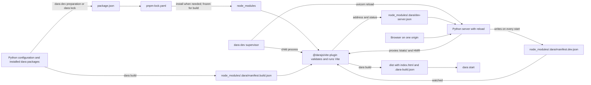

# Dara JS build redesign

Status: Draft

## Summary

Replace the UMD and Vite pipelines with one Vite build rooted in the app. The app keeps standard JS project files, while Dara owns only the entries needed to build its frontend.

This ships as Dara 2.0. The same release removes the UMD pipeline, `dara.config.json`, `dara setup-custom-js` and the build and mode flags on `dara start`. There is no compatibility period, so Dara never maintains two frontend pipelines or two runtime entry contracts at once.

The proposal makes these decisions:

- `package.json`, `pnpm-workspace.yaml`, `pnpm-lock.yaml`, `vite.config.ts`, `tsconfig.json` and `js/index.tsx` live at the app root. Dara-owned versions live in a named pnpm catalog inside the workspace file; a monorepo uses its root workspace file and lockfile.
- `dara dev` automatically creates missing project files, synchronizes the `dara` catalog and installs dependencies when needed. It preserves user configuration and reports the files to commit. `dara lock` runs the same preparation without starting development; it is not a prerequisite for ordinary development. Apps use pnpm directly for their own dependencies.
- `dara dev` is one command that supervises the Python server and frontend processes. It runs Python with reload and proxies the frontend so the browser talks only to Python. `dara build` creates deployable output and `dara start` serves it without a JS toolchain.
- Posture comes from the command. `dara dev` runs with development posture and `dara start` with deploy posture, so `--production`, `--docker`, `--enable-hmr`, `--rebuild`, `--skip-jsbuild` and `--dev-port` disappear with their environment variables.
- Commands read the configuration reference from `[tool.dara]` in `pyproject.toml`; `--config` becomes an override.
- Every app needs a JS toolchain to lock, develop or build, including apps without custom JS, because one pipeline for every app is worth the prerequisite. Node and pnpm are prerequisites: Dara checks the versions on `PATH` against the ranges it supports and fails with an install hint, and it manages neither. `create-dara-app` ships a `mise.toml` pinning both for convenience. The runtime image needs neither.
- Python writes separate development and build manifests. After Python bootstraps the JS dependencies, `@darajs/vite-plugin` initializes and validates the project and runs the frontend toolchain. It generates one default import per registered component and action, the runtime maps, static assets, `index.html` and a build marker from the manifests.
- Every concrete JS component and action class names its JS module with `js_source`, an ES module specifier that Vite resolves like any import: a package subpath such as `@darajs/components/button` or a relative app path such as `./js/charts/my_chart.tsx`. It replaces `js_module`, `js_component`, the `LOCAL` package and the `local=True` registration flag. Existing discovery and explicit registration supply the implementations to build; serialized runtime names keep their current meaning.
- `dara migrate` converts supported legacy configuration and source patterns, produces a reviewable diff, and reports ambiguous cases. It does not keep the old runtime pipeline alive.
- Every app has the same fixed JS entry and uses the same pipeline. The entry is only for setup and global styles.
- `dara check --json` ships in 2.0 as the structured diagnostics surface for CI and coding agents.

The 2.0 scope is the JS build and CLI transition, including automatic project preparation, dependency ownership, deployment artifacts, diagnostics and migration from the removed pipeline. Python changes are limited to the metadata and integration needed by that transition. Discovery improvements, qualified component identities, inspection metadata, component previews, WebMCP, application testing and prop binding are post-2.0 ideas, not release dependencies. Existing discovery traversal, serialized runtime names and prop-resolution behavior remain. See [Post-2.0 ideas](#post-20-ideas).

This fixes seven problems in the current system:

- Two builds of one commit can resolve different transitive npm packages because apps have no lockfile.
- Production builds use Node with no compatibility check.
- UMD and Vite builds behave differently.
- `dist/` is both a generated JS workspace and the build output.
- `dist/` is mounted at `/static`, so a production build serves `package.json`, `node_modules/`, the generated sources, `_build.json` with the serialized `npm_token`, and any `.npmrc` written for a private registry, token included.
- Python reads Vite's output manifest at request time to assemble HTML that Vite can emit itself.
- The bootstrap JSON embedded in `index.html` is not script-safe: `json.dumps` leaves `<` unescaped, so a string containing `</script>` breaks out of the data block.

The Python component and action source declarations become `js_source`; registry and serialized runtime names remain compatible. pnpm 12 is the supported package manager major. `dara dev` is the standard development loop and runs both halves behind one origin. Production runs `dara build` before `dara start`, and no command does both.

## Toolchain and prerequisites

Developers and CI need Node and pnpm to run `dara lock`, `dara dev`, `dara build` or `dara check`. A runtime that only runs `dara start` needs neither because it serves the compiled `dist/` directory.

Project preparation, shared by `dara dev` and `dara lock`, writes the supported ranges under `engines`:

```json
{
  "engines": {
    "node": ">=22.12.0",
    "pnpm": ">=12 <13"
  }
}
```

Dara checks `node --version` and `pnpm --version` against these ranges before lock, development or build work and fails with the required range and an install hint when either is missing or unsupported. The Node floor accounts for [Vite's minimum version](https://vite.dev/guide/#scaffolding-your-first-vite-project); accepting every Node 22 release would be insufficient. Dara updates the ranges when a release needs a newer toolchain. Dara writes neither an exact `packageManager` field nor a `devEngines` entry; the app may add either, and with `devEngines.runtime` set to `onFail: download` pnpm can provision Node itself.

Dara does not install Node or pnpm and does not depend on any version manager. `create-dara-app` writes a `mise.toml` pinning Node and pnpm inside the ranges, so a mise user runs `mise install` and is done. Everyone else reads that file or the `engines` block and installs the two tools with brew, winget, corepack or whatever they already use. Dara never invokes mise and never checks for it. `dara check` reports both versions and whether they satisfy the ranges.

`dara dev` and `dara build` launch the plugin through `pnpm exec`, never a bare `node`. The generated `mise.toml` pins stable releases. When an app uses pnpm runtime provisioning, diagnostics must report and check the runtime that actually executes the plugin as well as the binaries on `PATH`.

Dependency installation during `dara dev`, `dara lock` or `dara build` needs a populated package cache, registry access or a mirror. A prepared development project does not resolve dependencies again just because the server restarts. Air-gapped deployments can build in CI and ship the output; `dara start` never needs the registry. Projects configure registry routing, credentials, proxies and certificate authorities through pnpm's normal `.npmrc` lookup.

The generated project must install without dependency build scripts, because pnpm ignores them unless a repository allowlists them. Project preparation prints pnpm's ignored-build-scripts warning as a diagnostic instead of letting it scroll past.

Dara invokes tools with argument lists. pnpm receives the full environment so `.npmrc` placeholders such as `${NPM_TOKEN}` resolve. The Node process that runs the plugin receives an allowlist instead: `PATH`, `HOME`, the temporary directory variables, locale and terminal variables, `CI`, the proxy variables, `NODE_OPTIONS`, `NODE_EXTRA_CA_CERTS`, `VITE_*` and the Windows system variables. This avoids forwarding unrelated environment credentials. It is not isolation from user plugins: Vite loads app `.env` files, and config and plugin code can read files available to the process. Registry credentials must never be serialized into generated manifests or output.

## User workflows

The commands describe operations rather than persistent modes, and each command carries its own posture. `dara dev` is development and supervises both Vite and the reloadable Python server. `dara start` is deployment and serves a build with the posture a runtime image has.

Commands that import the app read the configuration reference from `pyproject.toml`:

```toml
[tool.dara]
config = "my_app.main:config"
```

`create-dara-app` writes this entry. `--config <module:config>` overrides it, and without either Dara falls back to today's `<directory>.main:config` guess. The app root is the working directory of every command, as it is today. `dara dev` also accepts `--root <dir>`.

### Set up a new app

`create-dara-app` writes the project files described under [create-dara-app](#create-dara-app) and installs the Python environment. The developer then runs:

```sh
dara dev
```

The first development run checks Node and pnpm, creates missing dependency files, synchronizes the `dara` catalog and installs `@darajs/vite-plugin`. Its initialization mode creates missing `vite.config.ts`, `tsconfig.json` and `js/index.tsx` files. Development starts when preparation succeeds. A clone with consistent dependency files reuses its lockfile and only installs missing or stale local dependencies.

When preparation changes checked-in files, Dara reports the reason and the files to commit:

```text
Prepared frontend project.
Created vite.config.ts, tsconfig.json and js/index.tsx.
Updated package.json, pnpm-workspace.yaml and pnpm-lock.yaml.
Commit these files with your application changes.
```

`dara lock` runs the same preparation without starting a server, for example to prepare a dependency update for review. It remains available but is not a required development step. A failed install reports its cause and can be retried with either command.

### Migrate an existing app

Run `dara migrate` to convert supported legacy configuration and source declarations. Review its diff and resolve any reported ambiguous cases, then run `dara dev`. Ordinary preparation detects legacy configuration and directs the user to migration rather than overwriting it. See [Migration](#migration) for the conversion contract.

### Develop the app

```sh
dara dev
```

`dara dev` resolves the app root and starts the reloadable Python worker. The worker imports the configuration and writes the development manifest, which the supervisor uses to prepare the project before launching the plugin's development runner. The runner serves Vite on a free port and runs the TypeScript 7 checker in watch mode beside it. Vite transpiles without type checking, so the checker is what turns a type error into something you see, in the Vite overlay and in the terminal.

The Python server writes `manifest.dev.json` whenever it starts and proxies every request under `/static/` to Vite, including the HMR websocket. The browser only ever talks to Python, so development and production share one origin. SSO redirect URIs, cookies and the base URL behave the same in both, and a devcontainer forwards one port.

A Python change restarts the Python server and refreshes the manifest from the newly imported configuration. Vite keeps running because the supervisor owns it, and JavaScript HMR never restarts the backend. After a successful backend reload, the browser refreshes even if the frontend manifest is unchanged, so Python-only layout changes appear. State-preserving Python reload remains follow-up work. Vite logs only warnings and errors, prefixed so they stand apart from Python's.

```text
$ dara dev
Dara 2.0.0 · my_app.main:config
frontend ready in 412ms
serving on http://localhost:8000
watching my_app/ for Python changes
```

Until Vite reports ready, or while project preparation is pending or blocked, Python serves a diagnostic page when its worker is available and keeps its API and health endpoints available. If an app import fails, the supervisor reports the traceback and keeps watching for a fix; it cannot claim the failed worker's endpoints are healthy. Successful recovery refreshes the browser. The plugin never serves HTML of its own.

`--open` opens the browser once the server reports ready, and `--no-typecheck` skips the development checker. `--frozen` disables creation and synchronization of checked-in files and requires a frozen install, for teams and agents that want development to report drift without repairing it. Three more flags cover the cases where one process is not enough:

- `--no-reload` runs the Python server inside the supervisor process, so an IDE debugger sees breakpoints while Vite still runs as a child.
- `--frontend-only` imports the configuration once for preparation, runs Vite without a Python server and writes its address to `node_modules/.dara/dev-server.json`. Vite waits for the development manifest owned by the separately started backend, for example under a debugger.
- `--backend-only` runs only the Python server, writes its development manifest and reads `dev-server.json` to find Vite. It serves the diagnostic page until Vite appears. It also suits an API-only app that registers no pages; it does not prepare or install a frontend project.

This path is the same whether `js/index.tsx` is empty or contains app code, and it is the standard loop for Python-only changes too. The component set comes from existing discovery and explicit registration, so adding a registration changes the manifest. If a reload changes package requirements, the supervisor repeats project preparation before accepting the new frontend manifest; in frozen mode it reports the drift instead. Commit any dependency-file changes after upgrading a `dara-*` Python package or changing JS dependencies.

### Add a custom component

Write the React component in a file under `js/` with a default export, and point the Python class at it:

```python
class MyChart(ComponentInstance):
    js_source = './js/charts/my_chart.tsx'
    title: str
```

Use existing discovery or explicitly register the class with `config.add_component(MyChart)` when needed. Once registered, `dara dev` picks up the new module and `js/index.tsx` is untouched. See [Component sources](#component-sources) and [Registration compatibility](#registration-compatibility). Add app dependencies with pnpm; development preparation synchronizes any remaining declared dependency drift. Manual prop resolution, including `useVariable` and `useAction`, keeps its existing behavior in 2.0.

### Build and run production output

CI or a developer with the JS toolchain creates the deployable output explicitly:

```sh
dara build
```

The runtime then starts the Python app:

```sh
dara start
```

`dara build` requires consistent checked-in project files, performs a frozen install and a TypeScript check, and writes self-contained output without `node_modules` or credentials. Type errors prevent publication; the development-only `--no-typecheck` flag does not apply. A runtime image needs only the Python application and that output. `dara start` validates the build marker and serves it without invoking Node, pnpm or Vite.

`dara start` always runs with deploy posture. It hides API documentation unless `--api-docs` is passed, `--require-sso` still enforces an SSO configuration, and the JWT secret fallback and default session backend follow the rules `--production` and `--docker` used to select. A build served locally behaves like the runtime image, warning included when `JWT_SECRET` is not set.

A missing or stale build makes `dara start` fail with `run dara build`. Using a new component in Python also makes the build stale, because the generated entry imports only registered modules. Develop with `dara dev`; a deployable artifact is always an explicit `dara build`.

### Check a project

`dara check` runs the diagnostics the other commands share without repairing project files: the active pnpm and its origin, lockfile agreement with `package.json`, the `dara` catalog against the installed Python packages, the TypeScript and Vite contracts, `js_source` specifiers, one pass of the TypeScript checker, and the build marker when output exists. It imports application and Vite configuration code, so it cannot guarantee those imports have no side effects. It exits nonzero with the repairing command for each failure. Run it in CI, and run it first when something looks wrong.

`--json` prints the same diagnostics as a list of objects, each with a stable `code`, a `message` and a `fix` holding the repairing command. Codes are documented and never reused, so a coding agent can act on them without parsing prose. `dara dev --json` events and a public development status API are [post-2.0 ideas](#post-20-ideas). The internal status needed by the supervisor and proxy remains part of the pipeline.

## Command reference

| Command                                                                                          | Behaviour                                                                                                                                                                                                                                                                               |
| ------------------------------------------------------------------------------------------------ | --------------------------------------------------------------------------------------------------------------------------------------------------------------------------------------------------------------------------------------------------------------------------------------- |
| `dara dev [--frozen] [--open] [--no-typecheck] [--no-reload] [--frontend-only] [--backend-only]` | Supervises the reloadable Python server, project preparation, Vite and the TypeScript watcher. Creates missing project files and synchronizes declared requirements unless frozen. Python owns the development manifest and proxies `/static/` and HMR. Never writes production output. |
| `dara lock`                                                                                      | Imports the configuration and runs the same project preparation as development without starting either server or running a build. Reports changed files to commit.                                                                                                                      |
| `dara migrate [--check]`                                                                         | Converts supported legacy configuration and source patterns. Reports changes and unresolved cases; `--check` reports the proposed migration without writing it. Does not install dependencies or run a server.                                                                          |
| `dara build [--output <dir>] [--no-deps-build]`                                                  | Imports the app, writes the build manifest and performs a frozen install. The runner validates configuration, builds workspace dependencies, checks TypeScript, builds into staging and publishes completed output with its marker. Never repairs checked-in files.                     |
| `dara start [--api-docs] [--require-sso]`                                                        | Validates and serves existing output with deploy posture, without a JS toolchain or reload.                                                                                                                                                                                             |
| `dara check [--json]`                                                                            | Checks dependency agreement, configuration, registered sources, TypeScript and existing build output without repairing files. Exits nonzero with guidance for failures; JSON diagnostics have stable codes.                                                                             |

Every command that imports the app accepts `--config <module:config>` as an override of `[tool.dara]`. `dara start` keeps `--port`, `--host`, `--base-url`, `--metrics-port`, `--disable-metrics` and the logging options; `dara dev` accepts the same serving options plus `--reload-dir`.

### Shared project preparation

`dara dev` and `dara lock` use one preparation operation. Python computes requirements from the imported configuration, checks the toolchain and legacy-project state, and plans edits before writing. It creates missing `package.json` and workspace files, reconciles Dara-owned entries and invokes the plugin initializer after the plugin is installed. Existing Vite, TypeScript and application source files are never overwritten by preparation.

If requirements and the lockfile agree, preparation reuses the lockfile and performs a frozen install only when local dependencies need restoring. If declared requirements changed or no lockfile exists, it runs pnpm's normal install to reconcile them. It never runs a blanket dependency update. An unchanged rerun produces no checked-in diff. Dependency changes may legitimately update the lockfile and affected transitive packages; the report names both the reason and changed files.

The supervisor also watches dependency declarations and receives requirements from new development manifests. It serializes preparation runs, keeps the frontend unavailable while its installed dependencies are changing, and restarts the frontend runner when installation changes its toolchain or dependency graph. Normal Python reloads that leave dependency requirements unchanged keep Vite running. A preparation failure stays visible and can be retried after the relevant files are fixed; frozen mode reports the mismatch instead of repairing it.

Only the supervisor performs automatic preparation; the Python worker and Vite plugin do not install dependencies. A workspace lock serializes catalog and install mutations from multiple Dara processes. Before writing a shared catalog, preparation checks the workspace's declared Dara requirements and reports conflicting apps. It does not resolve disagreement by letting the last command overwrite another app's requirements.

`dara build` and `dara dev --frozen` fail on inconsistent or missing checked-in files with `run dara lock and commit the result`. `dara check` reports the same drift. None silently switches to mutable installation.

The first preparation must install `@darajs/vite-plugin` before its initializer exists. Each file replacement is atomic, and preflight conflicts leave files untouched. A later install or validation failure may leave prepared dependency files and newly created project files in place; the diagnostic lists those changes and how to retry. Preparation does not claim an all-or-nothing transaction across network installation and multiple files.

The output directory follows this order:

1. `dara build --output <dir>`
2. `Configuration.static_files_dir`
3. `dist/`

The plugin receives the resolved directory. A conflicting `build.outDir` in `vite.config.ts` is an error because Python and Vite must agree on the directory Python serves.

## How it fits together



Python discovers what the app needs and writes the operation-specific manifest. The Vite plugin produces the frontend. In development Python also fronts Vite, so the browser sees one origin in every mode. In production Python serves the result without a JS toolchain.

## Project files and ownership

A standalone app checks in `package.json`, `pnpm-workspace.yaml`, `pnpm-lock.yaml`, `vite.config.ts`, `tsconfig.json` and `js/index.tsx`. It ignores `node_modules/` and its build output.

| File or entry                                                                                        | Owner                                                                                                                |
| ---------------------------------------------------------------------------------------------------- | -------------------------------------------------------------------------------------------------------------------- |
| `catalogs.dara` in `pnpm-workspace.yaml`: `@darajs/*`, Vite, TypeScript, shared runtime dependencies | Dara, reconciled during development preparation or `dara lock`                                                       |
| The rest of `pnpm-workspace.yaml`                                                                    | User or repository                                                                                                   |
| `catalog:dara` references and `engines` in `package.json`                                            | Dara adds missing ones and never edits other entries                                                                 |
| App dependencies, scripts, metadata and optional `packageManager`                                    | User                                                                                                                 |
| `pnpm-lock.yaml`                                                                                     | Generated by pnpm when declared dependencies need reconciliation; reused for unchanged development and frozen builds |
| `vite.config.ts`                                                                                     | User, initialized by the plugin when missing, with the Dara plugin required                                          |
| `tsconfig.json`                                                                                      | User, initialized by the plugin when missing, with Dara's module resolution settings required                        |
| `js/index.tsx`                                                                                       | User, initialized by the plugin when missing and never rewritten                                                     |

### Fixed application entry

Every new app has a `js/index.tsx`, initially containing only:

```ts
export {};
```

The Vite plugin always imports this module for its side effects. It is the app's place for global styles and JS setup, and nothing else: components and actions never resolve from it.

An empty module has negligible runtime and bundle cost. Every app carries a JS project in this design, so the entry adds one checked-in source file. In return, Dara removes the custom-JS setup command, optional local-entry state, conditional TypeScript includes and several build branches. Every app uses the same entry in development and production.

The plugin's initialization mode creates the empty entry only when it is missing and never rewrites it. Ordinary development preparation recreates a missing entry and reports the new file. Frozen development and production builds fail with an instruction to prepare and commit the project. `dara start` needs the compiled output rather than this source file.

#### Component sources

Every concrete JS component and action class, in a `dara-*` package, a third-party plugin or the app, names the module that default-exports its implementation:

```python
# dara-components
class Button(LayoutComponent):
    js_source = '@darajs/components/button'

# the app
class MyChart(ComponentInstance):
    js_source = './js/charts/my_chart.tsx'
```

`js_source` is an ES module specifier and Vite resolves it exactly as an `import` statement would. A bare specifier names a package subpath and resolves through that package's `exports` map in `node_modules`, with the `dara-source` condition selecting source for workspace packages. A relative specifier resolves from the app root and must stay under `js/`, so the root `tsconfig.json`, Vite's file allow list and the app's linter and formatter share a single root, and Python packaging never has to exclude TypeScript from a wheel. In both cases the module's default export is the component, so there is no export-name convention, no `js_component` override and no barrel file between the class and its implementation.

`js_source` is required for each concrete JS component and action registered with the app. A missing or absolute source fails while constructing the configuration. Abstract base classes and Python-rendered components do not acquire a JS implementation requirement. The specifier itself says whether a class is local, so the `local=True` flag on `add_component` and `add_action` disappears. Existing registration paths read `js_source`; their discovery scope does not expand.

Direct module imports avoid pulling unrelated exports and their dependencies through a package barrel. They do not provide route-level loading: the generated entry statically imports every registered implementation, so development loads that complete reachable module graph. Production can tree-shake unused exports, but must preserve observable side effects. Direct imports reduce that dependency on barrel behavior; imports inside each implementation and explicit setup modules still contribute to the graph. Lazy component loading and route prefetching are [post-2.0 ideas](#post-20-ideas).

For a custom component, a developer or coding agent writes one TSX file and one Python class that points at it, then registers it through the existing APIs if discovery does not include it. Development handles the JS project setup. TypeScript checks the source and Vite supplies HMR. An unresolved source is a project diagnostic naming its registration. A missing default export is reported during module loading in development or bundling in production, also associated with that registration. Checking an export exists does not prove that its props match the Python model; automatic binding and generated prop types remain future work.

Application code may live outside `js/` when the root `tsconfig.json` includes it, but relative `js_source` specifiers may not. Apps add their own linting, test tools and other dependencies to `package.json`.

The root `vite.config.ts` and `tsconfig.json` describe the Dara app. An app that also publishes a JS library keeps separate library configuration as described under [Package exports and workspace libraries](#package-exports-and-workspace-libraries).

### Registration compatibility

The build consumes the registrations produced by existing runtime discovery, `@discover`, `@py_component` and explicit `add_component` and `add_action` calls. Definition construction changes to record `js_source` instead of the removed resolution fields. This does not require AST traversal, improved component-instance discovery, tree walking or retained class descriptors. Dependencies missed by current discovery still need explicit registration before the build; production does not discover and compile new JS on demand.

The frontend manifest and generated maps use each registry entry's existing `name`, matching serialized component instances and JS action payloads. Preserve existing naming overrides, including `py_component` and `py_name`. For example, `NavigateToImpl` currently serializes as `NavigateTo`. A module specifier selects the default export independently of that runtime name, so moving away from barrel export names does not require changing Python serialization.

This preserves the current limitations around same-named classes in different modules. Qualified identities would need a coordinated change across Python registration, serialization and browser lookup; adding qualified keys only to the generated JS maps would be incorrect. That change and improved discovery are separate [post-2.0 ideas](#post-20-ideas).

### Dependency ownership

Dara-owned versions live in a named pnpm catalog. Project preparation, shared by `dara dev` and `dara lock`, reconciles the `catalogs.dara` block of `pnpm-workspace.yaml` from the installed Python packages, creating the file when a standalone app has none, and makes sure `package.json` references each required package as `catalog:dara`:

```yaml
catalogs:
  dara:
    "@darajs/components": ^2.0.0
    "@darajs/core": ^2.0.0
    "@darajs/vite-plugin": ^2.0.0
    react: ^18.3.0
    react-dom: ^18.3.0
    typescript: ^7.0.0
    vite: ^8.1.0
```

```json
{
  "devDependencies": {
    "@darajs/core": "catalog:dara",
    "vite": "catalog:dara"
  }
}
```

Ownership is a matter of location. Dara owns the catalog block and nothing else in the workspace file; the repository owns the rest of `pnpm-workspace.yaml`, and the user owns their dependency declarations in `package.json`. Preparation adds missing `catalog:dara` references and maintains the Dara-required `engines` constraints, preserving compatible user restrictions and reporting conflicts. It does not overwrite user dependency entries. A required package that references anything else fails preparation with the reference to use, except `workspace:`, `link:` and `file:` targets inside the repository or workspace, which the loader validates against the expected package name and the catalog version. A standalone app uses a workspace of one; the supported pnpm version's handling of a workspace file with no `packages` list is verified by the first implementation slice.

An app that doubles as a library keeps its own `peerDependencies`; the `catalog:dara` reference sits in `devDependencies` and describes the app build only.

Preparation output is deterministic. Catalog entries and added references use sorted order and stable formatting, so an unchanged rerun produces no diff. A Dara upgrade changes the catalog and lockfile, and may change required references or toolchain constraints. The report identifies each change.

After a `dara-*` Python upgrade, ordinary development synchronizes requirements and reports changes to commit. `dara lock` performs the same work explicitly. Frozen development and production builds reject drift. A dependency bot that edits Dara's catalog can create a mismatch with Python requirements; preparation restores the required entries, while `dara check` reports the mismatch without repairing it.

### Plugin packages

A third-party Python package that ships JS components or actions publishes its JS as an npm package with an `exports` map and registers it exactly as `dara-*` packages do: a `js_source` subpath such as `@my-org/dara-widgets/gauge` on each class, `ConfigurationBuilder.add_module_dependency` to map the Python package to the npm package, plus a `dara_assets` entry point for static assets. Preparation derives the npm package name from the specifiers, adds it to the `dara` catalog with a version derived from the installed Python package, references it from `package.json`, and the app resolves it from a registry it can reach. Private plugins use a private registry route in `.npmrc`. Npm distribution remains the supported route, including for downstream JavaScript consumers.

`@darajs/*` packages follow the same rules and expose one subpath per component through an `exports` pattern, as shown under [Package exports and workspace libraries](#package-exports-and-workspace-libraries). Their barrels remain for external consumers. Dara imports component subpaths and an explicit `./setup` subpath for module dependencies. That setup module imports only required initialization and global styles, without re-exporting a component barrel. Packages without setup needs expose an empty setup module. A component that previously relied on a barrel to import its stylesheet moves that import into its own module or the setup module.

This replaces shipping a UMD bundle inside the wheel. Because `file:` and `link:` targets must resolve inside the repository or workspace, JS cannot travel with a Python package. The custom JS documentation's distribution section changes accordingly.

### Shared dependencies

Packages that carry React context, state or styling across package boundaries must resolve to compatible root versions. The initial set is:

- `react`
- `react-dom`
- `styled-components`
- `@tanstack/react-query`
- `recoil`
- `recoil-sync`
- `react-router`

`@darajs/*` packages declare these as peer dependencies wherever they use them. The `dara` catalog carries compatible versions, and the Vite plugin deduplicates them. If another dependency later shares runtime state across packages, Dara manages compatible root and peer ranges for it too.

### Registry authentication

pnpm resolves `.npmrc` from its usual local and global locations. Dara does not prescribe where it lives. Environment placeholders keep credentials out of the repository:

```ini
@my-org:registry=https://npm.pkg.github.com/
//npm.pkg.github.com/:_authToken=${NPM_TOKEN}
```

Apps that install private `@darajs/*` packages need the relevant registry route and credential. Dara reports the missing route or environment variable but never writes a token.

## create-dara-app

The generator gets an overhaul in the same release so the first `dara dev` works without reading documentation. It writes:

- `pyproject.toml` with the `[tool.dara]` entry and the Python dependencies
- `package.json` with a private name, ready for development preparation to add the `catalog:dara` references and the `engines` entry
- `mise.toml` pinning Node and pnpm inside the supported ranges, so a mise user gets the toolchain with `mise install`; it is a convenience and Dara never reads it
- `AGENTS.md` documenting automatic development preparation, frozen builds, migration, `js_source`, the Dara-owned catalog and `dara check --json`, so a coding agent can work without inferring the build system
- a README that leads with `dara dev`, lists prerequisites and explains which generated files to commit, then covers build, serve, check, explicit locking and migration

It installs the Python environment and prints `dara dev` as the next step. Frontend preparation belongs to that command, so missing JS tools or registry access can be fixed and retried without regenerating the app. It writes no Dockerfile because the release action owns image builds. `js/index.tsx`, `vite.config.ts` and `tsconfig.json` come from the shared initializer, so the generator carries no JS templates of its own.

## Manifest and Vite plugin

### Frontend manifests

Python derives machine-specific manifests from the imported configuration and installed packages. Development and production use the same schema:

```json
{
  "schema": 1,
  "configuration": "my_app.main:config",
  "daraVersion": "2.0.0",
  "packageRequirements": [
    {
      "name": "@darajs/components",
      "section": "devDependencies",
      "specifier": "^2.0.0"
    },
    {
      "name": "@darajs/core",
      "section": "devDependencies",
      "specifier": "^2.0.0"
    },
    {
      "name": "@darajs/enterprise",
      "section": "devDependencies",
      "specifier": "^2.0.0"
    },
    {
      "name": "@darajs/vite-plugin",
      "section": "devDependencies",
      "specifier": "^2.0.0"
    },
    {
      "name": "react",
      "section": "devDependencies",
      "specifier": "^18.3.0"
    },
    {
      "name": "typescript",
      "section": "devDependencies",
      "specifier": "^7.0.0"
    },
    {
      "name": "vite",
      "section": "devDependencies",
      "specifier": "^8.1.0"
    }
  ],
  "moduleDependencies": [
    {
      "python": "dara.enterprise",
      "package": "@darajs/enterprise",
      "source": "@darajs/enterprise/setup"
    }
  ],
  "components": [
    {
      "name": "Button",
      "source": "@darajs/components/button"
    },
    {
      "name": "MyChart",
      "source": "./js/charts/my_chart.tsx"
    }
  ],
  "actions": [
    {
      "name": "NavigateTo",
      "source": "@darajs/core/actions/navigate-to"
    }
  ],
  "static": [
    {
      "package": "dara.components",
      "source": "/site-packages/dara/components/_assets/common",
      "target": "."
    }
  ],
  "appStatic": ["/app/static"],
  "favicon": "/app/static/favicon.ico",
  "outDir": "./dist"
}
```

The `static`, `appStatic` and `favicon` entries carry the sources described under [Static assets](#static-assets). Python resolves `outDir` using the precedence in the command reference before it writes the manifest. The manifests carry no URLs: Python applies the runtime base URL when it renders the template, and Vite's address travels through `dev-server.json`.

`configuration` records the resolved Python configuration reference for diagnostics; the Vite plugin never imports it. `packageRequirements` contains every Dara-owned package with its required `package.json` section and the specifier written to the `dara` catalog. The example shows representative entries. The project loader compares the complete list with the catalog block, the `package.json` references and the installed packages. Project preparation or the frozen install has already established lockfile agreement.

Each component and action entry carries its existing runtime `name` and `js_source` specifier. The name and source identify its registration in build diagnostics; a richer descriptor or import-provenance model is not required. Python derives the npm package name from every bare specifier, `@darajs/components` from `@darajs/components/button`, to build `packageRequirements`, and uses `Configuration.module_dependencies` to map each Python package to its npm package so the catalog version follows the installed Python version. It carries module dependencies even when no component or action uses the package, with an explicit `source` naming the package's `./setup` export. Plugins use `ConfigurationBuilder.add_module_dependency` for package inclusion and version mapping.

The UMD pipeline also used explicit module dependencies to order script tags. ESM imports establish dependency evaluation order instead. Setup code that depends on another module must import that dependency; Vite does not make initialization order irrelevant.

The fixed entry does not appear in the manifest. A relative specifier resolves from the app root, and Python rejects one that escapes `js/`, or an absolute path, before it writes the manifest. A bare specifier whose package name equals the app's own `package.json` name is the app publishing itself as a library; it is excluded from `packageRequirements` and resolved as described under [Package exports and workspace libraries](#package-exports-and-workspace-libraries).

Each app has three derived files below `<app-root>/node_modules/.dara/`, including in a workspace:

- The Python server started by `dara dev` owns `manifest.dev.json` and replaces it whenever it starts or reloads. The supervisor and plugin ignore unchanged frontend requirements. Successful backend reload still triggers the normal browser refresh, independently of whether the manifest changed.
- `dara build` owns `manifest.build.json` and replaces it once before the production build.
- The plugin owns `dev-server.json`: Vite's origin, a per-run token, and its state with any diagnostic. Python reads it to configure the proxy and to render diagnostics, and the supervisor removes it on exit.

The Vite command selects the file. `serve` starts without a manifest, then reads and watches the development manifest. `build` requires and reads the build manifest once. A production build cannot replace the manifest used by a running development server. The workspace root remains responsible only for shared pnpm state such as the lockfile. Both manifests may contain absolute static paths because neither leaves the build machine.

In development Python proxies requests under `/static/` to the origin recorded in `dev-server.json`, including websocket upgrades, and rewrites the upstream `Host` header. The runner configures asset and websocket paths for that prefix and the runtime base URL. This requires working websocket forwarding: [Vite can otherwise fall back to a direct connection](https://vite.dev/config/server-options.html#server-ws), bypassing the proxy. The development slice must verify that module loading, HMR and recovery use the Python origin, including behind an HTTPS proxy.

Per-app files separate each app's configuration, but do not prove a recorded process is still alive. The supervisor ties readiness to the current runner and clears stale status on startup and exit. The request-time identity handshake based on `Configuration.static_files_dir` disappears, along with the `VITE_SERVER_*` variables and `--dev-port`.

The development plugin holds one parsed state and publishes it in `dev-server.json`:

- `waiting` means no development manifest exists yet.
- `ready` contains a parsed manifest whose package requirements match the project.
- `blocked` contains a manifest or dependency error and the command that repairs it.

Only `ready` exposes the virtual application entry. Python reads the state before proxying and renders a diagnostic page for the other two. Missing sources and dependency failures belong to these project diagnostics. Module evaluation, missing exports and runtime errors can still occur after readiness and must be visible in the browser and terminal with the declaring component or action where available. The plugin does not serve HTML.

### Shared JS project loader

`@darajs/vite-plugin` exposes one Node project loader and a CLI with initialization, check, development and build modes. Shared preparation invokes initialization after dependency installation when needed. `dara check` invokes check, and `dara dev` and `dara build` invoke the respective runners after preparation or frozen installation.

Initialization mode creates `vite.config.ts`, `tsconfig.json` and `js/index.tsx` when they are missing, then validates the complete project. The defaults live with the code that interprets them, not in `dara-core`. Initialization never rewrites an existing file. The Node check, development and build runners do not write checked-in files; the Python development supervisor invokes preparation separately when needed.

The loader parses the app root once and checks:

- the frontend manifest schema and Dara version when an operation supplies a manifest
- `packageRequirements` against the `dara` catalog, the `package.json` references and the packages pnpm resolved
- the fixed `js/index.tsx` entry
- every component, action and setup `source` specifier resolves through Vite, relative ones to a file under `js/` and bare ones to a package subpath or the app's own `exports`
- effective TypeScript options, resolved with a tsconfig reader such as `get-tsconfig` that follows JSONC and `extends`
- the Vite configuration resolved through Vite's API for both `serve` and `build`
- workspace, `file:` and `link:` targets against their resolved package names and versions

The loader returns the parsed project or structured diagnostics. The development and build runners pass the parsed project into plugin hooks instead of repeating checks there. They resolve the visible Vite config and require exactly one Dara plugin before starting the requested operation. If the config omits the plugin, the runner shows a Dara diagnostic before Vite starts.

The loader never imports the Python app or repairs invalid state. Only initialization writes project files. No runner installs or updates dependencies, although build mode may invoke declared workspace build scripts after Python completes the frozen install.

Python passes the derived requirements to initialization and check over standard input; neither writes a manifest. Development and build read the requirements from their manifests. The four operations use the same diagnostics for shared project errors. Python does not parse `tsconfig.json`, load `vite.config.ts`, inspect installed JS packages or recheck manifest requirements.

### Visible Vite configuration

Every app has a visible `vite.config.ts`:

```ts
import dara from "@darajs/vite-plugin";
import { defineConfig } from "vite";

export default defineConfig({
  plugins: [dara()],
});
```

The shared project loader resolves an existing config for both Vite commands. If it omits the Dara plugin, validation fails and prints the import and plugin entries to add.

`dara()` returns `@vitejs/plugin-react` together with Dara's own Vite plugins. Vite flattens that plugin array, so the app does not import or configure the React plugin separately. `@darajs/vite-plugin` owns the React plugin dependency and its version.

During development and builds, the runner completes the parsed project with Vite's resolved configuration. It rejects a second React plugin and settings that conflict with Dara's virtual entry, output directory, HTML generation, URL handling or development endpoints. Other Vite settings remain under user control.

### TypeScript configuration

Project preparation adds TypeScript as a Dara-owned development dependency through the catalog:

```json
{
  "devDependencies": {
    "typescript": "catalog:dara"
  }
}
```

The catalog range follows minor and patch releases within the latest stable major supported by Dara. Dara moves it to the next major only after the generated app and all `@darajs/*` sources pass against that release. Prereleases and the next untested major do not enter an app through preparation. Dara runs the TypeScript 7 checker as an executable and does not depend on an in-process JavaScript compiler API.

Every app also has a small root `tsconfig.json` extending a preset shipped by the locked plugin version:

```json
{
  "extends": "@darajs/vite-plugin/tsconfig.json",
  "include": ["js"]
}
```

The preset contains compiler options only, so application paths remain relative to the app's file. It starts strict and makes Vite and the editor resolve workspace packages the same way. Its initial compiler options are:

```json
{
  "compilerOptions": {
    "allowUnreachableCode": false,
    "allowUnusedLabels": false,
    "customConditions": ["dara-source"],
    "exactOptionalPropertyTypes": true,
    "forceConsistentCasingInFileNames": true,
    "isolatedModules": true,
    "jsx": "react-jsx",
    "lib": ["DOM", "DOM.Iterable", "ES2022"],
    "module": "ESNext",
    "moduleDetection": "force",
    "moduleResolution": "bundler",
    "noEmit": true,
    "noFallthroughCasesInSwitch": true,
    "noImplicitOverride": true,
    "noImplicitReturns": true,
    "noPropertyAccessFromIndexSignature": true,
    "noUncheckedIndexedAccess": true,
    "noUncheckedSideEffectImports": true,
    "noUnusedLocals": true,
    "noUnusedParameters": true,
    "skipLibCheck": true,
    "strict": true,
    "target": "ES2022",
    "types": ["vite/client"],
    "useDefineForClassFields": true,
    "verbatimModuleSyntax": true
  }
}
```

`moduleResolution: "bundler"` makes TypeScript follow package `exports` using bundler rules. `customConditions` makes it select the same `dara-source` branch as Vite. TypeScript then reads a sibling package's source for editor types and type checking, so that package does not need prebuilt declarations during app development.

`jsx: "react-jsx"` selects React's automatic JSX runtime. App files do not need to import `React` only to use JSX.

These settings are the preset default, not the full Dara contract. They keep application and workspace source strict while `skipLibCheck` avoids checking declarations inside third-party packages. Dara tests every `@darajs/*` package that exposes `dara-source` against this default. Upgrades update the locked preset rather than rewriting each app's config; user overrides and existing standalone configs remain supported if they satisfy the required options.

For an existing config, the shared Node project loader resolves the effective compiler options and requires only the settings the pipeline needs:

- `moduleResolution` is `bundler`
- `customConditions` contains `dara-source`
- `jsx` is `react-jsx`
- `noEmit` is `true`
- `isolatedModules` is `true`
- `types` contains `vite/client`

Missing or conflicting required values fail during preparation, checking, development and build with the settings to add. Dara does not rewrite an existing file or reject changes to the other defaults. The loader validates configuration, while the runner separately type-checks the effective app project during development, check and build. A build does not publish output when that check fails.

### Generated entry

The plugin generates one default import per registered component and action, straight from its `js_source` specifier:

```ts
import daraCore from "@darajs/core/bootstrap";
import "@darajs/enterprise/setup";
import "/js/index.tsx";
import action0 from "@darajs/core/actions/navigate-to";
import component0 from "@darajs/components/button";
import component1 from "/js/charts/my_chart.tsx";

const actions = {
  NavigateTo: action0,
};

const components = {
  Button: component0,
  MyChart: component1,
};

daraCore({ actions, components });
```

The entry imports the dedicated core bootstrap module, each explicit module-dependency setup source, the app entry, and registered implementation sources. Bootstrap and setup subpaths must not re-export component barrels. Those imports keep initialization and styles in the Vite graph while Python includes registered static assets. A specifier that does not resolve, or a module without a default export, fails the production build with its declaring Python identifier. Development source-resolution failures block readiness; native module-loading failures are reported through the browser and terminal. The plugin does not infer implementations by parsing barrel re-exports.

The maps are keyed by the existing runtime names supplied in the manifest and on serialized instances and actions. Passing ready-made maps replaces the module-export lookup cache and the `preloadComponents` and `preloadActions` lookup steps. It changes how an implementation is loaded, while preserving how serialized data identifies it. It does not defer module loading: every static import and its dependencies must still load before bootstrap executes. `@darajs/vite-plugin` and `@darajs/core` version together, so the generated call changes with them in 2.0.

The initial graph contains every registered implementation, the bootstrap and setup entries, the app entry and all their reachable imports. Direct subpaths avoid unrelated barrel dependencies, but do not make the graph route-specific. Correct `sideEffects` declarations and setup modules with only the required imports remain relevant to production tree-shaking.

### Remaining plugin responsibilities

The plugin also:

- includes `@vitejs/plugin-react` and deduplicates shared dependencies
- pre-bundles known heavy dependencies through `optimizeDeps.include` to reduce mid-session optimization; newly introduced dependencies may still require optimization or a runner restart
- runs the TypeScript checker in watch mode during development and once during check and build, reporting to the overlay and terminal and preventing publication on build errors
- emits `index.html` with its scripts, stylesheets and Jinja placeholders
- handles the runtime base URL and publishes `dev-server.json` for the Python proxy
- serves and copies package static assets, application static folders and the favicon
- builds workspace dependencies, writes the build marker and publishes production output

Two static sources cannot write the same destination. The build fails and names both sources when a file or directory collides.

The Jinja placeholders are intentional. Python embeds the compiled router, theme, authentication configuration, runtime URLs and other bootstrap data in the initial HTML response. This avoids a bootstrap request before the first render while leaving the stable document structure and asset references under Vite's control. Python must use script-safe JSON serialization for embedded data, escaping `<`, `>`, `&`, U+2028 and U+2029 after `json.dumps` so a value cannot close its `<script>` element. This fix does not depend on the redesign and ships ahead of it.

### Python responsibilities

Python keeps six jobs:

- check the Node and pnpm versions against the `engines` ranges before invoking pnpm or the plugin
- derive manifests from existing component and action registrations, preserving runtime names and validating `js_source` specifiers
- in development, supervise Vite as a child process and proxy `/static/` to it, including the HMR websocket
- prepare missing project files and dependency declarations for development or explicit locking, and require frozen inputs for builds
- validate the production build marker
- render the plugin-emitted Jinja placeholders and serve `index.html` and static output, while the static mount refuses `.dara-build.json` and the raw template so build metadata is never served

Python no longer carries templates for Vite, TypeScript or the fixed entry. It does not generate build-time JS or HTML tags, build workspace packages, copy assets or manipulate Vite's output tree. Apart from that bootstrap, `@darajs/vite-plugin` owns JS project initialization, parsing, validation and execution.

## Monorepos

An app inside a pnpm workspace joins that workspace. Dara walks upward to find `pnpm-workspace.yaml` and then:

- uses the root `pnpm-lock.yaml` and records its complete digest in `.dara-build.json`
- scopes installation to the app, using frozen inputs for builds and unchanged development dependency state
- synchronizes only the `dara` catalog in the root workspace file and the app's Dara-owned package references and engine constraints. Every Dara app in the workspace shares one Dara version. Both automatic preparation and `dara lock` fail naming conflicting apps when their Python requirements disagree
- writes its derived files below the app's own `node_modules/.dara/` directory
- follows pnpm's normal `.npmrc` lookup and workspace layout
- leaves `minimumReleaseAge`, `allowBuilds`, `blockExoticSubdeps`, overrides, other catalogs and patches to the repository

Dara does not add an automatic `minimumReleaseAge` exclusion for its packages. A same-day release may be blocked until the workspace policy allows it or the repository adds its own exclusion.

### Package exports and workspace libraries

Every package that provides Dara components exposes one subpath per component through its `exports` map. In a repository checkout, a `dara-source` condition lets Dara builds read workspace source instead of `dist/`. Explicit setup exports take precedence over the component pattern:

```json
{
  "name": "@darajs/systems",
  "exports": {
    ".": {
      "dara-source": "./js/index.tsx",
      "types": "./dist/index.d.ts",
      "default": "./dist/index.js"
    },
    "./setup": {
      "dara-source": "./js/setup.ts",
      "types": "./dist/setup.d.ts",
      "default": "./dist/setup.js"
    },
    "./*": {
      "dara-source": "./js/*/index.tsx",
      "types": "./dist/*/index.d.ts",
      "default": "./dist/*/index.js"
    }
  }
}
```

The `"./*"` pattern is what component `js_source` specifiers hit: `@darajs/systems/gauge` resolves to `js/gauge/index.tsx` under `dara-source` and to `dist/gauge/index.js` otherwise. The `"."` key stays for external consumers who import the barrel. The Dara plugin enables `dara-source` in Vite, and the TypeScript preset enables it for the editor and checker. `dara-source` appears before `types` because workspace tooling should prefer source when the condition is active.

An enabled [export condition](https://vite.dev/config/shared-options.html#resolve-conditions) applies equally to registry packages and workspace packages; resolution does not infer which kind of installation was intended. Therefore the package publish step removes `dara-source` branches from the packaged `package.json`, retaining `types` and compiled `default` targets for every export. It does not rewrite the checkout manifest or consumers' `node_modules`. Published packages may include original source and source maps for inspection, but consumers execute their compiled exports. The package release tests must install the actual packed tarball into a clean Dara app with `dara-source` enabled and verify that imports resolve to `dist/`.

The plugin package separately exports its `tsconfig.json` preset, and `@darajs/core` exports a dedicated `./bootstrap` entry without the public component barrel. Third-party component packages follow the same source-versus-published contract if they opt into `dara-source` during local development.

This opt-in removes the sibling library prebuild from Dara development and enables cross-package HMR and source type checking. The source must still compile under the app's Vite and TypeScript settings.

An app that publishes its own components, such as `dara-systems`, uses the same specifiers as its consumers: its classes declare `js_source = '@darajs/systems/gauge'`. Inside that app the specifier names the app's own package. Node calls this package self-referencing and resolves it through the package's own `exports`, and TypeScript follows the same rule under `moduleResolution: "bundler"`. The plugin does not rely on Vite's support for it: a `resolveId` hook maps any specifier whose package name equals the app's `package.json` name to the app root with the `dara-source` condition, and preparation excludes that name from `packageRequirements` because a package cannot depend on itself. Consumers resolve the same specifier to `dist/` through the published manifest described above. The publishing app has no branching in its Python declarations and may still declare app-only components with relative specifiers.

`dara dev` does not build workspace libraries. A sibling library must expose `dara-source` or run its own build or watch command. If a package exposes neither source nor built output, `dara dev` fails and tells the user to build that package, start its watcher or add the source condition.

Production builds every reachable workspace dependency first. The plugin's build runner invokes `pnpm --filter "<app>^..." run build` for all of them, including packages that expose `dara-source`, before it builds the app. `--no-deps-build` passes through to the runner and skips that step when the repository knows its source conditions or existing outputs are sufficient.

An app that is also a published library keeps the Dara configs at `vite.config.ts` and `tsconfig.json`, with library-specific settings in `vite.lib.config.ts` and, when needed, `tsconfig.lib.json`. If both builds would write the same directory, configuration validation asks the project to choose separate outputs.

## Static assets

Static assets are files that browser code fetches by URL instead of importing into the Vite bundle.

### Current behavior

Packages expose an `AssetManifest` through the `dara_assets` Python entry point with four lists: `autojs_assets`, the UMD bundles for the auto-JS mode; `common_assets`, files copied to `static_files_dir/<package>/` in every build mode and served at `/static/<package>/`; `tag_order`, the subset that gets script tags in the generated HTML; and `depends_on`, which orders those tags across packages. `dara-components` registers the vendored BokehJS, Pixi and Plotly files as common assets but leaves them out of `tag_order`, and the components that need them add script elements at runtime with URLs such as `/static/dara.components/bokeh-3.1.1.min.js`.

### Proposed registration

Packages keep the same entry point. `AssetManifest` replaces the four lists with `static_assets`, which maps a source file or directory under `base_path` to a target inside that package's URL namespace:

```python
from pathlib import Path

from dara.core.base_definitions import AssetManifest, StaticAsset

asset_manifest = AssetManifest(
    base_path=Path(__file__).parent,
    static_assets=[
        StaticAsset(source='common', target='.'),
    ],
)
```

In this example, `common/bokeh-3.1.1.min.js` is available at `/static/dara.components/bokeh-3.1.1.min.js` when the app has no base URL. Dara applies the configured base URL before `/static` when it has one. A directory registration copies or serves its contents recursively and preserves paths below the source directory.

Python loads the entry points for packages used by the app. It resolves each source against the installed package and writes the absolute source, package name and relative target to the active frontend manifest. Absolute paths are build-machine data only. A source must exist and resolve inside its Python package. Targets must be relative and cannot escape `/static/<package>/`.

During `dara dev`, the Vite plugin serves each source through middleware at its package URL and watches it for changes. During `dara build`, the plugin copies the same files to `<outDir>/<package>/`. FastAPI mounts `outDir` at `/static`, so browser code uses the same `/static/<package>/` URL in development and production. The favicon goes to `<outDir>/favicon.ico` and is available at `/static/favicon.ico`. The build marker records the copied files and their content hashes.

Each Python package owns its namespace. Two registrations in that package cannot produce the same target path; the command fails and names both sources. Static registration does not add a script or stylesheet tag to `index.html`. The component that needs the file loads its URL explicitly. Files that can be imported as JavaScript, CSS or another Vite asset should use normal imports instead.

`AssetManifest` keeps `base_path` and gains `static_assets`; `autojs_assets`, `common_assets`, `tag_order` and `depends_on` are removed, and a manifest that still sets them fails at startup naming `static_assets`. Dara updates its own manifests in the same release. The vendored BokehJS, Pixi and Plotly files stay in `dara-components/_assets/common/` with unchanged browser URLs, so their current runtime loaders keep working. Bundling them is follow-up work.

### Application static folders

Apps register their own files with `ConfigurationBuilder.add_static_folder`, and a `static/` directory at the app root is registered implicitly. Plugins use the same API to ship data with their Python packages. Python resolves every registered folder to an absolute path and writes the list to the manifest as `appStatic`.

The plugin treats these folders as one merged tree at the root of the static namespace. During `dara dev` it serves them through the same middleware as package assets, at `/static/<path>`; during `dara build` it copies them into `<outDir>/`. Vite's own `publicDir` stays unused because it accepts a single directory. Two folders that write the same path fail the command naming both sources, as does a file whose path matches a package namespace directory such as `dara.components/`. The favicon keeps its own `favicon` entry so a differently named `.ico` can still become `/static/favicon.ico`.

## Build freshness

The plugin writes `.dara-build.json` into the output directory. It records:

- a digest of the portable component, action and dependency fields
- hashes of emitted files and copied static assets
- the complete lockfile digest, using the root lockfile in a workspace
- an inventory and content hashes of frontend source inputs, rooted at portable app or workspace paths
- the Dara version

The input inventory covers the app's `js/` tree, imported JS, TS, CSS and assets outside that tree, Vite configuration and its imported files, effective TypeScript configuration files, app and workspace package manifests and dependency configuration, relevant workspace source, and additional file inputs declared by build plugins. The `js/` tree and registered static folders record their file sets, so additions and deletions cannot go unnoticed. Plugins using globbed inputs must declare the watched directories as well as the files found during the build. Input hashes must reflect the files used for the build; a file changing during compilation invalidates staging and requires a retry.

Output hashes detect changed artifacts; they do not establish that the current source would produce those artifacts. Input hashes close that gap for declared files. Plugins that read extra files or build-time environment values must declare those inputs to the build runner, which records fingerprints without serializing secret values. Arbitrary undeclared plugin reads cannot be verified by this marker and must not be described as covered.

The build runner writes to a sibling staging directory. It builds workspace dependencies, checks TypeScript, runs Vite, hashes the result and writes `.dara-build.json` last. The previous output remains in place until staging is complete.

On the first build, one rename publishes staging into the absent output path. For a replacement, the runner moves the current output to a backup, moves staging into place and attempts to restore the backup if the second move fails. If restoration also fails, it preserves the backup and reports the paths needed for recovery. A later build inspects the markers before removing abandoned staging or backup directories. Replacing an existing non-empty directory is not guaranteed to be atomic. Open file handles can prevent renames on Windows; the runner reports the filesystem error and retains the recoverable output instead of deleting the backup.

When `dara start` serves built output, it derives the same portable fields in memory and compares them with the marker and emitted files. In a source checkout, it also compares the recorded frontend input inventories and contents, the lockfile, available static sources and declared build-time environment fingerprints. Editing a TSX file without changing `js_source`, editing CSS or Vite configuration, or adding or deleting an input makes the build stale.

A runtime image may omit the frontend source/configuration trees, workspace inputs and lockfile together and serve only the Python app and compiled output. If a frontend checkout is present, a missing member of its recorded input inventory is a mismatch, not permission to skip validation. Runtime validation needs no Node process; it compares portable records and file hashes. The distinction between an omitted frontend checkout and a partially missing checkout is covered explicitly by packaging and freshness tests.

Any mismatch identifies the changed or missing input or output and fails with `run dara build`.

The marker covers the whole workspace lockfile, so an unrelated workspace dependency change also makes the app build stale. CI builds on every deployment. The conservative digest mainly affects local workflows that reuse an older build.

## Migration

Dara 2.0 removes the legacy pipeline in the same release that introduces this one. Migration tooling translates project files to the new contract; it does not execute the old pipeline.

### Project migration

- `dara migrate --check` reads legacy files and reports proposed edits and unresolved cases without writing or importing the legacy app. `dara migrate` applies supported transformations and reports the resulting files for review. It does not install dependencies or run either server.
- Move `extra_dependencies` from `dara.config.json` to ordinary `package.json` dependencies, preserving existing entries and reporting conflicts. Add `[tool.dara] config` when it can be determined, update recognized command usages, and move known local sources under `js/` when references can be rewritten safely. Existing npm or yarn lockfiles cannot be losslessly converted into a pnpm resolution; report that the first preparation creates a new lockfile for review.
- Replace statically resolvable `js_module` and `js_component` declarations with `js_source`. A known named export may use a generated default-export adapter. Preserve existing registration calls and runtime naming overrides, removing the obsolete `local=True` argument after the source is known. Migration does not simplify registration based on a new discovery algorithm. Dynamic source declarations, unresolved exports and side effects in an old entry require specific manual edits rather than guesses.
- Preserve setup and global style imports in `js/index.tsx`. Remove `dara.config.json` only after all of its settings have a resolved destination or have been explicitly addressed. Running migration again must not duplicate dependencies, adapters or configuration entries. Unresolved cases produce a nonzero exit and source-linked guidance; any successfully applied subset is reported.
- Source edits preserve unrelated code and formatting. Before writing each planned change, verify that the file still matches the input used to compute it. A concurrent edit is reported instead of overwritten. The migration does not claim an atomic transaction across all files.
- After reviewing migration, run `dara dev` to prepare dependencies and project files, then `dara check` and a production build. `dara lock` remains available for preparing the project without starting development.
- `@darajs/*` packages migrate in the same release. Third-party packages need component subpath exports, a dedicated setup export when registered as a module dependency, and a published manifest that resolves compiled output. Their serialized runtime names remain compatible. Package-authoring guidance and release fixtures verify Python declarations against the packed npm exports.
- `dara setup-custom-js` is removed. Invoking it fails with a message that every app already has `js/index.tsx`.
- `_assets/auto_js/` directories leave the wheels, and the `build` scripts of `@darajs/*` packages stop producing UMD bundles.

Ordinary development preparation recognizes remaining legacy configuration or declarations and names `dara migrate`; it does not perform structural source migration implicitly. Removed APIs still produce precise errors for constructs the migration cannot rewrite.

### Flags

| Flag                          | Dara 2.0                                                                                                                                                                                                            |
| ----------------------------- | ------------------------------------------------------------------------------------------------------------------------------------------------------------------------------------------------------------------- |
| `--production`                | Removed. `dara start` always runs with deploy posture, so the JWT secret fallback in `signing_key.py` and the default session backend in `session_store.py` follow the deployment rules whenever a build is served. |
| `--docker`                    | Removed. `dara start` hides API documentation by default; `--api-docs` shows it and the existing `--require-sso` enforces SSO.                                                                                      |
| `--enable-hmr`, `--dev-port`  | Removed. `dara dev` owns Vite, and its port is an implementation detail behind the proxy.                                                                                                                           |
| `--rebuild`, `--skip-jsbuild` | Removed. Fail with a message naming `dara build`.                                                                                                                                                                   |
| `--reload`, `--reload-dir`    | Move to `dara dev`, where reload is the default and `--no-reload` disables it. `dara start` does not reload.                                                                                                        |

The commands set posture internally. `DARA_PRODUCTION_MODE`, `DARA_DOCKER_MODE`, `DARA_HMR_MODE`, `DARA_JS_REBUILD`, `SKIP_JSBUILD` and the `VITE_SERVER_*` variables are no longer read. Downstream code keeps calling `is_deploy_mode()`, which returns true under `dara start` and false under `dara dev`.

The old `dist/_build.json`, `dist/manifest.json`, `VITE_MANIFEST_PATH` and generated `dist/tsconfig.json` disappear. TypeScript configuration moves to the checked-in root `tsconfig.json`. The new output contains `.dara-build.json` and plugin-emitted `index.html`.

### Release action

`dara-release-action` currently calls `dara-enterprise cache-build-config`, `collect-static` and `package`. The action ships first and detects the installed Dara major: for 1.x it keeps the current sequence, for 2.0 it calls `dara build --output <dir>` once, and `collect-static` becomes unnecessary because the output already contains application static folders. Downstream apps cannot take the major until that release of the action exists.

The release action continues to own toolchain provisioning, bundle assembly, asset embedding, validation, hooks and the runtime image. Dara 2.0 frontend output always comes from `dara build`. The release integration verifies that the existing image build accepts this output without introducing another frontend build path.

Registry credentials reach pnpm through `.npmrc` environment placeholders. Bundle validation continues to reject credentials and `.npmrc` files in the output.

The `dara-config-file` release input has no replacement. Release-time rewriting of `dara.config.json` is incompatible with the checked-in dependency state; workspace dependencies use `workspace:*` instead.

### Removed internals

Downstream packages may use the following internals. Audit their consumers, including enterprise packages outside this repository, before removing or replacing them in the major release.

| API                                                                                                   | Replacement                                                                                   |
| ----------------------------------------------------------------------------------------------------- | --------------------------------------------------------------------------------------------- |
| `ConfigurationBuilder.template_extra_js`, `add_package_tags_processor`, `package_tag_processors`      | None; the plugin emits `index.html`                                                           |
| `autojs_assets`, `common_assets`, `tag_order` and `depends_on` on `AssetManifest`, `_assets/auto_js/` | `AssetManifest.static_assets`                                                                 |
| `BuildMode`, `BuildConfig`, `BuildCache`, `_entry_autojs.template.tsx`                                | Frontend manifests and `.dara-build.json`                                                     |
| `fastapi_vite_dara`, `jinja/index*.html`, `build_vite_template`                                       | Plugin-emitted `index.html` with Jinja placeholders                                           |
| `BuildConfig.npm_registry`, `BuildConfig.npm_token`                                                   | `.npmrc`                                                                                      |
| `DevServerInfo`, `check_dev_server`, `dev_server_mismatch.html`, `VITE_DARA_DEV_SERVER_INFO`          | `dev-server.json` and the development proxy                                                   |
| `@darajs/core` default export taking an importer map                                                  | Dedicated `@darajs/core/bootstrap` entry with ready-made maps keyed by existing runtime names |
| `js_module` and `js_component` on component and action classes, `JsComponentDef.js_module`            | `js_source` module specifier, default export                                                  |
| `local=True` on `add_component` and `add_action`, `LOCAL` resolution from `js/index.tsx` exports      | Relative `js_source`, with existing discovery and explicit registration                       |

Adding `exports` maps to `@darajs/*` packages for `dara-source` restricts deep imports for every consumer. That change is semver-visible and belongs in the same major.

## Alternatives considered

### Node shipped as a Python wheel

A `dara-core` extra could carry a platform-specific Node binary. It would add another runtime distribution and update mechanism to maintain. Node stays a documented prerequisite instead; the other ways of removing it are compared under [Dara-managed toolchain](#dara-managed-toolchain).

### Dara-managed toolchain

Dara could remove the prerequisite by installing the tools itself: download and verify a standalone pnpm binary, then use pnpm's runtime provisioning or separately install Node. That would make tool acquisition part of shared project preparation. Another option is to require mise and point users at `mise install` when tools are missing.

Keeping the tools as prerequisites leaves their acquisition and update policy with the user's existing tooling. The shipped `mise.toml` covers the internal case, where mise is already standard, without making mise a dependency for outside users or on Windows. An app that wants pnpm to provision Node can add `devEngines.runtime` itself.

### Content-addressed build cache

Publishing vanilla build output to an artifact host would let some apps download a frontend instead of building it. A correct cache key would need the full build inputs, including the app's configuration and assets; the Python package set alone is insufficient. This proposal keeps one Vite pipeline for all apps. Ordinary CI caching can accelerate that pipeline without introducing a prebuilt-frontend operating mode.

### JS tarballs inside wheels

A Python package could embed an npm tarball and preparation could extract it and create a `file:` catalog entry. That would avoid a separate npm registry for private packages, but it introduces another package installation and release path. Publishing npm packages remains part of the design: it supports downstream JavaScript consumers independently of Python, while the catalog connects the Python and npm versions used by a Dara app.

### Colocated JS inside the Python package

Allowing a component's JS next to the Python class would make related files easier to find. This proposal uses `js_source` as the explicit link and keeps app-local sources under `js/`, giving TypeScript, Vite, linting and formatting a shared source root. Supporting both locations would require defining their inclusion and packaging rules; it does not follow automatically from import discovery.

### Bun

Bun could combine the runtime and package manager, but this redesign does not require replacing either. Node and pnpm retain the existing tooling and the named catalog on which dependency ownership relies. A later toolchain change would need to preserve those contracts.

### Compatibility period

Shipping the new pipeline in a minor release and keeping the UMD pipeline and legacy flags until a later major would mean maintaining two frontend pipelines and two entry contracts. The major upgrade removes the old runtime path. `dara migrate` converts the supported legacy configuration and reports the remaining work before users adopt the new commands.

### Two-origin development

Today the browser loads modules from Vite's own origin and Python checks Vite's identity on every page request. Keeping that model avoids a proxy but retains the separate frontend origin and its configuration. Proxying through Python gives the browser one URL and lets hosted environments forward one port. The proxy still needs tested HTTP and websocket forwarding, origin and host handling, startup diagnostics and shutdown behavior; its implementation cost needs to be established in the development slice.

### Dara-owned entries inside package.json

Writing Dara's versions straight into `package.json` mixes user dependency choices with framework version ownership. A named pnpm catalog puts the Dara-controlled versions in one location and lets every app in a repository share them. Preparation still needs the reference insertion, peer-dependency and conflict rules described above; the catalog reduces what Dara manages in `package.json` rather than eliminating all merging.

### Node supervising Python

The plugin CLI could spawn the Python server instead of the reverse. The `dara` entry point is Python and stays the front door, and uvicorn's reloader already supervises a worker process, so Python supervises Node.

## Open question

Should `dara dev` skip the Vite child for an app that registers no pages? `--backend-only` covers it for now, and the supervisor only learns about pages after the worker imports the app.

## Test strategy

Tests follow the ownership boundaries in the design:

- Preparation tests cover a first `dara dev` with missing local files, a restart with no file changes or unnecessary installation, an interrupted install and retry, Python dependency changes, workspace conflicts and concurrent supervisors. They check deterministic catalog output, preservation of user settings, compatible engine constraints and actionable errors when Node or pnpm is missing or unsupported. Failures preserve each file's atomicity and report partial progress; preparation does not claim a multi-file transaction.
- Registration compatibility fixtures cover components and actions registered through existing discovery and explicit calls, using package and local `js_source` specifiers. They follow current runtime names and naming overrides from Python definitions through serialized payloads to generated browser maps. Existing discovery behavior and explicit variable hooks must continue to work; improved traversal and qualified identities are not acceptance criteria for this release.
- Project and plugin fixtures cover catalog drift, inherited TypeScript settings, user Vite configuration, fixed-entry recreation, valid and invalid `js_source` paths, package-name derivation and self-references. They check default imports, dedicated setup and bootstrap exports, app side effects, script-safe JSON, asset collisions and the `waiting`, `ready` and `blocked` transitions. A small package fixture verifies that setup does not import unused component modules through a barrel.
- CLI integration tests exercise the development supervisor, single-origin HTTP and websocket proxy, worker failure and recovery, Python refresh, JS HMR and dependency changes while running. They cover both split-process flags, `[tool.dara]`, type-check diagnostics, separate per-app manifests and `check --json` output. `dev --frozen`, `check`, `build` and `start` must not repair checked-in project files or change dependency resolution; only the first and third may perform a frozen install. Their errors identify the command that can repair each problem. Diagnostic codes remain consistent while remedies reflect each command's role.
- Build and runtime fixtures cover failing TypeScript checks, workspace dependency builds, `--no-deps-build`, marker-last staging, preservation of previous output and recovery after interruption. Freshness checks cover edits, additions and deletions of TSX, CSS, assets and configuration inputs, including workspace libraries and declared plugin inputs. Both a source checkout and an artifact-only image work; a partially missing checkout cannot silently bypass freshness. Private marker and template files are never publicly served.
- Publication tests install the actual packed npm tarballs into a separate consumer. With `dara-source` enabled, workspace packages use source and registry packages use compiled exports. They cover component, setup and bootstrap subpaths and a JavaScript consumer without Python. Testing only the monorepo checkout is insufficient.
- Migration fixtures cover automatic conversion, ambiguous exports, customized configuration, existing registrations, dependency conflicts and repeated execution. `--check` leaves files untouched, supported edits preserve user code, unresolved items have locations and instructions, and an interrupted or partial migration can be rerun without duplicating adapters or deleting unresolved configuration.

The implementation slices below add end-to-end application coverage.

## Implementation slices

Each slice is usable end to end before the next starts.

| #   | Outcome                                                                                                                                                                                                                                                                                                                                           | Proven on                                         |
| --- | ------------------------------------------------------------------------------------------------------------------------------------------------------------------------------------------------------------------------------------------------------------------------------------------------------------------------------------------------- | ------------------------------------------------- |
| 1   | With the documented tool prerequisites installed, a generated app runs on first `dara dev`, creates its missing files, recovers from an edit error, passes type checking, builds and serves its artifact. This proves shared preparation, the supervisor and proxy, the minimal built-in registry and the manifest and marker contracts together. | `create-dara-app` output                          |
| 2   | A local custom component and action work alongside built-ins through existing discovery or explicit registration. Their current serialized names resolve through the generated maps. Python reload, JS HMR and a new dependency update the running app. Current explicit variable hooks remain supported.                                         | `packages/demo-app`                               |
| 3   | An existing downstream app runs `dara migrate --check`, applies supported changes, resolves a reported manual step, then passes `check`, development and production build. A second migration is a no-op.                                                                                                                                         | A representative downstream app with custom JS    |
| 4   | Two apps share a catalog and lockfile, use source from a workspace library, and build independently. The packed library also works through compiled exports in a separate Dara app and a JavaScript consumer.                                                                                                                                     | A monorepo whose app also publishes a library     |
| 5   | Package and application static assets, including existing vendored visualization files, survive build, artifact-only deployment and source freshness checks.                                                                                                                                                                                      | Demo app visualization pages                      |
| 6   | A clean CI checkout runs `dara check --json` and a frozen production build. Release tooling calls the new commands, downstream packages migrate, and the UMD pipeline, legacy flags and removed internals are deleted for Dara 2.0.                                                                                                               | Dara package suite and downstream release fixture |

## Post-2.0 ideas

Everything in this section is outside the 2.0 release scope. These ideas can be investigated and delivered separately after the JS build and CLI transition; their order, APIs and implementation are not committed here. The core pipeline does not depend on improved discovery, new serialized identities or an introspection schema.

### Import discovery

Discovery can improve independently of bundling. In particular, inspecting an imported component instance's `__module__` can lose the module that constructed the page. A later investigation should compare the existing runtime scan with light AST import analysis plus inspection of loaded runtime objects. This may also help future route prefetching, but it is not itself a complete route-to-JS dependency graph.

The leading candidate recovers module-scope import relationships, including aliases and relative imports, without attempting to statically evaluate Python. A prototype should establish traversal boundaries against existing discovery tests and the imported-instance case before choosing an algorithm. It should account for:

- Actual runtime bindings. `sys.modules` is a cache, not proof that an import statement executed or was at module scope. Conditional and `TYPE_CHECKING` imports cannot be treated as active merely because the target is cached.
- Existing `@discover`, `@py_component` and explicit registration behavior, with runtime fallback when source is unavailable. Importing a component should not recursively scan every installed dependency.
- Already constructed component trees. Inspecting them may recover nested dependencies, but arbitrary page factories and derived variables must not be executed just to discover possible output.
- Function-local and dynamic imports that cannot be established before build. Preserve explicit registration and investigate source-linked guidance for unresolved dependencies.

Import provenance and retained class descriptors could support diagnostics and schema extraction as part of this follow-up. They are not new registry requirements in 2.0.

### Qualified component and action identities

A canonical identifier based on the declaring Python module and qualified class name could allow same-named classes from different modules to coexist. Re-exports should not change the identifier, and the Python distribution used for version lookup must remain separate; today's truncated `py_module` is not sufficiently precise for identity.

This requires a coordinated design for Python registries, component serialization, JS action payloads and browser lookup. Qualified keys in the generated JS maps alone cannot fix collisions already introduced on the Python side. Define an additive or versioned migration for serialized data and existing naming overrides before choosing the new contract. Component instance UIDs, Python callback identifiers and variable UIDs have separate purposes.

### Component reference and visual previews

A component reference should explain which components are available and their existing behavior and styling. It needs to cover installed libraries as well as components registered by the current app. The existing `JsComponentDef` metadata does not retain enough information to derive this reference on its own. This work would need retained class descriptors or another schema source, plus a library-provided index or bounded enumeration mechanism for the wider catalog.

For each component, expose its runtime name and qualified Python declaration, inherited props, types, defaults, allowed values, descriptions, variable and action semantics, and resolved JS source or source-map location. The reference need not wait for a change to serialized identities. Python field defaults, frontend defaults and computed browser styles are separate facts. Extracting Python fields or printing compiled JS cannot establish how a component looks inside a particular parent and theme. Custom serializers and validators also need explicit schema support.

Three complementary options should be evaluated together:

- A queryable reference, such as `dara describe Stack --json`, provides concise usage, supported layout props, theme tokens and source locations. Examples should show the existing styled defaults before suggesting `raw_css`.
- An executable gallery provides default appearances and representative states, with minimal Python examples. Components requiring data or context use maintained fixtures. Screenshots record the package version, theme, viewport and parent layout; they are examples under stated conditions, not universal default styles.
- Live inspection reports resolved props, relevant computed styles, theme and parent context for a selected instance, with a link back to its definition and gallery example.

The same examples should feed documentation and preview checks so the two stay aligned. Useful acceptance cases include an agent discovering that `Stack` has a supported `gap` prop, choosing a built-in component without adding unnecessary CSS, and explaining why its rendered spacing differs under another parent. The reference format and gallery implementation need a separate design.

### Structured development diagnostics

`dara check --json` is part of the core CLI transition. A later step is a public stream of structured development events for preparation progress, readiness, reloads and failures, with stable codes and source locations. A status query could report the active app, URL, worker and frontend state, and manifest digest. These would let terminal-based agents observe startup without parsing prose or requiring a browser. Transport and command names need a separate design; the internal status used by the 2.0 supervisor is not a commitment to a public inspection API.

### Live inspection through WebMCP

[WebMCP](https://webmachinelearning.github.io/webmcp/) is an option for exposing page tools to agents interacting with a running browser. Dara could provide tools to inspect the current component tree, select an instance, read its resolved props and layout, find its Python declaration, and inspect current render errors. A browser adapter should call shared inspection functions rather than define a second component model.

Page tools depend on the page being open and the browser supporting the API. They do not by themselves provide an offline component catalog, start a broken app or capture screenshots. Pairing live tools with the reference and gallery above supports component selection before editing and verification on the running page. Browser automation can supply screenshots and interaction checks. An ordinary MCP adapter for terminal agents remains another option, with no endpoint committed here.

The investigation must establish how browser instances map back to component definitions and Python source locations. A serialized registry is not a live tree: resolved variables, browser state, parent layout and computed styles require runtime instrumentation. Development inspection should expose a deliberate, bounded view of app state and stay out of production by default.

### Application testing

A fixture in the spirit of [Streamlit AppTest](https://docs.streamlit.io/develop/api-reference/app-testing/st.testing.v1.apptest) could construct a Dara app, inspect its rendered Python component tree, supply variable values, invoke supported actions and assert the resulting state. The first useful slice should exercise one real page interaction and derived-variable update with controlled authentication, scheduling and external dependencies.

Define which behavior runs through Dara's existing execution paths and which requires a browser. A Python-only fixture cannot verify React local state, JS actions, DOM events, styling or accessibility, and should not recreate those semantics in a separate Python implementation. Browser-backed checks cover those behaviors. Both kinds of tooling can share component identifiers and inspection output without implying that a serialized Python tree is a DOM or accessibility snapshot.

### Automatic prop binding

The goal is to remove repetitive `useVariable` calls from custom components while preserving ordinary Python call sites, precise types and explicit write semantics. No Python prop declaration, serialization behavior or React hook contract changes for this in 2.0.

One candidate is explicit field metadata distinguishing a readable value from an editable model. Illustrative `Value[T]` and `Model[T]` declarations could let an adapter provide a resolved `T` for the former and a resolved value plus typed setter for the latter. Literals and readable variables could feed a value; a model would need a literal with local editable state or a compatible writable variable. Derived variables must not silently acquire write support. Other options include an opt-in typed React adapter over the existing wire props or generated bindings that keep the Python declarations unchanged.

These are candidates, not settled aliases or APIs. An investigation must demonstrate type safety for the actual Python variable classes and their generic parameters, distinguish reactive fields from variable references passed as data, and preserve custom validation and serialization. It also needs to handle hook ordering when a prop changes source, loading and suspense, setters, forms and action timing. Existing `useVariable` behavior matters: a literal can have local editable state, so treating literals as a no-op setter would change behavior. Keep an escape hatch to raw wire props and explicit hooks.

Prototype a display-only prop and an editable control end to end before choosing a declaration syntax. Success means both a simpler component implementation and Python/static TypeScript errors for invalid writes or incompatible values, without weakening types to accommodate untyped variables.

### Generated component prop types

Generated TypeScript declarations could reduce drift between Python fields and React props. The source must describe the serialized wire format, with explicit mappings for variables, children, actions and custom serializers; Python annotations alone do not establish that format. Fields such as `Variable[Any]`, validator-defined constraints and custom data types need a documented fallback or override. Generated types should report unsupported cases without presenting incomplete inference as a verified contract.

A reverse wrapper generator for npm components is a separate feasibility question. It needs to understand React prop types and map them into supported Python and wire types. Its analysis tool must be selected explicitly; the proposal's use of native `tsc` does not provide an in-process TypeScript compiler API.

### Lazy loading and route prefetching

The 2.0 entry statically imports all registered components and actions. Direct `js_source` imports improve the bundle's dependency graph but do not make it route-specific. The current route `DependencyGraph` tracks derived variables and Python components, and skips conditional nodes; it is not a route-to-JS-module graph.

A first experiment could load a registered component on first render through a dynamic import and cache the resulting component. It would require a loader contract in the registry and defined loading, error and retry behavior. Existing suspense support is useful but does not implement that contract. Bundler optimization determines chunk boundaries; one import does not guarantee one emitted chunk.

Route prefetching would additionally need dependency information that accounts for Python-rendered and conditional content, with explicit declarations or conservative fallbacks for dependencies that cannot be known ahead of time. Start by measuring a page with a heavy visualization or editor against one that does not use it, including initial requests and navigation latency. A bundle analysis command would help evaluate the result.

### State-preserving Python reload

The 2.0 workflow refreshes the browser after a successful Python reload. Preserving the current route and state requires stable instance and variable identities, rules for changed defaults and types, cleanup of removed state, and reconciliation of pending actions and derived-variable work after the backend restarts. The supervisor and websocket provide transport, not those semantics. Prototype compatible edits and define when to fall back to a full refresh.

### Unified error overlay

Python render exceptions and TypeScript errors could share one overlay with source locations and editor links. The design needs consistent error identity, clearing on recovery and ownership across worker restarts and Vite reconnects. Shared structured diagnostics would support it.

### Bundle vendored visualization libraries

Try supported Bokeh, Pixi and Plotly npm versions behind dynamic imports and measure compatibility and loading behavior. The demo app's Bokeh, Plotly and causal graph pages must work, including a Bokeh figure and `DataTable` if removing `jquery.min.js` is part of the change. Newer versions alone are not evidence that the previous packaging problems are fixed.

If the experiment succeeds, `dara-components` can remove the corresponding vendored files. Shared preparation would need an explicit compatibility mapping between the installed Python `bokeh` package and the selected `@bokeh/bokehjs` version. Existing script loading should have bounded failure and retry behavior regardless of whether that packaging change proceeds.
