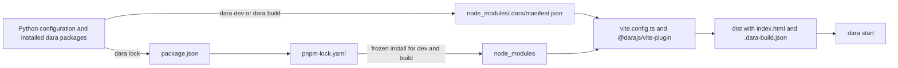

# Dara JS build redesign

Status: Draft

## Summary

Replace the UMD and Vite pipelines with one Vite build rooted in the app. The app keeps standard JS project files, while Dara owns only the entries needed to build its frontend.

The proposal makes these decisions:

- `package.json`, `pnpm-lock.yaml` and `vite.config.ts` live at the app root. A pnpm workspace uses its root lockfile.
- `dara lock` is the only command that updates dependency files.
- `dara dev` runs the frontend development loop, `dara build` creates deployable output, and `dara start` runs the Python server against either source.
- Dara checks compatible Node and pnpm versions from `PATH`. mise is recommended but optional.
- Python writes a build manifest. `@darajs/vite-plugin` turns it into named imports, component and action maps, static assets, `index.html` and a build marker.
- Apps with and without custom JS use the same pipeline.

This fixes five problems in the current system:

- Two builds of one commit can resolve different transitive npm packages because apps have no lockfile.
- Production builds use whichever Node happens to be installed.
- UMD and Vite builds behave differently.
- `dist/` is both a generated JS workspace and the build output.
- Python reads Vite's output manifest at request time to assemble HTML that Vite can emit itself.

The Python component and action APIs remain unchanged. pnpm is the only supported package manager.

## Toolchain and prerequisites

Developers and CI need Node and pnpm to run `dara lock`, `dara dev` or `dara build`. A runtime that only runs `dara start` needs neither because it serves the compiled `dist/` directory.

`dara lock` writes the supported ranges under `engines`:

```json
{
  "engines": {
    "node": ">=22",
    "pnpm": ">=11 <12"
  }
}
```

Dara checks `node --version` and `pnpm --version` before lock, development or build work. It updates these ranges when a Dara release needs a newer toolchain.

`create-dara-app` includes a `mise.toml`, so a mise user can install the recommended versions with `mise install`. Other version managers work when `node` and `pnpm` on `PATH` satisfy the ranges. The app may add an exact `packageManager` field or pin exact versions in mise. Dara writes neither.

The first `dara lock` needs registry access. Projects configure registry routing, credentials, proxies and certificate authorities through pnpm's normal `.npmrc` lookup.

Dara invokes tools with argument lists and a restricted environment. Registry credentials are available to pnpm but not to Vite.

## User workflows

The commands describe operations rather than persistent modes. Development uses a Vite process alongside the Python server. Production uses an explicit build followed by the same serve-only `dara start` used in a runtime image.

All examples accept `--config <module:config>`. Apps with namespaced packages must provide it instead of relying on auto-discovery.

### Set up a new app

`create-dara-app` creates `package.json`, `vite.config.ts` and the recommended `mise.toml`. After installing the Python environment:

```sh
mise install
dara lock --config my_app.main:config
```

The mise step is optional for users who installed compatible Node and pnpm versions another way. Commit `package.json`, `pnpm-lock.yaml` and `vite.config.ts` after `dara lock` succeeds.

### Migrate an existing app

Run `dara lock` once against the existing configuration. It imports supported values from `dara.config.json`, creates missing standard files and prints the remaining migration steps. An app with a nonstandard `local_entry` first moves that value to `Configuration.js_entry`.

Review and commit the generated files, then remove `dara.config.json`. Later commands do not keep merging it into the standard files.

### Develop the app

Run Vite and the Python server in separate terminals:

```sh
dara dev --config my_app.main:config
```

```sh
dara start --enable-hmr --reload --config my_app.main:config
```

`dara dev` performs a frozen install, writes the build manifest and starts Vite. `--enable-hmr` tells the Python server to load the frontend from Vite. `--reload` is optional and restarts Python when Python files change; JavaScript HMR does not restart the backend.

This path is the same with or without custom JS. Run `dara lock` and commit its changes after upgrading a `dara-*` Python package or changing JS dependencies.

### Add custom JS

Run `dara setup-custom-js`, export components from `js/index.tsx`, and register them from Python. Add any app-owned JS tools or dependencies to `package.json`, then run `dara lock` before returning to the development workflow.

### Build and run production output

CI or a developer with the JS toolchain creates the deployable output explicitly:

```sh
dara build --config my_app.main:config
```

The runtime then starts the Python app:

```sh
dara start --config my_app.main:config
```

`dara build` performs a frozen install and writes self-contained output without `node_modules` or credentials. A runtime image needs only the Python application and that output. `dara start` validates the build marker and serves it without invoking Node, pnpm or Vite.

Outside HMR, a missing or stale build makes `dara start` fail with `run dara build`. It never rebuilds automatically. The compatibility mapping for the old `--production` flag is covered under migration.

## Command reference

| Command | Behaviour |
| --- | --- |
| `dara lock` | Imports the configuration, updates Dara-owned `package.json` entries, runs `pnpm install`, and writes the lockfile. It creates a standard `vite.config.ts` when absent. |
| `dara dev` | Checks the project files, runs `pnpm install --frozen-lockfile`, writes the manifest, and starts Vite's development server. It does not write `dist/`. |
| `dara build --output <dir>` | Performs the same frozen install and manifest generation, then runs the production Vite build. It never changes checked-in files. |
| `dara start` | Runs the Python server. Normally it validates and serves an existing build without a JS toolchain. With `--enable-hmr`, it expects `dara dev` to supply the frontend. |
| `dara setup-custom-js` | Creates `js/index.tsx` and the recommended TypeScript files, then tells the user to run `dara lock`. |

Missing or inconsistent dependency files make `dara dev` and `dara build` fail with `run dara lock and commit the result`. No command repairs that state implicitly.

The output directory follows this order:

1. `dara build --output`
2. `Configuration.static_files_dir`
3. `dist/`

The plugin receives the resolved directory. A conflicting `build.outDir` in `vite.config.ts` is an error because Python and Vite must agree on the directory Python serves.

## How it fits together



Python discovers what the app needs and writes the manifest. The Vite plugin produces the frontend. Python then serves the result without a JS toolchain.

## Project files and ownership

A standalone app checks in `package.json`, `pnpm-lock.yaml` and `vite.config.ts`. It ignores `node_modules/` and its build output.

| File or entry | Owner |
| --- | --- |
| Required `@darajs/*` dependencies | Dara |
| Vite, the React plugin and `@darajs/vite-plugin` | Dara |
| Shared runtime dependencies and `engines` | Dara |
| App dependencies, scripts, metadata and optional `packageManager` | User |
| `pnpm-lock.yaml` | Generated by pnpm when `dara lock` runs |
| `vite.config.ts` | User, with the Dara plugin required |

`dara lock` applies these merge rules:

- It adds a missing Dara-owned entry. A compatible `peerDependencies` entry satisfies a library dependency.
- It keeps compatible user values and fails before writing if a value is incompatible.
- It accepts `workspace:`, `link:` and `file:` specifiers after checking that the target is inside the repository or workspace and has the expected package name.
- It leaves user-owned entries in place.

Upgrading a `dara-*` Python package may require `dara lock` and a commit. Dependency bots must ignore Dara-owned entries and update them through the Python package upgrade instead. Dara documents this policy but does not add Dependabot or Renovate configuration to the app.

### Shared dependencies

Packages that carry React context, state or styling across package boundaries must resolve to compatible root versions. The initial set is:

- `react`
- `react-dom`
- `styled-components`
- `@tanstack/react-query`
- `recoil`
- `recoil-sync`
- `react-router`

`@darajs/*` packages declare these as peer dependencies wherever they use them. The app has Dara-owned compatible entries, and the Vite plugin deduplicates them. If another dependency later shares runtime state across packages, Dara manages compatible root and peer ranges for it too.

### Registry authentication

pnpm resolves `.npmrc` from its usual local and global locations. Dara does not prescribe where it lives. Environment placeholders keep credentials out of the repository:

```ini
@my-org:registry=https://npm.pkg.github.com/
//npm.pkg.github.com/:_authToken=${NPM_TOKEN}
```

Apps that install private `@darajs/*` packages need the relevant registry route and credential. Dara reports the missing route or environment variable but never writes a token.

## Manifest and Vite plugin

### Build manifest

Python derives a machine-specific manifest from the imported configuration and installed packages:

```json
{
  "schema": 1,
  "daraVersion": "1.24.0",
  "local": { "entry": "./js/index.tsx" },
  "components": [
    {
      "python": "dara.components.Button",
      "package": "@darajs/components",
      "export": "Button"
    }
  ],
  "actions": [
    {
      "python": "dara.core.NavigateTo",
      "package": "@darajs/core",
      "export": "NavigateTo"
    }
  ],
  "static": [
    {
      "source": "/site-packages/dara/components/_assets/static",
      "dest": "dara.components"
    }
  ],
  "favicon": "./static/favicon.ico",
  "outDir": "./dist"
}
```

Python resolves its module-to-package map before writing component and action entries. Package dependencies registered without a component or action remain explicit imports in the manifest.

The manifest lives at `node_modules/.dara/manifest.json`. It is derived state, regenerated for development and builds, and never checked in. Absolute static paths are allowed here because the manifest does not leave the build machine.

### Visible Vite configuration

Every app has a normal `vite.config.ts`:

```ts
import dara from '@darajs/vite-plugin';
import { defineConfig } from 'vite';

export default defineConfig({
    plugins: [dara()],
});
```

`dara lock` creates this file when it is missing. If an existing config omits the plugin, `dara lock` fails and prints the import and plugin entries to add. It never rewrites an existing TypeScript config.

The plugin checks Vite's resolved configuration in `configResolved`. It rejects settings that conflict with Dara's virtual entry, output directory, HTML generation, URL handling or development endpoints. Other Vite settings remain under user control.

### Generated entry

The plugin generates real named imports for every registered export:

```ts
import daraCore from '@darajs/core';
import { NavigateTo as action0 } from '@darajs/core';
import { Button as component0 } from '@darajs/components';
import { MyChart as component1 } from '/js/index.tsx';

const actions = {
    'dara.core.NavigateTo': action0,
};

const components = {
    'dara.components.Button': component0,
    'LOCAL.MyChart': component1,
};

daraCore({ actions, components });
```

Rollup follows `export *` chains when it resolves these imports. A missing or ambiguous export therefore fails the build with the Python registration that requested it. The plugin does not need its own re-export parser.

Passing ready-made maps removes the current package namespace cache and the `preloadComponents` and `preloadActions` runtime steps. `@darajs/vite-plugin` and `@darajs/core` version together, so the generated call can change with them.

### Other plugin responsibilities

The plugin also:

- configures React and deduplicates the shared dependencies
- emits `index.html` with the required scripts, stylesheets and Jinja placeholders
- handles Dara's runtime base URL and development server endpoints
- copies package static assets and the favicon
- watches the build manifest during `dara dev`
- writes the production build marker

Two static sources cannot write the same destination. The build fails and names both sources when a file or directory collides.

### Python responsibilities

Python keeps four jobs:

- derive the manifest from the imported app configuration
- invoke pnpm and Vite for lock, development and build commands
- validate the production build marker
- serve `index.html` and static output

Python stops generating JS source, Vite configuration and HTML tags. It also stops copying assets into `dist/`.

## Build freshness

The plugin writes `.dara-build.json` into the output directory. It records:

- a digest of the portable component, action, dependency and local-entry manifest
- content hashes for copied static assets
- the lockfile digest, using the whole root lockfile in a workspace
- the Dara version and hashes of emitted files

`dara build` writes to a temporary directory and replaces the old output only after a successful build.

When serving built output, `dara start` derives the portable part of the manifest in memory and checks it and the emitted files against the marker. In a checkout where the lockfile and static sources are present, it compares those too. A runtime image may contain only the Python application and compiled output, so the absence of JS build files is not an error.

Any mismatch fails with `run dara build`. `dara start` never rebuilds. Custom JS development belongs in `dara dev`; producing a new deployable build always requires an explicit `dara build`.

`dara dev` and `dara build` separately verify that the installed Python packages agree with Dara-owned `package.json` entries. A mismatch fails with `run dara lock and commit package.json and pnpm-lock.yaml`.

## Custom JS

Custom JS follows normal Vite conventions:

1. Put the default entry at `js/index.tsx`. Use `Configuration.js_entry` for another location.
2. Add the app's TypeScript, linting and test tools to `package.json`.
3. Run `dara dev` while editing and `dara build` for deployable output.

`dara setup-custom-js` creates the default entry and recommended TypeScript files. It does not create `dara.config.json`.

The root `vite.config.ts` is reserved for the Dara app. If the same package also publishes a JS library, its library build uses `vite.lib.config.ts` and a script such as `vite build --config vite.lib.config.ts`. This keeps the two outputs and plugin contracts explicit.

## Monorepos

An app inside a pnpm workspace joins that workspace. Dara walks upward to find `pnpm-workspace.yaml` and then:

- uses the root `pnpm-lock.yaml` and records its complete digest in `.dara-build.json`
- runs a filtered frozen install for the app
- updates only the app's Dara-owned `package.json` entries
- follows pnpm's normal `.npmrc` lookup and workspace layout
- leaves `minimumReleaseAge`, `allowBuilds`, `blockExoticSubdeps`, overrides, catalogs and patches to the repository

Dara does not add an automatic `minimumReleaseAge` exclusion for its packages. A same-day release may be blocked until the workspace policy allows it or the repository adds its own exclusion.

The root may set an exact `packageManager` or mise pin. Dara only requires that the active pnpm satisfies its compatibility range.

### Sibling libraries

A workspace library can expose source to Dara builds with a `dara-source` export condition:

```json
{
  "exports": {
    ".": {
      "dara-source": "./js/index.tsx",
      "types": "./dist/index.d.ts",
      "default": "./dist/index.js"
    }
  }
}
```

The plugin adds that condition when resolving dependencies. Libraries without it must build before the app; `dara build` runs `pnpm --filter "<app>^..." run build`. `--no-deps-build` skips that step.

An app that is also a published library keeps the Dara config at `vite.config.ts` and the library config at `vite.lib.config.ts`. If both builds would write the same directory, configuration validation asks the project to choose separate outputs.

## Static assets

Packages can register files for `/static/<package>/`. Python resolves the installed paths into the manifest and the plugin copies them into the output. This replaces the file-serving part of `AssetManifest` for assets that cannot be bundled.

The first migration keeps the vendored BokehJS, Pixi and Plotly files in `dara-components/_assets/common/` and serves them through this mechanism. Bundling them is follow-up work.

## Migration

Migration support ships in a minor release. Removing the legacy pipeline requires a major release. The duration of the compatibility period remains open.

### Project migration

`dara.config.json` is a one-time migration input to `dara lock`:

- `extra_dependencies` move into `package.json` under the normal ownership rules.
- A default custom entry moves to `js/index.tsx`.
- Before migration, an app with a nonstandard `local_entry` moves that value to `Configuration.js_entry`.
- `dara lock` creates missing standard files and tells the user to remove `dara.config.json`.

Once the standard files exist, Dara does not keep merging `dara.config.json` into them. Existing `npm` or `yarn` settings migrate to pnpm.

`create-dara-app` ships the standard files and `.gitignore` entries. `packages/demo-app` is the first migration test.

### Legacy flags

During compatibility, deprecated flags preserve `DARA_PRODUCTION_MODE`, `DARA_JS_REBUILD` and `SKIP_JSBUILD` for downstream code but use the new command model:

| Legacy input | Compatibility behaviour |
| --- | --- |
| `--production` | Runs `dara build`, then `dara start`, and warns. |
| `--rebuild` | Runs `dara build`, then `dara start`, and warns. |
| `--skip-jsbuild` | Runs `dara start` and warns that the flag is redundant. |
| `--docker` | Keeps its SSO and hidden API documentation behaviour. Its build-skip implication is redundant. |
| `--enable-hmr` | Keeps the existing pairing where `dara start --enable-hmr` expects `dara dev` to be running. |

The major release removes `--production`, `--rebuild`, `--skip-jsbuild` and their build-selection environment variables. `--docker` and `--enable-hmr` remain for their other behaviour.

The old `dist/_build.json`, `dist/manifest.json`, `VITE_MANIFEST_PATH` and generated `dist/tsconfig.json` disappear. The new output contains `.dara-build.json` and plugin-emitted `index.html`.

### Release action

`dara-release-action` currently calls `dara-enterprise cache-build-config`, `collect-static` and `package`. The action replaces that sequence with one `dara build --output <dir>` call. The old commands remain as deprecated compatibility wrappers until the legacy pipeline disappears.

The release action continues to own toolchain provisioning, bundle assembly, asset embedding, validation, hooks, prebuilt assets and the runtime image. This proposal does not change its Dockerfile.

Registry credentials reach pnpm through `.npmrc` environment placeholders. Bundle validation continues to reject credentials and `.npmrc` files in the output.

The `dara-config-file` release input has no replacement. Release-time rewriting of `dara.config.json` is incompatible with the checked-in dependency state; workspace dependencies use `workspace:*` instead.

### Deprecated internals

Downstream packages use several auto-JS internals. They warn during compatibility and disappear with the old pipeline.

| API | During compatibility | After removal |
| --- | --- | --- |
| `ConfigurationBuilder.template_extra_js`, `add_package_tag_processor`, `package_tag_processors` | Kept with no effect | Removed |
| Auto-JS fields on `AssetManifest`, `_assets/auto_js/` | Ignored; `common_assets` still supports URL-loaded files | Replaced by package static assets |
| `BuildMode.AUTO_JS`, `_entry_autojs.template.tsx` | Kept for legacy builds | Removed |
| `fastapi_vite_dara`, `jinja/index*.html`, `build_vite_template` | Kept for legacy builds | Removed |
| `BuildConfig.npm_registry`, `BuildConfig.npm_token` | Warn and point to `.npmrc` | Removed |

## Alternatives considered

### Dara-managed Node and pnpm

An earlier design had `dara-core` download and cache Node and pnpm. A secure cross-platform installer would duplicate version managers and conflict with repositories that already pin their toolchain. Dara instead verifies binaries from `PATH`.

### Bun

Bun would reduce the toolchain to one executable, but this redesign does not need a new runtime and package manager. Node and pnpm retain the existing Vite ecosystem.

## Open question

- How long should `dara.config.json` remain a supported migration input?

## Implementation slices

Each slice is usable end to end before the next starts.

| # | Outcome | Proven on |
| --- | --- | --- |
| 1 | A generated app can lock, build and serve through the new manifest, plugin and marker path. | `create-dara-app` output |
| 2 | Development and custom JS work through `dara dev`, named imports and ready-made runtime maps. | `packages/demo-app` |
| 3 | A clean CI checkout builds deployable output and the release action calls `dara build`. | A downstream app without custom JS |
| 4 | Workspace lockfiles, sibling libraries and separate app and library Vite configs work together. | A monorepo whose app also publishes a library |
| 5 | Package static assets serve the existing vendored visualization files. | Demo app visualization pages |
| 6 | Downstream packages migrate and the UMD pipeline is removed. | Dara package suite |

## Follow-up work enabled by this redesign

### Bundle vendored visualization libraries

Try Bokeh, Pixi and Plotly as npm dependencies behind `import()`. Use current library versions because the previous failures came from 2023 releases. The demo app's Bokeh, Plotly and causal graph pages must work, including a Bokeh figure and `DataTable` without `jquery.min.js`.

If the spike works, `dara-components` can remove the vendored files. `dara lock` can then select `@bokeh/bokehjs` to match the installed Python `bokeh` version.

### Split heavy packages

The single Vite pipeline lets packages use `import()` for code splitting. Today `@darajs/components` re-exports its heavy editors and graph packages from one index. A library can replace a static re-export with a lazy boundary:

```ts
export const CausalGraphEditor = React.lazy(() => import('./causal-graph'));
```

`DynamicComponent` already wraps components in `Suspense`. Heavy action dependencies can use `await import()` inside the action. The first candidates are the causal graph editor, plotting, code and markdown editors, and AI chat.
