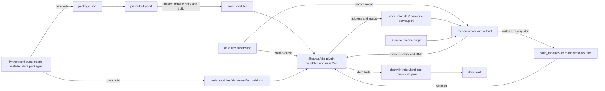

# Dara JS build redesign

Status: Draft

## Summary

Replace the UMD and Vite pipelines with one Vite build rooted in the app. The app keeps standard JS project files, while Dara owns only the entries needed to build its frontend.

This ships as Dara 2.0. The same release removes the UMD pipeline, `dara.config.json`, `dara setup-custom-js` and the build and mode flags on `dara start`. There is no compatibility period, so Dara never maintains two frontend pipelines or two runtime entry contracts at once.

The proposal makes these decisions:

- `package.json`, `pnpm-workspace.yaml`, `pnpm-lock.yaml`, `vite.config.ts`, `tsconfig.json` and `js/index.tsx` live at the app root. Dara-owned versions live in a named pnpm catalog inside the workspace file; a monorepo uses its root workspace file and lockfile.
- `dara lock` is the only Dara command that changes dependency files: it rewrites the `dara` catalog, adds missing `catalog:dara` references, runs the install and lets the plugin create missing project files. Apps use pnpm directly for their own dependencies.
- `dara dev` is one process. It starts Vite as a child, runs the Python server with reload, and proxies the frontend so the browser talks only to Python. `dara build` creates deployable output and `dara start` serves it without a JS toolchain.
- Posture comes from the command. `dara dev` runs with development posture and `dara start` with deploy posture, so `--production`, `--docker`, `--enable-hmr`, `--rebuild`, `--skip-jsbuild` and `--dev-port` disappear with their environment variables.
- Commands read the configuration reference from `[tool.dara]` in `pyproject.toml`; `--config` becomes an override.
- Every app needs Node and pnpm to lock, develop or build, including apps without custom JS. This is a deliberate trade. The company standardizes on mise, the runtime image still needs neither, and one pipeline for every app is worth the prerequisite. Dara checks compatible versions from `PATH`; mise is recommended but optional.
- Python writes separate development and build manifests. After Python bootstraps the JS dependencies, `@darajs/vite-plugin` initializes and validates the project and runs the frontend toolchain. It generates named imports, component and action maps, static assets, `index.html` and a build marker from the manifests.
- Every app has the same fixed JS entry and uses the same pipeline.

This fixes seven problems in the current system:

- Two builds of one commit can resolve different transitive npm packages because apps have no lockfile.
- Production builds use Node with no compatibility check.
- UMD and Vite builds behave differently.
- `dist/` is both a generated JS workspace and the build output.
- `dist/` is mounted at `/static`, so a production build serves `package.json`, `node_modules/`, the generated sources, `_build.json` with the serialized `npm_token`, and any `.npmrc` written for a private registry, token included.
- Python reads Vite's output manifest at request time to assemble HTML that Vite can emit itself.
- The bootstrap JSON embedded in `index.html` is not script-safe: `json.dumps` leaves `<` unescaped, so a string containing `</script>` breaks out of the data block.

The Python component and action APIs remain unchanged, and pnpm 12 or newer is the only supported package manager. `dara dev` is the standard development loop and runs both halves behind one origin. Production runs `dara build` before `dara start`, and no command does both.

## Toolchain and prerequisites

Developers and CI need Node and pnpm to run `dara lock`, `dara dev`, `dara build` or `dara check`. A runtime that only runs `dara start` needs neither because it serves the compiled `dist/` directory.

`dara lock` writes the supported ranges under `engines`:

```json
{
  "engines": {
    "node": ">=22",
    "pnpm": ">=12 <13"
  }
}
```

Dara checks `node --version` and `pnpm --version` against these same ranges before lock, development or build work. It updates the ranges when a Dara release needs a newer toolchain.

`create-dara-app` includes a `mise.toml`, so a mise user can install the recommended versions with `mise install`. Other version managers work when `node` and `pnpm` on `PATH` satisfy the ranges. The app may add an exact `packageManager` field or pin exact versions in mise. Dara writes neither.

`dara lock` and `dara build` need registry access or a mirror, so air-gapped environments build in CI and ship the output. `dara start` never needs the registry. Projects configure registry routing, credentials, proxies and certificate authorities through pnpm's normal `.npmrc` lookup.

The generated project must install without dependency build scripts, because pnpm ignores them unless a repository allowlists them. `dara lock` prints pnpm's ignored-build-scripts warning as a diagnostic instead of letting it scroll past.

Dara invokes tools with argument lists. pnpm receives the full environment so `.npmrc` placeholders such as `${NPM_TOKEN}` resolve. The Node process that runs the plugin receives an allowlist instead: `PATH`, `HOME`, the temporary directory variables, locale and terminal variables, `CI`, the proxy variables, `NODE_OPTIONS`, `NODE_EXTRA_CA_CERTS`, `VITE_*` and the Windows system variables. Vite still loads `.env` files from the app root itself. Registry credentials never reach Vite or user plugins.

## User workflows

The commands describe operations rather than persistent modes, and each command carries its own posture. `dara dev` is development and owns both Vite and the Python server in one process. `dara start` is deployment and serves a build with the posture a runtime image has.

Commands that import the app read the configuration reference from `pyproject.toml`:

```toml
[tool.dara]
config = "my_app.main:config"
```

`create-dara-app` writes this entry. `--config <module:config>` overrides it, and without either Dara falls back to today's `<directory>.main:config` guess. The app root is the working directory of every command, as it is today. `dara dev` also accepts `--root <dir>`.

### Set up a new app

`create-dara-app` writes the project files described under [create-dara-app](#create-dara-app), installs the Python environment, then runs `dara lock`. When Node or pnpm is missing it prints the two remaining steps and stops; the generated project is complete either way.

```sh
mise install
dara lock
```

The mise step is optional for users who installed compatible Node and pnpm versions another way. The first lock writes the `dara` catalog and installs `@darajs/vite-plugin`; its initialization mode then creates the missing `vite.config.ts`, `tsconfig.json` and empty `js/index.tsx`. Commit those files with `package.json`, `pnpm-workspace.yaml` and `pnpm-lock.yaml` after `dara lock` succeeds.

At the end of a successful lock, Dara prints the next steps:

```text
Dependencies locked. Commit package.json, pnpm-workspace.yaml, pnpm-lock.yaml and any generated project files.

Develop:
  dara dev

Build and serve:
  dara build
  dara start
```

These commands are guidance only. `dara lock` does not run either path.

### Migrate an existing app

`dara lock` refuses to run while `dara.config.json` exists and prints the manual steps, which are listed under [Migration](#migration) with every removed command, flag and API. Delete the file, run `dara lock` again, then review and commit the generated files.

### Develop the app

```sh
dara dev
```

`dara dev` resolves the app root, checks the frozen install, starts the plugin's development runner as a child process, then runs the Python server with reload in the same process. The runner serves Vite on a free port and runs the TypeScript 7 checker in watch mode beside it. Vite transpiles without type checking, so the checker is what turns a type error into something you see, in the Vite overlay and in the terminal.

The Python server writes `manifest.dev.json` whenever it starts and proxies every request under `/static/` to Vite, including the HMR websocket. The browser only ever talks to Python, so development and production share one origin. SSO redirect URIs, cookies and the base URL behave the same in both, and a devcontainer forwards one port.

A Python change restarts the Python server and refreshes the manifest from the newly imported configuration. Vite keeps running because the supervisor owns it, and JavaScript HMR never restarts the backend. Vite logs only warnings and errors, prefixed so they stand apart from Python's.

```text
$ dara dev
Dara 2.0.0 · my_app.main:config
frontend ready in 412ms
serving on http://localhost:8000
watching my_app/ for Python changes
```

Until Vite reports ready, or while the plugin reports a dependency mismatch, Python serves a diagnostic page with the exact command needed to continue and keeps serving API and health endpoints. The plugin never serves HTML of its own.

`--open` opens the browser once the server reports ready, and `--no-typecheck` skips the checker. Three more flags cover the cases where one process is not enough:

- `--no-reload` runs the Python server inside the supervisor process, so an IDE debugger sees breakpoints while Vite still runs as a child.
- `--frontend-only` runs only Vite and writes its address to `node_modules/.dara/dev-server.json`, for a Python server started elsewhere, for example under a debugger.
- `--backend-only` runs only the Python server, which reads that file to find Vite and serves the diagnostic page until it appears. It also suits an API-only app that registers no pages.

This path is the same whether `js/index.tsx` is empty or contains app code, and it is the standard loop for Python-only changes too. The component set comes from import discovery over the app's modules, so the first use of a new component changes the manifest, and only `dara dev` picks that up without a rebuild. Run `dara lock` and commit its changes after upgrading a `dara-*` Python package or changing JS dependencies.

### Add a custom component

Export components from the existing `js/index.tsx` and register them from Python. Add any app-owned JS tools or dependencies to `package.json`, then run `dara lock` before returning to the development workflow.

### Build and run production output

CI or a developer with the JS toolchain creates the deployable output explicitly:

```sh
dara build
```

The runtime then starts the Python app:

```sh
dara start
```

`dara build` performs a frozen install and writes self-contained output without `node_modules` or credentials. A runtime image needs only the Python application and that output. `dara start` validates the build marker and serves it without invoking Node, pnpm or Vite.

`dara start` always runs with deploy posture. It hides API documentation unless `--api-docs` is passed, `--require-sso` still enforces an SSO configuration, and the JWT secret fallback and default session backend follow the rules `--production` and `--docker` used to select. A build served locally behaves like the runtime image, warning included when `JWT_SECRET` is not set.

A missing or stale build makes `dara start` fail with `run dara build`. Using a new component in Python also makes the build stale, because the generated entry imports only registered exports. Develop with `dara dev`; a deployable artifact is always an explicit `dara build`.

### Check a project

`dara check` runs the diagnostics the other commands share, without side effects: toolchain versions, lockfile agreement with `package.json`, the `dara` catalog against the installed Python packages, the TypeScript and Vite contracts, one pass of the TypeScript checker, and the build marker when output exists. It exits nonzero with the repairing command for each failure. Run it in CI, and run it first when something looks wrong. `--json` prints the same diagnostics as a list of code, message and fix for tooling and coding agents. The code set stays small in 2.0.0 and grows afterwards, as described under [After 2.0.0](#after-200).

## Command reference

| Command                                                     | Behaviour                                                                                                                                                                                                                                                                                                                                                             |
| ----------------------------------------------------------- | --------------------------------------------------------------------------------------------------------------------------------------------------------------------------------------------------------------------------------------------------------------------------------------------------------------------------------------------------------------------- |
| `dara lock`                                                 | Imports the configuration, rewrites the `dara` catalog in `pnpm-workspace.yaml`, adds missing `catalog:dara` references to `package.json`, runs `pnpm install`, and writes the lockfile. It then invokes the plugin package's initialization mode, which creates missing standard JS project files and validates the result before printing the commands to run next. It does not run a development or production Vite build.              |
| `dara dev [--open] [--no-typecheck] [--no-reload] [--frontend-only] [--backend-only]` | Resolves the app root from the working directory or `--root`, runs `pnpm install --frozen-lockfile`, starts the plugin package's development runner as a child process, which serves Vite on a free port and runs the TypeScript checker in watch mode, then runs the Python server with reload. Python writes `manifest.dev.json` on every start and proxies `/static/` to Vite. The command never writes `dist/` or checked-in files. |
| `dara build [--output <dir>]`                               | Imports the app once, writes `manifest.build.json`, performs a frozen install, and hands the app root to the plugin package's build runner. The runner validates the project, builds reachable workspace dependencies, runs Vite into staging, writes the marker and publishes the completed output. The command never changes checked-in files.                      |
| `dara start [--api-docs] [--require-sso]`                   | Runs the Python server with deploy posture against an existing build. It validates the marker and serves the output without a JS toolchain, hides API documentation unless asked, and never starts Vite or reloads.                                                                                                                                                   |
| `dara check [--json]`                                       | Runs every diagnostic the other commands share without writing anything: toolchain ranges, frozen-install agreement, the `dara` catalog against installed Python packages, the TypeScript and Vite contracts, one type-check pass, and the build marker. Exits nonzero with the repairing command; `--json` lists code, message and fix.                                                                                          |

Every command that imports the app accepts `--config <module:config>` as an override of `[tool.dara]`. `dara start` keeps `--port`, `--host`, `--base-url`, `--metrics-port`, `--disable-metrics` and the logging options; `dara dev` accepts the same serving options plus `--reload-dir`.

An inconsistent `package.json` and lockfile makes the frozen install fail with `run dara lock and commit the result`. A later mismatch between the development manifest and `package.json` moves the plugin to its blocked state, which Python renders as a diagnostic page. No command repairs either state implicitly.

The first `dara lock` must install `@darajs/vite-plugin` before its initializer and validator exist. Python writes the catalog and references and runs the install, then invokes initialization mode. A failure before the write changes nothing. A later Vite or TypeScript error leaves the valid dependency files and newly created standard files in place, exits nonzero and prints the edits required before rerunning `dara lock`.

The output directory follows this order:

1. `dara build --output <dir>`
2. `Configuration.static_files_dir`
3. `dist/`

The plugin receives the resolved directory. A conflicting `build.outDir` in `vite.config.ts` is an error because Python and Vite must agree on the directory Python serves.

## How it fits together



Python discovers what the app needs and writes the operation-specific manifest. The Vite plugin produces the frontend. In development Python also fronts Vite, so the browser sees one origin in every mode. In production Python serves the result without a JS toolchain.

## Project files and ownership

A standalone app checks in `package.json`, `pnpm-workspace.yaml`, `pnpm-lock.yaml`, `vite.config.ts`, `tsconfig.json` and `js/index.tsx`. It ignores `node_modules/` and its build output.

| File or entry                                                     | Owner                                                                                         |
| ----------------------------------------------------------------- | --------------------------------------------------------------------------------------------- |
| `catalogs.dara` in `pnpm-workspace.yaml`: `@darajs/*`, Vite, TypeScript, shared runtime dependencies | Dara, rewritten by every `dara lock`                                                    |
| The rest of `pnpm-workspace.yaml`                                 | User or repository                                                                            |
| `catalog:dara` references and `engines` in `package.json`         | Dara adds missing ones and never edits other entries                                          |
| App dependencies, scripts, metadata and optional `packageManager` | User                                                                                          |
| `pnpm-lock.yaml`                                                  | Generated by pnpm when `dara lock` runs                                                       |
| `vite.config.ts`                                                  | User, initialized by the plugin when missing, with the Dara plugin required                   |
| `tsconfig.json`                                                   | User, initialized by the plugin when missing, with Dara's module resolution settings required |
| `js/index.tsx`                                                    | User, initialized by the plugin when missing and never rewritten                              |

### Fixed application entry

Every new app has a `js/index.tsx`, initially containing only:

```ts
export {};
```

The Vite plugin always imports this module. It is the app's place for local component and action exports, global styles and JS setup. Source may live elsewhere; the fixed entry can re-export it with normal TypeScript imports.

An empty module has negligible runtime and bundle cost. Every app already carries a JS project under this proposal, so the entry adds one checked-in source file. In return, Dara removes the custom-JS setup command, optional local-entry state, a manifest field, conditional TypeScript includes and several build branches. Every app uses the same entry in development and production.

This makes a custom component an ordinary application change instead of a build-system task. A developer or coding agent can add a React component, export it from the existing entry and register it from Python without running a setup command or adding configuration files. TypeScript checks the source, the plugin validates registered exports and Vite supplies HMR.

The plugin's initialization mode creates the empty entry only when it is missing and never rewrites it. Development and production fail with a direct instruction to run `dara lock` if the file is later removed.

Application code may live outside `js/` when the root `tsconfig.json` includes it. `js/index.tsx` remains the fixed import boundary and imports or re-exports that code. Apps add their own linting, test tools and other dependencies to `package.json`.

The root `vite.config.ts` and `tsconfig.json` describe the Dara app. An app that also publishes a JS library keeps separate library configuration as described under [Sibling libraries](#sibling-libraries).

### Dependency ownership

Dara-owned versions live in a named pnpm catalog. `dara lock` rewrites the `catalogs.dara` block of `pnpm-workspace.yaml` from the installed Python packages, creating the file when a standalone app has none, and makes sure `package.json` references each required package as `catalog:dara`:

```yaml
catalogs:
  dara:
    "@darajs/components": ^2.0.0
    "@darajs/core": ^2.0.0
    "@darajs/vite-plugin": ^2.0.0
    react: ^18.3.0
    react-dom: ^18.3.0
    typescript: ^7.0.0
    vite: ^8.1.0
```

```json
{
  "devDependencies": {
    "@darajs/core": "catalog:dara",
    "vite": "catalog:dara"
  }
}
```

Ownership is a matter of location. Dara owns the catalog block and nothing else in the workspace file; the repository owns the rest of `pnpm-workspace.yaml`, and the user owns `package.json`. `dara lock` adds a missing `catalog:dara` reference and never changes any other entry. A required package that references anything else fails the lock with the reference to use, except `workspace:`, `link:` and `file:` targets inside the repository or workspace, which the loader validates against the expected package name and the catalog version. There is no range intersection, exact-match rule or bot policy to document, and an agent editing `package.json` cannot clobber a Dara version. pnpm accepts a workspace file that lists no packages, so a standalone app is a workspace of one.

An app that doubles as a library keeps its own `peerDependencies`; the `catalog:dara` reference sits in `devDependencies` and describes the app build only.

Lock output is deterministic. Catalog entries and added references are written in sorted order with stable formatting, so a rerun without changes produces no diff and a Dara upgrade produces a diff that touches only the catalog block.

Python writes the catalog because it must bootstrap `@darajs/vite-plugin` before any Node code can run. After installation the Node project loader checks the catalog block, the references and the resolved packages.

Upgrading a `dara-*` Python package requires `dara lock` and a commit. Without it, development enters the blocked state and `dara build` fails, both naming the command. A dependency bot that understands catalogs would edit the block; the next `dara lock` rewrites it and `dara check` reports the drift in between.

### Plugin packages

A third-party Python package that ships JS components or actions publishes its JS as an npm package and registers it exactly as `dara-*` packages do: `js_module` on the component definitions, plus a `dara_assets` entry point for static assets. `dara lock` adds it to the `dara` catalog the same way, deriving the specifier from the installed Python version and referencing it from `package.json`, and the app resolves it from a registry it can reach. Private plugins use a private registry route in `.npmrc`.

This replaces shipping a UMD bundle inside the wheel. Because `file:` and `link:` targets must resolve inside the repository or workspace, JS cannot travel with a Python package. The custom JS documentation's distribution section changes accordingly.

### Shared dependencies

Packages that carry React context, state or styling across package boundaries must resolve to compatible root versions. The initial set is:

- `react`
- `react-dom`
- `styled-components`
- `@tanstack/react-query`
- `recoil`
- `recoil-sync`
- `react-router`

`@darajs/*` packages declare these as peer dependencies wherever they use them. The `dara` catalog carries compatible versions, and the Vite plugin deduplicates them. If another dependency later shares runtime state across packages, Dara manages compatible root and peer ranges for it too.

### Registry authentication

pnpm resolves `.npmrc` from its usual local and global locations. Dara does not prescribe where it lives. Environment placeholders keep credentials out of the repository:

```ini
@my-org:registry=https://npm.pkg.github.com/
//npm.pkg.github.com/:_authToken=${NPM_TOKEN}
```

Apps that install private `@darajs/*` packages need the relevant registry route and credential. Dara reports the missing route or environment variable but never writes a token.

## create-dara-app

The generator gets an overhaul in the same release so the first `dara dev` works without reading documentation. It writes:

- `pyproject.toml` with the `[tool.dara]` entry and the Python dependencies
- `package.json` with `engines` and a private name, ready for `dara lock` to add the `catalog:dara` references
- `mise.toml` pinning the recommended Node and pnpm versions
- `AGENTS.md` naming the five commands, the fixed entry, the Dara-owned catalog and what not to edit, so a coding agent can work in the project without inferring the build system
- a README whose only instructions are the five commands

It then installs the Python environment and runs `dara lock`. When Node or pnpm is missing it prints `mise install` and `dara lock` and stops. It writes no Dockerfile because the release action owns image builds. `js/index.tsx`, `vite.config.ts` and `tsconfig.json` come from `dara lock` like in any other app, so the generator carries no JS templates of its own.

## Manifest and Vite plugin

### Frontend manifests

Python derives machine-specific manifests from the imported configuration and installed packages. Development and production use the same schema:

```json
{
  "schema": 1,
  "configuration": "my_app.main:config",
  "daraVersion": "2.0.0",
  "packageRequirements": [
    {
      "name": "@darajs/components",
      "section": "devDependencies",
      "specifier": "^2.0.0"
    },
    {
      "name": "@darajs/core",
      "section": "devDependencies",
      "specifier": "^2.0.0"
    },
    {
      "name": "@darajs/enterprise",
      "section": "devDependencies",
      "specifier": "^2.0.0"
    },
    {
      "name": "@darajs/vite-plugin",
      "section": "devDependencies",
      "specifier": "^2.0.0"
    },
    {
      "name": "react",
      "section": "devDependencies",
      "specifier": "^18.3.0"
    },
    {
      "name": "typescript",
      "section": "devDependencies",
      "specifier": "^7.0.0"
    },
    {
      "name": "vite",
      "section": "devDependencies",
      "specifier": "^8.1.0"
    }
  ],
  "moduleDependencies": [
    {
      "python": "dara.enterprise",
      "package": "@darajs/enterprise"
    }
  ],
  "components": [
    {
      "python": "dara.components.Button",
      "package": "@darajs/components",
      "export": "Button"
    },
    {
      "python": "LOCAL.MyChart",
      "package": "LOCAL",
      "export": "MyChart"
    }
  ],
  "actions": [
    {
      "python": "dara.core.NavigateTo",
      "package": "@darajs/core",
      "export": "NavigateTo"
    }
  ],
  "static": [
    {
      "package": "dara.components",
      "source": "/site-packages/dara/components/_assets/common",
      "target": "."
    }
  ],
  "appStatic": ["/app/static"],
  "favicon": "/app/static/favicon.ico",
  "outDir": "./dist"
}
```

The `static`, `appStatic` and `favicon` entries carry the sources described under [Static assets](#static-assets). Python resolves `outDir` using the precedence in the command reference before it writes the manifest. The manifests carry no URLs: Python applies the runtime base URL when it renders the template, and Vite's address travels through `dev-server.json`.

`configuration` records the resolved Python configuration reference for diagnostics; the Vite plugin never imports it. `packageRequirements` contains every Dara-owned package with its required `package.json` section and the specifier written to the `dara` catalog. The example shows representative entries. The project loader compares the complete list with the catalog block, the `catalog:dara` references and the installed packages. The frozen install has already checked that the lockfile agrees with the checked-in files.

Python resolves its module-to-package map before writing component and action entries. It carries `Configuration.module_dependencies` into `moduleDependencies` even when no component or action uses the package. Plugins use `ConfigurationBuilder.add_module_dependency` when import discovery would otherwise miss a Python package's asset manifest and JS module.

The UMD pipeline also used explicit module dependencies to order script tags. Vite makes ordering irrelevant, but explicit inclusion still matters.

The fixed local entry does not appear in the manifest. A component or action whose package is `LOCAL` always resolves from `<app-root>/js/index.tsx`.

Each app has three derived files below `<app-root>/node_modules/.dara/`, including in a workspace:

- The Python server started by `dara dev` owns `manifest.dev.json` and replaces it whenever it starts or reloads. The plugin compares content and ignores a rewrite that changes nothing, so a Python reload does not refresh the browser by itself.
- `dara build` owns `manifest.build.json` and replaces it once before the production build.
- The plugin owns `dev-server.json`: Vite's origin, a per-run token, and its state with any diagnostic. Python reads it to configure the proxy and to render diagnostics, and the supervisor removes it on exit.

The Vite command selects the file. `serve` starts without a manifest, then reads and watches the development manifest. `build` requires and reads the build manifest once. A production build cannot replace the manifest used by a running development server. The workspace root remains responsible only for shared pnpm state such as the lockfile. Both manifests may contain absolute static paths because neither leaves the build machine.

In development the browser never talks to Vite. Python proxies every request under `/static/` to the origin recorded in `dev-server.json`, including the HMR websocket upgrade, and rewrites the `Host` header so Vite's allowed-hosts check passes. Vite's client connects to the port its script was loaded from when neither `server.hmr.port` nor `clientPort` is set. HMR therefore flows through the proxy with no configuration. Because both files live in the same app root's `node_modules/.dara/`, a Vite server for another project cannot be mistaken for this one. The request-time identity handshake based on `Configuration.static_files_dir` disappears, along with the `VITE_SERVER_*` variables and `--dev-port`.

The development plugin holds one parsed state and publishes it in `dev-server.json`:

- `waiting` means no development manifest exists yet.
- `ready` contains a parsed manifest whose package requirements match the project.
- `blocked` contains a manifest or dependency error and the command that repairs it.

Only `ready` exposes the virtual application entry. Python reads the state before proxying and renders a diagnostic page for the other two, so an unresolved module request never becomes a blank page or a Vite overlay. The plugin does not serve HTML.

### Shared JS project loader

`@darajs/vite-plugin` exposes one Node project loader and a CLI with initialization, check, development and build modes. `dara lock` invokes initialization after installation, `dara check` invokes check, and `dara dev` and `dara build` invoke the other two.

Initialization mode creates `vite.config.ts`, `tsconfig.json` and `js/index.tsx` when they are missing, then validates the complete project. The defaults live with the code that interprets them, not in `dara-core`. Initialization never rewrites an existing file. Check, development and build are read-only with respect to checked-in files.

The loader parses the app root once and checks:

- the frontend manifest schema and Dara version when an operation supplies a manifest
- `packageRequirements` against the `dara` catalog, the `package.json` references and the packages pnpm resolved
- the fixed `js/index.tsx` entry
- effective TypeScript options, resolved with a tsconfig reader such as `get-tsconfig` that follows JSONC and `extends`
- the Vite configuration resolved through Vite's API for both `serve` and `build`
- workspace, `file:` and `link:` targets against their resolved package names and versions

The loader returns the parsed project or structured diagnostics. The development and build runners pass the parsed project into plugin hooks instead of repeating checks there. They resolve the visible Vite config and require exactly one Dara plugin before starting the requested operation. If the config omits the plugin, the runner shows a Dara diagnostic before Vite starts.

The loader never imports the Python app or repairs invalid state. Only initialization writes project files. No runner installs or updates dependencies, although build mode may invoke declared workspace build scripts after Python completes the frozen install.

Python passes the derived requirements to initialization and check over standard input; neither writes a manifest. Development and build read the requirements from their manifests. The four operations use the same diagnostics for shared project errors. Python does not parse `tsconfig.json`, load `vite.config.ts`, inspect installed JS packages or recheck manifest requirements.

### Visible Vite configuration

Every app has a visible `vite.config.ts`:

```ts
import dara from "@darajs/vite-plugin";
import { defineConfig } from "vite";

export default defineConfig({
  plugins: [dara()],
});
```

Initialization mode creates this file when it is missing. The shared project loader resolves an existing config for both Vite commands. If it omits the Dara plugin, validation fails and prints the import and plugin entries to add. Dara never rewrites an existing Vite config.

`dara()` returns `@vitejs/plugin-react` together with Dara's own Vite plugins. Vite flattens that plugin array, so the app does not import or configure the React plugin separately. `@darajs/vite-plugin` owns the React plugin dependency and its version.

During development and builds, the runner completes the parsed project with Vite's resolved configuration. It rejects a second React plugin and settings that conflict with Dara's virtual entry, output directory, HTML generation, URL handling or development endpoints. Other Vite settings remain under user control.

### TypeScript configuration

`dara lock` adds TypeScript as a Dara-owned development dependency:

```json
{
  "devDependencies": {
    "typescript": "^7.0.0"
  }
}
```

The range follows minor and patch releases within the latest stable major supported by Dara. Dara moves it to the next major only after the generated app and all `@darajs/*` sources pass against that release. Prereleases and the next untested major do not enter an app through `dara lock`. The TypeScript 7 package ships the native compiler without a JavaScript compiler API, so Dara runs its executable for checking and never imports it.

Every app also has a root `tsconfig.json`. The generated config starts strict and makes Vite and the editor resolve workspace packages the same way:

```json
{
  "compilerOptions": {
    "allowUnreachableCode": false,
    "allowUnusedLabels": false,
    "customConditions": ["dara-source"],
    "exactOptionalPropertyTypes": true,
    "forceConsistentCasingInFileNames": true,
    "isolatedModules": true,
    "jsx": "react-jsx",
    "lib": ["DOM", "DOM.Iterable", "ES2022"],
    "module": "ESNext",
    "moduleDetection": "force",
    "moduleResolution": "bundler",
    "noEmit": true,
    "noFallthroughCasesInSwitch": true,
    "noImplicitOverride": true,
    "noImplicitReturns": true,
    "noPropertyAccessFromIndexSignature": true,
    "noUncheckedIndexedAccess": true,
    "noUncheckedSideEffectImports": true,
    "noUnusedLocals": true,
    "noUnusedParameters": true,
    "skipLibCheck": true,
    "strict": true,
    "target": "ES2022",
    "types": ["vite/client"],
    "useDefineForClassFields": true,
    "verbatimModuleSyntax": true
  },
  "include": ["js"]
}
```

`moduleResolution: "bundler"` makes TypeScript follow package `exports` using bundler rules. `customConditions` makes it select the same `dara-source` branch as Vite. TypeScript then reads a sibling package's source for editor types and type checking, so that package does not need prebuilt declarations during app development.

`jsx: "react-jsx"` selects React's automatic JSX runtime. App files do not need to import `React` only to use JSX.

These settings are the generated default, not the full Dara contract. They keep application and workspace source strict while `skipLibCheck` avoids checking declarations inside third-party packages. Dara tests every `@darajs/*` package that exposes `dara-source` against this default.

For an existing config, the shared Node project loader resolves JSONC, `extends` and effective compiler options with a small tsconfig reader such as `get-tsconfig` or `tsconfck`. It requires only the settings needed by the pipeline:

- `moduleResolution` is `bundler`
- `customConditions` contains `dara-source`
- `jsx` is `react-jsx`
- `noEmit` is `true`
- `isolatedModules` is `true`
- `types` contains `vite/client`

Missing or conflicting required values fail during lock, development and build with the settings to add. Dara does not rewrite the file or reject changes to the other generated defaults. The loader checks the configuration contract; it does not replace an app's separate lint or full-program type-check command.

### Generated entry

The plugin generates a named import for every registered export:

```ts
import daraCore from "@darajs/core";
import "@darajs/enterprise";
import "/js/index.tsx";
import { NavigateTo as action0 } from "@darajs/core";
import { Button as component0 } from "@darajs/components";
import { MyChart as component1 } from "/js/index.tsx";

const actions = {
  "dara.core.NavigateTo": action0,
};

const components = {
  "dara.components.Button": component0,
  "LOCAL.MyChart": component1,
};

daraCore({ actions, components });
```

The side-effect import runs app-level setup and includes global styles even when Python registers no local component or action. When registrations do exist, the named imports from the same module provide build-time export validation. JavaScript executes the module only once.

For an explicit module that contributes no named import, the plugin emits a side-effect import. This keeps the JS module in the Vite graph, while the Python module includes that package's registered static assets.

Rollup follows `export *` chains when it resolves the named imports. A missing or ambiguous export fails a production build with the Python registration that requested it. During `dara dev`, native module loading reports the missing export in the browser. The plugin does not need its own re-export parser.

The maps are keyed by `<py_module>.<name>`. The client derives that key from the component registry already embedded in the page, so two packages may export the same component name without colliding; today's cache is keyed by bare name and silently keeps the first match. Passing ready-made maps removes that cache and the `preloadComponents` and `preloadActions` runtime steps, which currently await every registered module before the first render. `@darajs/vite-plugin` and `@darajs/core` version together, so the generated call changes with them in 2.0.

Named imports keep tree-shaking possible, but it only pays off once `@darajs/*` packages declare `sideEffects` and avoid module-scope side effects; today none do, and the components entry starts with a CSS import. The lazy boundaries under [After 2.0.0](#after-200) deliver the larger win either way.

### Remaining plugin responsibilities

The plugin also:

- includes `@vitejs/plugin-react` and deduplicates shared dependencies
- pre-bundles the heavy `@darajs/*` dependencies through `optimizeDeps.include`, so Vite never pauses mid-session to optimize a newly discovered one
- runs the TypeScript checker in watch mode during development and once during check, reporting to the overlay and the terminal
- emits `index.html` with its scripts, stylesheets and Jinja placeholders
- handles the runtime base URL and publishes `dev-server.json` for the Python proxy
- serves and copies package static assets, application static folders and the favicon
- builds workspace dependencies, writes the build marker and publishes production output

Two static sources cannot write the same destination. The build fails and names both sources when a file or directory collides.

The Jinja placeholders are intentional. Python embeds the compiled router, theme, authentication configuration, runtime URLs and other bootstrap data in the initial HTML response. This avoids a bootstrap request before the first render while leaving the stable document structure and asset references under Vite's control. Python must use script-safe JSON serialization for embedded data, escaping `<`, `>`, `&`, U+2028 and U+2029 after `json.dumps` so a value cannot close its `<script>` element. This fix does not depend on the redesign and ships ahead of it.

### Python responsibilities

Python keeps five jobs:

- derive frontend manifests from the imported app configuration
- in development, supervise Vite as a child process and proxy `/static/` to it, including the HMR websocket
- write the catalog and references, run the install, then hand the JS project to the plugin package
- validate the production build marker
- render the plugin-emitted Jinja placeholders and serve `index.html` and static output, while the static mount refuses `.dara-build.json` and the raw template so build metadata is never served

Python no longer carries templates for Vite, TypeScript or the fixed entry. It does not generate build-time JS or HTML tags, build workspace packages, copy assets or manipulate Vite's output tree. Apart from that bootstrap, `@darajs/vite-plugin` owns JS project initialization, parsing, validation and execution.

## Monorepos

An app inside a pnpm workspace joins that workspace. Dara walks upward to find `pnpm-workspace.yaml` and then:

- uses the root `pnpm-lock.yaml` and records its complete digest in `.dara-build.json`
- runs a filtered frozen install for the app
- rewrites only the `dara` catalog in the root `pnpm-workspace.yaml` and the app's `catalog:dara` references. Every Dara app in the workspace therefore shares one Dara version, and `dara lock` fails naming both apps when their Python environments disagree
- writes its derived files below the app's own `node_modules/.dara/` directory
- follows pnpm's normal `.npmrc` lookup and workspace layout
- leaves `minimumReleaseAge`, `allowBuilds`, `blockExoticSubdeps`, overrides, other catalogs and patches to the repository

Dara does not add an automatic `minimumReleaseAge` exclusion for its packages. A same-day release may be blocked until the workspace policy allows it or the repository adds its own exclusion.

The root may set an exact `packageManager` or mise pin. Dara only requires that the active pnpm satisfies its compatibility range.

### Sibling libraries

A workspace library can expose source to Dara builds with a `dara-source` export condition:

```json
{
  "exports": {
    ".": {
      "dara-source": "./js/index.tsx",
      "types": "./dist/index.d.ts",
      "default": "./dist/index.js"
    }
  }
}
```

The `"."` key controls imports from the package root, such as `import { Component } from '@scope/ui'`. The Dara plugin enables `dara-source` in Vite, and the generated `tsconfig.json` enables it in TypeScript. Both resolve that import to `js/index.tsx`. `dara-source` appears before `types` because Dara app tooling should prefer source when the custom condition is active.

Other consumers do not enable `dara-source`. TypeScript uses `dist/index.d.ts`, while bundlers and runtimes fall through to `dist/index.js`. The package keeps its normal published contract.

This opt-in removes the sibling library prebuild from Dara development and enables cross-package HMR and source type checking. The source must still compile under the app's Vite and TypeScript settings.

`dara dev` does not build workspace libraries. A sibling library must expose `dara-source` or run its own build or watch command. If a package exposes neither source nor built output, `dara dev` fails and tells the user to build that package, start its watcher or add the source condition.

Production builds every reachable workspace dependency first. The plugin's build runner invokes `pnpm --filter "<app>^..." run build` for all of them, including packages that expose `dara-source`, before it builds the app. `--no-deps-build` passes through to the runner and skips that step when the repository knows its source conditions or existing outputs are sufficient.

An app that is also a published library keeps the Dara configs at `vite.config.ts` and `tsconfig.json`, with library-specific settings in `vite.lib.config.ts` and, when needed, `tsconfig.lib.json`. If both builds would write the same directory, configuration validation asks the project to choose separate outputs.

## Static assets

Static assets are files that browser code fetches by URL instead of importing into the Vite bundle.

### Current `common_assets` behavior

Packages currently expose an `AssetManifest` through the `dara_assets` Python entry point:

```toml
[tool.poetry.plugins."dara_assets"]
dara-components = "dara.components._assets:asset_manifest"
```

For example, this is a shortened version of the Dara Components manifest:

```python
COMMON_ASSETS = [
    './common/bokeh-3.1.1.min.js',
    './common/pixi.min.js',
    './common/plotly.min.js',
]

asset_manifest = AssetManifest(
    base_path=Path(__file__).parent.absolute().as_posix(),
    autojs_assets=AUTOJS_ASSETS,
    common_assets=COMMON_ASSETS,
    tag_order=AUTOJS_ASSETS,
    depends_on=['dara.core'],
)
```

Python loads this entry point, resolves each `common_assets` item against `base_path`, and copies the file to `static_files_dir/dara.components/<filename>`. The server exposes that directory at `/static/dara.components/`. The name means Dara copies these files in every build mode.

`tag_order` is separate. It controls which registered files get script tags in the generated HTML. Dara Components excludes its common assets from `tag_order`, so Bokeh, Pixi and Plotly are not loaded on every page. The components that need them construct URLs such as `/static/dara.components/bokeh-3.1.1.min.js` and add script elements at runtime.

### Proposed registration

Packages keep the same entry point. `AssetManifest` gains `static_assets`, which maps a source file or directory under `base_path` to a target inside that package's URL namespace:

```python
from pathlib import Path

from dara.core.base_definitions import AssetManifest, StaticAsset

asset_manifest = AssetManifest(
    base_path=Path(__file__).parent,
    static_assets=[
        StaticAsset(source='common', target='.'),
    ],
)
```

In this example, `common/bokeh-3.1.1.min.js` is available at `/static/dara.components/bokeh-3.1.1.min.js` when the app has no base URL. Dara applies the configured base URL before `/static` when it has one. A directory registration copies or serves its contents recursively and preserves paths below the source directory.

Python loads the entry points for packages used by the app. It resolves each source against the installed package and writes the absolute source, package name and relative target to the active frontend manifest. Absolute paths are build-machine data only. A source must exist and resolve inside its Python package. Targets must be relative and cannot escape `/static/<package>/`.

During `dara dev`, the Vite plugin serves each source through middleware at its package URL and watches it for changes. During `dara build`, the plugin copies the same files to `<outDir>/<package>/`. FastAPI mounts `outDir` at `/static`, so browser code uses the same `/static/<package>/` URL in development and production. The favicon goes to `<outDir>/favicon.ico` and is available at `/static/favicon.ico`. The build marker records the copied files and their content hashes.

Each Python package owns its namespace. Two registrations in that package cannot produce the same target path; the command fails and names both sources. Static registration does not add a script or stylesheet tag to `index.html`. The component that needs the file loads its URL explicitly. Files that can be imported as JavaScript, CSS or another Vite asset should use normal imports instead.

`AssetManifest` keeps `base_path` and gains `static_assets`; `autojs_assets`, `common_assets`, `tag_order` and `depends_on` are removed, and a manifest that still sets them fails at startup naming `static_assets`. Dara updates its own manifests in the same release. The vendored BokehJS, Pixi and Plotly files stay in `dara-components/_assets/common/` with unchanged browser URLs, so their current runtime loaders keep working. Bundling them is follow-up work.

### Application static folders

Apps register their own files with `ConfigurationBuilder.add_static_folder`, and a `static/` directory at the app root is registered implicitly. Plugins use the same API to ship data with their Python packages. Python resolves every registered folder to an absolute path and writes the list to the manifest as `appStatic`.

The plugin treats these folders as one merged tree at the root of the static namespace. During `dara dev` it serves them through the same middleware as package assets, at `/static/<path>`; during `dara build` it copies them into `<outDir>/`. Vite's own `publicDir` stays unused because it accepts a single directory. Two folders that write the same path fail the command naming both sources, as does a file whose path matches a package namespace directory such as `dara.components/`. The favicon keeps its own `favicon` entry so a differently named `.ico` can still become `/static/favicon.ico`.

## Build freshness

The plugin writes `.dara-build.json` into the output directory. It records:

- a digest of the portable component, action and dependency fields
- hashes of emitted files and copied static assets
- the complete root lockfile digest in a workspace
- the Dara version

The build runner writes to a sibling staging directory. It builds workspace dependencies, runs Vite, hashes the result and writes `.dara-build.json` last. The previous output remains in place until staging is complete.

On the first build, one rename publishes staging into the absent output path. For a replacement, the runner moves the current output to a backup, moves staging into place and restores the backup if the second move fails. A later build inspects the markers before removing abandoned staging or backup directories. On all supported platforms, a failed publication restores the previous output. Replacing an existing non-empty directory is not guaranteed to be atomic. On Windows, the rename fails while a running `dara start` holds files in the output directory open, so the runner reports that the directory is in use rather than leaving a partial publication.

When `dara start` serves built output, it derives the same portable fields in memory and compares them with the marker and emitted files. If the checkout still has the lockfile and static sources, it compares those too. Their absence is valid in a runtime image that contains only the Python application and compiled output.

Any mismatch fails with `run dara build`.

The marker covers the whole workspace lockfile, so an unrelated workspace dependency change also makes the app build stale. CI builds on every deployment. The conservative digest mainly affects local workflows that reuse an older build.

## Migration

Dara 2.0 removes the legacy pipeline in the same release that introduces this one. Compatibility means precise error messages, not a second code path.

### Project migration

- `dara lock` refuses to run while `dara.config.json` exists and prints the manual steps: move `extra_dependencies` into `package.json`, keep `js/index.tsx` or re-export a nonstandard `local_entry` from it, switch any `npm` or `yarn` setup to pnpm 12, add the `[tool.dara]` entry to `pyproject.toml`, and delete the file. It does not parse the file. The next `dara lock` then writes the `dara` catalog and references.
- `dara setup-custom-js` is removed. Invoking it fails with a message that every app already has `js/index.tsx`.
- `_assets/auto_js/` directories leave the wheels, and the `build` scripts of `@darajs/*` packages stop producing UMD bundles.

### Flags

| Flag                          | Dara 2.0                                                                                                                                                                                                           |
| ----------------------------- | ------------------------------------------------------------------------------------------------------------------------------------------------------------------------------------------------------------------ |
| `--production`                | Removed. `dara start` always runs with deploy posture, so the JWT secret fallback in `signing_key.py` and the default session backend in `session_store.py` follow the deployment rules whenever a build is served. |
| `--docker`                    | Removed. `dara start` hides API documentation by default; `--api-docs` shows it and the existing `--require-sso` enforces SSO.                                                                                      |
| `--enable-hmr`, `--dev-port`  | Removed. `dara dev` owns Vite, and its port is an implementation detail behind the proxy.                                                                                                                          |
| `--rebuild`, `--skip-jsbuild` | Removed. Fail with a message naming `dara build`.                                                                                                                                                                  |
| `--reload`, `--reload-dir`    | Move to `dara dev`, where reload is the default and `--no-reload` disables it. `dara start` does not reload.                                                                                                        |

The commands set posture internally. `DARA_PRODUCTION_MODE`, `DARA_DOCKER_MODE`, `DARA_HMR_MODE`, `DARA_JS_REBUILD`, `SKIP_JSBUILD` and the `VITE_SERVER_*` variables are no longer read. Downstream code keeps calling `is_deploy_mode()`, which returns true under `dara start` and false under `dara dev`.

The old `dist/_build.json`, `dist/manifest.json`, `VITE_MANIFEST_PATH` and generated `dist/tsconfig.json` disappear. TypeScript configuration moves to the checked-in root `tsconfig.json`. The new output contains `.dara-build.json` and plugin-emitted `index.html`.

### Release action

`dara-release-action` currently calls `dara-enterprise cache-build-config`, `collect-static` and `package`. The action ships first and detects the installed Dara major: for 1.x it keeps the current sequence, for 2.0 it calls `dara build --output <dir>` once, and `collect-static` becomes unnecessary because the output already contains application static folders. Downstream apps cannot take the major until that release of the action exists.

The release action continues to own toolchain provisioning, bundle assembly, asset embedding, validation, hooks, prebuilt assets and the runtime image. This proposal does not change its Dockerfile.

Registry credentials reach pnpm through `.npmrc` environment placeholders. Bundle validation continues to reject credentials and `.npmrc` files in the output.

The `dara-config-file` release input has no replacement. Release-time rewriting of `dara.config.json` is incompatible with the checked-in dependency state; workspace dependencies use `workspace:*` instead.

### Removed internals

Downstream packages use several auto-JS internals. None of them have callers in this repository, so the enterprise packages confirm each removal before the release.

| API                                                                                                 | Replacement                                                  |
| --------------------------------------------------------------------------------------------------- | ------------------------------------------------------------ |
| `ConfigurationBuilder.template_extra_js`, `add_package_tags_processor`, `package_tag_processors`    | None; the plugin emits `index.html`                          |
| `autojs_assets`, `common_assets`, `tag_order` and `depends_on` on `AssetManifest`, `_assets/auto_js/` | `AssetManifest.static_assets`                                |
| `BuildMode`, `BuildConfig`, `BuildCache`, `_entry_autojs.template.tsx`                              | Frontend manifests and `.dara-build.json`                    |
| `fastapi_vite_dara`, `jinja/index*.html`, `build_vite_template`                                     | Plugin-emitted `index.html` with Jinja placeholders          |
| `BuildConfig.npm_registry`, `BuildConfig.npm_token`                                                 | `.npmrc`                                                     |
| `DevServerInfo`, `check_dev_server`, `dev_server_mismatch.html`, `VITE_DARA_DEV_SERVER_INFO`        | `dev-server.json` and the development proxy                  |
| `@darajs/core` default export taking an importer map                                                | The generated call with ready-made component and action maps |

Adding `exports` maps to `@darajs/*` packages for `dara-source` restricts deep imports for every consumer. That change is semver-visible and belongs in the same major.

## Alternatives considered

### Dara-managed Node and pnpm

An earlier design had `dara-core` download and cache Node and pnpm. A secure cross-platform installer would duplicate version managers and conflict with repositories that already pin their toolchain. Dara instead verifies binaries from `PATH`.

### Bun

Bun would reduce the toolchain to one executable, but this redesign does not need a new runtime and package manager. Node and pnpm retain the existing Vite ecosystem.

### Compatibility period

An earlier draft shipped the new pipeline in a minor release and kept the UMD pipeline, a `dara.config.json` importer and the legacy flags until a later major. That would have meant maintaining two frontend pipelines, two `@darajs/core` entry contracts and UMD builds in every package for the duration. A single major with precise error messages costs one coordinated upgrade instead.

### Two-origin development

An earlier draft kept today's model, where the browser loads modules from Vite's own origin and Python checks Vite's identity on every page request. Proxying through Python costs roughly a hundred lines of development-only code and gains one URL across development and production, no CORS or identity handshake, and hosted environments that forward a single port. vite_ruby takes the same approach.

### Dara-owned entries inside package.json

An earlier draft wrote Dara's versions straight into `package.json` and needed merge rules: exact specifier matching, a peer-dependency exception and a policy asking dependency bots to leave those entries alone. A named pnpm catalog makes ownership a matter of location and removes all three. It couples Dara to pnpm, which the proposal already requires.

### Node supervising Python

The plugin CLI could spawn the Python server instead of the reverse. The `dara` entry point is Python and stays the front door, and uvicorn's reloader already supervises a worker process, so Python supervises Node.

## Open question

Should `dara dev` skip the Vite child for an app that registers no pages? `--backend-only` covers it for now, and the supervisor only learns about pages after the worker imports the app.

## Test strategy

Tests follow the ownership boundaries in the design:

- Python unit tests cover catalog rewriting and reference insertion with deterministic output, build freshness, script-safe JSON serialization, the development proxy including websocket upgrades and `Host` rewriting, and the static mount refusing `.dara-build.json` and the raw template. They include a failed catalog write leaving every file untouched, and missing build inputs.
- Table-driven Node fixtures cover project parsing, catalog and reference drift, inherited TypeScript settings, Vite configuration, the fixed entry and workspace targets. They assert parsed outcomes and diagnostics, not version literals or generated template text.
- Plugin fixtures cover generated imports, `export *`, app side effects, package and application static assets with their collision rules, `react-jsx`, missing exports and the development transitions between `waiting`, `ready` and `blocked`.
- CLI integration tests cover first-lock bootstrap, the `dara.config.json` refusal message, `[tool.dara]` resolution, and the supervisor starting and stopping both processes, including `--frontend-only` and `--backend-only`. They also cover diagnostic pages for `waiting` and `blocked`, `dara check` exit codes and `--json` output, type-check errors reaching the overlay and the check report, separate per-app manifests, removed-flag errors and serve-time marker errors. The same invalid project must produce the same guidance from lock, development and build.
- Build-runner tests cover workspace packages without compiled entry points, `--no-deps-build`, marker-last staging, preservation of the previous output after failure and recovery from abandoned staging or backup directories.

The implementation slices below add end-to-end application coverage.

## Implementation slices

Each slice is usable end to end before the next starts.

| #   | Outcome                                                                                                                                                                                                                                 | Proven on                                     |
| --- | --------------------------------------------------------------------------------------------------------------------------------------------------------------------------------------------------------------------------------------- | --------------------------------------------- |
| 1   | A generated app can install the plugin, initialize its missing JS project files, then build, publish and serve through the new manifest and marker path, including package static assets, application static folders and the updated `dara-components` asset manifest. | `create-dara-app` output                      |
| 2   | Backend manifest regeneration, the `dara dev` supervisor with its single-origin proxy, the shared project loader, local JS, named imports and ready-made runtime maps work together.                                                                                                | `packages/demo-app`                           |
| 3   | A CI job runs `dara check` and builds deployable output from a clean checkout, and the release action detects the Dara major and calls `dara build`. Today's CI exercises only the UMD path.                                                                                                                                                 | A downstream app whose fixed entry is empty   |
| 4   | Workspace lockfiles, source conditions, and separate app and library Vite and TypeScript configs work together.                                                                                                                         | A monorepo whose app also publishes a library |
| 5   | The existing vendored visualization files work through package static assets.                                                                                                                                                           | Demo app visualization pages                  |
| 6   | Downstream packages migrate, the UMD pipeline, legacy flags and removed internals are deleted, and Dara 2.0 is released.                                                                                                                                                                            | Dara package suite                            |

## After 2.0.0

Nothing in this section ships in 2.0.0. Each item builds on the single pipeline and is listed so the 2.0.0 design does not rule it out.

### Structured diagnostics

`dara check --json` ships in 2.0.0 with a small set of codes. Afterwards every diagnostic gains a stable identifier and a documentation URL, `dara dev --json` emits events such as `ready` with the URL for agents that run the server in the background, and a development endpoint at `/__dara__/status` returns the plugin state, manifest digest and registered components.

### Generated TypeScript types for component props

Component classes are pydantic models, so `dara dev` and `dara build` could emit type declarations from their JSON schemas, with Dara-specific mappings for variables, children and actions. A local component would then declare its props against the Python definition and fail the type check when the two drift.

### Bundle analysis

`dara build --analyze` writes a treemap of the production bundle, which makes the lazy-loading work below measurable.

### Bundle vendored visualization libraries

Try Bokeh, Pixi and Plotly as npm dependencies behind `import()`. Use current library versions because the previous failures came from 2023 releases. The demo app's Bokeh, Plotly and causal graph pages must work, including a Bokeh figure and `DataTable` without `jquery.min.js`.

If the spike works, `dara-components` can remove the vendored files. `dara lock` can then select `@bokeh/bokehjs` to match the installed Python `bokeh` version. Until then, the three runtime loaders should share one script loader with error handling; the Bokeh loader has no `onerror` path and polls indefinitely after a 404.

### Split heavy packages

The single Vite pipeline lets packages use `import()` for code splitting, and nothing in 2.0.0 depends on it. Today `@darajs/components` re-exports its heavy editors and graph packages from one index. A library can replace a static re-export with a lazy boundary:

```ts
export const CausalGraphEditor = React.lazy(() => import("./causal-graph"));
```

`DynamicComponent` already wraps components in `Suspense`. Heavy action dependencies can use `await import()` inside the action. The first candidates are the causal graph editor, plotting, code and markdown editors, and AI chat.
