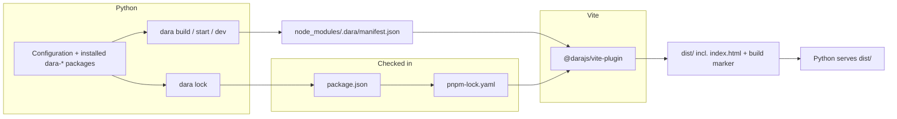

# Dara JS build redesign

Status: Draft

## Summary

Replace the generated `dist/` JS workspace, `dara.config.json`, the dependence on whatever Node is installed, and the UMD / auto-JS mode with one build pipeline on a Dara-managed Node and pnpm.

| Decision | Replaces |
| --- | --- |
| Dara downloads and caches one exact Node and pnpm per `dara-core` release and uses them for every app. | Whatever Node is on `PATH`; `npm install` at startup. |
| Every app checks in `package.json` and `pnpm-lock.yaml` at its root. Nothing Dara-specific is checked in. | No lockfile; a generated `package.json` in `dist/`. |
| Dara owns its entries in those files; `dara lock` refreshes them. Everything else belongs to the user. | `dara.config.json` `extra_dependencies`. |
| Python writes one manifest to `node_modules/.dara/`; `@darajs/vite-plugin` reads it and produces all of `dist/`, including `index.html`. | Template string replacement, symlinks, `fastapi_vite_dara`. |
| Custom JS is a `js/` directory in the same project. No eject, no user Vite config. | `setup-custom-js` creating a second JS project. |
| Apps with and without custom JS build the same way. | UMD / auto-JS vs. production Vite build. |

Problems this fixes:

- Two builds of one commit can resolve different npm packages: there is no lockfile for the transitive graph.
- Production builds depend on the machine's Node.
- Two code paths (UMD / auto-JS and Vite) with different behaviour.
- `dist/` is a synthetic workspace and an output directory at the same time, wired with symlinks and generated files.
- `fastapi_vite_dara` reads Vite's `manifest.json` back at request time to assemble HTML that Vite already knows how to produce.

Non-goals: every Node target on day one; changes to the Python component and action APIs; pruning unrelated user dependencies; lockfile formats other than pnpm's; a no-download fallback.

## Accepted trade-off: zero config, not zero download

Today `dara start` with no flags serves UMD bundles from the wheels: no Node, no network beyond pip, any OS. Removing that path means the first run of any Dara app downloads Node and pnpm into a global cache and runs `pnpm install`.

| Cost | Mitigation |
| --- | --- |
| First run needs network access to Node, pnpm and npm sources. | Toolchain URL overrides and a root `.npmrc` cover mirrors. |
| A platform without a managed Node target is unsupported. | `win-x64` is in the initial list even though CI does not run on Windows. |
| Wheels shrink only partly until the vendored-library spike lands. | See static assets and code splitting. |

There is no prebuilt fallback bundle. The point is fewer code paths, not a different second path.

## How it fits together



Python knows what only Python can know and writes it to the manifest. The plugin is the only thing that writes into `dist/`. Python serves `dist/`.

## Commands

All commands accept `--config <module:config>`; apps with namespaced packages cannot rely on auto-discovery.

| Command | Does | Never does |
| --- | --- | --- |
| `dara lock` | Discover `@darajs/*` from installed Python packages, apply the merge rules to `package.json`, install with managed pnpm, write `pnpm-lock.yaml`. | Touch user entries. |
| `dara start` / `dara dev` | Locally: create missing `package.json` / `pnpm-lock.yaml` and print what to commit; rebuild a stale `dist/`. `dara dev` runs the Vite dev server through managed Node. | Rewrite checked-in files after the first bootstrap. |
| `dara build --output <dir>` | Require files that agree with the installed Python packages, `pnpm install --frozen-lockfile`, run Vite. Output is self-contained: no `node_modules`, no credentials. Used by CI and the release action. | Generate or repair anything. |
| `dara setup-custom-js` | Scaffold `js/index.tsx`, `tsconfig.json`, `@types/react`, then `dara lock`. | Create `dara.config.json`. |

Every failure names the command that fixes it, e.g. `run dara lock and commit package.json and pnpm-lock.yaml`.

## Managed toolchain

Each `dara-core` release pins one exact Node and one exact pnpm (latest major at release, v11 as of writing). The pins depend on nothing but the installed `dara-core`, so an app's Python lockfile pins the toolchain too. A pre-installed Node or pnpm on `PATH` is never used, in CI or anywhere; accepting it would bring back the machine-dependent behaviour this removes.

| Target | Status |
| --- | --- |
| macOS arm64, macOS x64 | Supported |
| Linux x64, Linux arm64 (glibc) | Supported |
| Windows x64 | Best effort, not in CI |

Cache: `${XDG_CACHE_HOME:-~/.cache}/dara/{node,pnpm}/<version>/<target>/` (`%LOCALAPPDATA%\dara\...` on Windows). pnpm is the standalone executable from its GitHub release, not `npm install -g` or corepack, which need Node first and cannot be checksum-pinned the same way. Dara sets `PNPM_HOME` and the store directory to its own locations.

Security properties:

- The `dara-core` wheel is the only authority for versions and checksums, captured at release from Node's signed `SHASUMS256.txt` and pnpm's release checksums. Nothing in the app repository can override them; if it could, a pull request could swap a checksum and pair it with a mirror URL.
- Downloads are verified and installed atomically: temp file, SHA-256, extract to a temp dir, rename in one step, completion marker with the digest. No marker means absent. The extractor rejects absolute paths, `..`, links and special files. Cache dirs are owner-only and file-locked against concurrent Dara processes.
- CI caches are keyed by trust level so pull-request and release jobs do not share a toolchain cache.
- pnpm 10+ blocks dependency lifecycle scripts by default. The project's own scripts, `.pnpmfile.cjs` and `allowBuilds` entries still run and are treated as trusted repository code.
- Every subprocess call is `subprocess.run` with an argv list and a minimal environment. Registry credentials go to pnpm only, never to the Vite process.
- Proxy and CA variables (`HTTPS_PROXY`, `SSL_CERT_FILE`, `REQUESTS_CA_BUNDLE`) are honoured.

| Variable | Effect |
| --- | --- |
| `DARA_TOOLCHAIN_CACHE_DIR` | Cache root. CI caches it; images preseed it. |
| `DARA_NODE_DOWNLOAD_URL`, `DARA_PNPM_DOWNLOAD_URL` | URL templates with `{version}` and `{target}` for mirrors. Version and checksum stay pinned. |
| `DARA_DISABLE_TOOLCHAIN_DOWNLOAD=1` | Cached artifacts only; fail with instructions otherwise. |

## Project files and dependency ownership

Two checked-in files, both standard: `package.json` and `pnpm-lock.yaml`. `dist/` and `node_modules/` are ignored. There is no Dara lockfile because everything one would hold is already somewhere else:

| Would go in a Dara lockfile | Actually lives in |
| --- | --- |
| Node / pnpm pins and checksums | The installed `dara-core` |
| Required `@darajs/*` versions | `package.json` `dependencies` |
| `package.json` vs. lockfile drift | `pnpm install --frozen-lockfile` |
| Whether `dist/` matches the config | The build marker (below) |

The lockfile is what closes the supply-chain hole: `@darajs/*` versions already come from Python, but the transitive graph is resolved fresh on every build today. The guarantee is that two builds of one commit install the same packages with the same tools, not bit-identical output.

Two consequences for users: upgrading a `dara-*` Python package means `dara lock` and a commit, in every app; and dependency bots will try to bump `@darajs/*`, so the `create-dara-app` template ships Dependabot and Renovate config that ignores the Dara-owned entries.

### Ownership

| Dara-owned (`dara lock` writes) | User-owned |
| --- | --- |
| `@darajs/*` runtime packages → `dependencies` | Everything else: app dependencies, `typescript`, `eslint`, `vitest`, `scripts`, `name`, `files`, ... |
| `vite`, `@vitejs/plugin-react`, `@darajs/vite-plugin` → `devDependencies` | |
| `react`, `react-dom`, pinned to the supported major | |

Merge rules, applied by `dara lock` in every app:

- A missing Dara-owned dependency is added. An existing `peerDependencies` entry satisfies it, so an app that is also a published library does not gain a second copy under `dependencies`.
- A compatible user value is kept; an incompatible one fails before anything is written.
- `workspace:`, `link:` and `file:` specifiers are accepted. Before install Dara checks the path is inside the repository or workspace and that the target's `package.json` name and version match.
- User entries are never removed.

### Shared dependencies

User components import `react`, `react-dom` and `styled-components` and must get the instance Dara's runtime uses. Today the generated `package.json` uses `overrides`. Instead:

- `@darajs/*` libraries declare them as `peerDependencies`. `@darajs/core` currently lists React as a plain dependency, which under pnpm's isolated `node_modules` yields a second copy whenever the app's version differs.
- `react` / `react-dom` are Dara-owned entries in every app, so a no-custom-JS app has them without thinking about it and a custom-JS app on the wrong major gets the merge-rule error rather than a runtime hook error.
- `resolve.dedupe` in the plugin is the backstop for a nested dependency bundling its own React.

### Registry auth

No Dara setting replaces `dara.config.json` here. Routing and auth use the standard `.npmrc` at the app root, with environment placeholders:

```ini
@my-org:registry=https://npm.pkg.github.com/
//npm.pkg.github.com/:_authToken=${NPM_TOKEN}
```

Dara never writes a token into a project file. `@darajs/ai` and `@darajs/enterprise` live on a private registry, so apps using them need a credential for local development that auto-JS mode did not; this is a standard npm setup, a route and credential in `~/.npmrc` provisioned however the organisation manages developer credentials. The template ships the route line, never a token. Install errors name the `.npmrc` entry and environment variable involved.

## Manifest and plugin

### The manifest

Written by every Dara command from the imported configuration; read only by the plugin.

```json
{
  "schema": 1,
  "daraVersion": "1.24.0",
  "packages": { "dara.core": "@darajs/core", "dara.components": "@darajs/components", "my_lib": "@scope/ui" },
  "local": { "entry": "./js/index.tsx" },
  "components": [{ "module": "dara.components", "export": "Button" }, { "module": "LOCAL", "export": "MyChart" }],
  "actions": [{ "module": "dara.core", "export": "NavigateTo" }],
  "static": [{ "source": "/…/site-packages/dara/components/_assets/static", "dest": "dara.components" }],
  "favicon": "./static/favicon.ico",
  "outDir": "./dist"
}
```

`packages` is today's `package_map`. `components` / `actions` exist so the build can validate exports. `static` is `Configuration.static_folders` plus package static assets, resolved to absolute paths because only Python knows where site-packages is. `local` is null without custom JS.

It lives in `node_modules/.dara/` for the same reason Vite uses `node_modules/.vite/`: machine-specific derived state, already ignored everywhere, no new directory to explain. It is regenerated on every command and never checked in.

### The plugin

| Responsibility | Replaces |
| --- | --- |
| Whole Vite config: output dir, React plugin with `jsxRuntime: 'classic'`, `publicDir: false`, `resolve.dedupe`, `renderBuiltUrl` → `window.__toDaraUrl`, dev `base` / `origin` | `vite.config.template.ts`, `scripts.dev`, `overrides` |
| Virtual entry (below) | `_entry.template.tsx` |
| Emit `index.html` from a template in the plugin package, with script, stylesheet and `modulepreload` tags; Jinja placeholders pass through verbatim | `jinja/index.html`, `fastapi_vite_dara`, `manifest.json` |
| Validate that every `components` / `actions` export exists; fail the build naming the Python class | Runtime "component not found" |
| Copy `static[]` and `favicon` into `dist/`; write the build marker | `migrate_*_assets`, `find_favicon`, `dist/_build.json` |
| Dev server: `/__dara__/dev-server-info`, `/__dara__/index.html`, manifest as a watched file so a rewritten manifest reloads the page | |
| Stale-state errors naming the Dara command that fixes them | |

The virtual entry, never written to disk:

```ts
import daraCore from '@darajs/core';
import * as core from '@darajs/core';
import * as components from '@darajs/components';
import * as LOCAL from '/abs/path/js/index.tsx';
daraCore({ 'dara.core': core, 'dara.components': components, LOCAL });
```

Imports are static because `run.tsx` already awaits every package before the first render; today's `() => import()` only adds a waterfall. Vite preloads the graph from HTML parse time, `preloadComponents` / `preloadActions` go away, and code splitting still happens inside packages (see code splitting). Per-package cache chunks remain available via `manualChunks` if needed.

The plugin is versioned in lockstep with `@darajs/core`. `daraCore(...)` and the Vite integration are never user code, so their shape is never a compatibility surface. If app-level bundler settings are ever needed, the plugin takes options through the Python configuration; no config file.

### What Python keeps

Write the manifest; run `pnpm install --frozen-lockfile` and `vite build`; check the build marker; serve `dist/` at `/static/` and render `dist/index.html` through Jinja. Under `--enable-hmr` the template comes from the dev server's `/__dara__/index.html`, so `dara start --enable-hmr` now requires `dara dev` to be running and says so.

Removed: `BuildCache`, `BuildConfig`, `bundle_js`, `symlink_js`, `migrate_*_assets`, `build_*_template`, all templates and statics, `jinja/index*.html`, `fastapi_vite_dara`.

### Build freshness

The plugin writes `dist/.dara-build.json` (portable manifest digest, `pnpm-lock.yaml` digest, Dara version, emitted-file hash). `dara build` builds into a temp dir and swaps atomically. The digest excludes `static` paths so laptop and CI agree.

| Check | Stale means | Local `dara start` / `dev` | `dara build`, `--skip-jsbuild`, `--docker`, CI |
| --- | --- | --- | --- |
| `@darajs/*` in `package.json` vs. installed Python; `--frozen-lockfile` | `dara-*` upgraded or `package.json` edited without `dara lock` | Fail: `run dara lock` | Fail: `run dara lock` |
| Build marker vs. manifest and lockfile | Dependencies or configuration moved, nobody rebuilt | Rebuild | Fail, naming the mismatch |

Static folders are copied at build time, not every startup, so editing `static/` needs a rebuild; the marker catches it.

## Custom JS

Custom JS does not get its own JS project. The app already has `package.json`, the entry is virtual and the config is the plugin's.

1. Create `js/index.tsx` and export components. Dara picks it up by convention; `Configuration.js_entry` names another directory. This is the `LOCAL` module.
2. Add tooling to `package.json` like any JS project: `pnpm add -D typescript eslint prettier vitest`, `tsconfig.json`, `scripts`.
3. `dara lock` after dependency changes, then commit.

`dara setup-custom-js` scaffolds steps 1–2. On disk, the whole difference from a no-custom-JS app is the `js/` directory and the user's tooling entries.

## Monorepos

### Workspace mode

An app inside a pnpm workspace joins it. `--ignore-workspace` would give one manifest two lockfiles and drop the workspace's `minimumReleaseAge`, `allowBuilds` and `blockExoticSubdeps`, which are supply-chain controls the owner set on purpose. Dara walks up to find the workspace and then:

- treats the root `pnpm-lock.yaml` as the lockfile of record; still `--frozen-lockfile` in `dara build`
- records the digest of the whole root lockfile in the build marker (integrity records, overrides, catalogs and patches live outside the app's `importers:` entry), so any change in the workspace makes `dist/` stale
- owns only the app's own `package.json` entries and runs a filtered install
- excludes `@darajs/*` from `minimumReleaseAge` by default so a same-day Dara release installs; a workspace value wins

### Sibling libraries

`workspace:*` points at the package directory, not built output, so a library with `main: dist/index.js` has to be built first; downstream CI does this by hand today. Preferred fix: the library adds a source condition and the plugin adds `dara-source` to `resolve.conditions`, so the app bundles from TypeScript source with cross-package HMR and npm consumers never see it.

```json
"exports": { ".": { "dara-source": "./js/index.tsx", "types": "./dist/index.d.ts", "default": "./dist/index.js" } }
```

Fallback: `dara build` runs `pnpm --filter "<app>^..." run build` first; `--no-deps-build` skips it.

### Apps that are also published libraries

A package that is both a Dara app and a published `@scope/ui` library already has `files`, `main`, `types`, a library `vite.config.ts` and `outDir: ./dist`. Dara never reads a root `vite.config.ts`, so that is not in the way. Dara warns when `static_files_dir` is also referenced by `files` or `main`, and the docs recommend a separate output directory. Sibling apps depend on it with `workspace:*`. Once auto-JS is gone these packages drop their UMD build and `dara_assets` entrypoint and ship ESM and types.

### Which pnpm

A workspace root `packageManager: pnpm@<version>+sha512.<hash>` is honoured: the hash covers the npm tarball, so Dara downloads and verifies that tarball and runs it with managed Node. Without a hash it is accepted only if it equals Dara's pin; otherwise fail and point at `corepack use pnpm@<version>`. pnpm runs with `manage-package-manager-versions=false`.

## Migration

Staged. Compatibility and Warn ship in minors; Enforce breaks downstream packages and any app still on `dara.config.json`, so it lands in a major.

| Phase | What happens |
| --- | --- |
| Compatibility | `dara.config.json` is read as migration input only: `extra_dependencies` merge under the merge rules; `package_manager: pnpm` keeps pnpm, `npm` / `yarn` move to managed pnpm with a message; `local_entry` becomes `local.entry`. Deprecated flags keep setting their env vars. |
| Warn | Dara warns when `dara.config.json` is still the source of truth and points at `dara lock`. |
| Enforce | `dara.config.json` ignored. `dara build` requires the two files. UMD / auto-JS and the deprecated internals below removed. `--production` and `DARA_JS_REBUILD` removed. |

| Existing app | Migration |
| --- | --- |
| No custom JS | First local run creates the two files and adds `dist/` to `.gitignore`. If a `@darajs/*` package is off the public registry, write the `@darajs:registry=` route into `.npmrc` (no credential) and check the credential is in the environment before installing. |
| `package.json` already at root | Merge rules. |
| Custom JS | The `local_entry` directory becomes `LOCAL` as is; nothing moves. |
| Inside a pnpm workspace / also a library | Monorepos section. |

### Legacy flags and files

| Today | New model |
| --- | --- |
| `dara start` | Serves `dist/`; bootstraps and rebuilds locally per the freshness table. |
| `--production`, `DARA_PRODUCTION_MODE` | No-op with a deprecation warning. Env vars still set during compatibility because downstream apps read them (e.g. to switch `static_files_dir`). |
| `--enable-hmr` + `dara dev` | Same pairing; both validate managed state instead of installing into `dist/`. |
| `--skip-jsbuild` / `SKIP_JSBUILD` | Kept as the one "never build" flag. Fails on a stale `dist/`. |
| `--docker` | Unchanged: implies `--skip-jsbuild`, keeps `DARA_REQUIRE_SSO` and hidden API docs. |
| `--rebuild` / `DARA_JS_REBUILD` | `dara build --force`. |
| `dist/_build.json`, `dist/manifest.json`, `VITE_MANIFEST_PATH`, `dist/tsconfig.json` | Gone; manifest, build marker and plugin-emitted `index.html` instead. |
| `config.static_files_dir` | Still the output directory, default `dist/`. |

The `create-dara-app` template ships the two files and the `.gitignore` entry in the same release. `packages/demo-app` is where the migration is tested first.

### Release action

`dara-release-action` runs three `dara-enterprise` commands (`cache-build-config`, `collect-static`, `package`) that wrap the internals this removes, writes `.npmrc` credentials into the output and strips `node_modules`. Changes:

- The three commands become deprecated aliases printing the equivalent `dara build --output` call; the action calls `dara build`. No `node` on the runner, no `~/.npm` mount; it caches `DARA_TOOLCHAIN_CACHE_DIR` and the pnpm store keyed by trust level.
- Registry auth arrives as environment variables read by `.npmrc` placeholders. The bundle validator keeps rejecting `.npmrc`, symlinks and special files, and also scans for literal credential values.
- `dara-config-file` (release-time `{{ version }}` substitution into `dara.config.json`) has no replacement: rewriting a version at release time cannot coexist with a frozen lockfile, and the monorepo case it served is `workspace:*`.
- Wheel builds, asset embedding, bundle validation, hooks and the prebuilt-assets flow are unchanged.

`dara-enterprise`, `dara-release-action` and `dara-components` ship in lockstep with Enforce.

### Deprecated internals

Downstream packages depend on auto-JS-only internals. Fields stay and warn until Enforce.

| Surface | Until Enforce | At Enforce |
| --- | --- | --- |
| `template_extra_js`, `package_tag_processors` | Kept, no effect, warn when set | Removed |
| `AssetManifest` (`autojs_assets`, `tag_order`, `depends_on`, topo sort), `_assets/auto_js/` | Auto-JS fields ignored; `common_assets` still copied so URL loaders work | Replaced by package static assets; packages stop shipping UMDs |
| `BuildMode.AUTO_JS`, `_entry_autojs.template.tsx` | Kept for legacy projects | Removed |
| `fastapi_vite_dara`, `jinja/index*.html`, `build_vite_template` | Kept for the old pipeline | Removed, dependency dropped |
| `BuildConfig.npm_registry` / `npm_token` (plaintext token in `dist/.npmrc`) | Kept for the old pipeline; warn and point at `.npmrc` | Removed; closes the token-in-Docker-layer case |

## Static assets and code splitting

`dara_assets` exists because auto-JS could not bundle: every third-party library was a `<script>` tag or a runtime URL fetch. The tag-ordering machinery goes with auto-JS. What remains is the vendored BokehJS, Pixi and Plotly in `dara-components/_assets/common/` (most of the 7.8 MB wheel), loaded by URL as a workaround for old bundling problems.

1. **Spike**: bundle Bokeh, Pixi and Plotly as npm dependencies behind `import()`; `dara lock` writes `@bokeh/bokehjs` at the installed Python `bokeh` version. Upgrade first: Bokeh is pinned at `3.1.1` (2023) and has reworked its packaging since; `pixi.js` 8 is already a normal dependency of `ui-causal-graph-editor` and nothing references the vendored `pixi*.js`. Check whether the `jquery.min.js` tag is still needed by loading a Bokeh figure and `DataTable` without it.
2. **Regardless**: replace `AssetManifest` with an entrypoint returning files to serve under `/static/<pkg>/`; Python puts the paths in the manifest's `static` list, the plugin copies them. Permanent escape hatch.
3. If the spike works, `dara-components` drops the vendored files. If not, they move onto the static mechanism unchanged.

Code splitting inside packages follows from the same mechanism. `@darajs/components` re-exports everything from one index, so startup fetches the causal graph editor and the editors whether or not the app uses them. A library replaces the static re-export with a lazy one:

```ts
export const CausalGraphEditor = React.lazy(() => import('./causal-graph'));
```

The static export must go or Rollup keeps the module in the entry chunk. `DynamicComponent` already wraps every component in `Suspense` with the app's `fallback` / `suspend_render`, so nothing changes on the Dara side. This is only possible after auto-JS: UMD inlines library-level `import()`. Start with the causal graph editor, plotting, code and markdown editors and AI chat. Actions are plain functions, so a heavy action dependency uses `await import()` in the body instead.

## Alternative considered: Bun

One binary for runtime, package manager and bundler; the appeal was never clashing with the user's Node. A managed Node solves the clash as well, the size difference does not decide the architecture, pnpm's store recovers most of the install-speed gap, and Vite and its plugins keep working unchanged. The cost is one more artifact to manage, and it is Dara-managed state rather than user setup.

## Open questions

- How long does `dara.config.json` keep working?
- Can Bokeh, Pixi and Plotly be bundled, or do they stay on the static mechanism?
- Does BokehJS still need jQuery?
- Export validation: hard error for `export *` libraries by following `exportedBindings`, or a warning?

## Implementation slices

Each is usable end to end before the next starts.

| # | Slice | Proven on |
| --- | --- | --- |
| 1 | No-custom-JS app, whole path: toolchain download and cache, `dara lock`, React as peer, manifest, plugin with virtual entry, `index.html` and build marker, `fastapi_vite_dara` dropped, atomic `dara build`, freshness checks, `subprocess.run` | `create-dara-app` output |
| 2 | Custom JS: `LOCAL` module, merge rules, `setup-custom-js` scaffold, `dara.config.json` compatibility, flag deprecations | `packages/demo-app` |
| 3 | `dara build --output`, `dara-enterprise` aliases, release action with trust-keyed caches | A no-custom-JS downstream app from a clean checkout |
| 4 | Workspace mode, `dara-source` condition, `packageManager` handling, local-specifier checks | A monorepo whose app is also a published library |
| 5 | Package static assets, vendored-library spike, jQuery check, `React.lazy` boundaries in `@darajs/components`, `ai`, `enterprise` | Demo app pages |
| 6 | Remove UMD / auto-JS and deprecated `AssetManifest` fields once downstream has moved | |
