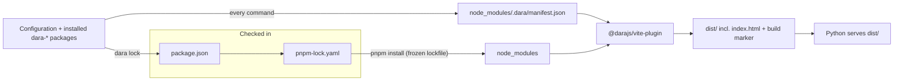

# Dara JS build redesign

Status: Draft

## Summary

Replace the generated `dist/` JS workspace, `dara.config.json`, the unchecked dependence on whatever Node is installed, and the UMD / auto-JS mode with one build pipeline on a Node and pnpm the app pins.

| Decision | Replaces |
| --- | --- |
| Node and pnpm come from `PATH`, pinned in `package.json` (`engines`, `packageManager`) and `mise.toml`. Dara checks the versions and refuses to run on a mismatch. | Whatever Node is on `PATH`, unchecked; `npm install` at startup. |
| Every app checks in `package.json` and `pnpm-lock.yaml`, both standard formats, at its root (or the workspace root in a pnpm monorepo). No Dara-specific file format is checked in. | No lockfile; a generated `package.json` in `dist/`. |
| Dara owns its entries in `package.json` and, outside a workspace, the whole lockfile; `dara lock` refreshes them. Everything else belongs to the user. | `dara.config.json` `extra_dependencies`. |
| Python writes one manifest to `node_modules/.dara/`; `@darajs/vite-plugin` reads it and produces all of `dist/`, including `index.html`. | Template string replacement, symlinks, `fastapi_vite_dara`. |
| Custom JS is a `js/` directory in the same project. No eject, no user Vite config. | `setup-custom-js` creating a second JS project. |
| Apps with and without custom JS build the same way. | UMD / auto-JS vs. production Vite build. |

Problems this fixes:

- Two builds of one commit can resolve different npm packages: there is no lockfile for the transitive graph.
- Production builds depend on whatever Node the machine has, with no version check.
- Two code paths (UMD / auto-JS and Vite) with different behaviour.
- `dist/` is a synthetic workspace and an output directory at the same time, wired with symlinks and generated files.
- `fastapi_vite_dara` reads Vite's `manifest.json` back at request time to assemble HTML that Vite already knows how to produce.

Non-goals: installing Node or pnpm for the user; changes to the Python component and action APIs; pruning unrelated user dependencies; lockfile formats other than pnpm's; a Node-free fallback.

## Accepted trade-off: zero config, but bring Node

Today `dara start` with no flags serves UMD bundles from the wheels: no Node, no network beyond pip, any OS. Removing that path means every Dara app, including one with no custom JS, needs Node and pnpm installed and runs `pnpm install` on first run.

"Zero configuration" still holds: users write no project files by hand. "Zero prerequisites" does not; Node and pnpm join Python as things to have installed.

| Cost | Mitigation |
| --- | --- |
| Node and pnpm are prerequisites. | Having Node is standard for anything web-adjacent. `create-dara-app` ships a `mise.toml` pinning both, so `mise install` is the whole setup; internal repositories use mise already. |
| First run needs network access to the npm registry. | A root `.npmrc` covers mirrors, as for any JS project. |
| Wrong Node on `PATH` used to fail late or silently. | Dara checks `node` and `pnpm` against the pins before doing anything and names the fix. |

Wheels shrink by the UMD bundles immediately, and by the vendored Bokeh / Pixi / Plotly only if the bundling spike succeeds. There is no prebuilt fallback bundle and no Dara-managed Node download (see alternatives): the point is fewer code paths.

## How it fits together



Nothing else crosses between Python and Vite: Python writes the manifest and runs `pnpm` and `vite`, the plugin writes `dist/`, Python serves it.

## Commands

All commands accept `--config <module:config>`; apps with namespaced packages cannot rely on auto-discovery. Terms used here are defined in the sections that follow.

| Command | Does | Does not update |
| --- | --- | --- |
| `dara lock` | Discover `@darajs/*` from installed Python packages, apply the merge rules to `package.json`, run `pnpm install`, write `pnpm-lock.yaml`. | User entries in `package.json`. |
| `dara start` / `dara dev` | Locally: create missing `package.json` / `pnpm-lock.yaml` and print what to commit; rebuild a stale `dist/`. `dara dev` runs the Vite dev server. | Checked-in files, after the first bootstrap. |
| `dara build --output <dir>` | Require checked-in files that agree with the installed Python packages, `pnpm install --frozen-lockfile`, run Vite. Output is self-contained: no `node_modules`, no credentials. Used by CI and the release action. | Checked-in files, ever. |
| `dara setup-custom-js` | Scaffold `js/index.tsx`, `tsconfig.json`, `@types/react`, then `dara lock`. | `dara.config.json` (no longer created). |

Every failure names the remedy.

## Toolchain

Dara runs the `node` and `pnpm` found on `PATH` and verifies them first. The pins are standard `package.json` fields, written by `dara lock` as Dara-owned entries:

| Field | Value | Checked how |
| --- | --- | --- |
| `engines.node` | The major Dara supports, e.g. `^22.12.0` | `node --version` satisfies the range |
| `packageManager` | `pnpm@<exact>+sha512.<hash>` | `pnpm --version` equals it; pnpm itself refuses to run if the field does not match (`manage-package-manager-versions=false` so it does not download a second copy) |

A mismatch or a missing binary fails before anything else happens: `Node 22.x required, found 18.20.1; run mise install`. The `create-dara-app` template ships a `mise.toml` pinning the same versions, and the docs recommend mise without requiring it; any Node and pnpm that satisfy the pins work. Windows is supported wherever Node is.

Dara raises `engines.node` and `packageManager` in `dara lock` when a new `dara-core` needs a newer major, and the release notes say so. The pnpm pin follows the latest major at release, v11 as of writing. pnpm 10+ blocks dependency lifecycle scripts by default; the project's own scripts, `.pnpmfile.cjs` and `allowBuilds` entries still run and are treated as trusted repository code.

Every subprocess call is `subprocess.run` with an argv list and a minimal environment. Registry credentials go to pnpm only, never to the Vite process. Proxy and CA variables are pnpm's concern (`.npmrc` `proxy`, `cafile`) and Dara does not handle them.

## Project files and dependency ownership

Two checked-in files, both standard: `package.json` and `pnpm-lock.yaml`. `dist/` and `node_modules/` are ignored. There is no Dara lockfile; each concern it would cover already has an authority or a check:

| Concern | Authority or check |
| --- | --- |
| Node / pnpm versions | `engines` and `packageManager` in `package.json`, mirrored in `mise.toml` |
| Required `@darajs/*` versions | `package.json` `dependencies`, compared with the installed Python packages |
| `package.json` vs. lockfile drift | `pnpm install --frozen-lockfile` |
| `dist/` vs. current configuration | The build marker (see build freshness) |

The lockfile closes the supply-chain hole: `@darajs/*` versions already come from Python, but the transitive graph is resolved fresh on every build today. The guarantee is that two builds of one commit install the same packages with the same pnpm and a Node of the same major, not bit-identical output.

Two consequences for users: upgrading a `dara-*` Python package means `dara lock` and a commit, in every app; and dependency bots will try to bump `@darajs/*`, so the `create-dara-app` template ships Dependabot and Renovate config that ignores the Dara-owned entries.

### Ownership

| Owner | `package.json` entries | Lockfile |
| --- | --- | --- |
| Dara (`dara lock` writes) | `@darajs/*` → `dependencies`; `vite`, `@vitejs/plugin-react`, `@darajs/vite-plugin` → `devDependencies`; `react`, `react-dom` pinned to the supported major; `engines.node`, `packageManager` | Whole `pnpm-lock.yaml` in a standalone app; only the app's entries in a workspace |
| User | Everything else: app dependencies, `typescript`, `eslint`, `vitest`, `scripts`, `name`, `files`, ... | |

Merge rules, applied by `dara lock` in every app:

- A missing Dara-owned dependency is added. An existing `peerDependencies` entry satisfies it, so an app that is also a published library does not gain a second copy under `dependencies`.
- A compatible user value is kept; an incompatible one fails before anything is written.
- `workspace:`, `link:` and `file:` specifiers are accepted. Before install Dara checks the path is inside the repository or workspace and that the target's `package.json` name and version match.
- User entries are never removed.

### Shared dependencies

User components import `react`, `react-dom` and `styled-components` and must get the instance Dara's runtime uses. Today the generated `package.json` uses `overrides`. Instead:

- `@darajs/*` libraries declare them as `peerDependencies`. `@darajs/core` currently lists React as a plain dependency, which under pnpm's isolated `node_modules` yields a second copy whenever the app's version differs.
- `react` / `react-dom` are Dara-owned entries in every app, so a no-custom-JS app has them without thinking about it and a custom-JS app on the wrong major gets the merge-rule error rather than a runtime hook error.
- The plugin dedupes React as a backstop (see the plugin table).

### Registry auth

No Dara setting replaces `dara.config.json` here. Routing and auth use the standard `.npmrc` at the app root with environment placeholders. Dara never writes a token into a project file. Install errors name the `.npmrc` entry and environment variable involved.

```ini
@my-org:registry=https://npm.pkg.github.com/
//npm.pkg.github.com/:_authToken=${NPM_TOKEN}
```

New migration cost: `@darajs/ai` and `@darajs/enterprise` live on a private registry, so apps using them need a credential for local development that auto-JS mode did not. The route and credential go in `~/.npmrc`, provisioned however the organisation manages developer credentials. The template ships the route line, never a token.

## Manifest and plugin

### The manifest

Written by every Dara command from the imported configuration; read only by the plugin.

```json
{
  "schema": 1,
  "daraVersion": "1.24.0",
  "packages": { "dara.core": "@darajs/core", "dara.components": "@darajs/components", "my_lib": "@scope/ui" },
  "local": { "entry": "./js/index.tsx" },
  "components": [{ "module": "dara.components", "export": "Button" }, { "module": "LOCAL", "export": "MyChart" }],
  "actions": [{ "module": "dara.core", "export": "NavigateTo" }],
  "static": [{ "source": "/…/site-packages/dara/components/_assets/static", "dest": "dara.components" }],
  "favicon": "./static/favicon.ico",
  "outDir": "./dist"
}
```

| Field | Source |
| --- | --- |
| `packages` | Today's `package_map`: Python module → JS package |
| `local` | The custom JS entry; null without custom JS |
| `components`, `actions` | The registries, for build-time export validation |
| `static` | `Configuration.static_folders` plus package static assets (below), resolved to absolute paths because only Python knows where site-packages is |

It lives in `node_modules/.dara/` because it is machine-specific derived state: it is regenerated on every command, already ignored by every repository, and never checked in.

### Package static assets

A package contributes files to `/static/<pkg>/` through an entrypoint returning a directory or file list. Python puts the resolved paths in the manifest's `static` list and the plugin copies them into `dist/<pkg>/`. No tag emission or ordering. This replaces `AssetManifest` and is the permanent escape hatch for anything that cannot be bundled.

### The plugin

| Responsibility | Replaces |
| --- | --- |
| Output: `build.outDir` from the manifest, `publicDir: false`, `build.manifest: false` | `vite.config.template.ts` |
| React: `@vitejs/plugin-react` with `jsxRuntime: 'classic'`; `resolve.dedupe: ['react', 'react-dom']` | Implicit in the docs; `overrides` in `package.json` |
| URLs: `renderBuiltUrl` → `window.__toDaraUrl` (base URL is a runtime setting); dev `base` / `server.origin` | `scripts.dev` in `package.json` |
| Virtual entry (below) | `_entry.template.tsx` |
| Emit `index.html` from a template in the plugin package, with script, stylesheet and `modulepreload` tags; Jinja placeholders pass through verbatim | `jinja/index.html`, `fastapi_vite_dara`, `manifest.json` |
| Validate that every `components` / `actions` export exists; fail the build naming the Python class. Open: libraries using `export *` currently get a warning because Rollup reports one `*` binding; following `exportedBindings` one level would make it a hard error | Runtime "component not found" |
| Copy `static[]` and `favicon` into `dist/`; write the build marker | `migrate_*_assets`, `find_favicon`, `dist/_build.json` |
| Dev server: `/__dara__/dev-server-info`, `/__dara__/index.html`; manifest as a watched file so a rewritten manifest reloads the page | |
| Stale-state errors naming the Dara command that fixes them | |

The virtual entry, never written to disk:

```ts
import daraCore from '@darajs/core';
import * as core from '@darajs/core';
import * as components from '@darajs/components';
import * as LOCAL from '/abs/path/js/index.tsx';
daraCore({ 'dara.core': core, 'dara.components': components, LOCAL });
```

Package imports are static because `run.tsx` already awaits every package before the first render; today's `() => import()` only adds a fetch-execute-fetch waterfall. `preloadComponents` / `preloadActions` go away. Splitting still happens inside packages (see code splitting).

The plugin is versioned in lockstep with `@darajs/core`. `daraCore(...)` and the Vite integration are never user code, so their shape is never a compatibility surface.

### What Python keeps

| Concern | Python does |
| --- | --- |
| Manifest | Write it from the imported configuration |
| Install and build | Verify `node` / `pnpm`, then `pnpm install --frozen-lockfile` and `vite build` |
| Freshness | The checks below |
| Serving | Mount `dist/` at `/static/`; render `dist/index.html` through Jinja. Under `--enable-hmr` the template comes from the dev server's `/__dara__/index.html`, so `dara start --enable-hmr` now requires `dara dev` to be running and says so |

Removed from Python: `BuildCache`, `BuildCacheDiff`, `BuildConfig`, `JsConfig.from_file`, `bundle_js`, `symlink_js`, `migrate_package_assets`, `migrate_static_assets`, `find_favicon`, `build_common_tags`, `build_autojs_template`, `build_vite_template`, `VITE_MANIFEST_PATH`, `VITE_STATIC_PATH`, the entry and Vite config templates, `statics/`, `jinja/index*.html`, `fastapi_vite_dara`.

### Build freshness

The plugin writes `dist/.dara-build.json`: a digest of the portable manifest fields (`packages`, `components`, `actions`, `local`), a content hash of the `static` sources, the `pnpm-lock.yaml` digest, the Dara version and a hash of the emitted files. Static *paths* are excluded so laptop and CI agree; static *contents* are included so an edited `static/` file is detected. `dara build` builds into a temporary directory and swaps atomically.

| Check | Stale means | Local `dara start` / `dara dev` | `dara start --skip-jsbuild` / `--docker` / CI start |
| --- | --- | --- | --- |
| `@darajs/*` in `package.json` vs. installed Python; `--frozen-lockfile` | `dara-*` upgraded or `package.json` edited without `dara lock` | Fail: `run dara lock and commit package.json and pnpm-lock.yaml` | Same |
| Build marker vs. manifest, static contents and lockfile | Dependencies, configuration or static files moved; nobody rebuilt | Rebuild | Fail, naming the mismatch |

`dara build` always builds; it applies only the first check.

## Custom JS

1. Create `js/index.tsx` and export components. Dara picks it up by convention; `Configuration.js_entry` names another directory. This is the `LOCAL` module.
2. Add tooling to `package.json` like any JS project: `pnpm add -D typescript eslint prettier vitest`, `tsconfig.json`, `scripts`.
3. `dara lock` after dependency changes, then commit.

`dara setup-custom-js` scaffolds steps 1–2. The whole on-disk difference from a no-custom-JS app is the `js/` directory and the user's tooling entries. There is no user Vite config: replacing the bundler is not a use case, and every Vite setting Dara has needed is framework contract rather than preference.

## Monorepos

### Workspace mode

An app inside a pnpm workspace joins it. `--ignore-workspace` would give one manifest two lockfiles and drop the workspace's `minimumReleaseAge`, `allowBuilds` and `blockExoticSubdeps`, which are supply-chain controls the owner set on purpose. Dara walks up to find the workspace and then:

- treats the root `pnpm-lock.yaml` as the lockfile of record; still `--frozen-lockfile` in `dara build`
- runs pnpm from the app root with the workspace's own configuration, so `.npmrc` discovery works as usual
- owns only the app's own `package.json` entries and runs a filtered install
- records the digest of the whole root lockfile in the build marker (integrity records, overrides, catalogs and patches live outside the app's `importers:` entry), so any change in the workspace makes `dist/` stale
- keeps `dist/` at the app root and lets pnpm place `node_modules` as the workspace dictates; the manifest follows the app's `node_modules`
- excludes `@darajs/*` from `minimumReleaseAge` by default so a same-day Dara release installs; a workspace value wins

### Sibling libraries and apps that are also libraries

A monorepo package can be both a Dara app and a published `@scope/ui` library consumed by sibling apps via `js_module`. Sibling apps depend on it with `workspace:*`, which points at the package directory, not built output, so today's CI builds the library by hand first.

| Library | `dara build` does |
| --- | --- |
| Declares a `dara-source` export condition (below) | Bundles from TypeScript source via `resolve.conditions`; cross-package HMR; npm consumers never see the condition |
| Does not | Runs `pnpm --filter "<app>^..." run build` first; `--no-deps-build` skips it |

```json
"exports": { ".": { "dara-source": "./js/index.tsx", "types": "./dist/index.d.ts", "default": "./dist/index.js" } }
```

Such a package already has `files`, `main`, `types`, a library `vite.config.ts` and `outDir: ./dist`. Dara never reads a root `vite.config.ts`, so that is not in the way. Dara warns when `static_files_dir` is also referenced by `files` or `main`, and the docs recommend a separate output directory. Once auto-JS is gone these packages drop their UMD build and `dara_assets` entrypoint and ship ESM and types.

### Which pnpm

In a workspace the root `package.json` `packageManager` field is the pin and Dara does not write one into the app. If it is missing, `dara lock` fails and asks for it (`corepack use pnpm@<version>` writes it with the hash). A workspace `mise.toml` pins the same version for the people who install it.

## Static assets and code splitting

`dara_assets` exists because auto-JS could not bundle: every third-party library was a `<script>` tag or a runtime URL fetch. The tag-ordering machinery goes with auto-JS; the package static assets mechanism above replaces the file-serving half. What remains is the vendored BokehJS, Pixi and Plotly in `dara-components/_assets/common/` (most of the 7.8 MB wheel), loaded by URL as a workaround for old bundling problems.

1. **Spike**: bundle Bokeh, Pixi and Plotly as npm dependencies behind `import()`; `dara lock` writes `@bokeh/bokehjs` at the installed Python `bokeh` version. Upgrade the libraries before retrying; the old problems were hit on 2023 releases. Success criteria: the demo app's Bokeh, Plotly and causal graph pages work from the bundle, and a Bokeh figure and `DataTable` work without the `jquery.min.js` tag.
2. **Regardless**: ship the package static assets mechanism.
3. If the spike works, `dara-components` drops the vendored files. If not, they move onto the static mechanism unchanged.

Code splitting inside packages uses the same `import()`. `@darajs/components` re-exports everything from one index, so startup fetches the causal graph editor and the editors whether or not the app uses them. A library replaces the static re-export with a lazy one; the static export must go or Rollup keeps the module in the entry chunk:

```ts
export const CausalGraphEditor = React.lazy(() => import('./causal-graph'));
```

`DynamicComponent` already wraps every component in `Suspense` with the app's `fallback` / `suspend_render`, so nothing changes on the Dara side. Actions are plain functions, so a heavy action dependency uses `await import()` in the body instead. This is only possible after auto-JS: UMD inlines library-level `import()`.

Start with the causal graph editor, plotting, the code and markdown editors, and AI chat.

## Migration

Staged. Compatibility and Warn ship in minors; Enforce breaks downstream packages and any app still on `dara.config.json`, so it lands in a major. How long `dara.config.json` keeps working is open.

| Phase | What happens |
| --- | --- |
| Compatibility | `dara.config.json` is the legacy source when the new files are absent; when both exist the new files win. `extra_dependencies` merge under the merge rules; `package_manager: pnpm` keeps pnpm, `npm` / `yarn` move to pnpm with a message; `local_entry` becomes `local.entry`. Deprecated flags keep setting their env vars. Programmatic callers such as `dara_cli.main([...])` get warnings, not errors. |
| Warn | Legacy-only projects still build. Dara warns when `dara.config.json` is the source of truth and points at `dara lock`. |
| Enforce | `dara.config.json` ignored. `dara build` requires the two files. UMD / auto-JS, the deprecated internals below and the `dara-enterprise` aliases removed. `--production` and `DARA_JS_REBUILD` removed. |

| Existing app | Migration |
| --- | --- |
| No custom JS | First local run creates the two files and adds `dist/` to `.gitignore`. If a `@darajs/*` package is off the public registry, write the `@darajs:registry=` route into `.npmrc` (no credential) and check the credential is in the environment before installing. |
| `package.json` already at root | Merge rules. |
| Custom JS | The `local_entry` directory becomes `LOCAL` as is; nothing moves. |
| Inside a pnpm workspace / also a library | Monorepos section. |

### Legacy flags and files

| Today | New model |
| --- | --- |
| `dara start` | Serves `dist/`; bootstraps and rebuilds locally per the freshness table. |
| `--production`, `DARA_PRODUCTION_MODE` | Use `dara build` then `dara start`. The flag is deprecated: it still sets the env var during Compatibility because downstream apps read it (e.g. to switch `static_files_dir`), but no longer selects a build path. |
| `--enable-hmr` + `dara dev` | Same pairing; both validate managed state instead of installing into `dist/`. |
| `--skip-jsbuild` / `SKIP_JSBUILD` | Kept as the one "never build" flag. Fails on a stale `dist/`. |
| `--docker` | Unchanged: implies `--skip-jsbuild`, keeps `DARA_REQUIRE_SSO` and hidden API docs. |
| `--rebuild` / `DARA_JS_REBUILD` | `dara build --force`. |
| `dist/_build.json`, `dist/manifest.json`, `VITE_MANIFEST_PATH`, `dist/tsconfig.json` | Gone; manifest, build marker and plugin-emitted `index.html` instead. |
| `config.static_files_dir` | Still the output directory, default `dist/`. |

The `create-dara-app` template ships the two files and the `.gitignore` entry in the same release. `packages/demo-app` is where the migration is tested first.

### Release action

`dara-release-action` runs three `dara-enterprise` commands (`cache-build-config`, `collect-static`, `package`) that wrap the internals this removes, writes `.npmrc` credentials into the output and strips `node_modules`. Changes:

- The three commands become deprecated aliases printing the equivalent `dara build --output` call, removed at Enforce; the action calls `dara build`. The runner installs the pinned Node and pnpm from the app's `mise.toml` and caches the pnpm store keyed by trust level, so pull-request and release jobs do not share it.
- Registry auth arrives as environment variables read by `.npmrc` placeholders. The bundle validator keeps rejecting `.npmrc`, symlinks and special files, and also scans for literal credential values.
- `dara-config-file` (release-time `{{ version }}` substitution into `dara.config.json`) has no replacement: rewriting a version at release time cannot coexist with a frozen lockfile, and the monorepo case it served is `workspace:*`.
- Wheel builds, asset embedding, bundle validation, hooks and the prebuilt-assets flow are unchanged.

`dara-enterprise`, `dara-release-action` and `dara-components` ship in lockstep with Enforce.

### Deprecated internals

Downstream packages depend on auto-JS-only internals. Fields stay and warn until Enforce.

| Surface | Until Enforce | At Enforce |
| --- | --- | --- |
| `ConfigurationBuilder.template_extra_js`, `add_package_tag_processor` / `package_tag_processors` | Kept, no effect, warn when set | Removed |
| `AssetManifest` (`autojs_assets`, `common_assets`, `tag_order`, `depends_on`, topo sort), `_assets/auto_js/` | Auto-JS fields ignored; `common_assets` still copied so URL loaders work | Replaced by package static assets; packages stop shipping UMDs |
| `BuildMode.AUTO_JS`, `_entry_autojs.template.tsx` | Kept for legacy projects | Removed |
| `fastapi_vite_dara`, `jinja/index*.html`, `build_vite_template` | Kept for the old pipeline | Removed, dependency dropped |
| `BuildConfig.npm_registry` / `npm_token` (plaintext token in `dist/.npmrc`) | Kept for the old pipeline; warn and point at `.npmrc` | Removed; closes the token-in-Docker-layer case |

## Alternatives considered

### Dara-managed Node and pnpm

An earlier draft had `dara-core` download an exact Node and standalone pnpm into `~/.cache/dara/`, verified against checksums baked into the wheel, so that `pip install dara-core && dara start` worked with no JS tooling installed. Rejected because:

- It is the riskiest code in the proposal: a downloader, checksum verification, a safe archive extractor, atomic installs with completion markers, an owner-only locked cache, mirror URL overrides, an offline mode, a platform target matrix, and trust-keyed CI caches. All of that replaces a version check.
- It re-implements what a version manager does. Every environment that needs a mirror or an offline install already solves it for mise, asdf or nvm, and we are adopting mise company-wide anyway.
- It ignores `PATH` by design, which fights repositories that already pin Node and pnpm and needs a special case for workspaces that set `packageManager`.
- The benefit accrues only to a first-time external user with no Node installed, and every other Python-plus-JS tool asks that user to install Node.

The boundary is identical either way: Dara invokes `node` and `pnpm` binaries. If external onboarding ever justifies it, a managed download can be added behind the same version check without touching the rest of the design.

### Bun

| | Bun | Node + pnpm |
| --- | --- | --- |
| Artifacts to install | One | Two |
| Vite and plugin ecosystem | Partial | Unchanged |
| Repeat-install speed | Fast | pnpm store recovers most of the gap |

Node, because Vite keeps working unchanged and the install-time difference does not decide the architecture.

## Open questions

- How long does `dara.config.json` keep working?
- Can Bokeh, Pixi and Plotly be bundled, or do they stay on the static mechanism? Does BokehJS still need jQuery?
- Export validation for `export *` libraries: warning or hard error (see the plugin table)?

## Implementation slices

Each is usable end to end before the next starts.

| # | Outcome | Proven on |
| --- | --- | --- |
| 1 | A no-custom-JS app builds and serves through the whole new path: toolchain check, `dara lock`, manifest, plugin, build marker, freshness checks; `fastapi_vite_dara` gone | `create-dara-app` output with `mise install` |
| 2 | Custom JS works: `LOCAL` module, merge rules, `setup-custom-js` scaffold, `dara.config.json` compatibility, flag deprecations | `packages/demo-app` |
| 3 | Production: `dara build --output`, `dara-enterprise` aliases, release action installing from `mise.toml` with trust-keyed pnpm store cache | A no-custom-JS downstream app from a clean checkout |
| 4 | Monorepos: workspace mode, `dara-source`, workspace `packageManager` pin, local-specifier checks | A monorepo whose app is also a published library |
| 5 | Package static assets, vendored-library spike, `React.lazy` boundaries in `@darajs/components`, `ai`, `enterprise` | Demo app pages |
| 6 | UMD / auto-JS and deprecated `AssetManifest` fields removed once downstream has moved | |
