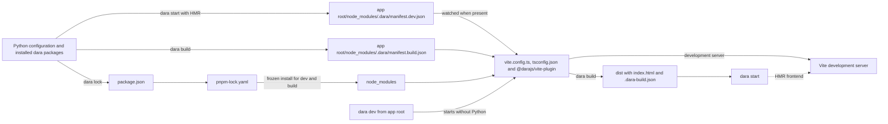

# Dara JS build redesign

Status: Draft

## Summary

Replace the UMD and Vite pipelines with one Vite build rooted in the app. The app keeps standard JS project files, while Dara owns only the entries needed to build its frontend.

The proposal makes these decisions:

- `package.json`, `pnpm-lock.yaml`, `vite.config.ts`, `tsconfig.json` and `js/index.tsx` live at the app root. A pnpm workspace uses its root lockfile.
- `dara lock` is the only command that updates dependency files.
- `dara dev` runs the frontend development loop from the app root without importing the Python app, `dara build` creates deployable output, and `dara start` runs the Python server against either source.
- Dara checks compatible Node and pnpm versions from `PATH`. mise is recommended but optional.
- Python writes separate development and build manifests. `@darajs/vite-plugin` owns development-manifest state handling and turns each manifest into named imports, component and action maps, static assets, `index.html` and a build marker.
- Every app has the same fixed JS entry and uses the same pipeline.

This fixes five problems in the current system:

- Two builds of one commit can resolve different transitive npm packages because apps have no lockfile.
- Production builds use Node with no compatibility check.
- UMD and Vite builds behave differently.
- `dist/` is both a generated JS workspace and the build output.
- Python reads Vite's output manifest at request time to assemble HTML that Vite can emit itself.

The Python component and action APIs remain unchanged. pnpm is the only supported package manager. A fresh app runs `dara build` before a normal `dara start`; development runs the backend and Vite as separate processes.

## Toolchain and prerequisites

Developers and CI need Node and pnpm to run `dara lock`, `dara dev` or `dara build`. A runtime that only runs `dara start` needs neither because it serves the compiled `dist/` directory.

`dara lock` writes the supported ranges under `engines`:

```json
{
  "engines": {
    "node": ">=22",
    "pnpm": ">=11 <12"
  }
}
```

Dara checks `node --version` and `pnpm --version` against these same ranges before lock, development or build work. It updates the ranges when a Dara release needs a newer toolchain.

`create-dara-app` includes a `mise.toml`, so a mise user can install the recommended versions with `mise install`. Other version managers work when `node` and `pnpm` on `PATH` satisfy the ranges. The app may add an exact `packageManager` field or pin exact versions in mise. Dara writes neither.

The first `dara lock` needs registry access. Projects configure registry routing, credentials, proxies and certificate authorities through pnpm's normal `.npmrc` lookup.

Dara invokes tools with argument lists and a restricted environment. Registry credentials are available to pnpm but not to Vite.

## User workflows

The commands describe operations rather than persistent modes. Development uses a Vite process alongside the Python server. Production uses an explicit build followed by the same serve-only `dara start` used in a runtime image.

Commands that import the app accept `--config <module:config>`. Apps with namespaced packages must provide it instead of relying on auto-discovery. `dara dev` is rooted only in the JS project, so it uses the current directory or an explicit `--root <dir>` and never accepts a Python configuration reference.

### Set up a new app

`create-dara-app` creates `package.json`, `vite.config.ts`, `tsconfig.json`, an empty `js/index.tsx` and the recommended `mise.toml`. After installing the Python environment:

```sh
mise install
dara lock --config my_app.main:config
```

The mise step is optional for users who installed compatible Node and pnpm versions another way. Commit `package.json`, `pnpm-lock.yaml`, `vite.config.ts`, `tsconfig.json` and `js/index.tsx` after `dara lock` succeeds.

At the end of a successful lock, Dara prints the two next-step paths and uses the resolved configuration reference where a command needs it:

```text
Dependencies locked. Commit package.json, pnpm-lock.yaml and any generated project files.

Development, in separate terminals:
  dara start --enable-hmr --reload --config my_app.main:config
  dara dev

Build and serve:
  dara build --config my_app.main:config
  dara start --config my_app.main:config
```

These commands are guidance only. `dara lock` does not run either path.

### Migrate an existing app

Run `dara lock` once against the existing configuration. It imports supported values from `dara.config.json`, creates missing standard files and prints the remaining migration steps.

Review and commit the generated files, then remove `dara.config.json`. Later commands do not keep merging it into the standard files.

### Develop the app

Run the Python server and Vite in separate terminals:

```sh
dara start --enable-hmr --reload --config my_app.main:config
```

```sh
dara dev
```

`--enable-hmr` tells the Python server to load the frontend from Vite. The server writes `manifest.dev.json` atomically whenever it starts. With the optional `--reload`, a Python change restarts the server and refreshes the manifest from the newly imported configuration.

`dara dev` resolves the app root from the current directory or `--root`, performs a frozen install, and starts Vite immediately. It neither imports the Python app nor waits for the backend. The plugin derives `<app-root>/node_modules/.dara/manifest.dev.json` from Vite's resolved root and treats a missing manifest as a normal waiting state.

The plugin watches the manifest's parent directory so atomic replacements are visible. When the manifest appears, it parses it, checks `daraVersion` and `packageRequirements`, and activates the generated entry. A replacement with compatible requirements invalidates that entry and reloads the browser with the new component, action and module dependency registrations. An invalid manifest or dependency mismatch keeps Vite running but replaces the app with a diagnostic that gives the exact `dara lock --config ...` command and tells the user to restart `dara dev` afterwards. JavaScript HMR does not restart the backend.

Either process may start first. While Vite is unavailable, API and health endpoints continue to work, but an app-shell request returns an HTTP 503 diagnostic page with the exact `dara dev --root ...` command to run. When Vite is already running but the backend has not written a manifest, the plugin serves its own HTTP 503 waiting page with the Vite client attached. The plugin triggers a full browser reload when the manifest arrives. Neither startup order requires a process restart; a browser showing the backend's Vite-unavailable page can refresh after Vite starts.

This path is the same whether `js/index.tsx` is empty or contains app code. Run `dara lock` and commit its changes after upgrading a `dara-*` Python package or changing JS dependencies.

### Add a custom component

Export components from the existing `js/index.tsx` and register them from Python. Add any app-owned JS tools or dependencies to `package.json`, then run `dara lock` before returning to the development workflow.

### Build and run production output

CI or a developer with the JS toolchain creates the deployable output explicitly:

```sh
dara build --config my_app.main:config
```

The runtime then starts the Python app:

```sh
dara start --config my_app.main:config
```

`dara build` performs a frozen install and writes self-contained output without `node_modules` or credentials. A runtime image needs only the Python application and that output. `dara start` validates the build marker and serves it without invoking Node, pnpm or Vite.

Outside HMR, a missing or stale build makes `dara start` fail with `run dara build`. The compatibility mapping for the old `--production` flag is covered under migration.

## Command reference

| Command | Behaviour |
| --- | --- |
| `dara lock` | Imports the configuration, updates Dara-owned `package.json` entries, runs `pnpm install`, and writes the lockfile. It creates the fixed entry and standard Vite and TypeScript configs when absent, then prints the development and build commands to run next. It does not run Vite or create build output. |
| `dara dev [--root <dir>]` | Resolves the app root from `--root` or the current directory, runs `pnpm install --frozen-lockfile`, and starts Vite immediately. The plugin waits for and validates `manifest.dev.json`. The command does not accept `--config`, import the app or write `dist/`. |
| `dara build --output <dir>` | Imports the app once, writes `manifest.build.json`, performs a frozen install, and runs the production Vite build. It never changes checked-in files. |
| `dara start` | Runs the Python server. Normally it validates and serves an existing build without a JS toolchain. With `--enable-hmr`, it writes `manifest.dev.json` and expects `dara dev` to supply the frontend. |

An inconsistent `package.json` and lockfile makes the frozen install fail with `run dara lock and commit the result`. A later mismatch between the development manifest and `package.json` moves the plugin to its blocked state. No command repairs either state implicitly.

The output directory follows this order:

1. `dara build --output`
2. `Configuration.static_files_dir`
3. `dist/`

The plugin receives the resolved directory. A conflicting `build.outDir` in `vite.config.ts` is an error because Python and Vite must agree on the directory Python serves.

## How it fits together



Python discovers what the app needs and writes the operation-specific manifest. The Vite plugin produces the frontend. Python then serves the result without a JS toolchain.

## Project files and ownership

A standalone app checks in `package.json`, `pnpm-lock.yaml`, `vite.config.ts`, `tsconfig.json` and `js/index.tsx`. It ignores `node_modules/` and its build output.

| File or entry | Owner |
| --- | --- |
| Required `@darajs/*` dependencies | Dara |
| Vite, TypeScript and `@darajs/vite-plugin` | Dara |
| Shared runtime dependencies and `engines` | Dara |
| App dependencies, scripts, metadata and optional `packageManager` | User |
| `pnpm-lock.yaml` | Generated by pnpm when `dara lock` runs |
| `vite.config.ts` | User, with the Dara plugin required |
| `tsconfig.json` | User, with Dara's module resolution settings required |
| `js/index.tsx` | User, created with the app and never rewritten by Dara |

### Fixed application entry

Every app has a `js/index.tsx`, initially containing only:

```ts
export {};
```

The Vite plugin always imports this module. It is the app's place for local component and action exports, global styles and JS setup. Source may live elsewhere; the fixed entry can re-export it with normal TypeScript imports.

An empty module has negligible runtime and bundle cost. Apps already require Node, pnpm, Vite and a root TypeScript configuration, so one checked-in source file adds no toolchain or development mode. In return, Dara removes the custom-JS setup command, the optional local-entry state, a manifest field, conditional TypeScript includes and several build branches. All apps exercise the same entry, HMR and production path from the day they are created.

This also makes a custom component an ordinary application change instead of a build-system task. A developer or coding agent can add a React component, export it from the existing entry and register it from Python without first discovering Dara-specific setup commands or creating configuration files. The fixed entry is a narrow guardrail: TypeScript checks the source, the plugin validates registered exports, and Vite supplies HMR. Small React and TypeScript components are well-bounded tasks for coding agents. Giving every app a prepared entry lets them work inside that boundary instead of first changing the project's build setup.

`dara lock` creates the empty entry only when it is missing and never rewrites it. Development and production fail with a direct instruction to restore the file if it is later removed.

### Dependency merge

`dara lock` applies these merge rules:

- It adds a missing Dara-owned install entry even when the package also appears in `peerDependencies`. An app that doubles as a library can keep its broad, user-owned peer range while Dara adds the version used by the app build and development server under `devDependencies`.
- For registry dependencies, an existing Dara-owned value must exactly match Dara's generated specifier string. For example, `^18.2.0` does not merge with `^18.3.0`, even if the ranges overlap. This keeps merges deterministic and avoids range-intersection logic in Python. Dara fails before writing and shows the expected value.
- It accepts `workspace:`, `link:` and `file:` specifiers as explicit exceptions after checking that the target is inside the repository or workspace, has the expected package name and declares a concrete version within Dara's required range.
- It leaves user-owned entries in place.

Upgrading a `dara-*` Python package may require `dara lock` and a commit. Dependency bots must ignore Dara-owned entries and update them through the Python package upgrade instead. Dara documents this policy but does not add Dependabot or Renovate configuration to the app.

### Shared dependencies

Packages that carry React context, state or styling across package boundaries must resolve to compatible root versions. The initial set is:

- `react`
- `react-dom`
- `styled-components`
- `@tanstack/react-query`
- `recoil`
- `recoil-sync`
- `react-router`

`@darajs/*` packages declare these as peer dependencies wherever they use them. The app has Dara-owned compatible entries, and the Vite plugin deduplicates them. If another dependency later shares runtime state across packages, Dara manages compatible root and peer ranges for it too.

### Registry authentication

pnpm resolves `.npmrc` from its usual local and global locations. Dara does not prescribe where it lives. Environment placeholders keep credentials out of the repository:

```ini
@my-org:registry=https://npm.pkg.github.com/
//npm.pkg.github.com/:_authToken=${NPM_TOKEN}
```

Apps that install private `@darajs/*` packages need the relevant registry route and credential. Dara reports the missing route or environment variable but never writes a token.

## Manifest and Vite plugin

### Frontend manifests

Python derives machine-specific manifests from the imported configuration and installed packages. Development and production use the same schema:

```json
{
  "schema": 1,
  "configuration": "my_app.main:config",
  "daraVersion": "1.24.0",
  "packageRequirements": [
    {
      "name": "@darajs/components",
      "section": "devDependencies",
      "specifier": "^1.24.0"
    },
    {
      "name": "@darajs/core",
      "section": "devDependencies",
      "specifier": "^1.24.0"
    },
    {
      "name": "@darajs/enterprise",
      "section": "devDependencies",
      "specifier": "^1.24.0"
    },
    {
      "name": "@darajs/vite-plugin",
      "section": "devDependencies",
      "specifier": "^1.24.0"
    },
    {
      "name": "react",
      "section": "devDependencies",
      "specifier": "^18.3.0"
    },
    {
      "name": "typescript",
      "section": "devDependencies",
      "specifier": "^7.0.0"
    },
    {
      "name": "vite",
      "section": "devDependencies",
      "specifier": "^8.1.0"
    }
  ],
  "moduleDependencies": [
    {
      "python": "dara.enterprise",
      "package": "@darajs/enterprise"
    }
  ],
  "components": [
    {
      "python": "dara.components.Button",
      "package": "@darajs/components",
      "export": "Button"
    },
    {
      "python": "LOCAL.MyChart",
      "package": "LOCAL",
      "export": "MyChart"
    }
  ],
  "actions": [
    {
      "python": "dara.core.NavigateTo",
      "package": "@darajs/core",
      "export": "NavigateTo"
    }
  ],
  "static": [
    {
      "package": "dara.components",
      "source": "/site-packages/dara/components/_assets/common",
      "target": "."
    }
  ],
  "favicon": "./static/favicon.ico",
  "outDir": "./dist"
}
```

`configuration` records the resolved Python configuration reference for diagnostics. The Vite plugin never imports it. `packageRequirements` contains every Dara-owned package entry with its required section and exact generated specifier. The example shows representative entries. During development, the plugin compares the complete list with `package.json` when it receives the manifest. The frozen install has already checked that the lockfile agrees with the checked-in project files.

Python resolves its module-to-package map before writing component and action entries. It carries `Configuration.module_dependencies` into `moduleDependencies` even when no component or action uses the package. This preserves `ConfigurationBuilder.add_module_dependency`, which plugins use to include a Python package's asset manifest and corresponding JS module when import discovery would otherwise miss both. In the UMD pipeline, including the manifest also made it participate in `depends_on` and tag ordering. The new pipeline removes that HTML ordering but keeps explicit package inclusion.

The fixed local entry does not appear in the manifest. A component or action whose package is `LOCAL` always resolves from `<app-root>/js/index.tsx`.

Each app has two derived files below `<app-root>/node_modules/.dara/`, including in a workspace:

- `dara start --enable-hmr` owns `manifest.dev.json` and replaces it whenever the backend starts or reloads.
- `dara build` owns `manifest.build.json` and replaces it once before the production build.

The Vite command selects the file. `serve` starts without a manifest, then reads and watches the development manifest. `build` requires and reads the build manifest once. A production build cannot replace the manifest used by a running development server. The workspace root remains responsible only for shared pnpm state such as the lockfile. Both manifests may contain absolute static paths because neither leaves the build machine.

In development, the plugin identifies the server by its schema version, canonical Vite root and origin. The backend derives the same app root while writing `manifest.dev.json` and checks that identity before sending users to Vite. This replaces the current identity based on `Configuration.static_files_dir`. A Vite server for another app produces a diagnostic naming both roots.

The development plugin holds one parsed state:

- `waiting` means no development manifest exists yet.
- `ready` contains a parsed manifest whose package requirements match the project.
- `blocked` contains a manifest or dependency error and the command that repairs it.

Only `ready` exposes the virtual application entry. The other states return diagnostic HTML instead of allowing an unresolved module request to become a blank page or Vite overlay.

### Visible Vite configuration

Every app has a normal `vite.config.ts`:

```ts
import dara from '@darajs/vite-plugin';
import { defineConfig } from 'vite';

export default defineConfig({
    plugins: [dara()],
});
```

`dara lock` creates this file when it is missing. If an existing config omits the plugin, `dara lock` fails and prints the import and plugin entries to add. It never rewrites an existing Vite config.

`dara()` returns `@vitejs/plugin-react` together with Dara's own Vite plugins. Vite flattens that plugin array, so the app does not import or configure the React plugin separately. `@darajs/vite-plugin` owns the React plugin dependency and its version.

The Dara plugin checks Vite's resolved configuration in `configResolved`. It rejects a second React plugin and settings that conflict with Dara's virtual entry, output directory, HTML generation, URL handling or development endpoints. Other Vite settings remain under user control.

### TypeScript configuration

`dara lock` adds TypeScript as a Dara-owned development dependency:

```json
{
  "devDependencies": {
    "typescript": "^7.0.0"
  }
}
```

The range follows minor and patch releases within the latest stable major supported by Dara. Dara moves it to the next major only after the generated app and all `@darajs/*` sources pass against that release. Prereleases and the next untested major do not enter an app through `dara lock`.

Every app also has a root `tsconfig.json`. The generated config starts strict and makes Vite and the editor resolve workspace packages the same way:

```json
{
  "compilerOptions": {
    "allowUnreachableCode": false,
    "allowUnusedLabels": false,
    "customConditions": ["dara-source"],
    "exactOptionalPropertyTypes": true,
    "forceConsistentCasingInFileNames": true,
    "isolatedModules": true,
    "jsx": "react-jsx",
    "lib": ["DOM", "DOM.Iterable", "ES2022"],
    "module": "ESNext",
    "moduleDetection": "force",
    "moduleResolution": "bundler",
    "noEmit": true,
    "noFallthroughCasesInSwitch": true,
    "noImplicitOverride": true,
    "noImplicitReturns": true,
    "noPropertyAccessFromIndexSignature": true,
    "noUncheckedIndexedAccess": true,
    "noUncheckedSideEffectImports": true,
    "noUnusedLocals": true,
    "noUnusedParameters": true,
    "skipLibCheck": true,
    "strict": true,
    "target": "ES2022",
    "types": ["vite/client"],
    "useDefineForClassFields": true,
    "verbatimModuleSyntax": true
  },
  "include": ["js"]
}
```

`moduleResolution: "bundler"` makes TypeScript follow package `exports` using bundler rules. `customConditions` makes it select the same `dara-source` branch as Vite. TypeScript then reads a sibling package's source for editor types and type checking, so that package does not need prebuilt declarations during app development.

`jsx: "react-jsx"` selects React's automatic JSX runtime. App files do not need to import `React` only to use JSX.

These settings are the generated default, not the full Dara contract. They keep application and workspace source strict while `skipLibCheck` avoids checking declarations inside third-party packages. Dara tests every `@darajs/*` package that exposes `dara-source` against this default.

For an existing config, `dara lock` resolves `extends` and requires only the settings needed by the pipeline:

- `moduleResolution` is `bundler`
- `customConditions` contains `dara-source`
- `jsx` is `react-jsx`
- `noEmit` is `true`
- `isolatedModules` is `true`
- `types` contains `vite/client`

Missing or conflicting required values fail with the settings to add. Dara does not rewrite the file or reject changes to the other generated defaults.

### Generated entry

The plugin generates real named imports for every registered export:

```ts
import daraCore from '@darajs/core';
import '@darajs/enterprise';
import '/js/index.tsx';
import { NavigateTo as action0 } from '@darajs/core';
import { Button as component0 } from '@darajs/components';
import { MyChart as component1 } from '/js/index.tsx';

const actions = {
    'dara.core.NavigateTo': action0,
};

const components = {
    'dara.components.Button': component0,
    'LOCAL.MyChart': component1,
};

daraCore({ actions, components });
```

The side-effect import runs app-level setup and includes global styles even when Python registers no local component or action. When registrations do exist, the named imports from the same module provide build-time export validation. JavaScript executes the module only once.

For an explicit module that contributes no named import, the plugin emits a side-effect import. This keeps the JS module in the Vite graph, while the Python module includes that package's registered static assets.

Rollup follows `export *` chains when it resolves the named imports. A missing or ambiguous export therefore fails a production build with the Python registration that requested it. During `dara dev`, native module loading reports the missing export in the browser. The plugin does not need its own re-export parser.

Passing ready-made maps removes the current package namespace cache and the `preloadComponents` and `preloadActions` runtime steps. `@darajs/vite-plugin` and `@darajs/core` version together, so the generated call can change with them.

### Other plugin responsibilities

The plugin also:

- includes `@vitejs/plugin-react` for JSX transforms and Fast Refresh
- deduplicates the shared dependencies
- emits `index.html` with the required scripts, stylesheets and Jinja placeholders
- handles Dara's runtime base URL and development server endpoints
- copies package static assets and the favicon
- starts in a waiting state when `manifest.dev.json` is absent
- watches the manifest directory, parses atomic replacements and validates package requirements
- serves development diagnostics for waiting and blocked states
- writes the production build marker

Two static sources cannot write the same destination. The build fails and names both sources when a file or directory collides.

### Python responsibilities

Python keeps four jobs:

- derive frontend manifests from the imported app configuration
- invoke pnpm for lock, development and build commands, and Vite for development and build
- validate the production build marker
- serve `index.html` and static output

Python stops generating JS source, Vite configuration and HTML tags. It also stops copying assets into `dist/`.

## Build freshness

The plugin writes `.dara-build.json` into the output directory. It records:

- a digest of the portable component, action and dependency manifest
- content hashes for copied static assets
- the lockfile digest, using the whole root lockfile in a workspace
- the Dara version and hashes of emitted files

`dara build` writes to a temporary directory and replaces the old output only after a successful build.

When serving built output, `dara start` derives the portable part of the manifest in memory and checks it and the emitted files against the marker. In a checkout where the lockfile and static sources are present, it compares those too. A runtime image may contain only the Python application and compiled output, so the absence of JS build files is not an error.

Any mismatch fails with `run dara build`. `dara start` never rebuilds. Application JS development belongs in `dara dev`; producing a new deployable build always requires an explicit `dara build`.

Because the marker records the whole workspace lockfile, even an unrelated workspace dependency change makes an app build stale. Rebuild the app after any root lockfile change.

CI runs `dara build` on each deployment, so whole-lockfile invalidation mainly affects local workflows that reuse an older build.

During development, the plugin compares `package.json` with `packageRequirements` in `manifest.dev.json`; `dara dev` does not import the app. A mismatch blocks the frontend with `run dara lock and commit package.json and pnpm-lock.yaml`, then tells the user to restart `dara dev`. `dara build` compares `package.json` with the requirements from its one configuration import and fails with the same lock guidance.

## Application JS

Application JS follows normal Vite conventions:

1. Add components, actions, global styles or setup code under `js/` and export the registered symbols from `js/index.tsx`.
2. Add the app's linting, test tools and other dependencies to `package.json`.
3. Run `dara dev` while editing and `dara build` for deployable output.

Code can live outside `js/` when the root `tsconfig.json` includes it. `js/index.tsx` remains the stable boundary and imports or re-exports that code. The path itself is not configurable.

The root `vite.config.ts` and `tsconfig.json` describe the Dara app. See [Sibling libraries](#sibling-libraries) for the separate configuration used when the same package also publishes a JS library.

## Monorepos

An app inside a pnpm workspace joins that workspace. Dara walks upward to find `pnpm-workspace.yaml` and then:

- uses the root `pnpm-lock.yaml` and records its complete digest in `.dara-build.json`
- runs a filtered frozen install for the app
- updates only the app's Dara-owned `package.json` entries
- writes both frontend manifests below the app's own `node_modules/.dara/` directory
- follows pnpm's normal `.npmrc` lookup and workspace layout
- leaves `minimumReleaseAge`, `allowBuilds`, `blockExoticSubdeps`, overrides, catalogs and patches to the repository

Dara does not add an automatic `minimumReleaseAge` exclusion for its packages. A same-day release may be blocked until the workspace policy allows it or the repository adds its own exclusion.

The root may set an exact `packageManager` or mise pin. Dara only requires that the active pnpm satisfies its compatibility range.

### Sibling libraries

A workspace library can expose source to Dara builds with a `dara-source` export condition:

```json
{
  "exports": {
    ".": {
      "dara-source": "./js/index.tsx",
      "types": "./dist/index.d.ts",
      "default": "./dist/index.js"
    }
  }
}
```

The `"."` key controls imports from the package root, such as `import { Component } from '@scope/ui'`. The Dara plugin enables `dara-source` in Vite, and the generated `tsconfig.json` enables it in TypeScript. Both therefore resolve that import to `js/index.tsx`. This is why `dara-source` appears before `types`: Dara app tooling should prefer source when the custom condition is active.

Other consumers do not enable `dara-source`. TypeScript uses `dist/index.d.ts`, while bundlers and runtimes fall through to `dist/index.js`. The package keeps its normal published contract.

This opt-in removes the sibling library prebuild from Dara development and enables cross-package HMR and source type checking. The source must still compile under the app's Vite and TypeScript settings.

`dara dev` does not build workspace libraries. A sibling library must expose `dara-source` or run its own build or watch command. If a package exposes neither source nor built output, `dara dev` fails and tells the user to build that package, start its watcher or add the source condition.

Production takes the conservative path. `dara build` runs `pnpm --filter "<app>^..." run build` for all reachable workspace dependencies, including packages that expose `dara-source`, before it builds the app. `--no-deps-build` skips that step when the repository knows its source conditions or existing outputs are sufficient.

An app that is also a published library keeps the Dara configs at `vite.config.ts` and `tsconfig.json`, with library-specific settings in `vite.lib.config.ts` and, when needed, `tsconfig.lib.json`. If both builds would write the same directory, configuration validation asks the project to choose separate outputs.

## Static assets

Static assets are files that browser code fetches by URL instead of importing into the Vite bundle.

### Current `common_assets` behavior

Packages currently expose an `AssetManifest` through the `dara_assets` Python entry point:

```toml
[tool.poetry.plugins."dara_assets"]
dara-components = "dara.components._assets:asset_manifest"
```

For example, this is a shortened version of the Dara Components manifest:

```python
COMMON_ASSETS = [
    './common/bokeh-3.1.1.min.js',
    './common/pixi.min.js',
    './common/plotly.min.js',
]

asset_manifest = AssetManifest(
    base_path=Path(__file__).parent.absolute().as_posix(),
    autojs_assets=AUTOJS_ASSETS,
    common_assets=COMMON_ASSETS,
    tag_order=AUTOJS_ASSETS,
    depends_on=['dara.core'],
)
```

Python loads this entry point, resolves each `common_assets` item against `base_path`, and copies the file to `static_files_dir/dara.components/<filename>`. The server exposes that directory at `/static/dara.components/`. The name means Dara copies these files in every build mode.

`tag_order` is separate. It controls which registered files get script tags in the generated HTML. Dara Components excludes its common assets from `tag_order`, so Bokeh, Pixi and Plotly are not loaded on every page. The components that need them construct URLs such as `/static/dara.components/bokeh-3.1.1.min.js` and add script elements at runtime.

### Proposed registration

Packages keep the same entry point. `AssetManifest` gains `static_assets`, which maps a source file or directory under `base_path` to a target inside that package's URL namespace:

```python
from pathlib import Path

from dara.core.base_definitions import AssetManifest, StaticAsset

asset_manifest = AssetManifest(
    base_path=Path(__file__).parent,
    static_assets=[
        StaticAsset(source='common', target='.'),
    ],
)
```

In this example, `common/bokeh-3.1.1.min.js` is available at `/static/dara.components/bokeh-3.1.1.min.js` when the app has no base URL. Dara applies the configured base URL before `/static` when it has one. A directory registration copies or serves its contents recursively and preserves paths below the source directory.

Python loads the entry points for packages used by the app. It resolves each source against the installed package and writes the absolute source, package name and relative target to the active frontend manifest. Absolute paths are build-machine data only. A source must exist and resolve inside its Python package. Targets must be relative and cannot escape `/static/<package>/`.

During `dara dev`, the Vite plugin serves each source through middleware at its package URL and watches it for changes. During `dara build`, the plugin copies the same files to `<outDir>/<package>/`. FastAPI mounts `outDir` at `/static`, so browser code uses the same `/static/<package>/` URL in development and production. The favicon goes to `<outDir>/favicon.ico` and is available at `/static/favicon.ico`. The build marker records the copied files and their content hashes.

Each Python package owns its namespace. Two registrations in that package cannot produce the same target path; the command fails and names both sources. Static registration does not add a script or stylesheet tag to `index.html`. The component that needs the file loads its URL explicitly. Files that can be imported as JavaScript, CSS or another Vite asset should use normal imports instead.

During compatibility, Dara translates existing `common_assets` entries into these package-scoped registrations. The first migration therefore keeps the vendored BokehJS, Pixi and Plotly files in `dara-components/_assets/common/` without changing their browser URLs. Their current runtime loaders continue to fetch them. Bundling them is follow-up work.

## Migration

Migration support ships in a minor release. Removing the legacy pipeline requires a major release. The duration of the compatibility period remains open.

### Project migration

`dara.config.json` is a one-time migration input to `dara lock`:

- `extra_dependencies` move into `package.json` under the normal ownership rules.
- An existing default custom entry stays at `js/index.tsx`.
- For a nonstandard `local_entry`, Dara creates `js/index.tsx` with a re-export of the old module. The existing source does not need to move.
- `dara lock` creates missing standard files and tells the user to remove `dara.config.json`.

Once the standard files exist, Dara does not keep merging `dara.config.json` into them. Existing `npm` or `yarn` settings migrate to pnpm.

During compatibility, `dara setup-custom-js` creates `js/index.tsx` only when it is missing and warns that every app now has the entry. The major release removes the command.

`create-dara-app` ships the standard files and `.gitignore` entries. `packages/demo-app` is the first migration test.

### Legacy flags

During compatibility, deprecated flags preserve `DARA_PRODUCTION_MODE`, `DARA_JS_REBUILD` and `SKIP_JSBUILD` for downstream code but use the new command model:

| Legacy input | Compatibility behaviour |
| --- | --- |
| `--production` | Runs `dara build`, then `dara start`, and warns. |
| `--rebuild` | Runs `dara build`, then `dara start`, and warns. |
| `--skip-jsbuild` | Runs `dara start` and warns that the flag is redundant. |
| `--docker` | Keeps its SSO and hidden API documentation behaviour. Its build-skip implication is redundant. |
| `--enable-hmr` | Keeps the existing pairing where `dara start --enable-hmr` expects `dara dev` to be running. |

The major release removes `--production`, `--rebuild`, `--skip-jsbuild` and their build-selection environment variables. `--docker` and `--enable-hmr` remain for their other behaviour.

The old `dist/_build.json`, `dist/manifest.json`, `VITE_MANIFEST_PATH` and generated `dist/tsconfig.json` disappear. TypeScript configuration moves to the checked-in root `tsconfig.json`. The new output contains `.dara-build.json` and plugin-emitted `index.html`.

### Release action

`dara-release-action` currently calls `dara-enterprise cache-build-config`, `collect-static` and `package`. The action replaces that sequence with one `dara build --output <dir>` call. The old commands remain as deprecated compatibility wrappers until the legacy pipeline disappears.

The release action continues to own toolchain provisioning, bundle assembly, asset embedding, validation, hooks, prebuilt assets and the runtime image. This proposal does not change its Dockerfile.

Registry credentials reach pnpm through `.npmrc` environment placeholders. Bundle validation continues to reject credentials and `.npmrc` files in the output.

The `dara-config-file` release input has no replacement. Release-time rewriting of `dara.config.json` is incompatible with the checked-in dependency state; workspace dependencies use `workspace:*` instead.

### Deprecated internals

Downstream packages use several auto-JS internals. They warn during compatibility and disappear with the old pipeline.

| API | During compatibility | After removal |
| --- | --- | --- |
| `ConfigurationBuilder.template_extra_js`, `add_package_tag_processor`, `package_tag_processors` | Kept with no effect | Removed |
| Auto-JS fields on `AssetManifest`, `_assets/auto_js/` | Ignored; `common_assets` still supports URL-loaded files | Replaced by package static assets |
| `BuildMode.AUTO_JS`, `_entry_autojs.template.tsx` | Kept for legacy builds | Removed |
| `fastapi_vite_dara`, `jinja/index*.html`, `build_vite_template` | Kept for legacy builds | Removed |
| `BuildConfig.npm_registry`, `BuildConfig.npm_token` | Warn and point to `.npmrc` | Removed |

## Alternatives considered

### Dara-managed Node and pnpm

An earlier design had `dara-core` download and cache Node and pnpm. A secure cross-platform installer would duplicate version managers and conflict with repositories that already pin their toolchain. Dara instead verifies binaries from `PATH`.

### Bun

Bun would reduce the toolchain to one executable, but this redesign does not need a new runtime and package manager. Node and pnpm retain the existing Vite ecosystem.

## Open question

- How long should `dara.config.json` remain a supported migration input?

## Test strategy

The dependency merge and build-freshness checks are pure functions with table-driven unit tests. Merge cases cover missing values, exact registry matches, overlapping-but-different ranges, a user peer beside a Dara-owned install entry, workspace targets and atomic failure without a partial write. Freshness cases cover manifest changes, emitted-file changes, static assets, missing build inputs and any root lockfile change.

Plugin fixtures exercise both development transforms and production builds. They cover an empty fixed entry, app-level side effects, a `react-jsx` local component with JSX but no `React` import, local and package registrations, side-effect module dependencies, `export *` resolution, static assets and missing or ambiguous exports.

CLI integration tests cover the generated strict TypeScript defaults and the smaller required contract inherited through `extends`. They also cover fixed-entry creation without overwriting an existing file, nonstandard `local_entry` migration through a re-export, lock guidance, config-free `dara dev` root selection, backend and Vite startup in either order, the backend HTTP 503 while Vite is unavailable, separate per-app manifests in a workspace and serve-time marker errors. A running development server must ignore a concurrent production manifest write.

Plugin tests cover the development state transitions from waiting to ready and from ready to blocked. They verify `packageRequirements` without a second app import, the plugin's HTTP 503 pages, recovery when an atomic manifest replacement arrives, virtual-entry invalidation, full browser reload and rejection of a Vite server rooted in another app. The implementation slices below add end-to-end app coverage on top of these focused tests.

## Implementation slices

Each slice is usable end to end before the next starts.

| # | Outcome | Proven on |
| --- | --- | --- |
| 1 | A generated app with an empty fixed entry can lock, build and serve through the new manifest, plugin and marker path, including package static assets and the `common_assets` compatibility adapter. | `create-dara-app` output |
| 2 | Backend manifest regeneration, `dara dev`, local JS, named imports, root TypeScript configuration and ready-made runtime maps work together. | `packages/demo-app` |
| 3 | A clean CI checkout builds deployable output and the release action calls `dara build`. | A downstream app whose fixed entry is empty |
| 4 | Workspace lockfiles, source conditions, and separate app and library Vite and TypeScript configs work together. | A monorepo whose app also publishes a library |
| 5 | The existing vendored visualization files work through package static assets. | Demo app visualization pages |
| 6 | Downstream packages migrate and the UMD pipeline is removed. | Dara package suite |

## Follow-up work enabled by this redesign

### Bundle vendored visualization libraries

Try Bokeh, Pixi and Plotly as npm dependencies behind `import()`. Use current library versions because the previous failures came from 2023 releases. The demo app's Bokeh, Plotly and causal graph pages must work, including a Bokeh figure and `DataTable` without `jquery.min.js`.

If the spike works, `dara-components` can remove the vendored files. `dara lock` can then select `@bokeh/bokehjs` to match the installed Python `bokeh` version.

### Split heavy packages

The single Vite pipeline lets packages use `import()` for code splitting. Today `@darajs/components` re-exports its heavy editors and graph packages from one index. A library can replace a static re-export with a lazy boundary:

```ts
export const CausalGraphEditor = React.lazy(() => import('./causal-graph'));
```

`DynamicComponent` already wraps components in `Suspense`. Heavy action dependencies can use `await import()` inside the action. The first candidates are the causal graph editor, plotting, code and markdown editors, and AI chat.
