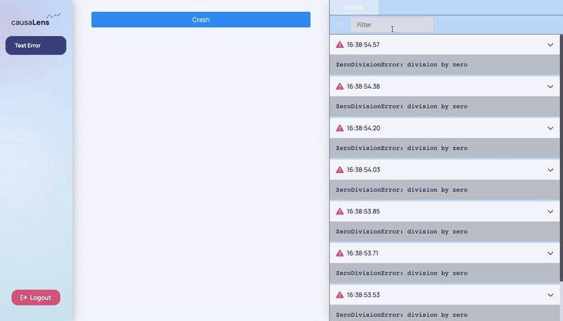

This page will introduce you to the development tooling available in Dara.

## Enabling devtools

To enable the dev tools, simply set the `enable_devtools` flag on the `config` object to `True`.

```python
from dara.core import ConfigurationBuilder

config = ConfigurationBuilder()
config.enable_devtools = True
```

Once enabled, there will be a floating devtool button visible on the screen. Clicking the button opens the devtools sidebar. You can resize the sidebar by dragging its border.


## Server Errors

The first dev tool available is the `Errors` tab which display a list of errors caught on the backend. This allows you to clearly see what is going wrong without having to switch back to your terminal, which could be cluttered with other logs.

Whenever an error is encountered, it is added to the errors tab, and the devtool icon displays an error badge. 

Clicking on an individual error allows you to see the full error traceback.


The errors can be filtered by their titles, and the list can be cleared by clicking the clear button.

