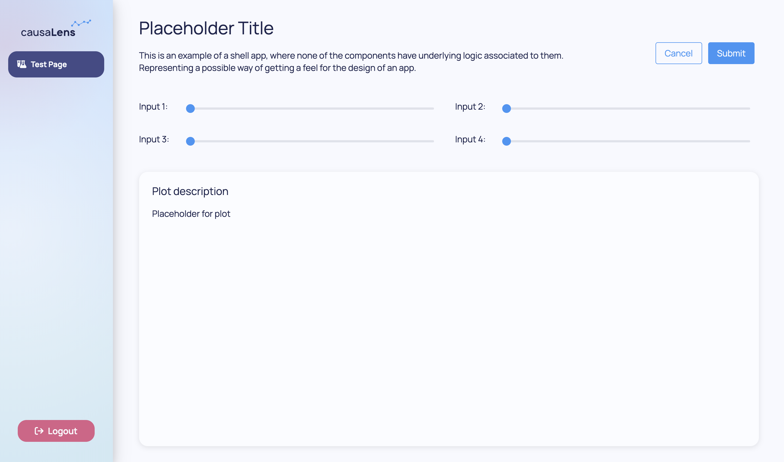
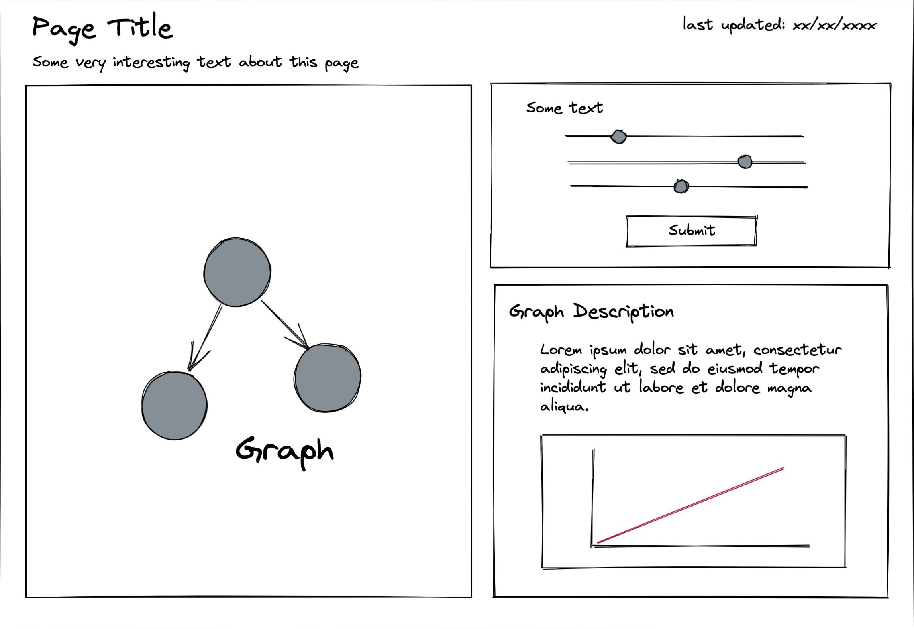

## Overview

This guide is divided into three sections:

1. [From an idea to app design](#from-an-idea-to-app-design)
2. [From design to better design](#from-design-to-better-design)
3. [From design to components](#from-design-to-components)

The first takes you from an idea to a wireframe, the second covers some tips on design practices aiming at helping with design iteration.
The last section briefly covers how to convert a wireframe into decisionApps components. This includes some
guidelines on choosing the best layout for the job: `dara.components.common.stack.Stack` vs `dara.components.common.grid.Grid`.

## From an idea to app design

In this section you will be following some steps which may be useful when designing your very own app. For this you will be taken through an example of
designing a `[Data Slicer](../../packages/dara-components/smart/data_slicer)` component. This will be used instead of
a full fledged app for the sake of simplicity, but the same steps hold true.

### Defining purpose

The first step of creating an app should be to define its purpose. The data slicer component has a purpose of facilitating users to select a subset of a dataset which can be used for other calculations. Some useful questions to ask in this step are:

- Who will be using it?
- What is the goal of my app?
- What problem is it trying to solve?
- What value does it add to the user?

### Inputs and Outputs

Once you have a general idea of what the goal of the app is, it is time to define inputs and outpus. In the case of the data slicer:

<table align="center">
  <tr>
    <td>
      <b>Output(s)</b>
    </td>
    <td> a subset of a dataset </td>
  </tr>
  <tr>
    <td>
      <b>Input(s)</b>
    </td>
    <td>a dataset, filters to be applied to the dataset </td>
  </tr>
</table>

Some questions to ask in this step are:

- What do I already have available to me? (e.g. Datasets)
- Are there any other external resources I need?
- What do I want to show the user / What do they need to see?
- What inputs do I need from the user in order to bridge the gap between what I have and what I want them to see?

### Defining pages

When defining the pages, there are two main areas to consider. First is the userflow of your app. And the is the goal of a page.

Some questions that may be useful when considering the flow:

- How should a user move from page to page?
- Do all user have the same entry point?
- What should the userflow for each be?
- What pages do I need to achieve this flow?

A userflow might look like: App overview page `->` Choosing a dataset or subset of it `->` Applying recourse constraints `->` Viewing the recourse results

A page will also have its own flow. For the Data Slicer, the user should first be guided into setting up their filters to then see the results, which leads to defining page goals.
To do so you could think of each page in terms of the table below:

<table align="center">
  <tr>
    <td>
      <b>Developer inputs</b>
    </td>
    <td>the developer, the person making the app will provide the dataset. </td>
  </tr>
  <tr>
    <td>
      <b>User inputs</b>
    </td>
    <td>
      the user will be able to add/remove filters. The filters will allow the
      user to select variables by either range or value.
    </td>
  </tr>
  <tr>
    <td>
      <b>Output</b>
    </td>
    <td>
      a table showing the results of the applied filter, a list showing the
      available variables a user can choose from.
    </td>
  </tr>
</table>

### Draw a wireframe

A wireframe is just a skeleton of how you envision your app is going to look and function. This can be anything from a roughly drawn sketch to a highly detailed layout on a specialist design tool.

It is useful to wireframe because it forces you to think about how you are going to ask the inputs to the user and where/how you are going to display the outputs.
It is also a useful mean to plan out how you are going to turn it into code, but more of this later.


## From design to better design

In this section you will go over some good design practices in order to help you reiterate over things that might make your app less user friendly.

<div style={{ textAlign: "center" }}>
  <em>
    Good design should always be consistent,
    <br />
    And so you must be persistent,
    <br />
    To create a userflow that's easy to pursue,
    <br />
    Within a layout that will sure shine through.
  </em>
</div>

### A good design is consistent

Consistency is the key to good design. For example most webpages that have a searchbar have so at the top.
As a user even without thinking, if you want to search for something that is where your eyes will go to.
Now imagine a website that has it at the bottom, for some people might not make a difference, but many will likely miss it.
Users don't want to work hard to use a webpage, it should "just work" for them.

Consistency must also hold true within your app. Another example: you have multiple modals with submit buttons. If they are often
changing between the right side and left side, and/or changing colors. This will likely lead to misclicks, how often do you really read
a button rather than just skim read it? Keeping it consistent will reinforce what the user expects, and so avoid unnecessary frustration.

Using a certain hue of red for errors, and a certain font size for important information, these consistencies
can be immensely powerful in helping you to tell the right story, bringing their attention to key facts and actions.

### Do I have too much?

A common mistake is to try and pack too much in a page, too many inputs, too many graphs. This can be overwhelming and confusing.
Although you might be adding more information, in practice the user is less able to digest and understand what is
important.

Some common signs that this may be an issue are:

- If you are having to adjust the font size to be smaller than default.
- If you are having to often remove paddings and margins in order to fit components.
- If you are using tooltips rather than text everywhere to explain functionality.
- If you are avoiding adding text explaining the context because that will mean other components don't fit.

If there is too much on a page, there is no focus, and users may feel frustrated and simply not able to achieve all
the cool things you planned. Make sure the purpose of the page is clear, and to offload where necessary by adding different pages,
modals, forms etc.

### Do I have too little?

Another common issue are apps that don't have enough context. A random person should be able to look at any page of an app and have
a general idea of what it is trying to show and what they can do in it. Of course a data scientist might have a much more in depth
understanding of what a certain table is showing than a business user. However both should still able to understand what that page's
purpose is.

- Do you explain what plots and tables are attempting to show?
- Do you clearly explain what the inputs require from the user?
- Is there any more context that is needed in an area for a user to understand how to use it?

Make sure your design has space to add both text and tooltips as appropriate, so that your app is self sufficient. A user
ideally should not need a tutorial to understand how to use an app!

## From design to components

In this section you will go through the next step, converting the idea into an actual app. Depending on your coding style you may want to
jump right into it. However if you are unsure you could always use some dummy data, or make a "shell app", that is add the components to the
page without worrying about functionality.

### Example of a shell app

Shell apps allow for quick iteration of design, without having to worry about underlying logic.
An example of such an app can be seen below. Note that none of the components take `value` param, they call no `Variable`s or `Action`s.
They are purely there to give you an idea of how an app might look like. This approach can also be quite useful in allowing you to see repeating
patterns and help to structure your app without the extra layer of complexity that interactivity adds.



```python

from dara.core import ConfigurationBuilder, get_icon
from dara.components import Stack, Text, Grid, Card, Label, Slider, Button, Heading, ComponentInstance

# Extracting slider with label component since it is used multiple times
def test_slider(slider_name: str) -> ComponentInstance:
    return Label(
        Slider(domain=[0, 10], disable_input_alternative=True),
        value=slider_name,
        direction='horizontal',
        label_width='15%',
        width='100%',
    )

def test_page() -> ComponentInstance:
    return Grid(
        Grid.Row(
            Grid.Column(
                Heading('Placeholder Title'),
                Text(
                    'This is an example of a shell app, where none of the components have underlying logic associated to them. Representing a possible way of getting a feel for the design of an app.'
                ),
                span=9,
                direction='vertical',
            ),
            Grid.Column(
                Button('Cancel', outline=True),
                span=2,
                align_items='center',
                justify='end',
            ),
            Grid.Column(
                Button('Submit'),
                span=1,
                align_items='center',
            ),
            column_gap=1,
        ),
        Grid.Row(
            Grid.Column(
                test_slider('Input 1:'),
                test_slider('Input 3:'),
                direction='vertical',
            ),
            Grid.Column(
                test_slider('Input 2:'),
                test_slider('Input 4:'),
                direction='vertical',
            ),
            column_gap=2,
        ),
        Grid.Row(
            Grid.Column(Card(Text('Placeholder for plot', height='400px'), title='Plot description')),
        ),
    )

config = ConfigurationBuilder()
config.add_page(name='Test Page', content=test_page(), icon=get_icon('flask-vial'))

```

### Choosing the right components

Are you using the right component? This can often lead to a lot of doubts as so many could fit into a single purpose. Suppose you have a list of
items and you want the user to choose between them. There are a number of components that could be used here, to name a few you could use 
`dara.components.common.radio_group.RadioGroup`, `dara.components.common.checkbox_group.CheckboxGroup` or `dara.components.common.select.Select`.

If you can only have one item selected at a time that would require either a `RadioGroup` or simple `Select`.
However if multiple items could be chosen, that would be `CheckboxGroup` or `Select` with the `multi` flag on.

Furthermore, depending on the scenario one is more apropriate than the other. `RadioGroup` and `CheckboxGroup` show all of the available
selections, these are often more appropriate for forms because you need to see the options at once to make your decision. However `Select`
is more compact, and if the user doesn't need all the options immediately visible, using the `Select` component could be the way to go.

And if the choice involves images or graphs then maybe what you need is `dara.components.common.component_select_list.ComponentSelectList`!

For this it is worth having a peruse through the available components [docs](../../reference/dara/components/common/accordion).

### Defining app layout

In Dara there are two tools which can be used to build your layout: `dara.components.common.stack.Stack` and `dara.components.common.grid.Grid`. Both are built on top of CSS flexbox, which makes wrapping and aligning elements an easy task. If you haven't already we do encourage you looking through their documentation.
Here you will be covering some guidelines of when to use each and how you can use your wireframe to help structure your code.

In this section you will be looking at a different example wireframe for a sample app page:



To decide which layout type to use it can be useful to draw lines across your wireframe in between components as shown in the picture below. As a rule of thumb:

- If you have both vertical and horizontal lines intersecting **use Grid**
- If all the components are divided rows without any vertical lines then **use Stack**

:::note
Please take the above with a pinch of salt, both `Grid` and `Stack` can achieve the same result. The only time they won't be able to is if responsive design is required. **For responsive design you must use Grid layout**.
:::


By slicing the wireframe you can break down this page in four sections. First is the overall `example_app`. This translates to a `Grid` with three rows, in code this red section would look like:

```python
def example_app() -> ComponentInstance:
    return Grid(
        Grid.Row(
            Grid.Column(Heading('Page Title')),
            Grid.Column(Text('last updated:xx/xx/xxxx'), justify='flex-end')
        ),
        Grid.Row(
            Grid.Column(Text('Some very interesting text about this page'))
        ),
        Grid.Row(
            Grid.Column(CausalGraphViewer(causal_graph=causal_graph())),
            Grid.Column(info_panel)
        ),
    )
```

Note that in the first row there are two columns, one with the page `Heading` and another with a "last updated" text, here you could use `justify='flex-end'` to guarantee the desired alignment of this text within the column.

`Grid` was useful here because makes it easier for someone to read this code and picture what it is showing. With `Stacks` this would have required embedding then with different directions which often can be very confusing.

Next what the code might look like for the blue `info_panel`:

```python
def info_panel() -> ComponentInstance:
    return Grid(
        Grid.Row(
            Grid.Column(inputs_section)
        ),
        Grid.Row(
            Grid.Column(graph_description)
        ),
        row_gap='10px'
    )

```

Here you could just as easily have used `Stack` instead of `Grid`, for the last two `inputs_section` and `graph_description` the code snippet shows `Stack` being used.

This was a good choice as there are different components displayed on top of one another, so the code is simpler.

```python
def inputs_section() -> ComponentInstance:
    return Stack(
        Text('Some text'),
        Slider(
            domain=domain,
            value=value,
        ),
        Slider(
            domain=domain,
            value=value,
        ),
        Slider(
            domain=domain,
            value=value,
        ),
        Button('Submit', onclick=action)
    )

def graph_description() -> ComponentInstance:
    return Stack(
        Heading('Graph Description'),
        Text('Lorem Ipsum ...'),
        Bokeh(fig)
    )
```

Another takeaway is how the code was broken down into different functions for each embedded `Grid`/`Stack` this simplifies when debugging layout and allows for maintainable code.

## Conclusion

In this page you covered steps for designing an app, for the sake of simplicity the examples were for only a page. However all the ideas extends to a full app.

These steps can be done in great detail or just be points of thought when building your app. To write clean code blocks, it is helpful to know the page
layout and needs, for that it is useful to have a wireframe. To have a wireframe you need to understand what the app's users and pages inputs and outputs are.
In turn to know what the flow and the purpose of your app is.

Please read [App Structure](./app-structure-breakdown) to learn how to structure your app's code in a higher level.
