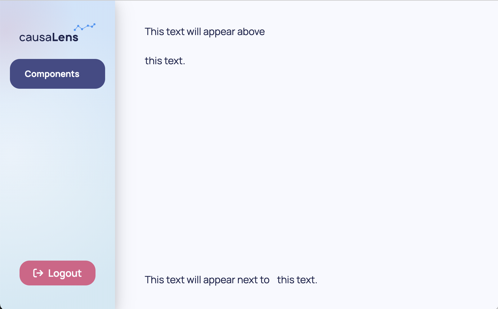
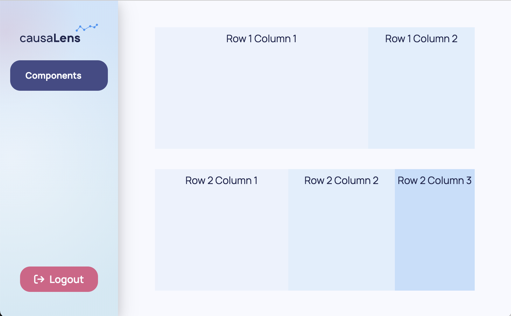
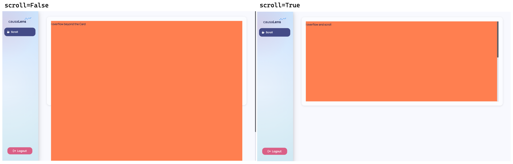
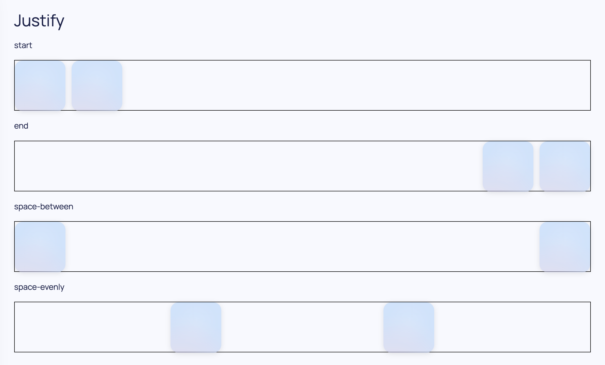
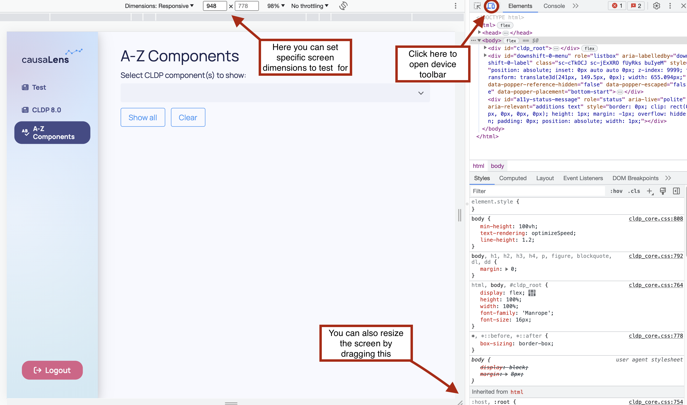

## Overview

As app creators, you know that creating a well-structured and visually appealing application layout can often be a challenging task. Balancing aesthetic appeal with functional design can seem daunting, particularly when you're trying to ensure your app is maintainable and user-friendly. This guide is here to help you traverse the landscape of app layout, providing useful pointers to enhance your application's structure, design and interactivity.

## Layout 101

This section contains a brief reminder of the two fundamental layout options for arranging elements in your application: `Stack` and `Grid`.

### Stack

[Stack](../../reference/dara/components/common/stack/) arranges elements linearly, either horizontally or vertically. You're essentially "stacking" your elements, one after the other, in a single row or column. This makes it excellent for aligning items along a single axis and it's perfect when you want your elements to be arranged in a straight line.

```python
from dara.components import Stack

Stack(
    Text('This text will appear above'),
    Text('this text.')
)

Stack(
    Text('This text will appear next to'),
    Text('this text.'),
    direction='horizontal'
)
```



### Grid

On the other hand, [Grid](../../reference/dara/components/common/grid/) is more akin to a table. You have rows and columns at your disposal, that allows you to arrange elements both horizontally and vertically. This can be fantastic for both setting an overall higher level layout of your page and for defining more granular two dimensional layouts.

You can think of `Grid` as a chessboard where each `Row` is divided into 12 squares. When defining your columns you can decide how many of these squares each `Column` can occupy, this is called the `span` of each column.

For the purpose of demonstration, background colors are added to show where one row/column ends and the other begins.

```python
from dara.components import Grid, Text
from dara.core.visual.themes import Light

Grid(
    Grid.Row(
        Grid.Column(
            Text('Row 1 Column 1'),
            background=Light.colors.blue2,
            justify='center',
            span=8
        ),
        Grid.Column(
            Text('Row 1 Column 2'),
            background=Light.colors.blue3,
            justify='center',
            span=4
        ),
        padding='10px'
    ),
    Grid.Row(
        Grid.Column(
            Text('Row 2 Column 1'),
            background=Light.colors.blue2,
            justify='center',
            span=5
        ),
        Grid.Column(
            Text('Row 2 Column 2'),
            background=Light.colors.blue3,
            justify='center',
            span=4
        ),
        Grid.Column(
            Text('Row 2 Column 3'),
            background=Light.colors.blue4,
            justify='center',
            span=3
        ),
        padding='10px'
    ),
)
```



You can specify the space between columns with the `column_gap` argument of the wrapping `Row` object. You can specify the space between rows with the `row_gap` argument of the wrapping `Grid` object.

In both cases, these layout tools are built on the flex model, which allows for responsive and adaptable layouts. In the following sections, we'll delve more into how to utilize these tools effectively in your application design process.

## Stacking it Up: Hug & Scroll

In this section you will learn some more advanced features of `Stack`, namely two highly useful props `hug` and `scroll`.

In the context of a flex container, `hug` acts somewhat like a function that adjusts the size of a container to fit its content perfectly. In other words, it sets the flex-shrink property to 1 and flex-grow property to 0, making the container just big enough to "hug" or fit its content snugly. This avoids any excess space around the content and can be particularly useful when you want the container to occupy only as much space as its content needs, no more, no less.

```python

from dara.components import Stack, Text

Stack(
    # Stack takes as much space as its contents needs
    Stack(
        Text('I am hug tightly and only occupy as much space as I need'),
        background='darkcyan',
        hug=True,
    ),
    # this Stack takes the remaining space
    Stack(
        Text('I stretch to occupy the remaining space available'),
        background='tomato',
    ),
)

```


:::caution

When using `hug` the `Stack` will adapt to the size of its contents, so using `%` for `height` and `width` within its descendants will not produce the desired effect. That is unless somewhere down the chain one of the `Stack`s has an absolute height, that is one set in `px`, `em/rem` or `vh/vw`.

:::

"Scroll", on the other hand, is more like a condition that checks for overflow. This is where an Autosizer comes in. The Autosizer checks if the content exceeds the available space within the container. If the content does overflow, the `scroll=True` property triggers the addition of scroll bars to that `Stack`.

In the example below we have a `Card` with a height of 500px, and a `Stack` that is free to scroll if its contents overflow the space available. Since the Stack has a `Text` with height 1000px, that will certainly overflow the 500px space available in the card, therefore it will gain vertical scroll bars.
By default if scroll is not set then the `Stack` will overflow the space of the `Card`. In this example the coral background spills out of the `Card`.

```python

from dara.components import Stack, Text

Card(
    Stack(
        # this inner has content which is 1000px in height
        Text('I overflow', height='1000px'),
        background='coral',
        scroll=True,
    ),
    # outer Stack has 500px room
    height='500px',
)

```



One last topic to note is how these two params interact. As mentioned above `scroll` when set to True uses an autosizer, what that means is that it starts with zero height and "scans" the space available, it then uses that value to define the space the `Stack` can end up taking. On the other hand `hug` starts with the size of the content. So when both are used together `hug` starts with zero height and is not able to grow. For these cases, where you want a `Stack` to both `hug` and `scroll` you should set the `overflow` property to `auto` instead.

```python

from dara.components import Stack

Stack(
    ...# some content
    hug=True,
    overflow='auto',
)

```

:::caution

**When dealing with `CausalGraphViewer`, `Table` and `Scrollable Stacks`:**
These components are special in that they essentially "scan" the space available on the page before they render. This is good because it allows them to adapt to their surroundings but it comes with drawbacks.

If you surround them with hug, hug tries to make the space only as big as it needs to. So there is a conflict of interest as there is no space leftover for them to take. In that case they will take their default `min_height`. So if you are using these components within a `hug` container you may need to overwrite `min_height` of the component should you want them to take more space on the screen.
:::

### Hugging in other layout components

The `hug` property is also supported on a few other layout components:

- `Grid`, `Grid.Row` and `Grid.Column`
- `Card`
- `TabbedCard`

As an example, you may want to set `Grid.Row` to not grow to fill the space available in the `Grid` but instead only occupy as much as its contents need:

```python

from dara.components import Grid

Grid(
    Grid.Row(
        ...# some content
        hug=True
    ),
    ...,
)

```

### Scrolling beyond Stacks

Similarly `scroll` is currently not implemented in `Grid.Column`, `Card` and `Tab`. To achieve scrollable content in those scenarios it is recommended to add a `Stack` within it and set `scroll=True`.

## Mastering the Flex

Both `Stack` and `Grid` components are built on top of [flexbox layout](https://css-tricks.com/snippets/css/a-guide-to-flexbox/). Having a mastery of its basic properties will allow for greater control over the layout of your apps. In this section you will learn about the key properties which you may want to set.

### Grow

`grow` (aka [flex-grow](https://developer.mozilla.org/en-US/docs/Web/CSS/flex-grow)) is the "growth factor". When you have extra space in your container and you want your elements to use up that space, flex-grow decides how much of this extra space each element should consume. If all elements have the same flex-grow value, they will share the extra space equally. If the values are different, they'll consume space proportional to their flex-grow value. If set to `False` or 0 it means that the container will not grow beyond the initial `basis` value.

If set, this value can be set to `True` which equals a grow factor of `1`, or `False` equaling to `0`. It can also take any other value that is accepted by `flex-grow`.

### Shrink

`shrink` (aka [flex-shrink](https://developer.mozilla.org/en-US/docs/Web/CSS/flex-shrink)), on the other hand, deals with the scenario where there's not enough space in the container to fit all the elements. Flex-shrink dictates how much each element should "shrink" to fit into the container. If all elements have the same flex-shrink value, they will shrink equally when the container is too small. If the values are different, they'll shrink in proportion to their flex-shrink value. If set to `False` or 0 it means that the container will not shrink beyond the initial `basis` value.

If set, this value can be set to `True` which equals a grow factor of `1`, or `False` equaling to `0`. It can also take any other value that is accepted by `flex-shrink`.

### Basis

`basis` (aka [flex-basis](https://developer.mozilla.org/en-US/docs/Web/CSS/flex-basis)) is a way of setting the size the component starts with. In a flex container, it determines the initial main size of a flex item before any available space is distributed according to the flex-grow and flex-shrink factors. Think of it as setting an initial size or "base" for an element.

:::note

These three properties form one called [flex](https://developer.mozilla.org/en-US/docs/Web/CSS/flex) and act in the direction of the container. That is for a vertical `Stack` it will grow/shrink and define initial size vertically resulting in some final **height**, for horizontal `Stack` horizontally defining the final **width** the component takes.

:::

### Gap

Layout components such as `Stack`, `Card`, `Tab`, `Grid.Column` all have a default `gap` of 0.75rem. This means that as you add components as children there will be a 0.75rem space between them automatically. This is useful to avoid content being too crowded and having to manually add a `Spacer` between each component.

```python

from dara.components import Stack

Stack(
    Heading(...),
    # hidden gap of 0.75rem
    Card(...),
    # hidden gap of 0.75rem
    Card(...),
)

```

This can be easily changed by setting the `gap` property to a different value:

```python

from dara.components import Stack

Stack(
    Heading(...),
    # hidden gap of 2rem
    Card(...),
    # hidden gap of 2rem
    Card(...),
    gap='2rem',
)

```

However suppose that now you would like certain heights applied to these components, `Heading` should take 10% of the space available, and each `Card` should take 30% and 60% respectively:

```python

from dara.components import Stack, Heading, Card

Stack(
    Heading(..., height='10%'),
    # hidden gap of 2rem
    Card(..., height='30%'),
    # hidden gap of 2rem
    Card(..., height='60%'),
    gap='2rem',
)

```

The heights add to 100%, but this `Stack` would overflow! This is because of gap, counting the true height you have 10% + 2rem + 30% + 2rem + 60% = 100% + 4rem.

To avoid this there are three different methods you can follow:

1. Leave one of your `Card`s without a height set, since they have `shrink` set to 1 by default (if height not set) it will shrink to fit the remaining space available.

```python

from dara.components import Stack, Heading, Card

Stack(
    Heading(..., height='10%'),
    # hidden gap of 2rem
    Card(..., height='30%'),
    # hidden gap of 2rem
    # takes remaining space available
    Card(...),
    gap='2rem',
)

```

2. Add `shrink=True` to each of the child components or the ones you would like to be able to "absorb" some of the space that `gap` takes

```python

from dara.components import Stack, Heading, Card

Stack(
    # Heading takes exactly 10%
    Heading(..., height='10%'),
    # hidden gap of 2rem
    # This Card in practice will take 30% - 2rem
    Card(..., height='30%', shrink=True),
    # hidden gap of 2rem
    # This Card in practice will take 60% - 2rem
    Card(..., height='60%', shrink=True),
    gap='2rem',
)

```

3. Account for the `gap` size when considering the heights manually with the help of `calc`:

```python

from dara.components import Stack, Heading, Card

Stack(
    # calc calculates x% of the space available minus the two gaps divided between the 3 components evenly
    Heading(..., height='calc(10% - (2rem / 3))'),
    # hidden gap of 2rem
    Card(..., height='calc(30% - (2rem / 3))'),
    # hidden gap of 2rem
    Card(..., height='calc(60% - (2rem / 3))'),
    gap='2rem',
)

```

### Justify and Align

Justify and align are about how elements are positioned in the container.

Justify (aka [justify-content](https://developer.mozilla.org/en-US/docs/Web/CSS/justify-content)) determines the alignment of items along the main axis of the container. For example in a vertical `Stack` along the y-axis or height axis. You could center them, space them evenly, or align them to one side.

Align (aka [align-items](https://developer.mozilla.org/en-US/docs/Web/CSS/align-items)) works similarly, but it deals with the cross axis — the axis perpendicular to the main axis. In the vertical `Stack` example it aligns your components in the x-axis or width axis. It determines how items are laid out vertically in a row setup or horizontally in a column setup. It can align all items to start (top or left), end (bottom or right), center, or even stretch to fill the container.



```python
from dara.components import Stack, Heading, Card, Text

Stack(
        Heading('Justify'),
        Text('start'),
        Stack(
            Card(height=100, width=100, accent=True),
            Card(height=100, width=100, accent=True),
            justify='start',
            direction='horizontal',
            border='1px solid black',
           height=100
        ),
        Text('end'),
        Stack(
            Card(height=100, width=100, accent=True),
            Card(height=100, width=100, accent=True),
            justify='end',
            direction='horizontal',
            border='1px solid black',
           height=100
        ),
        Text('space-between'),
        Stack(
            Card(height=100, width=100, accent=True),
            Card(height=100, width=100, accent=True),
            justify='space-between',
            direction='horizontal',
            border='1px solid black',
           height=100
        ),
        Text('space-evenly'),
        Stack(
            Card(height=100, width=100, accent=True),
            Card(height=100, width=100, accent=True),
            justify='space-evenly',
            direction='horizontal',
            border='1px solid black',
           height=100
        ),
)

```

## Testing Your Layout

When you're diving into layouts, it's crucial to remember that your app will be viewed on a range of screen sizes - from compact laptop screens to expansive secondary monitors. To make sure your app looks great across the board, you can start by simply zooming in and out in your browser. This will give you an initial feel for how your components adjust to different zoom levels.

Want a more in-depth look? The 'dev tools' is your go-to. One way of accessing it in most browsers is by right-click on your page and select 'inspect' from the dropdown. This will open a sidebar which has many tools to test the state of your app. One of the features it offers is the ability to simulate different screen resolutions. You can find this option in both Firefox and Chrome, represented by an icon displaying various devices. By selecting this, you can input specific screen resolutions to check out how responsive your app truly is.



While you're doing all this resizing, keep an eye out for any content that might overflow or areas that could have too much vacant space. Building a responsive app right off the bat requires careful consideration of the units you use for setting heights and widths. Absolute units, like "px", stay fixed no matter what the screen size is. Which could be very useful for certain items that should maintain a size, for example a heading on a page, however some other components such as plots or cards might benefit from changing size to fit nicely within the screen, for these relative units, like "%", could be more appropriate. You should choose which to use on a case by case basis.

Finally, remember to test for sections of your app that could house variable content. Imagine you've got a component that adds a row to a list every time a user clicks on a point in a graph. You'd want to see how it behaves when the list is empty, when it has a few elements, and when it's overflowing with entries. By doing this, you're ensuring your app is not just responsive, but also resilient in handling varying content.
