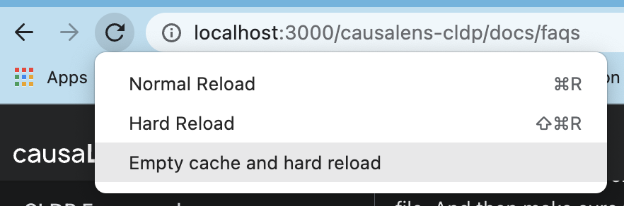
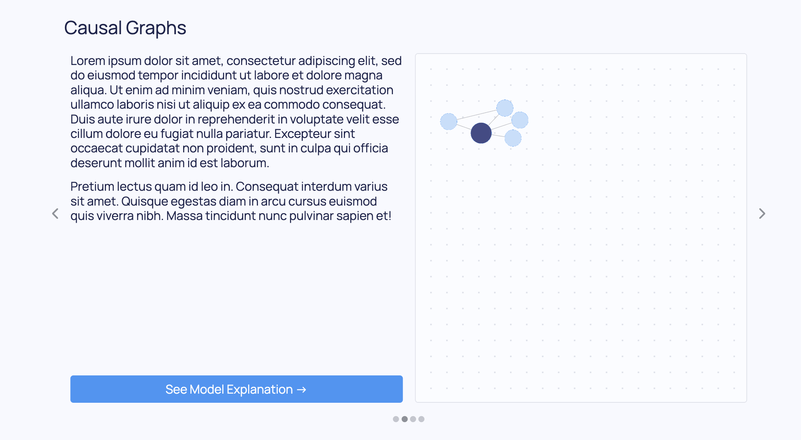

<details><summary><h3 style={{margin: '0px 0px 0px 0px'}}>How do I use an extension or plugin?</h3></summary>

1. Install the package.

```sh
poetry add dara-components
```

---

```sh
pip install dara-components
```

2. Import the components or functions you need from the extension and use them accordingly.

```python title=page1.py
from bokeh.plotting import figure
from dara.components import Bokeh

def line_plot(x, y):
    figure = ('My Figure')
    ...
    return Bokeh(figure)
```

The same process applies to plugins, however plugins are just plain functions so you will need to run `plugin_function(config_builder_instance)`.

</details>

<details><summary><h3 style={{margin: '0px 0px 0px 0px'}}>How do I customize the appearance of my app?</h3></summary>

Like any web app, your app can be customized with CSS.

<h4> Components </h4>

The appearance of components can be changed directly through its properties or by passing custom CSS into their `raw_css` property. The [**Customizing Components**](./advanced/styling-components) section shows examples and goes through some basic CSS properties you can use to give your app the right look!

<h4> App Themes </h4>

You can also give a specific color-way to your entire application. The [**Themes**](./advanced/custom-themes) section shows examples of how to configure your app with a pre-built theme, along with directing you to a resource on how to make your own themes.

</details>

<details><summary><h3 style={{margin: '0px 0px 0px 0px'}}>Why is my app not reflecting the latest version?</h3></summary>

There are a few reasons why your app might not be showing the latest changes. This section will cover some common fixes for this problem.

<h4> 1. Check if the correct versions appear on pyproject.toml </h4>

Check if the correct versions are on `pyproject.toml` file. And then make sure you tried running:

```
poetry update
```

Alternatively you can remove the `poetry.lock` file and then run:

```
poetry install
```

<h4> 2. Empty browser cache (for Chrome) </h4>

On Chrome right click anywhere on the page and select `inspect`, then right click on the refresh arrow and select `Empty cache and hard reload`.



<h4> 3. Check if you are using the the correct environment </h4>

Sometimes you could be using another virtual environment which has older versions. To check which environment you are using:

```
poetry env info
```

and check if the path matches to the one you expected. If not, you can deactivate the environment with the following:

```
deactivate
source .path/to/venv/bin/activate
```

<h4> 4. Delete your `dist/` folder and run your app again </h4>

The `dist/` folder contains the assets that can actually be hosted on the server. It may not be updated with your latest versions, so it is worth deleting the folder and running `poetry run dara start` again to let it rebuild.

<h4> 5. Check if your environment has the right package versions </h4>

Your environment could have both the latest and older versions of the same packages.

To check go in to `.venv/lib/python3.8/site-packages` and check which versions are present for the Dara packages being used.

Delete your `.venv` file and run either `poetry update` or `poetry install`, this should then create a fresh `.venv`.

</details>

<details><summary><h3 style={{margin: '0px 0px 0px 0px'}}>How do I access the values in my Variables?</h3></summary>

As mentioned in the [**user guide**](./getting-started/interactivity#variables), you cannot extract values or do operations on `Variable`s through traditional python code.

When you pass a variable to a function or method and you print it you will get something like the following:

```python

my_variable = Variable(5)

def my_function(var):
    print(var)
    ...

my_function(my_variable)
>>> uid='dbc82441-dc9a-4d58-baf0-d7822d56f95a' default=5 persist_value=False nested=[]
```

While `Variable`s and `DerivedVariable`s can be passed directly to the components, you may need to extract the value of a `Variable` to render a dynamic layout.

For example, you calculate the results of an experiment and you want the result to be in green text if it is positive and red if it is negative.

```python
from dara.core import DerivedVariable
from dara.components import Text

result = DerivedVariable(run_experiment, variables=[data, model])

def display_results(result_value):
    if result_value > 0:
        return Text(result_value, color='green')
    else:
        return Text(result_value, color='red')

display_results(result)
```

The above function will not work as expected. You must wrap it in a `py_component` decorator like so:

```python
from dara.core import DerivedVariable, py_component
from dara.components import Text

result = DerivedVariable(run_experiment, variables=[data, model])

@py_component
def display_results(result_value):
    if result_value > 0:
        return Text(result_value, color='green')
    else:
        return Text(result_value, color='red')

display_results(result)
```

If you did not have a preference in the way the results were presented, you do not need a `py_component` to extract the value. Therefore, the following suffices:

```python
from dara.core import DerivedVariable, py_component
from dara.components import Text

result = DerivedVariable(run_experiment, variables=[data, model])

def display_results(result_value):
    return Text(result_value)

display_results(result)
```

</details>

<details><summary><h3 style={{margin: '0px 0px 0px 0px'}}>When should I run a DerivedVariable as a task?</h3></summary>

Running a `dara.core.interactivity.derived_variable.DerivedVariable` with `run_as_task=True` tells the app to run the resolver function in a separate process within a process pool, with the `DerivedVariable`'s list of `variables` and `extras`.

As running the `DerivedVariable` as a task is optional, you may be wondering when you should utilize this functionality.

The answer comes down to whether you want to be doing multiple things at one time. python's Global Interpreter Lock (GIL) ensures that you can only have one _thread_ running at any given time. This means you cannot take advantage of multiple processors with concurrent threads. However, python allows _processes_ to be executed in parallel with multiple processors as each process spawned has its own memory and interpreter and thus its own GIL. If you'd like to take advantage of this workaround to the GIL, then you should run your `DerivedVariable` as a task.

This especially helps when you have heavy CPU bound tasks. It enables those tasks to run while leaving the rest of your app still functional in the meantime.

Keep in mind that spawning up a separate process comes with overhead. If the calculation is quick and light, the time it takes to pass your inputs to another process and back or spin up another process could take longer than the calculation itself.

For example, the following example:

```python title=my_app/tasks.py
def add(addend1, addend2):
    return addend1 + addend2
```

```python
from my_app.tasks import add
x, y = Variable(1), Variable(2)

summation = DerivedVariable(
    add,
    variables=[x, y],
    run_as_task=True
)
```

will probably run slower than the same scenario with `run_as_task` set to `False`. However, it still may be worth running as a task if you don't want the calculation to affect other application threads.

It is important to remember that the server uses recursion to resolve the values of `DerivedVariable`s so you can have the following:

```python title=my_app/tasks.py
def add(addend1, addend2):
    return addend1 + addend2

def multiply(factor1, factor2):
    return factor1 * factor2
```

```python
from my_app.tasks import add, multiply

x, y = Variable(1), Variable(2)

summation = DerivedVariable(
    add,
    variables=[x, y],
    run_as_task=True
)

product = DerivedVariable(
    add,
    variables=[summation, Variable(5)],
    run_as_task=True
)
```

The two process for `summation` and `product` are run in parallel, but `product` will wait until the results of `summation` have been resolved.

As mentioned, running `DerivedVariable`s as tasks will help with CPU bound tasks as IO bound tasks depend on the speed of the I/O subsystem, for example how fast a file system can read/write. Spawning up a separate process will not make this file system faster.

If using `DerivedVariable`s as [tasks](./getting-started/interactivity#derivedvariable), remember to set the `task_module` attribute of the config to the name of the module where your task resolver functions are located.

```python title=my_app/main.py
from dara.core import ConfigurationBuilder

config = ConfigurationBuilder()
config.task_module = 'my_app.tasks'
```

</details>

<details><summary><h3 style={{margin: '0px 0px 0px 0px'}}>Why are the components from an extension or plugin not showing up in my app?</h3></summary>

You may have installed and imported an extension but the components from that package are not rendering in your app.

This is probably because you added a new extension and did not rebuild the JavaScript, so the implementation of the new components is not included in your application. You can force the rebuild by running

```sh
poetry run dara start --rebuild
```

If that still does not work, this might mean your component is not registered in the application correctly. The [`import discovery`](./advanced/import-discovery) process should automatically register all the components you are using, however there might be edge cases where that is not possible. You can try explicitly registering the component in question with

```python
from dara.core import ConfigurationBuilder
from some_extension import SomeComponent

config = ConfigurationBuilder()
config.add_component(SomeComponent)
```

</details>

<details><summary><h3 style={{margin: '0px 0px 0px 0px'}}>Why do I see unexpected behavior with `plotting.Matplotlib`?</h3></summary>

This is likely caused by the use of pyplot to create a figure. In the context of the framework you should always use matplotlib's Figure object to instantiate your figure. The reason being that pyplot is not thread safe and can cause some unwanted behavior.

```python
from matplotlib.figure import Figure
from dara.components import Matplotlib

fig = Figure()
...
Matplotlib(fig)
```

In case your `matplotlib` plot is cutting off the axis labels, you can try to use the `tight_layout` method on the figure before passing it to the `Matplotlib` component.

```python
from matplotlib.figure import Figure
from dara.components import Matplotlib

fig = Figure()
...
fig.tight_layout()
Matplotlib(fig)
```

</details>
<details><summary><h3 style={{margin: '0px 0px 0px 0px'}}>Why is my graph not occupying the whole canvas?</h3></summary>

Sometimes when rendering a graph inside of a Carousel it might end up looking like this:


The problem arises when the Graph component is unable to accurately determine the space available to it. Or if you have a dynamic page and the canvas size is changed.

**Debugging Steps**
1. **Simplify Surrounding Structure:** Start by reducing the complexity of the components surrounding the Graph. Attempt to remove any nested Stacks or unnecessary elements around the graph. This can help isolate the issue and make it easier to identify the root cause.
2. **Forcing a re render:** If you have a dynamic page that changes the size of the graph, you may want to force it to recalculate its size on the click of a button, in this case you can wrap your graph in a `py_component` and force it to recalculate on the button click. 
3. **Provide Feedback if Needed:** If you encounter this issue, we would greatly appreciate your feedback on [GitHub](https://github.com/causalens/dara). Sharing your examples and experiences may shed light on the underlying problem, allowing us to diagnose it more accurately.

</details>
<details><summary><h3 style={{margin: '0px 0px 0px 0px'}}>Why am I getting `ValueError` with Plotly?</h3></summary>

Sometimes, when rendering multiple Plotly graphs on a page, one can encounter a `ValueError`. This error appears inconsistently, varying between re-renders of the page.
This seems to be a [known issue](https://github.com/plotly/plotly.py/issues/3441) with Plotly.
The first workaround can be found [here](https://community.plotly.com/t/inconsistent-callback-error-updating-scatter-plot/46754/8), where you can wrap your figure in a try and except to force it to load again if it fails the first time:

```python
import plotly.express as px
try:
    fig = px.scatter(...)
except Exception:
    fig = px.scatter(...)  # Exact same line as previously
return fig
```

Another approach that may also work is to instantiate using Plotly's graph object `Figure` and setting the layout explicitly:\

```python
import plotly.graph_objects as go

fig = go.Figure(layout=dict(template='plotly'))
```

</details>