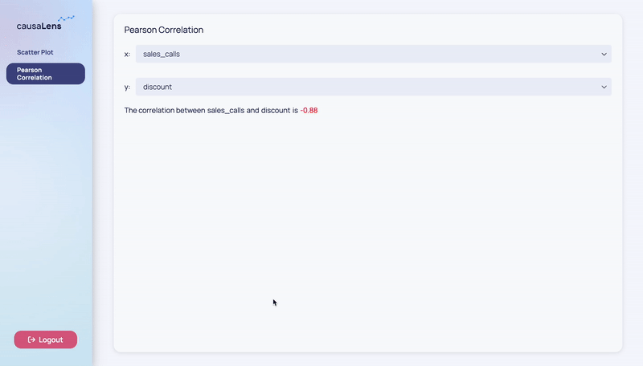

Below you will construct a very simple app that calculates and visualizes some simple statistics within a small dataset. The goal is to use the concepts outlined in the previous pages such as registering extensions, adding pages, enabling user interactivity, and reusing components, to build an app.

The file structure will look like this:

```
- my_app/
    -  custom_components.py
    -  definitions.py
    -  main.py
    -  pages/
        -   correlation.py
        -   scatter_plot.py
```

### Definitions

It is good to have your global state in one place and to keep it out of `main.py` for organization and readability. For this reason, you will define your dataset in `definitions.py`. If you had any more global variables, you could put them here and import them accordingly when you need them. If you had many global definitions, you could split them into separate files and have a `definitions` folder instead. In this app, one file is sufficient as you have only one global variable.

```python title=definitions.py
import pandas

data = pandas.DataFrame({
    'customer_ids': [1, 2, 3, 4, 5],
    'sales_calls': [4, 2, 3, 1, 3],
    'discount': [5, 15, 15, 20, 15],
    'renew': [True, True, False, False, False]
})
```

:::tip
The `data` variable above is just a normal Python variable. You may also have global Dara `dara.core.interactivity.plain_variable.Variable`s in which case you can follow similar guidelines. It can help to keep your Python variables and Dara `Variable`s separate so you always know which variable belongs to which category. Your global Dara `dara.core.interactivity.plain_variable.Variable`s, `dara.core.interactivity.data_variable.DataVariable`s and `dara.core.interactivity.derived_variable.DerivedVariable`s can live in `variables.py` or be separated into multiple files within a `variables` folder.
:::

### Configuration

You will build your configuration like you have in the previous steps by first instantiating the `dara.core.configuration.ConfigurationBuilder`.

```python title=my_app/main.py
from dara.core import ConfigurationBuilder

# Create a configuration builder
config = ConfigurationBuilder()
```

Later on you will add pages to this configuration.

### Reusable Components

Both of your pages will allow the user to select an `x` and `y` variable. Because both pages will use the same code, you will want to define your own custom component which can be called with whatever X and Y variable the user chooses. This way, you do not have to define the same thing twice and can call `x_y_selects(x, y)` instead.

```python title=my_app/custom_components.py
from dara.core import Variable, ComponentInstance
from dara.components import Stack, Text, Spacer, Select

from my_app.definitions import data


def x_y_selects(x_var: Variable, y_var: Variable) -> ComponentInstance:
    """ Constructs two selects, one for the x variable and one for the y variable"""
    return Stack(
        Stack(
            Text('x:'),
            Select(value=x_var, items=[*data.columns]),
            direction='horizontal'
        ),
        Stack(
            Text('y:'),
            Select(value=y_var, items=[*data.columns]),
            direction='horizontal'
        )
    )
```


### Pages

You should define your pages outside of `main.py` so you can clearly see what you are configuring. The first page is `ScatterPlotPage` and your second page is `CorrelationPage`. Both have properties `x` and `y` which represent the choices of the user in this application. When the user uses the `Select`s, these properties will be updated and the display will be re-rendered.

Both pages use a `dara.core.visual.dynamic_component.py_component` as you need to access the data with your `x` and `y` `Variable`s. In `ScatterPlotPage`, you need the `py_component` so that you can plot the correct data, and in `CorrelationPage` you need the `py_component` so that you can color the correlation depending on its sign. This follows a pattern as `py_component`s allow you dynamic visual rendering based on the values in your `Variable`s and `DerivedVariable`s.

The `CorrelationPage` uses a `DerivedVariable` because it needs to access the information within you `x` and `y` `Variable`s to calculate the Pearson Correlation between the two. Since this is not a visual calculation, you use a `DerivedVariable` and not a `py_component`.

```python title=my_app/pages/scatter_plot.py
from bokeh.plotting import figure

from dara.core import Variable, ComponentInstance, py_component
from dara.components import Stack, Card, Bokeh

from my_app.definitions import data
from my_app.custom_components import x_y_selects


class ScatterPlotPage:
    """
    Constructs a layout that displays two selects for x and y
    along with a scatter plot of the two selections
    """

    def __init__(self):
        self.x = Variable('sales_calls')
        self.y = Variable('discount')

    def __call__(self) -> ComponentInstance:
        return Card(
            Stack(
                x_y_selects(self.x, self.y),
                height='20%'
            ),
            self.scatter_plot(self.x, self.y),
            title='Scatter Plot'
        )

    @py_component
    def scatter_plot(self, x, y):
        p = figure(title = f"Customers: {x} vs {y}", sizing_mode='stretch_both')
        p.circle(x, y, source=data, fill_alpha=0.2, size=10)
        return Bokeh(p)
```



Don't forget to add your page to your configuration builder. Since your pages are classes, see [Pages](#pages), you need to call them.

:::tip
Your pages can be defined via classes or functions and the difference mostly comes down to preference. To learn more check out the [**Separating Pages**](../best-practices/app-structure-breakdown#separating-pages) section of the [**App Structure Guide**](../best-practices/app-structure-breakdown.md).
:::

```python title=main.py
from dara.core import ConfigurationBuilder
from my_app.pages.scatter_plot import ScatterPlotPage

# Create a configuration builder
config = ConfigurationBuilder()

# Register pages
config.add_page('Scatter Plot', ScatterPlotPage())
```

```python title=my_app/pages/correlation.py
import numpy

from dara.core import Variable, DerivedVariable, ComponentInstance, py_component
from dara.components import Stack, Text, Card, Paragraph

from my_app.definitions import data
from my_app.custom_components import x_y_selects


class CorrelationPage:
    """
    Constructs a layout that displays two selects for x and y
    along with a paragraph outputting the correlation of the two selections
    """

    def __init__(self):
        self.x = Variable('sales_calls')
        self.y = Variable('discount')

        self.correlation_coef = DerivedVariable(
            lambda x, y: numpy.corrcoef(data[x], data[y])[0, 1],
            variables=[self.x, self.y]
        )

    def __call__(self) -> ComponentInstance:
        return Card(
            Stack(
                x_y_selects(self.x, self.y),
                height='20%'
            ),
            self.display_correlation_coef(self.correlation_coef),
            title='Pearson Correlation'
        )

    @py_component
    def display_correlation_coef(self, correlation_coef):
        if correlation_coef >= 0:
            color = 'green'
        else:
            color = 'red'
        return  Paragraph(
            Text('The correlation between'),
            Text(self.x),
            Text('and'),
            Text(self.y),
            Text('is'),
            Text(round(correlation_coef, 2), color=color)
        )
```

Don't forget to add your page to your configuration builder.

```python title=main.py
from dara.core import ConfigurationBuilder
from my_app.pages.scatter_plot import ScatterPlotPage
from my_app.pages.correlation import CorrelationPage

# Create a configuration builder
config = ConfigurationBuilder()

# Register pages
config.add_page('Scatter Plot', ScatterPlotPage())
config.add_page('Pearson Correlation', CorrelationPage())
```


### More on App Structure

As you've seen above, there are tricks you can use to keep your app organized.

These tricks consist of the following:

- Split up your application pages into separate files, or folders if they grow larger.
- Keep the global state in a single place, which you can split into multiple files if it grows too large
- Pull out repeating patterns into reusable components in a separate file or folder

Additionally, your app may have separate business logic from the state and variables. For example, you may want to run a backtest on a dataset and a model. You would want to keep this backtest logic out of your pages, configuration, and definitions. Don't forget that you must include your `DerivedVariable`'s business logic in `tasks.py` if you want to spin the calculation up in a separate process. If this were the case, your app would look like the following:

```
- my_app/
    -  custom_components.py
    -  definitions.py
    -  main.py
    -  tasks.py
    -  pages/
        -   correlation.py
        -   scatter_plot.py
```

You used a `DerivedVariable` in this example, but the calculation was small and simple. Spinning up a separate process to carry out this calculation would be more overhead than it's worth so you do not need to store it in `tasks.py` or set `run_as_task` to `True`.

### Next Steps

Now that you know the basics and have seen a simple example, you can learn more about [Advanced concepts](../advanced/loading-states) or [Best Practices](../best-practices/designing-apps).
