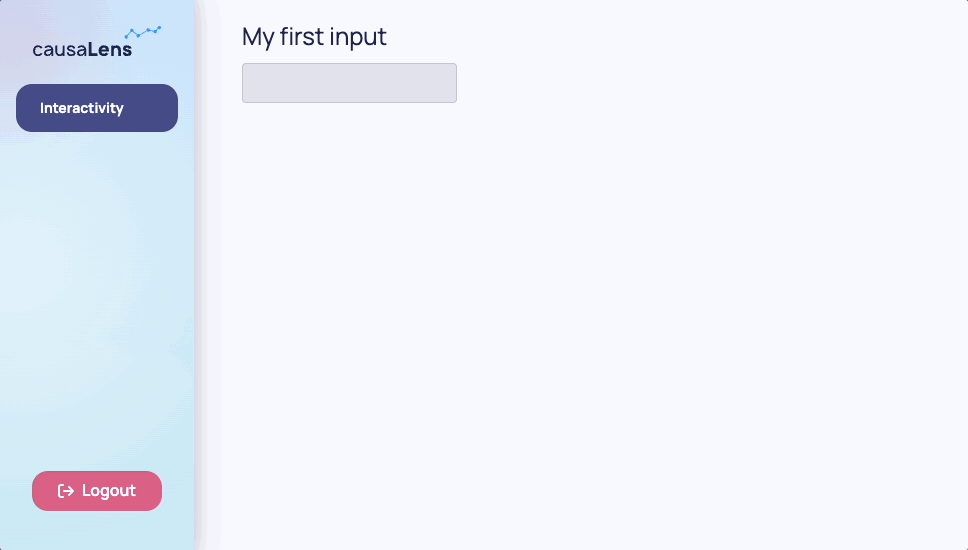
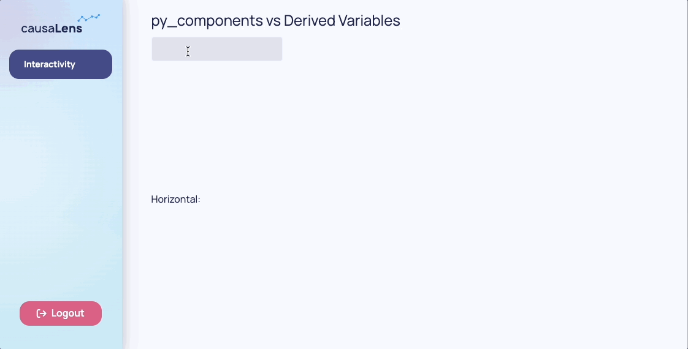
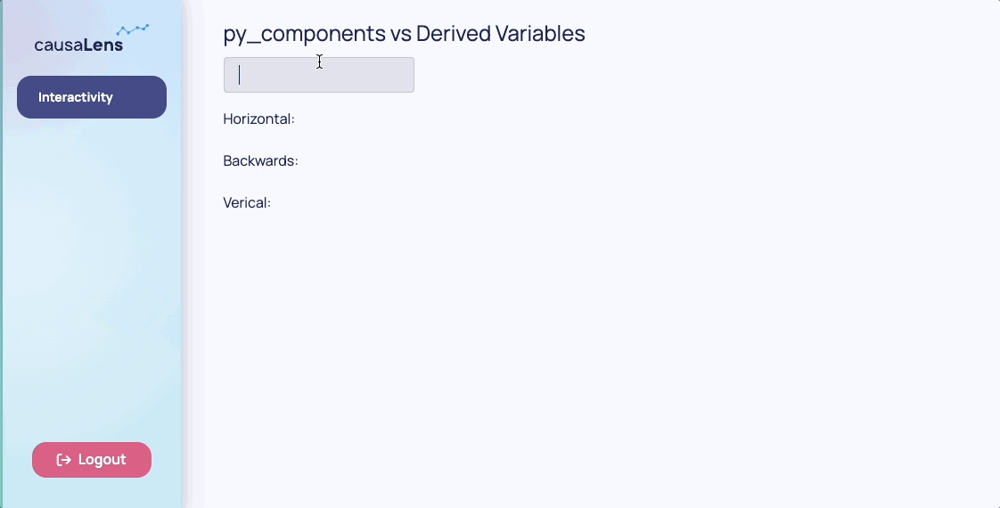

This page will introduce you to the reactivity system used in the Dara framework. The reactivity system allows you to connect parts of your app together and enable user interaction on the UI.

As underlined by the [Guiding Principles](./whats-dara#guiding-principles), to achieve as close to native web performance as possible, the framework only makes calls to the backend when absolutely necessary. The interactivity tools introduced in this page allow this type of performance.

The first tool is the `dara.core.interactivity.plain_variable.Variable`, which allow the end-user to see and interact with values in the frontend.

The second tool is the `dara.core.visual.dynamic_component.py_component` which allow you to use the current value of a single, or set of, Variable(s) to determine the components and layout present on a page.

## Variables

In this section you will walk through some different Variable types. Variables contain values that live entirely in the frontend.

### `Variable`

`dara.core.interactivity.plain_variable.Variable` is the core of Dara framework's reactivity system. It represents a dynamic value that can be read and written to by components. The state is managed entirely in the user's browser which means there is no need to call back to the Python server on each update.

```python
from dara.core import Variable

my_first_variable = Variable()
```

You can give your variable an initial `default` value of any type:

```python
my_variable_with_default = Variable(default='initial value')
```

<details>
<summary>What can you store in a <code>Variable</code>?</summary>

Values stored by a `Variable` do not have to be primitive types. They can also store JSON serializable types such as lists and dictionaries. As an example, you could store a dictionary representing application state in a single Variable:

```python
state = Variable({
    'input_value': 'Text',
    'settings': {
        'language': 'English'
    }
})
```

You could then use the .get(key) method available on `Variable` instances to specify a piece of a more complex state to pass into components. The framework will make sure to only retrieve or update the specified part of the variable.

```python
state = Variable({
    'input_value': 'Text',
    'settings': {
        'language': 'English'
    }
})

page_content = Stack(
    # Only `input_value` will be displayed
    Text(text=state.get('input_value')),
    # Only the specified property will be updated
    Input(value=state.get('input_value')),
    # You can chain the `get` calls to specify a sub-property to use
    Input(value=state.get('settings').get('language'))
)
```

</details>

:::tip
A `Variable` can be made persistent when refreshing the page by using the `persist_value` flag.
For more advanced persistence and collaboration options [check out the advanced guide](../advanced/persistence-and-collaboration.mdx).
:::

:::caution
You cannot extract values from or do operations on a `Variable` through traditional Python code.

For example, this calculation:

```
Variable(15) + Variable(5)
```

will not equal 20 and will not compile in the first place.

In the later sections of this page you will learn how to update a `Variable` and extract values from the `Variable` to perform calculations and update the frontend.

:::

### `UrlVariable`

`dara.core.interactivity.url_variable.UrlVariable` is very similar to a normal `Variable`. The only difference is that its state is stored in the URL of the page
as a query parameter, rather than being stored in the memory of the client.
This is useful to i.e. preserve state across page refreshes and providing deep links.

```python
from dara.core import ConfigurationBuilder, UrlVariable
from dara.components import Stack, Tab, TabbedCard, Text

config = ConfigurationBuilder()

# State will be stored as a query param, i.e. `...?url_value=default_value`
url_variable = UrlVariable(query='url_value', default='default_value')

page_content = Stack(
    #here selected_tab updates the state of the url_variable
    TabbedCard(
        Tab(Text('tab1 content'), title='Tab1'), Tab(Text('tab2 content'), title='Tab2'), selected_tab=url_variable
    )
)

config.add_page('Url Variable', content=page_content)
```

`UrlVariable` supports nested dictionary values with the `.get(key)` method just like a normal `Variable`.

### Interaction Through Components

As mentioned earlier, a `Variable` cannot be written to with traditional Python code. However, `Variable`s can be written to by components that enable interactivity. You were briefly introduced to these in the last section and now you will see how to use them throughout this section.

The example below shows how to use the `dara.components.common.input.Input` component to enable input from the user. The component accepts a `value`, which should be a `Variable` instance, and will allow the user to enter free text into the field. The `Input` will update the value with whatever is typed into the field.

```python
from dara.core import ConfigurationBuilder, Variable
from dara.components import Input, Heading, Stack, Text

config = ConfigurationBuilder()

my_first_variable = Variable()

page_content = Stack(
        Heading('My first input', level=2),
        Input(value=my_first_variable),
        Text(text=my_first_variable)
    )

config.add_page('Interactivity', content=page_content)
```



In the above example, whenever the `Input` field changes, it updates the value of `my_first_variable` and its value is displayed in the `Text` component. The whole process is synchronized as the value is stored entirely in the frontend so there are no calls to the Python server.

### Interaction Through Actions

The components mentioned above offer a way to directly update Variables. Another way to update Variables is through actions. Actions can be found in the core framework along with `Variable` and they work
by being passed to a component's callback parameter. A callback is simply a function that is passed as an argument to another function.

The primary way to create actions in Dara is the `@action` decorator. This decorator takes a function and returns an action that can be passed to a component's callback.
It injects an `ActionCtx` object as the first argument of the function, which contains the input sent from the component and exposes action methods to update the state of the application.

:::note

The action methods on `ActionCtx` are `async` and must be `await`-ed, so your decorated function should be `async` as well.
To learn more about `async` and `await` in Python, check out [this blogpost](https://realpython.com/async-io-python/).

:::

```python
from dara.core import action, Variable
from dara.components import Select, Item

some_variable = Variable(1)
other_variable = Variable(2)

@action
async def my_action(ctx: action.Ctx, arg_1: int, arg_2: int):
    # Value coming from the component, in this case the selected item
    value = ctx.input
    # Your action logic...

    # Update `some_variable` to `value` multiplied by 2 by arg_1 and arg_2
    await ctx.update(variable=some_variable, value=value * arg_1 * arg_2)


Select(
    items=[Item(label='item1', value=1), Item(label='item2', value=2)],
    onchange=my_action(2, other_variable)
)
```

The example above shows how to use the `@action` decorator to create an action that updates a `Variable` with the value of the selected item in a `Select` component multiplied by the static `2` argument and current value of `other_variable`.
The `@action`-decorated function can take a mixture of regular Python variables and Dara `Variable`-based arguments in any combination. The `@action` decorator will automatically resolve the `Variable`-based arguments so your function will receive the current value of the `Variable` instead of the `Variable` instance.

The `dara.components.common.button.Select` component has an `onchange` parameter which accepts an action. A valid argument to an action parameter is one of the following three options:

- An instance of an `@action`-decorated function (as in the example above).
- An instance of an individual static action object.
- A list of a combination of the above two options.

:::warning

Passing a list of `@action`-decorated functions to an action prop is deprecated and will not be supported in future versions of Dara. This is because it requires
the app to make a request to the backend server for each action in the list, which is not performant. Instead, you should use the `@action` decorator to create a single action
and compose them. Learn more about composing actions [here](./actions.md#composing-actions).

:::

One example of a static action object is the result of calling `sync` on a `Variable` or `UrlVariable` instance. This creates an action object which, when passed to an action prop,
will update the variable with the value of the input sent from the component.

```python
from dara.core import action, Variable
from dara.components import Select, Item

some_variable = Variable()

Select(
    items=[Item(label='item1', value=1), Item(label='item2', value=2)],
    onchange=some_variable.sync()
)
```

The example above shows how to use the `sync` method to create an action that updates a `Variable` with the value of the selected item in a `Select` component.
Other interactive components like `Button`s have corresponding callback parameters, e.g. `onclick`, `onchange` or similar.

In summary, to trigger an update based on user interaction simply pass an action to your component's callback. The `@action` decorator allows you to create
a complex action flow with multiple steps, control flow and error handling. For simpler use cases, you can use shortcuts like `sync` to create one-off actions for
common operations like updating a variable with the value of the input sent from a component.
To see more actions checkout the [Actions](./actions.md).

### `DerivedVariable`

As mentioned earlier, values cannot be extracted from `Variable`s with traditional Python code. However, the values of a `Variable` can be extracted and used for calculations in a `dara.core.interactivity.derived_variable.DerivedVariable`.

The primary purpose of a `DerivedVariable` is to transform a set of raw state variables from the frontend browser into a single new derived state from a calculation on the backend server. This state can then be shared into components in the same way as other `Variable`s. This is particularly useful for running expensive or long running tasks such as machine learning or data processing steps.

When defining a `DerivedVariable`, you have to specify a function and a list of `Variable`s or other `DerivedVariable`s to that function. Every time one of the specified variables changes, the function is re-run with the current values of the variables.

```python
from dara.core import Variable, DerivedVariable

x = Variable(10)
y = Variable(15)
result = DerivedVariable(lambda a, b: a + b, variables=[x, y])
```

:::info
What is going on under the hood?

1. The browser collects the state of the browser-side `Variable`s listed in the `DerivedVariable`s argument, `variables`. It does so recursively so that you can define `DerivedVariable`s based on other `DerivedVariable`s.
2. The browser then sends a single request comprising of all of these states to the backend server.
3. The server makes necessary calculations based on these values, again acting recursively so that if your `DerivedVariable` lists another `DerivedVariable` as an input, that value will be ready for the `DerivedVariable` in question.
4. Your resolved function is executed with the final raw values so that you can perform any custom Python logic involving these values.

:::

The example below will show you how `DerivedVariable`s can work with interactive components to render dynamic output based on the user's input. The example allows the user to select which features for which they would like to calculate the correlation coefficient. The output will tell them the strength and sign of the correlation.

The features are selected with the `Select` component, which takes a list of `items` to select from and a `value` in which to store the selection. What is strong and what is weak is determined by the threshold that can be set via the `Slider` component. This component takes a `domain` determining the range, a `step` determining the increment of the slider, and `values` in which to store the values the slider lands on. Similar to how you made the `Input` component in the example previously, these values will be `Variable`s.

```python
import pandas
import numpy

from dara.core import ConfigurationBuilder, Variable, DerivedVariable
from dara.components import Card, Text, Spacer, Paragraph, Select, Slider, Label

config = ConfigurationBuilder()

data = pandas.DataFrame(
    {
        'sepal_length': [5.1, 4.9, 4.7, 4.6, 5.0, 5.4, 4.6, 5.0, 4.4, 4.9, 5.4, 4.8, 4.8],
        'sepal_width': [3.5, 3.0, 3.2, 3.1, 3.6, 3.9, 3.4, 3.4, 2.9, 3.1, 3.7, 3.4, 3.0],
        'petal_length': [1.4, 1.4, 1.3, 1.5, 1.4, 1.7, 1.4, 1.5, 1.4, 1.5, 1.5, 1.6, 1.4],
        'petal_width': [0.2, 0.2, 0.2, 0.2, 0.2, 0.4, 0.3, 0.2, 0.2, 0.1, 0.2, 0.2, 0.1],
    }
)

def correlation(x, y, threshold):
    corr = numpy.corrcoef(data[x], data[y])[0, 1]
    if abs(corr) >= threshold:
        strength = 'strongly'
    else:
        strength = 'weakly'

    if corr > 0:
        sign = 'positive'
    else:
        sign = 'negative'
    return f'{strength} {sign}'


selected_x = Variable('petal_length')
selected_y = Variable('petal_width')
strength_threshold = Variable([0.5])

corr_xy = DerivedVariable(correlation, variables=[selected_x, selected_y, strength_threshold])

page_content = Card(
    Spacer(),
    Select(value=selected_x, items=[*data.columns]),
    Spacer(),
    Select(value=selected_y, items=[*data.columns]),
    Spacer(),
    Label(Slider(value=strength_threshold, domain=[0, 1], step=0.1), value='Strength Threshold:'),
    Paragraph(
        Text('The correlation of '),
        Text(selected_x, bold=True),
        Text(' and '),
        Text(selected_y, bold=True),
        Text(' is '),
        Text(corr_xy, bold=True),
    ),
    title='Using Derived Variables with Interactive Components',
)

# Adding page
config.add_page(name='Interactivity', content=page_content)
```


There are several more advanced configuration options available on a `DerivedVariable`. One advanced setting is the `deps` parameter. This parameter gives you control over when the recalculation of the `DerivedVariable` happens.

The possible values are:

- `None`: (the default) the function specified in a `DerivedVariable` is rerun each time any of its dependant variables change
- A list of variables: (subset of all variables used by the function) the function specified in a `DerivedVariable` is rerun only when these specified variables change
- `[]`: the variable will only calculate its value on page load which could be useful in combination with the next advanced feature, a `trigger`

```python
x = Variable(10)
y = Variable(15)

def expensive_computation(x, y):
    value = # Some complex computation...
    return value

# Only 'x' changing will trigger a re-calculation; all updates to 'y' will be ignored
result = DerivedVariable(expensive_computation, variables=[x, y], deps=[y])
```

In this example, `result` will only be recalculated when `y` is updated.

:::caution
It is important to note that it is _not_ possible to update a `DerivedVariable` directly. Its value can only be changed if one of its dependant variables changes. This is because a `DerivedVariable` is a read-only piece of derived state.
:::

As shown earlier, interactive components often take functions or callbacks, called actions, as parameters to specify what should happen upon some user interaction. The `DerivedVariable` provides a helper method `trigger` which returns a ready-to-use action that forces the `DerivedVariable` to recalculate with the current values of its variable list.

To continue the described scenario:

```python
x = Variable(10)
y = Variable(15)

def expensive_computation(x, y):
    value = # Some complex computation...
    return value

# result will calculate on page load
result = DerivedVariable(expensive_computation, variables=[a, b], deps=[])

# result will only be recalculated when this button is clicked
layout = Stack(
    ...
    Button('Calculate', onclick=result.trigger())
)
```

This feature is useful in a scenario when the computation is very expensive and takes multiple inputs. It should not be rerun every time a user changes one of the settings as you would want to group the updates together.

<details>
<summary><h3 style={{margin: '0px 0px 0px 0px'}}> Tasks:<code>DerivedVariables</code> with Heavy CPU Calculations</h3></summary>

CPU bound calculations are calculations that require intensive processing. Typically this will include machine learning calculations or expensive data manipulations. These calls block not only the thread they are running on, but all the other threads of the webserver as well. This is due to python's GIL (Global Interpreter Lock) and if you want to avoid this then you need to offload these calculations to separate processes, or even to another machine if you have it available. You can learn more about python's Global Interpreter Lock [here](https://docs.python.org/3/c-api/init.html#thread-state-and-the-global-interpreter-lock).

Offloading computation to another process can get complicated fairly quickly, so Dara provides an easy way define certain functions as tasks that can be offloaded to another process outside the main one running your web app.

To use this feature you must put the definition of the `DerivedVariable`'s resolver into a file of your choice.

```python title=my_app/tasks.py
def task_func(var1, var2):
    """ Mock task function """
    result = # some expensive calculation
    return result

```

You should then import the resolver function where you need it. You also need to set `run_as_task` to `True` on the `DerivedVariable` you are working with. This tells the app to spin up another process to run this function. You also need to set the `task_module` property on the config which specifies the name of the module where your task resolver functions are located.

```python title=my_app/main.py
from my_app.tasks import task_func
...

my_var1 = Variable()
my_var2 = Variable()
results = DerivedVariable(
    task_func,
    variables=[my_var1, my_var2],
    run_as_task=True
)

@py_component
def display_results(results):
    # Do something with the results here and return some dashboarding components based on the results.
    return Stack(
        ...
    )

config.add_page('Expensive Calculation Results', display_results(results))

config.task_module = 'my_app.tasks'
```

:::tip
If you have long-running tasks, it helps to let the end-user know the progress through a progress bar. This utilizes the `track_progress` feature of `py_component`s or is set in Dara components directly. Check out [**Advanced: Progress Tracking**](../advanced/progress-tracking) to learn more.
:::

</details>

#### `Variable.create_from_derived`

`DerivedVariable`s represent the result of a computation and are read-only. They can only be modified by changing one of their input variables. However, you may want to use the value of a `DerivedVariable`as a starting point for a mutable `Variable` that users can modify.

You can achieve this using the `dara.core.interactivity.plain_variable.create_from_derived` static method on the `Variable` class. It creates a new `Variable` instance that is initially bound to the `DerivedVariable` passed as an argument. The resulting `Variable` will be mutable, like any other `Variable`. At first, it will mirror the value of the `DerivedVariable`. Once it's explicitly modified, e.g. by a component or an action, it will stop mirroring the `DerivedVariable` value.

```python
from cai_causal_graph import CausalGraph
from dara.components import CausalGraphViewer
from dara.core import DerivedVariable, Variable

def compute_causal_graph(...) -> CausalGraph:
    return CausalGraph(...)

# read-only computed CausalGraph
computed_cg = DerivedVariable(compute_causal_graph, variables=[...])

# mutable copy
mutable_cg = Variable.create_from_derived(computed_cg)

# use the mutable copy for the viewer so the up-to-date value can be used elsewhere
CausalGraphViewer(causal_graph=mutable_cg)
```

The example above demonstrates a common use case for `Variable.create_from_derived` with editor-like components. The initial value for the user to interact with, in this case a `CausalGraph` instance, is computed using a `DerivedVariable`. To make this value editable, you create a mutable copy using `Variable.create_from_derived` and pass it to the `CausalGraphViewer`. This enables the user to update the `mutable_cg` variable, which can also be used elsewhere to represent the current editor state, while keeping `computed_cg` as the original `CausalGraph`.

To revert the `Variable` back to its initial state, use the `ResetVariables` action to re-bind it to the `DerivedVariable` it was created from.

```python
from dara.core import ResetVariables
from dara.components import Button

Button('Reset', onclick=ResetVariables(variables=[mutable_cg]))
```

After resetting the `Variable` will mirror the `DerivedVariable` it was created from until it is modified once more. This means that if the `DerivedVariable` has changed since the `Variable` was last bound to it, the `Variable` will now reflect the latest value of the `DerivedVariable` after the reset.

#### Caching

The results of a `DerivedVariable` are cached on the backend server. So, when a `DerivedVariable` is called with values of arguments it has already been called with in the past, there does not need to be a re-calculation.

There are different levels of caching that a `DerivedVariable` can offer and you can specify your choice in the `DerivedVariable`'s `cache` argument. The different levels of caching are defined in the `CacheType` enumeration.

```python
from dara.core import CacheType

results = DerivedVariable(
    task_func,
    variables=[my_var1, my_var2],
    run_as_task=True,
    cache=CacheType.GLOBAL
)
```

You have the following options for caching your `DerivedVariable`s:

- `CacheType.GLOBAL`: (default setting) calculation results are stored in a global cache across all users and are able to be reused if a calculation is invoked with the same set of arguments
- `CacheType.SESSION`: behaves similarly to `global` with the only difference being that calculation results are cached per session
- `CacheType.USER`: behaves similarly to `session` with the only difference being that calculation results are cached per user across sessions/logins
- `None`: disables caching and causes the `DerivedVariable` calculation to be reran every time.

Global caching enables the best performance. The further you go down the list, the more you will have your `DerivedVariable`s being recalculated.

:::note
The `trigger` method takes an optional `force` argument specifying whether you want the forced recalculation to also act as a _cache buster_ , replacing the values stored in the cache and essentially ignoring the caching settings specified on the variable. The default of `force` is True.
:::

In addition to the cache `type`, you can also specify the `policy` to use, which determines how items are retained or evicted from the cache.The default policy is an `LRU` (Least Recently Used)
cache with a maximum size of 10 items (globally, or per user/session depending on the `CacheType` set). For a detailed explanation of the available cache policies and how to use them,
refer to [Cache Policies Documentation](../advanced/cache-policies.mdx).

## `py_component`

The `py_component` function is a decorator and is the primary method of creating a dynamic layout based on the current state of an application's variables.

It is similar to a `DerivedVariable` in that it is a derived state from the backend server based on the values in the frontend. It is different though in that it returns a component to render in the frontend instead of just a value.

The decorated function can take a mixture of regular python variables and Dara `Variable`-based arguments in any combination.
This flexibility makes it ideal for creating reusable visual components to use within your application.

Similar to `DerivedVariable`s, any `py_component`-decorated function will only be rerun when one of its input variables changes.

```python
@py_component
def FormattedNumber(number: int, symbol: str):
    # number is a regular value here
    formatted = f'{symbol}{number}.00'
    return Text(text=formatted)

number_variable = Variable(20)
symbol_variable = Variable('$')

config.add_page('First Page', FormattedNumber(number_variable, '£'))
config.add_page('Second Page', FormattedNumber(150, '£'))
config.add_page('Third Page', FormattedNumber(number_variable, symbol_variable))
```

<details>
<summary>What is a python decorator?</summary>

Decorators allow you to add new functionality to an existing object without modifying its structure.

If you have the following function:

```python
def calculate_ratio(numerator: int, denominator: int):
    return float(numerator) / float(denominator)
```

You can define a decorator which wraps the function passed into it and makes it a percentage by multiplying it by 100.

```python
def make_percent(function):
    def wrapper():
        result = function()
        return f'{result * 100}%'

    return wrapper
```

The decorator takes a function as an argument so you can do the following:

```python
calculate_percent = make_percent(calculate_ratio)
calculate_percent(5, 10)

>>> 50%
```

This is a valid way to decorate a function but python provides an easier way to apply decorators with the @ symbol before the function you want to decorate.

```python
@make_percent
def calculate_ratio(numerator: int, denominator: int):
    return float(numerator) / float(denominator)

calculate_ratio(5, 10)

>>> 50%
```

You can learn more about decorators in [python's docs](https://docs.python.org/3/glossary.html#term-decorator).

</details>

:::tip
What is going on under the hood? The `py_component` decorator is extracting the values out of the `Variable`s or `DerivedVariables` that were passed into it so you can work with the raw values and perform logic with them.
:::

A `py_component` decorator can also be configured to specify:

- A `fallback` component to render whilst waiting for the component to be rendered. See [**Loading States**](../advanced/loading-states) for more information.
- A `polling_interval` causing the component to poll the backend and refresh itself every `n` seconds
- A `track_progress` flag to indicate whether progress tracking is enabled or not, defaulting to `False`. This is turns the fallback component into a progress bar if the component is waiting for a long-running task to complete. See [**Progress Tracking**](../advanced/progress-tracking) for more information.

You only need a `py_component` if you need to extract the values from `Variable`s for rendering a dynamic layout based on the value in the `Variable`. You do not have to unwrap `Variable`s if you just want to pass them to a component that accepts variables directly like `Text`.

:::tip
You should abstract any heavy logic in a `py_component` logic to a `DerivedVariable` when possible for better performance and code structure. Check out [**Best Practices: Light PyComponents**](../best-practices/light-pycomponents) to learn more.
:::

## `DerivedVariable` vs `py_component`

It may be that you are unsure of which to use, and the answer may often be a combination of both!
`DerivedVariable` and `py_component` are similar in the way that they both will calculate something based on other `Variable`-type values.
The key difference is that a `py_component` returns a **component** whereas `DerivedVariable` is used to recalculate a **value**.

The example below is aimed at illustrating how these might work together. The user will input some text, stored in a `Variable` called `input`.

```python title=main.py
from dara.core import ConfigurationBuilder, Variable
from dara.components import ComponentInstance, Heading, Input, Stack, Text

# config
config = ConfigurationBuilder()

user_input = Variable('')


def page_content() -> ComponentInstance:
    return Stack(
        Heading('py_components vs Derived Variables', level=2),
        Input(value=user_input),
    )


config.add_page(name='Interactivity', content=page_content())
```

You will be tasked with displaying `input` horizontally, vertically and backwards, displaying how and when to use `DerivedVariable` and `py_component`:

1. **Horizontal**

This is the simplest case. You just need to show the `Variable` value as is.

```python
...

user_input = Variable('')

def page_content() -> ComponentInstance:
    return Stack(
        Heading('py_components vs Derived Variables', level=2),
        Input(value=user_input),
        Stack(Text('Horizontal:'), Text(user_input), direction='horizontal'),
    )

config.add_page(name='Interactivity', content=page_content())
```



2. **Backwards**

To display the text backwards you need to transform the string. This involves changing the **value** of the string so in this case you would use a `DerivedVariable`.

```python
from dara.core import Variable, DerivedVariable
...

user_input = Variable('')
backwards_input = DerivedVariable(lambda text: ''.join(reversed(text)), variables=[user_input])

def page_content() -> ComponentInstance:
    return Stack(
        Heading('py_components vs Derived Variables', level=2),
        Input(value=user_input),
        Stack(Text('Horizontal:'), Text(user_input), direction='horizontal'),
        Stack(Text('Backwards:'), Text(backwards_input), direction='horizontal'),
    )

config.add_page(name='Interactivity', content=page_content())
```


3. **Vertical**

In this case you will choose to loop through each letter of the input text and add each letter as a separate `Text` component so that they can be placed vertically in a `Stack`. Because you want a varying **layout**, you must use the `py_component`-decorator.

```python
from dara.core import Variable, DerivedVariable, py_component
...

user_input = Variable('')
backwards_input = DerivedVariable(lambda text: ''.join(reversed(text)), variables=[user_input])

@py_component
def my_py_component(input_str: str) -> ComponentInstance:
    # returns a varying component based on the input Variable
    vertical_text = Stack(padding='50px')
    for letter in input_str:
        vertical_text.append(Text(letter))
    return vertical_text

def page_content() -> ComponentInstance:
    return Stack(
        Heading('py_components vs Derived Variables', level=2),
        Input(value=user_input),
        Stack(Text('Horizontal:'), Text(user_input), direction='horizontal'),
        Stack(Text('Backwards:'), Text(backwards_input), direction='horizontal'),
        Stack(
            Text('Verical:'),
            my_py_component(user_input),
        ),
    )

# Adding page
config.add_page(name='Interactivity', content=page_content())
```



## Architecture Summary

As mentioned in the introduction, Dara enables a close-to-native web app performance by offloading as much logic as possible into the browser. This optimization results in the app not needing to call into the server every time you want to change something on the screen.

This close-to-native performance is achieved by the concepts in this page. `Variable`s are updated in the frontend browser so they do not require server involvement. Server-side logic is handled by `DerivedVariable`s and `py_component`s with the main difference being `DerivedVariable`s are a derived state that represent a value while `py_component`s are a derived state that represent a component to be rendered in the frontend. `DerivedVariable`s are also better equipped to handle computationally expensive tasks.

:::info
As mentioned, `DerivedVariable`s and `py_components` unwrap `Variable`s to expose their values. This has some caveats due to the architecture. Check out [**Best Practices: Retaining Correct Variable Types**](../best-practices/retaining-correct-variable-types) to learn more.
:::

## Next Steps

So far you have learned how to handle your app's information and interactivity. A common source of information within an app is a dataset. Within the Dara framework, there are special kinds of variables to optimally handle datasets. You will learn about those in the next section.
