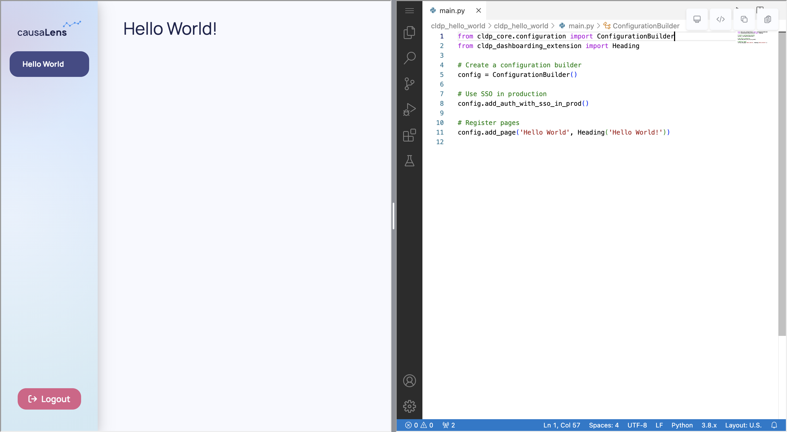

import Tabs from "@theme/Tabs";
import TabItem from "@theme/TabItem";

This page will walk you through the installation of Dara framework and the creation of a simple 'Hello World' app.

## Requirements

There are two prerequisites to being able to use the Dara framework:

- Python v3.8+
- NodeJS v14+ (Don't worry you don't need to understand any JS, this is used to build the application in production mode)

You can install both of these via the Homebrew package manager on MacOS or follow the instructions on their
websites: [Python](https://www.Python.org/about/gettingstarted/) [node](https://nodejs.org/en/).

Once you have these tools installed the best way is to create a Python virtual environment or start a new
Python Poetry project so that our dependencies don't conflict with anything you have installed on your wider system.

## Installation - Starting a new project

There are two methods in which you can start a new Dara project:

- The first is through using the CLI for creating apps.
- The second is by manually starting a project with `poetry` or `pip`.

<Tabs
    defaultValue="cli"
    values={[{label: 'CLI Quickstart', value: 'cli'}, {label: 'Poetry Quickstart', value: 'Poetry'}, {label: 'Pip Quickstart', value: 'pip'}]}
>
<TabItem value="cli">

The CLI can be installed globally with the help of the `pipx` package which installs it in an isolated virtual environment and makes it available just like any other global binary.

`pipx` installation instructions [are available here](https://pypa.github.io/pipx/installation/) but the short version is:

```bash
python3 -m pip install --user pipx
python3 -m pipx ensurepath
```

You might need to **restart your terminal** after installing `pipx`. The `ensurepath` command adds necessary directories to your `PATH`, the changes might not be reflected in your terminal until you restart it.

To install the CLI globally with the `pipx` package, run the following command:

```bash
pipx install create-dara-app
```

You should see a message saying that the CLI has been installed successfully. Check that the CLI is available by running the following command:

```bash
create-dara-app --version
```

</TabItem>

<TabItem value="Poetry">

Poetry can be installed following these [instructions](https://Python-Poetry.org/docs/basic-usage/). You can
then create a new Poetry project with the following command in your project's directory:

```sh
poetry init
```

This command will guide you through creating your `pyproject.toml` config.

:::warning
When following the prompts, you can simply hit enter for most however when prompted for the `Compatible Python versions` please enter `>=3.8.0, <3.12.0`.

```sh
Compatible Python versions [^3.8]:  >=3.8.0, <3.12.0
```
This is necessary because Dara libraries support python versions `>=3.8.0, <3.12.0`.
:::

The contents of the `pyproject.toml` will be something like the following:

```toml
[tool.poetry]
name = "<your-app-name>"
version = "0.1.0"
description = ""
readme = "README.md"
packages = [{include = "<your-app-name>"}]

[tool.poetry.dependencies]
python = ">=3.8.0, <3.12.0"


[build-system]
requires = ["poetry-core"]
build-backend = "poetry.core.masonry.api"
```

As the `readme` field is set to `"README.md"`, you will want to make sure to have a `README.md` file in your directory. This file can be empty to start with and you can fill it out at a later time with important information about the app. You will now have the following file structure:

```
- <your-app-name>/
    - pyproject.toml
    - README.md
```

Now that you have initiated your Poetry project, you can install it with the following:
```sh
poetry install
```

You are now ready to add the core of the Dara framework:

```sh
poetry add dara-core --extras all
```

</TabItem>

<TabItem value="pip">

You can create a virtual environment with the following command:

```sh
python3 -m venv dara_venv
```

This will create a virtual environment in your current working directory. You can then activate that environment with
the following command:

```sh
source dara_venv/bin/activate
```

You are now ready to install the core of the Dara framework:

```sh
pip install dara-core[all]
```

</TabItem>
</Tabs>

## Building your app

The following will go through two examples of building a simple app - one using the `create-dara-app` command line interface and the other using Poetry manually.

<Tabs
    defaultValue="cli"
    values={[{label: 'CLI Quickstart', value: 'cli'}, {label: 'Manual Quickstart', value: 'manual'}]}
>
<TabItem value="cli">

If you have installed the `create-dara-app` package, you can follow these instructions.

`create-dara-app` creates an app with two pages. The first page is an introductory page with a welcome message, and the second page is a gallery of components, providing a simple example of how to use each component offered in `dara-components`.

```
- <your-app-name>/
    - <your_app_name>/
        - pages/
            - intro_page.py
            - components_page.py
        - utils/
            - components.py
            - template.py
        - main.py        
    - pyproject.toml
    - README.md
```

To create this app run the following command:

```bash
create-dara-app
```

</TabItem>
<TabItem value="manual">

If you have set up your project manually with Poetry or pip, you should follow these instructions.

Create another folder in your project with the same name as the project itself. Within the folder add two empty files, one called `__init__.py` and the other called `main.py`. You will have the following file structure:

```
- <your-app-name>/
    - <your_app_name>/
        - __init__.py
        - main.py
    - pyproject.toml
    - README.md
```

:::warning
The folder cannot have hyphens, and therefore you must substitute `-` for `_`. For example, the `first-dashboard` project will have a `first_dashboard` subfolder.
:::

Now you can start coding your app. In `main.py`, copy the following contents into it:

```python title=<your-app-name>/<your_app_name>/main.py
from dara.core import ConfigurationBuilder
from dara.components import Heading

# Here you initialize the app config, which uses a Builder pattern to
# build up the app piece by piece.
config = ConfigurationBuilder()

# Here you add a single page to the application, with a title of 'Hello World'
# and the text 'Hello World!' on the page.
config.add_page('Hello World', Heading('Hello World!'))
```

:::note
Dara expects configuration to be available as a `config` variable in `{root_package}/main.py` by default.

As an example, in a project called `test-application`
your code should be in `(...)/test-application/test_application/main.py`. Take note of the dash being replaced by an underscore in the package name.

The default behavior can be overridden using the `--config` CLI flag.
:::

</TabItem>
</Tabs>

### Running your application

Once you've got your project setup, you will want to run the application so you can see your application in action. This can be done with a single command from the root of your project:

<Tabs
    defaultValue="Poetry"
    groupId="packageManager"
    values={[ {label: 'Poetry', value: 'Poetry'}, {label: 'Pip', value: 'pip'}]}
>

<TabItem value="Poetry">

If you have used the CLI you can skip this step, as it automatically installs the dependencies. Otherwise install the dependencies:

```sh
poetry install
```

To start the app:

```sh
poetry run dara start --reload
```

</TabItem>
<TabItem value="pip">

Within the `venv` created earlier then:

```sh
dara start --reload
```

</TabItem>
</Tabs>

:::tip
The `--reload` flag here will cause it to automatically reload the backend and UI whenever any changes are made and saved.
:::

This command will start a local development server and will start your application at `http://localhost:8000`.

If you have used the `create-dara-app` CLI, your app will look like the following:


If you have set up your app manually, your app will look like the following:

