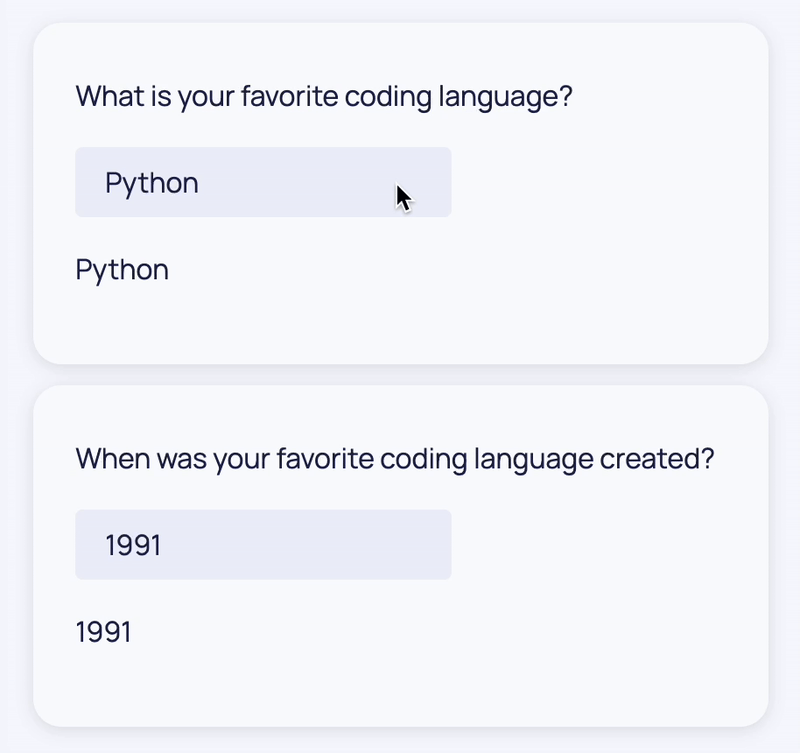

Welcome to the documentation for building decisionApps, for this you will be using the Dara framework (also known as decisionApp SDK). These pages will give you an introduction to the low-code application framework and help you along your first steps to making beautiful apps in no time at all.

Dara is a low-code application framework that is different in architecture and usability but similar in purpose to Plotly Dash, Streamlit and Shiny. It's designed to make dashboards and apps quickly using tools that you are already familiar with.

## Why Make Another Application Framework?

The alternative solutions have a few persistent issues in the design of their frameworks. Other frameworks:

- Offer a fixed set of components disabling any kind of flexibility and experimentation.
- Have a steep learning curve and poor performance as the complexity increases.
- Are hampered by their requirement to call back to the Python server for even the simplest update or interaction. This significantly dampens performance when dashboards are shared between multiple users.
- Are too focused on dashboarding, without any sort of programmatic access into the framework.

As a result Dara was built with principles to address these issues and make a powerful decision making framework.

### Guiding Principles

- **Extensible:** Dara has extensibility at its core and extending the system should be as simple as building a dashboard.
- **Smooth learning curve and maintainable:** Going from simple dashboards with no user interaction to complex multi-page apps, with lots of interaction points, is straightforward while keeping the code maintainable.
- **Native web app performance:** The framework has close to native web app performance and only makes calls back to the Python backend when it really needs to.
- **API access:** The framework supports the creation of simple APIs so that automated processes or advanced users can access the same functionality as the dashboard without multiple solutions.

## The Solution

Following the principles set out above, the framework runs on top of industry standard
open source tools including FastAPI, Pydantic and React. At its core, the framework is a FastAPI server, with an optional React based UI in front of it. The core is designed to provide the bare minimum functionality and make no assumptions about what you wish to do with the framework.

The simplest app you can make with Dara is the following:

```python
from dara.core import ConfigurationBuilder

config = ConfigurationBuilder()
```

### Extensibility

Installing `dara-core` will allow you to create the app above, however there will be no dashboard or functionality. Every piece of Dara, apart from the core framework engine, is distributed as an extension to the core. This means that you can pick and choose what you need with no bloat from components you'll never use. Because extensibility is a first class citizen in the framework, it is easy to write your own extensions or plugins and share them with the rest of your team!

The pre-built extensions range from simple UI components to Bokeh plotting, graph editing, data handling, and more.

### Near Native Performance

The defining feature of the framework is how it approaches the interaction between the UI and the server. In typical low-code dashboarding solutions, all of the logic for updating the UI is handled by the python code the user writes. This results in poor performance and can make the most simple app in concept, be very complicated in code.
Dara attempts to encode the desired behavior of the user back to the UI without requiring multiple trips to the backend server.

As a simple example of the issue, consider having a single user input and a text field that shows the current value of that input. If you need to callback to the backend after every keystroke, it is going to add significant load to the backend for a trivial interaction. A less naive approach could use a throttle, only sending the keystrokes once the user has finished typing. While better than the first approach, this second approach would cause your app to lose the feeling of a native web application that is responsive to user interactions. In Dara, this kind of interaction cycle happens entirely in the user's browser to avoid swamping the backend. Dara's approach results in an experience similar to a native web application unlike the first two approaches.

Despite this advanced architecture, Dara is simple to use. It was designed with you as an application builder in mind.

The API that resulted is as follows:

```python
from dara.core import Variable
from dara.components import Input, Card, Text

def example():
    language = Variable('Python')  # This defines a Variable object that will be used to link fields together

    return Card(
        Text('What is your favorite coding language?'),
        Input(value=language), # Here the input takes in the current value and allows for it to be updated through the user's keyboard
        Text(language) # Here the text component simply displays the value
    )
```


### Reusability

The `example` function above uses pre-built components from one of Dara's extension packages. However, the `example` function can also be thought of as a component itself since it returns a component. Thinking in terms of components can enable your applications to be as low-code as you want them to be.

For example, you might want ask another question and have a different default answer that corresponds to the question.

You can define the following, similar to the previous `example` function:

```python
from dara.core import Variable
from dara.components import Input, Card, Text

def example(question: str, default_answer: str):
    language = Variable(default_answer)

    return Card(
        Text(question),
        Input(value=language),
        Text(language)
    )
```

And you can call it as a newly created component as follows:

```python
example('What is your favorite coding language?', 'Python')
example('When was your favorite coding language created?', '1991')
```



Components being customizable and reusable results in powerful extensibility and minimal code solutions.

## Next Steps

You can learn more about these principles and how to build your own app in the [tutorial](./local-setup.mdx).
