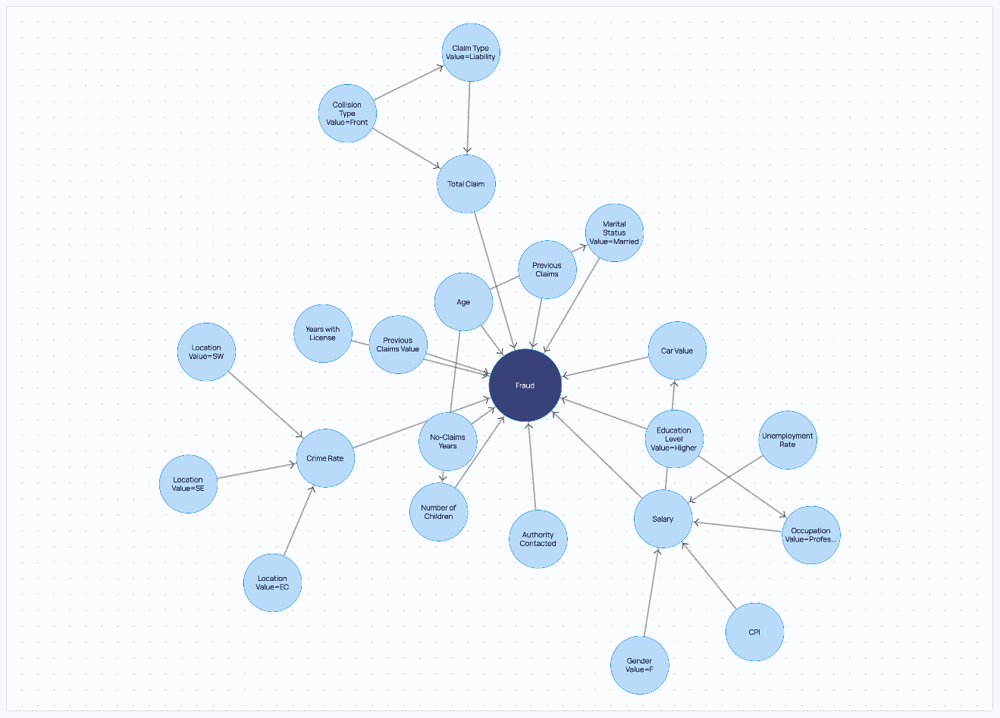
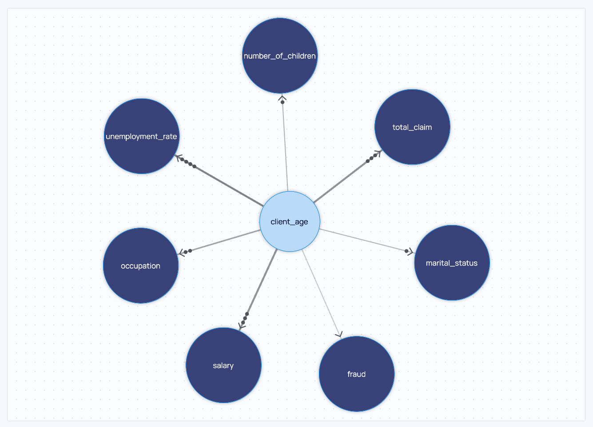
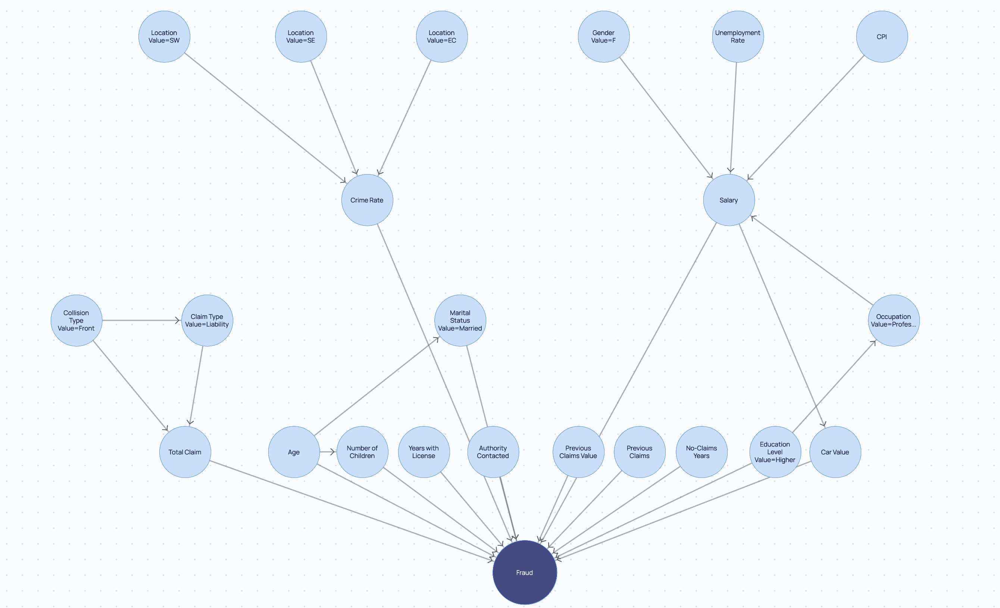
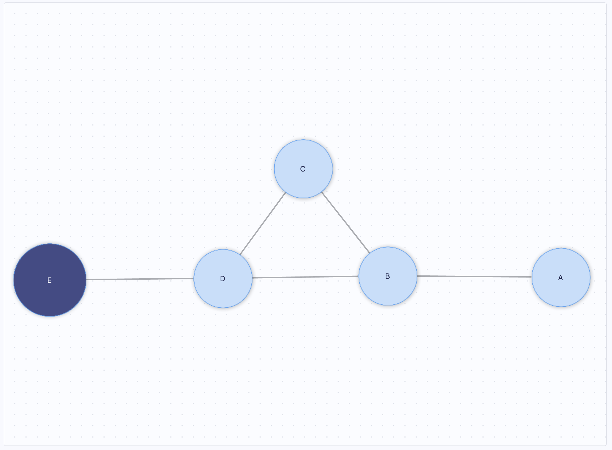

## Overview

This extension contains all the the components used to display causal graphs.

## Add your first Causal Graph

Below we are going to show an example of how to add a `dara.components.graphs.components.causal_graph_viewer.CausalGraphViewer` component.

```python
from dara.components import CausalGraphViewer
from dara.core import ConfigurationBuilder, get_icon, ComponentInstance
from cai_causal_graph import CausalGraph

# Creates a CausalGraph
def default_causal_graph() -> CausalGraph:
    # instantiate CausalGraph
    cg = CausalGraph()

    # Create edges
    cg.add_edge('Age', 'Fraud')
    cg.add_edge('Age', 'Marital Status Value=Married')
    cg.add_edge('Age', 'Number of Children')
    cg.add_edge('Authority Contacted', 'Fraud')
    cg.add_edge('CPI', 'Salary')
    cg.add_edge('Car Value', 'Fraud')
    cg.add_edge('Claim Type Value=Liability', 'Total Claim')
    cg.add_edge('Collision Type Value=Front', 'Claim Type Value=Liability')
    cg.add_edge('Collision Type Value=Front', 'Total Claim')
    cg.add_edge('Crime Rate', 'Fraud')
    cg.add_edge('Education Level Value=Higher', 'Fraud')
    cg.add_edge('Education Level Value=Higher', 'Occupation Value=Professional')
    cg.add_edge('Gender Value=F', 'Salary')
    cg.add_edge('Location Value=EC', 'Crime Rate')
    cg.add_edge('Location Value=SE', 'Crime Rate')
    cg.add_edge('Location Value=SW', 'Crime Rate')
    cg.add_edge('Marital Status Value=Married', 'Fraud')
    cg.add_edge('No-Claims Years', 'Fraud')
    cg.add_edge('Number of Children', 'Fraud')
    cg.add_edge('Occupation Value=Professional', 'Salary')
    cg.add_edge('Previous Claims', 'Fraud')
    cg.add_edge('Previous Claims Value', 'Fraud')
    cg.add_edge('Salary', 'Car Value')
    cg.add_edge('Salary', 'Fraud')
    cg.add_edge('Total Claim', 'Fraud')
    cg.add_edge('Unemployment Rate', 'Salary')
    cg.add_edge('Years with License', 'Fraud')

    return cg


# config
config = ConfigurationBuilder()

# adds causal graph viewer
def causal_graph_viewer_content() -> ComponentInstance:
    return CausalGraphViewer(
        causal_graph=default_causal_graph()
    )


config.add_page(name='CausalGraph', content=causal_graph_viewer_content(), icon=get_icon('diagram-project'))
```



_`CausalGraphViewer` component_

## Customising Causal Graph Viewer

### Rendering properties

The rendering of nodes and edges can be customised via the `rendering_properties` metadata. The following properties are available:

`edge.meta.rendering_properties`:

- `accepted: boolean` - whether edge was accepted (used by resolver component)
- `color: string` - edge color
- `description: string` - description/note displayed in side panel
- `forced: boolean` - whether edge was forced by constraints from domain knowledge
- `thickness: number` - edge thickness; provided values are normalized and scaled across all edge thicknesses provided
- `tooltip: string | dict[string, string]` - extra information to display in tooltip

`node.meta.rendering_properties`

- `color: string` - node color, defaults to `Theme.colors.background` for latent nodes, `Theme.colors.secondary` for output nodes and to `Theme.colors.blue4` for other nodes
- `highlight_color: string` - color used for border and selected shadow, defaults to `Theme.colors.primary`
- `label: string` - human-readable alternative label to display instead of the node name
- `label_color: string` - node font color
- `label_size: string | number` - node font size
- `latent: boolean` - whether the node is latent; if not provided, computed based on `available_inputs` property
- `size: number` - node radius in pixels
- `tooltip: string | dict[string, string]` - extra information to display in tooltip
- `x: number` - x position of node
- `y: number` - y position of node

The metadata can be set in the following way:

```python
from cai_causal_graph import CausalGraph

# Creates a CausalGraph
def graph_with_meta() -> CausalGraph:
    cg = CausalGraph()

    cg.add_node('client_age', meta={'rendering_properties': {
        'color': 'red',
        'label': 'Age',
        'label_color': 'pink',
        'label_size': 12,
        'latent': False,
        'size': 10,
        'tooltip': 'Age of the client'
    }})

    cg.add_edge('client_age', 'fraud', meta={'rendering_properties': {
        'color': 'blue',
        'description': 'This is a note which can also be edited via the UI',
        'thickness': 1,
        'tooltip': 'Connection between age and fraud'
    }})

    return cg
```

### Graph Legend

By default the graph has a legend which is dependent on the current `editor_mode` selected for that graph. You can gain control over these in two ways:

- You can add to the legends already present with the `additional_legends` property. This accepts an array of legends as can be seen in the example below.
- Alternatively you can alter the prepopulated legends by passing `default_legends`. This accepts a dict of editor_mode to array of legends.

#### Legend types

There are three kinds of legends which can be added to the graph. Below you will find each kind and the properties they possess.

##### `Legend.Spacer`

Spacers can be used to create a space in between sections of your legend. For example to separate node related legends to edge related ones.
What it means is that it will not display a symbol. You may still write a label for it.

- `label: string` - Optional label to show in the legend

##### `Legend.Node`

Displays a node symbol, this can be useful to explain what different colors of nodes might mean to an user.

- `label: string` - Optional label to show in the legend
- `color: string` - Optional color to fill the node symbol in the legend, defaults to theme.blue4
- `highlight_color: string` - Optional color for the node symbol rim in the legend, defaults to theme.primary

:::tip

When configuring the color properties for legends, the following are supported:

**Standard Colors** - You can use common color formats such as named colors ('red', 'blue', etc.),
hexadecimal values ('#ff0000', '#0000ff'), RGB ('rgb(255, 0, 0)'), or any other CSS-compatible color specification.
This is ideal for specific, custom color requirements.

**Themed Colors** - These are specified with a `theme.` prefix, followed by the color key from the currently active theme palette.
For example, `theme.primary`, `theme.secondary`, or any other predefined theme color. If the app has the light theme set these would be
the primary, secondary of the Light theme. If the app was using the dark theme, then the dark theme equivalents would have been picked up.
Or even if a custom theme was setup for the app the colors which had those names would be the ones selected by the legend.

:::

##### `Legend.Edge`

Displays a node symbol, this can be useful to explain what different colors of nodes might mean to an user.

- `label: string` - Optional label to show in the legend
- `color: string` - Optional color for the edge symbol in the legend, defaults to theme.grey5
- `arrow_type: ArrowType` - One of none, normal, filled, empty, soft. It is an optional edge/arrow head to show at end of line, defaults to normal
- `center_symbol: CenterSymbol` - One of none, cross, question, bidirected. It is an optional symbol to show at the center of the edge, defaults to none
- `dash_array: string` - Optional [stroke-dasharray](https://developer.mozilla.org/en-US/docs/Web/SVG/Attribute/stroke-dasharray) SVG path property - line will be dashed if specified

### Legend Examples

#### `additional_legends` Example

```python
from dara.core.configuration import ConfigurationBuilder
from cai_causal_graph import CausalGraph
from dara.core.visual.themes.light import Light
from dara.components import CausalGraphViewer
from dara.components.graphs.definitions import Legend, ArrowType, CenterSymbol

# Create a causal graph with nodes of different colors
cg = CausalGraph()
cg.add_node(
    'A', meta={'rendering_properties': {'color': Light.colors.warning, 'highlight_color': Light.colors.warningDown}}
)
cg.add_node(
    'B', meta={'rendering_properties': {'color': Light.colors.success, 'highlight_color': Light.colors.successDown}}
)
cg.add_edge('A', 'B')
cg.add_edge('B', 'C')

config = ConfigurationBuilder()
config.add_page(
    name='Legends',
    content=CausalGraphViewer(
        causal_graph=cg,
        # Add additional legends to the graph
        additional_legends=[
            Legend.Spacer(),
            # You can define the colors just as you would in any other component
            Legend.Node(color=Light.colors.warning, label='Warning Node', highlight_color=Light.colors.warningDown),
            # Alternative you can also directly pass a theme. to get them
            Legend.Node(color='theme.success', label='Success Node', highlight_color='theme.successDown'),
            Legend.Spacer(),
            Legend.Edge(
                arrow_type=ArrowType.FILLED, center_symbol=CenterSymbol.QUESTION, label='Directed', color='theme.plum'
            ),
        ],
    ),
)

```


#### `default_legends` Example

Default legends is structured slightly differently. By default it takes a dict of key [EditorMode](../../../../reference/dara/components/graphs/definitions#editormode) and legends array value. This is so the correct default
legends appear for whichever `editor_mode` is set by the user.

When updating these however you may only care for overwriting it for the `editor_mode` you use. An example of this can be found below:
```python
from dara.core.configuration import ConfigurationBuilder
from cai_causal_graph import CausalGraph
from dara.core.visual.themes.light import Light
from dara.components import CausalGraphViewer, EditorMode
from dara.components.graphs.definitions import Legend

# Create a causal graph with nodes of different colors
cg = CausalGraph()
cg.add_node(
    'A', meta={'rendering_properties': {'color': Light.colors.warning, 'highlight_color': Light.colors.warningDown}}
)
cg.add_node(
    'B', meta={'rendering_properties': {'color': Light.colors.success, 'highlight_color': Light.colors.successDown}}
)
cg.add_edge('A', 'B')
cg.add_edge('B', 'C')

config = ConfigurationBuilder()
config.add_page(
    name='Legends',
    content=CausalGraphViewer(
        causal_graph=cg,
        # override the default legends with your own
        default_legends={
            EditorMode.DEFAULT: [
                # You can define the colors just as you would in any other component
                Legend.Node(color=Light.colors.warning, label='Warning Node', highlight_color=Light.colors.warningDown),
                # Alternative you can also directly pass a theme. to get them
                Legend.Node(color='theme.success', label='Success Node', highlight_color='theme.successDown'),
            ]
        },
    ),
)
```

### Edge thickness

One of the rendering properties is `thickness`. This property is used to scale the displayed strength of the edges. When set on more
than two edges, the values provided for `thickness` are normalized and scaled across all edges with a thickness provided.

```python
from cai_causal_graph import CausalGraph

# Creates a CausalGraph
def graph_with_meta() -> CausalGraph:
    cg = CausalGraph()

    cg.add_edge('client_age', 'fraud', meta={'rendering_properties': {'thickness': 1}})
    cg.add_edge('client_age', 'marital_status', meta={'rendering_properties': {'thickness': 2}})
    cg.add_edge('client_age', 'number_of_children', meta={'rendering_properties': {'thickness': 3}})
    cg.add_edge('client_age', 'occupation', meta={'rendering_properties': {'thickness': 4}})
    cg.add_edge('client_age', 'salary', meta={'rendering_properties': {'thickness': 5}})
    cg.add_edge('client_age', 'total_claim', meta={'rendering_properties': {'thickness': 6}})
    cg.add_edge('client_age', 'unemployment_rate', meta={'rendering_properties': {'thickness': 7}})

    return cg
```



_`CausalGraphViewer` with edge thicknesses_

### Graph Layouts

The default layout you have seen in the previous examples is the `FcoseLayout`. Layouts are available as classes with customizable properties.
You can read more about `fCoSE` and more available layouts in the `dara.components.graphs.graph_layout.GraphLayout` and the layout docstrings.

You can set the layout by providing a layout instance as the `graph_layout` property of `CausalGraphViewer`:

```python
from dara.components import CausalGraphViewer
from dara.components.graph_layout import PlanarLayout

CausalGraphViewer(
    causal_graph=default_causal_graph(),
    graph_layout=PlanarLayout()
)
```


_`CausalGraphViewer` with `PlanarLayout`_

In particular, you can provide your own layout by setting the `x` and `y` properties of each node in the `rendering_properties` metadata.
Here's an example of using a custom layout using the `networkx` library and `pygraphviz`:

```python
import networkx

cg = CausalGraph()
# ... add edges and nodes to cg

# Compute positions wih pygraphviz
cg_nx = cg.to_networkx()
nx_layout = networkx.nx_agraph.graphviz_layout(cg_nx)

# Update metadata to include the positions
scaling_factor = 5 # the layout needs to account for node sizes so we have to scale it
for node, positions in nx_layout.items():
    x, y = positions
    node = cg.get_node(node)
    node.meta = {
        'rendering_properties': {
            'x': x * scaling_factor,
            'y': y * scaling_factor
        }
    }
```

This can be used with the `CustomLayout` class to provide a fixed layout which can be restored upon pressing the `Recalculate Layout` button.
When used with other layouts, the positions from metatdata are used directly and the specified layout algorithm is not ran on the first render.
Further recalculations of the layout will use positions provided by the specified layout algorithm.

Note that third-party layout algorithms might not account for node sizes, so you might have to scale the positions accordingly unless
they provide a way to specify the node size.

### Defining tiers in graphs

The following layouts support tiers: `FcoseLayout`, `PlanarLayout`, `SpringLayout` and `MarketingLayout`.
This allows one to set which nodes should appear at the same level, your are also able to set which order the nodes appear within it and the hierarchy of each tier.



A way of setting tiers is to pass it as an array of array of nodes, the inner arrays define the order in which the tiers appear:

```
from dara.components import CausalGraphViewer, FcoseLayout
from cai_causal_graph import CausalGraph

cg = CausalGraph()
cg.add_edge('A', 'C')
cg.add_edge('B', 'D')
cg.add_edge('C', 'E')
cg.add_edge('D', 'E')

tiers = [['A', 'B'], ['C', 'D'], ['E']]

CausalGraphViewer(
    causal_graph=cg,
    graph_layout=FcoseLayout(
            tiers=tiers,
            orientation='vertical'
        ),
)
```

Alternatively you can pass the tiers based on some node property with the use of `TiersConfig`
For `TiersConfig`:

- you must pass a `group`, the group defines the path to the node property which contains the name of the tier they belong to. In the below example we define this to be a property called group within the meta of the node, so the path is `meta.group`
- you may also define the `rank`, this is a list of group names defining the hierarchy of the tiers.
- you may pass the `order_nodes_by`, this is a path to the node property containing a number which defines the order in which the nodes should be displayed within a tier.

```
from dara.components import CausalGraphViewer, FcoseLayout, TiersConfig
from cai_causal_graph import CausalGraph

cg = CausalGraph()
cg.add_node(identifier='A', meta={'group': 'first', order: 2})
cg.add_node(identifier='B', meta={'group': 'first', order: 1})
cg.add_node(identifier='C', meta={'group': 'second'})
cg.add_node(identifier='D', meta={'group': 'second'})
cg.add_node(identifier='E', meta={'group': 'third'})
cg.add_edge('A', 'C')
cg.add_edge('B', 'D')
cg.add_edge('C', 'E')
cg.add_edge('D', 'E')

CausalGraphViewer(
    causal_graph=cg,
    graph_layout=FcoseLayout(
        tiers=TiersConfig(group='meta.group', rank=['first', 'second', 'third'], order_nodes_by='meta.order'),
        ),
)
```

:::warning

For the `PlanarLayout` we utilise the sugyiama algorithm from [d3-dag](https://github.com/erikbrinkman/d3-dag/tree/main) library.
This approach has currently some limitations and for some configurations it may be unable to resolve the tiers/layers.
If that happens your graph will be automatically switched to use `FcoseLayout` and a warning will be displayed in your app.

:::

### Editing the graph

While the `CausalGraphViewer` component can be used as a view-only component, it can also be used for interactive flows by passing `editable=True`.

When provided with a `Variable` containing a `CausalGraph` instance, it will update the graph in the `Variable` whenever the user makes changes to the graph.

When provided with a `DerivedVariable`, the graph will not updated it as `DerivedVariable`s are read-only. You can either:

- use the `on_update` callback to get notified of changes to the graph and save the updated state to another variable

```python
from cai_causal_graph import CausalGraph
from dara.components import CausalGraphViewer
from dara.core import Variable, DerivedVariable

def compute_cg():
    return CausalGraph(...)

# read-only computed causal graph
cg_dv = DerivedVariable(compute_cg, variables=[])

# writable variable to store the updated graph
cg_copy = Variable()

CausalGraphViewer(
    causal_graph=cg_dv,
    editable=True,
    on_update=cg_copy.sync()
)
```

- use the `Variable.create_from_derived` API to create a writable variable from a read-only variable. This copy will be in sync with the
  read-only variable until the user makes changes to the graph. You can read more about it in the [interactivity documentation](../../../getting-started/interactivity#variablecreate_from_derived).

```python
from cai_causal_graph import CausalGraph

def compute_cg():
    return CausalGraph(...)

# read-only computed causal graph
cg_dv = DerivedVariable(compute_cg, variables=[])

# writable variable to store the updated graph
cg_copy = Variable.create_from_derived(cg_dv)

CausalGraphViewer(
    causal_graph=cg_copy,
    editable=True
)
```

### Interactivity

In order to interact with the causal graph, you can provide `on_click_node` and `on_click_edge`
event handlers in order to trigger actions upon clicking on an edge or a node. The following example
demonstrates how to use the `on_click_node` and `on_click_edge` event handlers to update a variable
with the name of the clicked node or edge.

```python
from dara.core import Variable, py_component, action
from dara.components import CausalGraphViewer, Stack, Text
from dara.components.graphs.graph_layout import PlanarLayout

from cai_causal_graph import CausalGraph

selected_node = Variable(None)
selected_edge = Variable(None)

causal_graph = CausalGraph()
causal_graph.add_edge('A', 'B')
causal_graph.add_edge('B', 'C')
causal_graph.add_edge('A', 'C')

@action
async def resolver_on_click_node(ctx: action.Ctx):
    value = ctx.input.get('identifier') if isinstance(ctx.input, dict) else None
    await ctx.update(variable=selected_node, value=value)

@action
async def resolver_on_click_edge(ctx: action.Ctx):
    await ctx.update(variable=selected_edge,  value=f"{ctx.input.get('source')} -> {ctx.input.get('destination')}")

@py_component
def display(selected_node, selected_edge):
    return Stack(
        Text(f"Selected Node: {selected_node}"),
        Text(f"Selected Edge: {selected_edge}"),
    )

Stack(
    CausalGraphViewer(
        causal_graph=causal_graph,
        graph_layout=PlanarLayout(),
        on_click_node=resolver_on_click_node(),
        on_click_edge=resolver_on_click_edge(),
    ),
    display(selected_node, selected_edge),
)
```

### Skeleton

You can also display the [Skeleton](https://causalgraph.causalens.com/docs/generated/cai-causal-graph/docs/causal_graph/#skeleton) of your `CausalGraph` this is simply
a representation of a graph where all the edges are undirected.

```python
from dara.core.configuration import ConfigurationBuilder
from cai_causal_graph import CausalGraph
from dara.components import CausalGraphViewer

# create a causal graph
cg = CausalGraph()
cg.add_edge('A', 'B')
cg.add_edge('B', 'C')
cg.add_edge('C', 'D')
cg.add_edge('D', 'E')
cg.add_edge('B', 'D')

# get its Skeleton instance
skeleton = cg.skeleton

config = ConfigurationBuilder()
config.add_page(name='Skeleton Example', content=CausalGraphViewer(causal_graph=skeleton))
```



### TimeSeriesCausalGraph

If a [TimeSeriesCausalGraph](https://causalgraph.causalens.com/docs/generated/cai-causal-graph/docs/time_series_causal_graph)
is detected and the layout chosen supports it, then by default they will use `time_lag` and `variable_name` to place these
nodes within the same tier. You can override this behaviour by setting tiers to something else.

The layouts that currently support `TimeSeriesCausalGraph` are: `FcoseLayout`, `SpringLayout` and `MarketingLayout`.

```
from dara.core.configuration import ConfigurationBuilder
from dara.components import CausalGraphViewer, FcoseLayout
from cai_causal_graph import TimeSeriesCausalGraph

cg_time = TimeSeriesCausalGraph()

cg_time.add_edge('X1 lag(n=1)', 'X1')
cg_time.add_edge('X2 lag(n=1)', 'X2')
cg_time.add_edge('X1', 'X3')
cg_time.add_edge('X2', 'X3')

config = ConfigurationBuilder()
config.add_page(
    name='Time Series Example',
    content=CausalGraphViewer(causal_graph=cg_time, graph_layout=FcoseLayout(orientation='vertical')),
)
```


