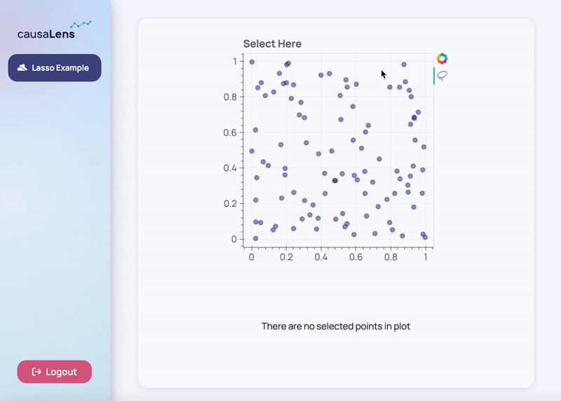

Bokeh events make it possible to trigger actions based on front-end interactions with Bokeh objects such as clicks, mouse movements, widget or tool interactions, etc.

## How Bokeh Events Work

One way to respond to these events is through the Bokeh server, however Dara does not use the Bokeh server. Bokeh provides a second way to respond to events through [CustomJS callbacks](https://docs.bokeh.org/en/3.0.3/docs/user_guide/interaction/js_callbacks.html). With this extension's event handler, you can easily create a `CustomJS` object with some preset JavaScript. This JavaScript sends out some custom events which are listened for and then turned into Dara `actions`. So not only can you utilize `CusotmJS` for more complex Bokeh interactions, but you can tie them to your `Variable`s through `action`s enabling a dynamic layout based on your user's interaction with the Bokeh object.

## Setting up a Bokeh Event

### Event Handler

To create a Bokeh event handler that is compatible with Dara, please use the `figure_events` function in `dara-components.plotting.utils`, this method handles interactions with Dara action framework. Make sure the `event_name` has no spaces.

```python
import pandas as pd
from bokeh.plotting import figure
from bokeh.models.tools import TapTool

from dara.core import Variable, py_component, action
from dara.components import Stack, Text, Button, Bokeh, figure_events

wheat_data = pd.DataFrame({
    'area': [18.85, 19.94, 20.16, 15.26, 14.11, 12.3, 13.8],
    'perimeter': [16.17, 16.92, 17.03, 14.84, 14.1, 13.34, 13.47],
    'wheat_class': ['araraticum', 'araraticum', 'araraticum', 'polonicum',
                    'polonicum', 'carthlicum', 'carthlicum'],
})

selected_variety_var = Variable()

def interactive_wheat_scatter_plot():
    p = figure(title='Area vs Perimeter - click the dots',
               tools='reset', sizing_mode='stretch_both')
    p.circle('area', 'perimeter', source=wheat_data, size=10)

    p.toolbar.logo = None
    p.xaxis.axis_label = 'Area'
    p.yaxis.axis_label = 'Perimieter'

    figure_event_generator = figure_events(p)

    # returns a CustomJS object that can be placed wherever Bokeh accepts CustomJS
    click_event = figure_event_generator(
        event_name="CLICK",
        code="""
            const index = cb_data.source.inspected.indices[0];
            return cb_data.source.data['wheat_class'][index];
        """
    )

    # adding the CusomJS object to a TapTool object (to trigger the action whenever the plot is clicked on)
    taptool = TapTool(callback=click_event(), behavior='inspect')
    p.add_tools(taptool)
    ...
```

:::tip
How do you know what to put in the `code` argument? You'll always have access to a `cb_data` object which represents the data in your callback. You can get selected and inspected values from `cb_data.source.selected` and `cb_data.source.inspected` respectively. You can use the indices from these properties to index anything in the data that you need through `cb_data.source.data`. To get a full view of the `cb_data` object, you can add the line `console.log(cb_data)` to your code snippet and view this object in your browser's developer tool's console. Click [**here**](https://docs.bokeh.org/en/latest/docs/reference/models/callbacks.html#bokeh.models.CustomJS) to learn more about Bokeh CustomJS callbacks.
:::

### Register Actions

Now to use this event with a `Bokeh` component, the component has to register actions to perform on the event. This is done by providing a list of (event name, action) pairs to the `events` property on the `Bokeh` component like the following:

```python
    ...
    # you sync the value of the selected_variety_var to the value returned by the callback
    # in this case the value will hold the wheat_class of whatever plot point was selected
    return Bokeh(p, events=[
        ('CLICK', [selected_variety_var.sync()])
    ])
```

Now the `selected_variety_var` is updated with the wheat class variety of whatever data point was clicked on. You may want to do something with this information, for example display it to the user and offer them a link to more information on that wheat variety. You can achieve this by decorating your a function with the `py_component` decorator and passing the `selected_variety_var` as an argument to the function. Now you have access to whatever is in that variable to create a dynamic layout.

The following shows how:

```python
import pandas as pd
from bokeh.plotting import figure
from bokeh.models.tools import TapTool

from dara.core import ConfigurationBuilder, Variable, py_component, NavigateTo
from dara.components import Stack, Text, Button, Card, Bokeh, figure_events

wheat_data = pd.DataFrame(
    {
        "area": [18.85, 19.94, 20.16, 15.26, 14.11, 12.3, 13.8],
        "perimeter": [16.17, 16.92, 17.03, 14.84, 14.1, 13.34, 13.47],
        "wheat_class": [
            "araraticum",
            "araraticum",
            "araraticum",
            "polonicum",
            "polonicum",
            "carthlicum",
            "carthlicum",
        ],
    }
)

selected_variety_var = Variable()


def interactive_wheat_scatter_plot():
    p = figure(
        title="Area vs Perimeter - click the dots",
        tools="reset",
        sizing_mode="stretch_both",
    )
    p.circle("area", "perimeter", source=wheat_data, size=10)

    p.toolbar.logo = None
    p.xaxis.axis_label = "Area"
    p.yaxis.axis_label = "Perimieter"

    figure_event_generator = figure_events(p)

    # returns a CustomJS object that can be placed wherever Bokeh accepts CustomJS
    click_event = figure_event_generator(
        event_name="CLICK",
        code="""
            const index = cb_data.source.inspected.indices[0];
            return cb_data.source.data['wheat_class'][index];
        """,
    )

    # adding the CusomJS object to a TapTool object (to trigger the action whenever the plot is clicked on)
    taptool = TapTool(callback=click_event(), behavior="inspect")
    p.add_tools(taptool)

    return Bokeh(
        p,
        events=[
            (
                "CLICK",
                [selected_variety_var.sync()],
            )
        ],
    )


@py_component
def selected_variety_information(selected_variety):
    if selected_variety is None:
        return Text(
            "Click on (inspect) a point on the graph to see it's wheat variety class.",
            align="center",
        )
    else:
        return Stack(
            Text(f"The selected point is of the {selected_variety} wheat variety."),
            Button(
                f"Read More on Triticum {selected_variety}",
                onclick=NavigateTo(f"https://en.wikipedia.org/wiki/Triticum_{selected_variety}"),
            ),
            height="10%",
            align="center",
        )


config = ConfigurationBuilder()
config.add_page(
    "Click Events",
    Card(
        Stack(
            interactive_wheat_scatter_plot(),
            height="75%",
        ),
        selected_variety_information(selected_variety_var),
        align="center",
    ),
)
```


## Callback Arguments

You can also pass arguments into your callback and use them within the JavaScript code. The following example will generate a random number and multiply it to the `scalar` argument whenever the click action is triggered. The arguments must be formatted in a dictionary when passed to the callback.

```python
click_event = figure_event_generator(
    event_name="CLICK",
    code="""
        // any expected parameters can be referenced by using `args.param_name` or `args['param_name']`
        return Math.random() * args.scalar
    """
)

taptool = TapTool(callback=click_event({'scalar': 10}))
my_figure.add_tools(taptool)

```

## Lasso event

In this section you will cover how to obtain the selected data with `LassoTool`. Differently to `TapTool` this does not provide a callback so your approach needs to be slightly different.

In this example, a random scatter plot with 100 data points is plotted. It has a lasso tool which turns the lassoed elements red. And the indices of the selected points will appear in an array below the Bokeh plot.



We can set up the `Bokeh` plot with the following:

```python
# generates random data
x = [random() for x in range(100)]
y = [random() for y in range(100)]
color = ['navy'] * len(x)

s = ColumnDataSource(data=dict(x=x, y=y, color=color))

# defines a figure which has the lasso tool
p = figure(width=400, height=400, tools='lasso_select', title='Select Here')

# adds the data points to figure
p.circle('x', 'y', color='color', size=8, source=s, alpha=0.4)
```

Now you need to be able to observe changes to the lassoed area, this can be done with the selected property of `ColumnDataSource`. For this you can use `figure_events` to create a `CustomJS` callback which is used to add that event to Bokeh.

```python
figure_event_generator = figure_events(p)

# returns a CustomJS object that can be placed wherever Bokeh accepts CustomJS
lasso_event = figure_event_generator(
    event_name='LASSO',
    code=...,
)
```

The `figure_events` in this example is responsible for:

-   getting the current selected values
-   changing the colors of the selected and unselected data
-   triggering an event that will update the Dara `Variable`

The first is easy, you can get it with the following, where s is our data source, the `ColumnDataSource`:

```js
const inds = s.selected.indices;
```

For the colors, we need to define what the color should be based on whether they are in this selected group or not, and then cause the Bokeh to redraw itself with these colors:

```js
// define unselected color
for (let i = 0; i < d['color'].length; i++) {
    d['color'][i] = 'navy';
}

// define selected color
for (let i = 0; i < inds.length; i++) {
    d['color'][inds[i]] = 'firebrick';
}

// emits a signal which causes Bokeh to redraw, this will result in it picking up the new colors
s.change.emit();

// returns inds to the action
return inds;
```

The reason why this works is that when you pass events to the `Bokeh` component, Dara adds a listener for it in the frontend following the name convention above. So we take advantage by dispatching an event of same name within the `figure_events` code, which the listener picks up and triggers the `sync` action.

```python
Bokeh(
        p,
        events=[('LASSO', [selected_indices.sync()])],
    )
```

Putting all of this together:

```python
from random import random
from bokeh.plotting import figure, ColumnDataSource

from dara.core import (
    Variable,
    py_component,
    ConfigurationBuilder,
    get_icon,
)
from dara.components import Stack, Text, Card, Bokeh, figure_events

selected_indices = Variable()


def interactive_scatter_plot():
    x = [random() for x in range(100)]
    y = [random() for y in range(100)]
    color = ["navy"] * len(x)

    s = ColumnDataSource(data=dict(x=x, y=y, color=color))
    p = figure(width=400, height=400, tools="lasso_select", title="Select Here")
    p.circle("x", "y", color="color", size=8, source=s, alpha=0.4)

    figure_event_generator = figure_events(p)

    # returns a CustomJS object that can be placed wherever Bokeh accepts CustomJS
    lasso_event = figure_event_generator(
        event_name="LASSO",
        code="""

        const inds = s.selected.indices;
        const d = s.data;

        if (inds.length == 0)
            return;

        for (let i = 0; i < d['color'].length; i++) {
            d['color'][i] = "navy"
        }
        for (let i = 0; i < inds.length; i++) {
            d['color'][inds[i]] = "firebrick"
        }

        s.change.emit();
        return inds;
    """,
    )

    s.selected.js_on_change("indices", lasso_event(args=dict(s=s)))

    return Bokeh(
        p,
        events=[("LASSO", [selected_indices.sync()])],
    )


@py_component
def selected_information(selected):
    if selected is None:
        return Stack(
            Text("There are no selected points in plot", align="center"),
            justify="center",
        )
    else:
        return Stack(
            Text(f"The selected points are {selected}", align="center"),
            justify="center",
        )


def lasso_page():
    return Card(
        Stack(
            interactive_scatter_plot(),
            align="center",
        ),
        selected_information(selected_indices),
    )


config = ConfigurationBuilder()
config.add_page(
    name="Lasso Example", content=lasso_page(), icon=get_icon("hat-cowboy-side")
)
```
