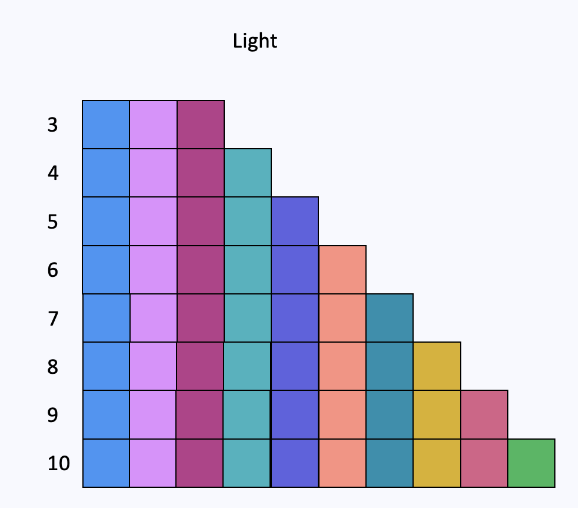
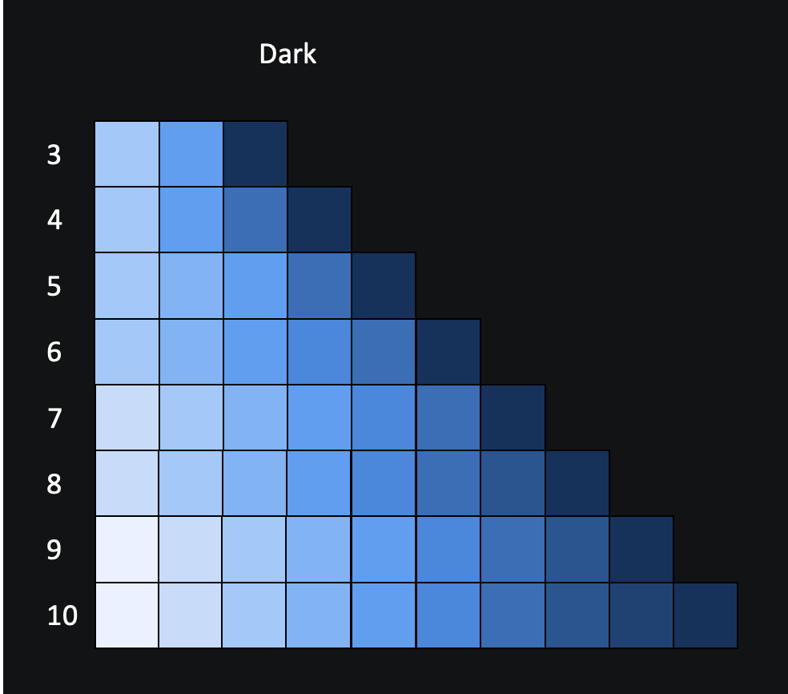

Dara offers the following 6 custom palettes to be used in your plots, these can be seen in more detail below:

| Light Theme Palettes      | Dark Theme Palettes | Max number of colours available |
| ----------- | ----------- | ----------- | 
| CategoricalLight      | CategoricalDark       | 10 |
| SequentialLight   | SequentialDark        | 10 |
| PolarisingLight   | PolarisingDark        | 11 |

They can be used in the same way as any other [palette from Bokeh](https://docs.bokeh.org/en/latest/docs/reference/palettes.html#bokeh-palettes)

These can also be used in Plotly for example by setting the `colorway` or `colorscale` attributes.

### Categorical




### Sequential




### Polarising


### Example of using palette with Bokeh

An example app using such palette:
```python
from bokeh.plotting import figure

from dara.core import ConfigurationBuilder, get_icon
from dara.components import Bokeh
from dara.components.plotting.palettes import PolarisingLight


def bokeh_plot():

    letters = ['a', 'b', 'c', 'd', 'e', 'f', 'g', 'h', 'i', 'j', 'k']
    p3 = figure(x_range=letters)
    p3.vbar(x=[1, 2, 3, 4, 5, 6, 7, 8, 9, 10, 11], top=[11] * 11, bottom=[10] * 11, width=1, color=PolarisingLight[11])

    return Bokeh(p3)


config = ConfigurationBuilder()
config.add_page(name='Bokeh Example', content=bokeh_plot(), icon=get_icon('palette'))
```

### Example of using palette with Plotly

An example app using Sequential Palette:


```python
import plotly.graph_objects as go

from dara.components import Plotly
from dara.components.plotting.palettes import SequentialLight10

from dara.core import ConfigurationBuilder, ComponentInstance, get_icon

def heatmap_example():
    # Sample data
    z = [[0.1, 0.3, 0.5, 0.7], [0.2, 0.4, 0.6, 0.8], [0.3, 0.5, 0.7, 0.9], [0.4, 0.6, 0.8, 1.0]]

    # converts sequential palette into a colorscale for heatmap
    colorscale = []
    num_colors = len(SequentialLight10)

    for i in range(num_colors):
        color = SequentialLight10[i]
        position = i / (num_colors - 1)
        colorscale.append([position, color])

    # Define the heatmap trace
    heatmap = go.Heatmap(z=z, colorscale=colorscale)

    # Create the figure
    fig = go.Figure(data=heatmap)

    # Set the plot title
    fig.update_layout(title='Heatmap Example')

    return Plotly(fig)

config = ConfigurationBuilder()
config.add_page(name='Plotly Example', content=heatmap_example(), icon=get_icon('palette'))
```

