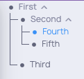

## Overview

This extension provides with the capability to add `dara.components.smart.hierarchy.HierarchyViewer` and `dara.components.smart.hierarchy.HierarchySelector` components to your app.
They can be used to display hierarchical data structures.

`HierarchySelector` displays a tree-like view of the data structure, while `HierarchyViewer` displays a treemap to visualise the composition of a dataset.

## Getting Started

### Adding HierarchyViewer and HierarchySelector component to a page

The `HierarchyViewer` and `HierarchySelector` components take a `hierarchy` argument which can be a `dara.components.smart.hierarchy.Node` or a `Variable` or `DerivedVariable` containing a `Node`.
In addition, `HierarchySelector` requires a `value` argument which must be a `Variable`. This variable will be updated with the currently selected node.

Below is a simple example of how you can add the components to your app:

```python
from dara.core import Variable, ConfigurationBuilder, ComponentInstance, get_icon
from dara.components import Stack, HierarchyViewer, HierarchySelector, Node

# config
config = ConfigurationBuilder()

# Hierarchy we're displaying
hierarchy = Node(
    id=1,
    label='First',
    weight=1,
    children=[
        Node(
            id=2,
            label='Second',
            weight=1,
            children=[Node(id=4, label='Fourth', weight=1), Node(id=5, label='Fifth', weight=1)],
        ),
        Node(id=3, label='Third', weight=0.5),
    ],
)

# define a Variable which will store the selected variable
selection = Variable()


def selector_page() -> ComponentInstance:
    return Stack(HierarchySelector(hierarchy=hierarchy, value=selection))


def viewer_page() -> ComponentInstance:
    return Stack(HierarchyViewer(hierarchy=hierarchy))


config.add_page(name='Hierarchy Viewer', content=viewer_page(), icon=get_icon('eye'))
config.add_page(name='Hierarchy Selector', content=selector_page(), icon=get_icon('eyes'))
```

#### `Hierarchy Viewer` component


#### `Hierarchy Selector` component


