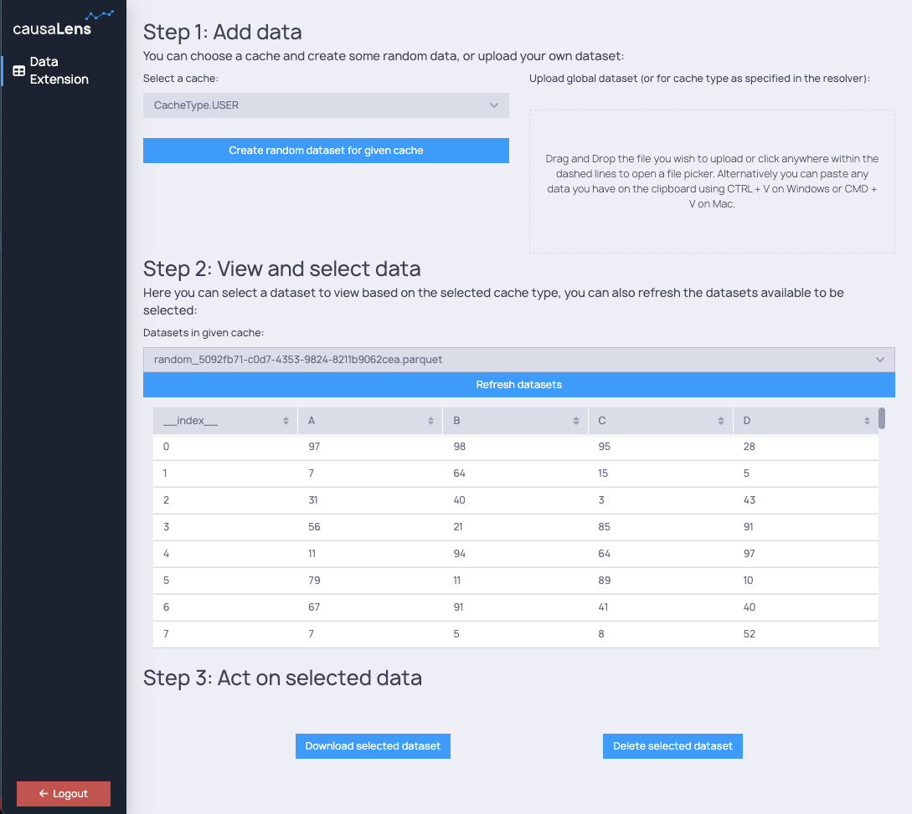

## Overview

The `dara-core` provides extra functionalities for interacting with data, built on top of the core `DataVariable` concepts.
It contains the `UploadDropzone` component, as well as a `DataFactory` class which is a factory of variables, actions and methods
to interact with locally stored data.

## Getting started

Using the `UploadDropzone` component implicitly registers an endpoint for uploading data under the hood. To explicitly register the endpoint without
using the component (e.g. for programmatic upload only):

```python
from dara.core.data_utils.endpoints import upload
from daracore import ConfigurationBuilder

config = ConfigurationBuilder()
config.add_endpoint(upload)
```

### Using DataFactory

Now that you are setup we can go ahead and use the components and utilities provided to interact with data.
Below is a full example of how this might look in an app:

```python
import io
from uuid import uuid4

import numpy as np
import pandas

from dara.core import (
    ConfigurationBuilder,
    DerivedVariable,
    Variable,
    get_icon,
    py_component,
    CacheType,
    action
)
from dara.core.auth import MultiBasicAuthConfig
from dara.components import (
    Button,
    Heading,
    Select,
    Spacer,
    Stack,
    Table,
    Text,
    Item,
    UploadDropzone
)
from dara.core.data_utils import DataFactory

# App configuration
config = ConfigurationBuilder()
config.add_auth(MultiBasicAuthConfig({'test1': 'test', 'test2': 'test'}))

# Create a factory pointing at a root folder
ds_factory = DataFactory('./data_root')

# Cache selection
cache_items = [CacheType.GLOBAL, CacheType.USER, CacheType.SESSION]
selected_cache = Variable(CacheType.GLOBAL)

# Dataset selection
selected_ds_name = Variable()
selected_ds = ds_factory.read_dataset_var(selected_ds_name, selected_cache)

# List of datasets in selected cache
datasets_list = ds_factory.list_datasets_var(selected_cache, polling_interval=5)
datasets_items = DerivedVariable(lambda sets: [Item.to_item(s) for s in sets], variables=[datasets_list])


@py_component
def DatasetTable(df: pandas.DataFrame):
    """
    Display a dataset in a table
    """
    if df is None:
        return Text('not selected')

    return Table(data=selected_ds, columns=df.columns.tolist(), max_rows=8, raw_css={'height': 'auto'})


def resolver(content: bytes, name: str) -> None:
    """Handle uploaded csv file"""
    file_object_csv = io.StringIO(content.decode('utf-8'))
    dataset = pandas.read_csv(file_object_csv)
    # Note that here cache type for uploaded data must currently be provided upfront
    ds_factory.write_dataset(dataset, name, cache=CacheType.GLOBAL)

@action
async def create_df(ctx: action.Ctx, cache):
    """Create a dataframe - here we're just randomizing some values"""
    df = pandas.DataFrame(np.random.randint(0, 100, size=(100, 4)), columns=list('ABCD'))
    uid = str(uuid4())
    ds_factory.write_dataset(df, f'random_{uid}', cache=cache)


def add_data_section():
    return Stack(
        Stack(
            Text('Select a cache:'),
            Select(value=selected_cache, items=cache_items),
            Spacer(),
            Button('Create random dataset for given cache', onclick=create_df(selected_cache)),
        ),
        Spacer(),
        Stack(
            Text('Upload global dataset (or for cache type as specified in the resolver):'),
            UploadDropzone(resolver=resolver),
        ),
        direction='horizontal',
    )


def act_on_data_section():
    return Stack(
        Button(
            'Download selected dataset',
            onclick=ds_factory.download_dataset_action(selected_ds_name),
        ),
        Button('Delete selected dataset', onclick=ds_factory.delete_dataset_action(selected_ds_name, selected_cache)),
        direction='horizontal',
        justify='space-evenly',
    )


config.add_page(
    name='Data Extension',
    content=Stack(
        Heading('Step 1: Add data'),
        Heading('You can choose a cache and create some random data, or upload your own dataset:', level=3),
        add_data_section(),
        Heading('Step 2: View and select data'),
        Heading(
            'Here you can select a dataset to view based on the selected cache type, you can also refresh the datasets available to be selected:',
            level=3,
        ),
        Text('Datasets in given cache:'),
        Select(value=selected_ds_name, items=datasets_items),
        Button('Refresh datasets', onclick=datasets_list.trigger()),
        DatasetTable(selected_ds),
        Heading('Step 3: Act on selected data'),
        act_on_data_section(),
        padding='20px',
    ),
    icon=get_icon('table'),
)

```



### FileStore

Internally, `DataFactory` is implemented using a lower-level `FileStore`. The latter is also available for use in the extension.
It provides a set of helper methods to interact with any files stored on disk. You might find it useful if you need to
persist data created by users - the file store will handle things like making sure the data is 'scoped' to the correct user or session,
depending on specified cache settings.
