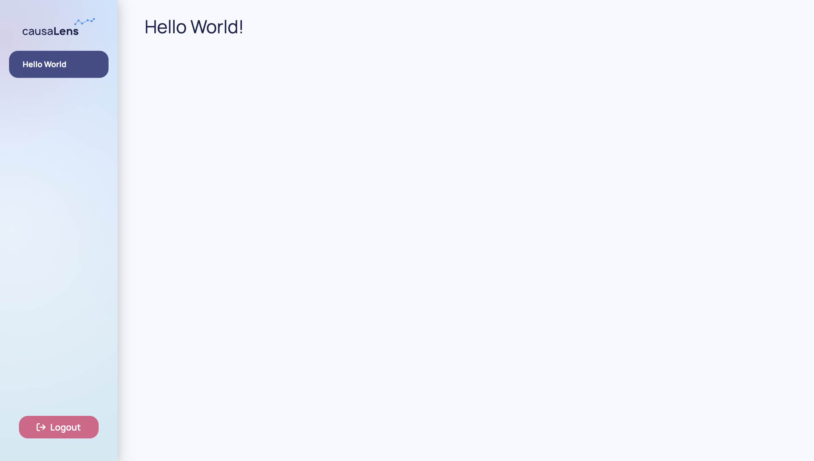
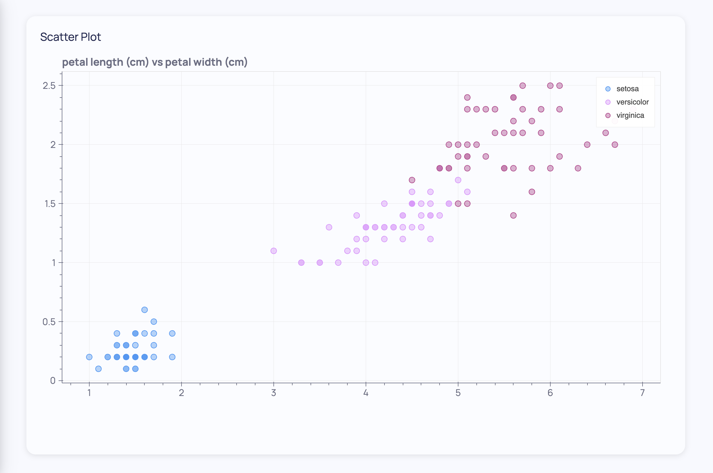
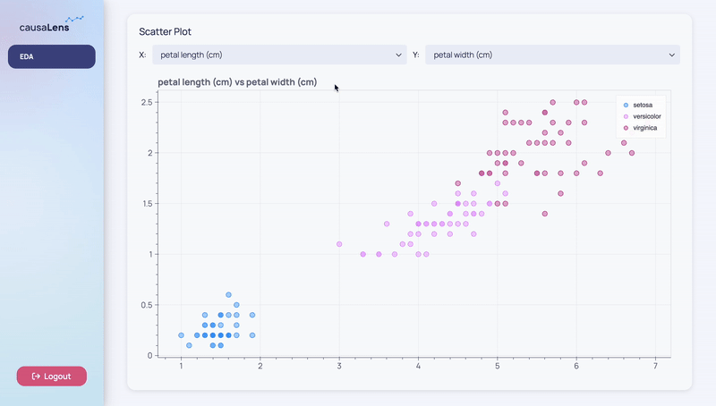
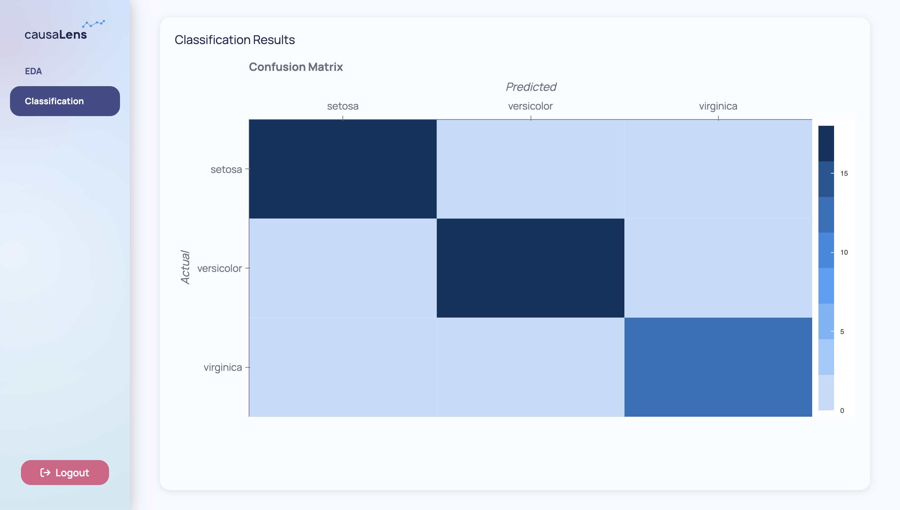
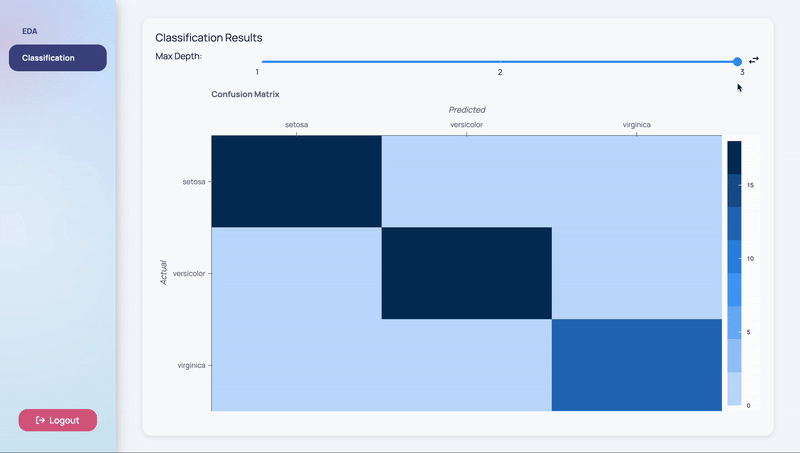
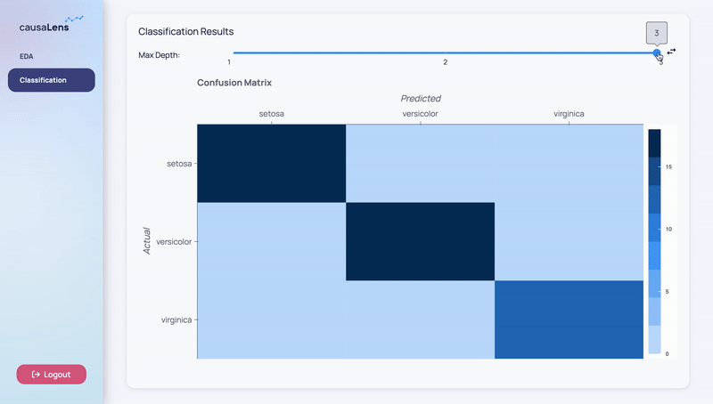

This page will help you build an app from start to finish. The use case is simple, using `sklearn`'s iris dataset you will do some simple exploratory data analysis (EDA) and build a simple classifier and explore its results.

## Creating Your App

You can create an app with Poetry in just a few steps. Poetry can be installed following these [instructions](https://Python-Poetry.org/docs/basic-usage/). First make a directory called `my_first_app`:

```sh
mkdir my_first_app
```

Navigate into that directory and run `poetry init` to initialize a poetry project.

```sh
cd my_first_app
poetry init
```

This command will guide you through creating your `pyproject.toml` config.

:::note
When following the prompts, you can simply hit enter for most however when prompted for the `Compatible Python versions` please enter `>=3.8.0, <3.12.0`.

```sh
Compatible Python versions [^3.8]:  >=3.8.0, <3.12.0
```

This is necessary because Dara libraries support python versions `>=3.8.0, <3.12.0`.
:::

You will now have the following file structure:

```
- my_first_app/
    - pyproject.toml
```

The contents of the `pyproject.toml` will be something like the following:

```toml
[tool.poetry]
name = "my-first-app"
version = "0.1.0"
description = ""
readme = "README.md"
packages = [{include = "my_first_app"}]

[tool.poetry.dependencies]
python = ">=3.8.0, <3.12.0"


[build-system]
requires = ["poetry-core"]
build-backend = "poetry.core.masonry.api"
```

As the `readme` field is set to `"README.md"`, you will want to make sure to have a `README.md` file in your directory. This file can be empty to start with and you can fill it out at a later time with important information about the app. You will now have the following file structure:

```
- my_first_app/
    - pyproject.toml
    - README.md
```

Now that you have initiated your Poetry project, you can install it with the following:

```sh
poetry install
```

You are now ready to add the core of the Dara framework:

```sh
poetry add dara-core --extras all
```

You can follow the User Guide's [Local Development instructions](./getting-started/local-setup.mdx) for other options on how to install the packages and create your first app.

## Your App's Configuration

Create another folder in `my_first_app` with the same name. Within the folder add two empty files, one called `__init__.py` and the other called `main.py`. You will have the following file structure:

```
- my_first_app/
    - my_first_app/
        - __init__.py
        - main.py
    - pyproject.toml
    - README.md
```

Now you can start coding your first app. In `main.py`, copy the following contents into it:

```python title=my_first_app/my_first_app/main.py
from dara.core import ConfigurationBuilder
from dara.components import Heading

# Create a configuration builder
config = ConfigurationBuilder()

# Register pages
config.add_page('Hello World', Heading('Hello World!'))
```

Your `main.py` file is where you want to set up your configuration with the `dara.core.configuration.ConfigurationBuilder`. In this example, the `ConfigurationBuilder` is adding your pages to your app.

Try running your app with the following command within the outermost `my_first_app` directory:

```sh
poetry run dara start
```

Your app will look like the following:



### Extensions

The core of the Dara framework comes with many functionalities such as interactivity and the base rendering engine. By design, the framework is easily extendable with extra components and other features via outside packages and plugins.

The simplest extension that comes with the framework is the `dara-components`, which is already added in this example's configuration. This extension adds a range of common UI components to quickly extend upon the basic functionality of the page system. You are able to use the component, in this case `dara.components.common.heading.Heading` in your page, by simply importing it from the extension package.

In order to do EDA, you will need some plotting functionality. This can be found in the same extension which allows you to display `dara.components.plotting.bokeh.Bokeh` or `dara.components.plotting.plotly.Plotly` figures.

### Data

In this app, you will use data and models from `scikit-learn`. Therefore you must add this dependency to your project:

```sh
poetry add scikit-learn
```

It is good practice to have your global state in one place and to keep it out of `main.py` for organization and readability. For this reason, you will define your dataset in `definitions.py`.

```python title=my_first_app/my_first_app/definitions.py
import pandas
from sklearn import datasets

iris = datasets.load_iris()
features = iris.feature_names
target_names = iris.target_names
data = pandas.DataFrame(iris.data, columns=features)
data['species'] = iris.target
data['species_names'] = data['species'].map(
    {i: name for i, name in enumerate(target_names)}
)
```

Your project's directory should now look like the following:

```
- my_first_app/
    - my_first_app/
        - __init__.py
        - definitions.py
        - main.py
    - pyproject.toml
    - README.md
```

### Pages

Pages hold the contents of your app. They are added with the `add_page` method on the `ConfigurationBuilder` with a title and the page's content.

By default, your app will use the default Dara template which includes a sidebar for the page menu and a larger panel on the right for the content of each page. Adding a second page is as simple as calling `add_page` a second time.

You can delete the `Hello World` page to make room for pages that have some substance by simply removing the line of code that uses `add_page`.

## Page 1: EDA

You can technically build your entire app in `main.py` and if your app is very small, then there is no issue in doing so. However, as your app gets more complex it helps to separate the structure into different folders and files. As this app will have two pages, you should define a folder called `pages`.

Your exploratory data analysis can be in a file called `eda.py` which should be located in the `pages` folder.

Your project's directory should now look like the following:

```
- my_first_app/
    - my_first_app/
        - pages/
            - eda.py
        - __init__.py
        - definitions.py
        - main.py
    - pyproject.toml
    - README.md
```

Now you can begin using Bokeh plots by wrapping any plot in the `dara.components.plotting.bokeh.Bokeh` wrapper component provided by the extension. You can use any plot of choice but this example will use a scatter plot to show the relationship between two variables. It will stratify the scatter plot by the target, species.

```python title=my_first_app/my_first_app/pages/eda.py
from bokeh.plotting import figure

from dara.components import Bokeh, Card
from dara.components.plotting.palettes import CategoricalLight3

from my_first_app.definitions import data

def scatter_plot(x: str, y: str):
    plot_data = data.copy()
    plot_data['color'] = plot_data['species_names'].map(
        {x: CategoricalLight3[i] for i, x in enumerate(data['species_names'].unique())}
    )

    p = figure(title = f"{x} vs {y}", sizing_mode='stretch_both', toolbar_location=None)
    p.circle(
        x,
        y,
        color='color',
        source=plot_data,
        fill_alpha=0.4,
        size=10,
        legend_group='species_names'
    )
    return Bokeh(p)

def eda_page():
    return Card(
        scatter_plot('petal length (cm)', 'petal width (cm)'),
        title='Scatter Plot'
    )
```

Notice how the page content is wrapped in a `dara.components.common.card.Card` component. A `Card` wraps a component instance and gives it a title and an optional subtitle.

Don't forget to register the page in your app's configuration:

```python title=my_first_app/my_first_app/main.py
from dara.core import ConfigurationBuilder

from my_first_app.pages.eda import eda_page

# Create a configuration builder
config = ConfigurationBuilder()

# Add page
config.add_page('EDA', eda_page())
```

Your app will now look like the following:



### Adding Interactivity - `Variable`s and `py_component`s

Now while this is nice, you had to name your `x` and `y` variables statically. In order to see the other relationships within the variables you would have to go back into the code and reload the app.

To let the end user of the app decide, you can add interactivity components into your apps. The `dara.core.interactivity.plain_variable.Variable`s and `dara.core.visual.dynamic_component.py_component`s allow you to do this.

#### `Variable`s

`dara.core.interactivity.plain_variable.Variable` is the core of the framework's reactivity system. It represents a dynamic value that can be read and written to by components. The state is managed entirely in the user's browser which means there is no need to call back to the Python server on each update.

The dynamic values you want to represent in this example are the features you choose for your `x` and `y` axis on the scatter plot. `Variable`s can be defined with a default value so that when the app is reloaded they will hold these values. The following code shows you how to define `x_var` and `y_var` which will now hold these dynamic values. After this, you will learn how to use them.

```python title=my_first_app/my_first_app/pages/eda.py
...

from dara.core import Variable

...

def eda_page():
    x_var = Variable('petal length (cm)')
    y_var = Variable('petal width (cm)')

    ...
```

You cannot read values from or modify the values of `Variable` instances with traditional Python code as they live entirely in the browser. As mentioned, `Variable`s can be written to by components that enable interactivity. These components come from the `dara-components` and they accept a `Variable` instance and update them accordingly.

In this example, you can use the `dara.components.common.select.Select` component to allow the user to change `x_var` and `y_var` so they can see the scatter plot for all combinations of features. The `Select` component takes a `value` which is the `Variable` you want to update with it, and `items` which are the choices the component presents to the end-user.

```python title=my_first_app/my_first_app/pages/eda.py
from bokeh.plotting import figure

from dara.core import Variable
from dara.components import Bokeh, Stack, Select, Text, Card
from dara.components.plotting.palettes import CategoricalLight3

from my_first_app.definitions import data, features

def scatter_plot(x: str, y: str):
    plot_data = data.copy()
    plot_data['color'] = plot_data['species_names'].map(
        {x: CategoricalLight3[i] for i, x in enumerate(data['species_names'].unique())}
    )

    p = figure(title = f"{x} vs {y}", sizing_mode='stretch_both', toolbar_location=None)
    p.circle(
        x,
        y,
        color='color',
        source=plot_data,
        fill_alpha=0.4,
        size=10,
        legend_group='species_names'
    )
    return Bokeh(p)

def eda_page():
    x_var = Variable('petal length (cm)')
    y_var = Variable('petal width (cm)')

    return Card(
        Stack(
            Text('X:'),
            Select(items=features, value=x_var),
            Text('Y:'),
            Select(items=features, value=y_var),
            direction='horizontal',
            align='center',
            hug=True,
        ),
        scatter_plot('petal length (cm)', 'petal width (cm)'),
        title='Scatter Plot'
    )
```

Along with the `dara.components.common.select.Select` components, there are `dara.components.common.text.Text` components that label the `Select`s. These components together are wrapped in a `dara.components.common.stack.Stack` which is a core component for laying out a document. Wrapping these in a `Stack` keeps them separate from the `scatter_plot`. Setting the `Stack`'s `direction` to horizontal lays the components next to each other left-to-right.

Your app will look like the following:



Each time the end-user is selecting a different item, the `Variable` associated with the `Select` is updated with that value.

You may notice that the graph is not updating despite what the user chooses. This is because the `Variable`s are still not connected to the scatter plot. You'll need to update the arguments of `scatter_plot` to be `x_var` and `y_var` respectively. However, remember that you cannot read values in `Variable`s directly in Python code as these `Variable`s live in the front-end. This brings us to the use of `py_components`.

#### `py_component`s

The `dara.core.visual.dynamic_component.py_component` function is a decorator that allows changing your layout based on the current state of your application's `Variable`s. When your function is wrapped in a `py_component`, it exposes the values out of the `Variable`s that were passed into it so you can work with the raw values and perform Python logic with them.

By adding the `py_component` decorator to your `scatter_plot` function, you can now pass in `x_var` and `y_var` and get access to the strings within them. Using these strings, you can now index the correct data column and have the plot dynamically render based on your choices.

```python title=my_first_app/my_first_app/pages/eda.py
from bokeh.plotting import figure

from dara.core import Variable, py_component
from dara.components import Bokeh, Stack, Select, Text, Card
from dara.components.plotting.palettes import CategoricalLight3

from my_first_app.definitions import data, features


@py_component
def scatter_plot(x: str, y: str):
    plot_data = data.copy()
    plot_data['color'] = plot_data['species_names'].map(
        {x: CategoricalLight3[i] for i, x in enumerate(data['species_names'].unique())}
    )

    p = figure(title = f"{x} vs {y}", sizing_mode='stretch_both', toolbar_location=None)
    p.circle(
        x,
        y,
        color='color',
        source=plot_data,
        fill_alpha=0.4,
        size=10,
        legend_group='species_names'
    )
    return Bokeh(p)

def eda_page():
    x_var = Variable('petal length (cm)')
    y_var = Variable('petal width (cm)')

    return Card(
        Stack(
            Text('X:'),
            Select(items=features, value=x_var),
            Text('Y:'),
            Select(items=features, value=y_var),
            direction='horizontal',
            align='center',
            hug=True,
        ),
        scatter_plot(x_var, y_var),
        title='Scatter Plot'
    )
```

Your app will look like the following:


It looks the same as before but now the graph is updating according to the end-user's choices for `x_var` and `y_var`.

## Page 2: Modeling

So far you've made a dynamic page for some simple exploratory data analysis. You may also want to do some simple modeling with the iris dataset.

You can define another file in the `pages` folder called `classification.py`.

Your project's directory should now look like the following:

```
- my_first_app/
    - my_first_app/
        - pages/
            - eda.py
            - classification.py
        - __init__.py
        - definitions.py
        - main.py
    - pyproject.toml
    - README.md
```

This page will run a `DecisionTreeClassifier` and show the results via a confusion matrix. You can plot the confusion matrix with the `Bokeh` wrapper.

```python title=my_first_app/my_first_app/pages/classification.py
import pandas
from bokeh.models import BasicTicker, ColorBar, LinearColorMapper
from bokeh.plotting import figure
from bokeh.transform import transform
from sklearn.metrics import confusion_matrix
from sklearn.model_selection import train_test_split
from sklearn.tree import DecisionTreeClassifier

from dara.components import Bokeh, Card
from dara.components.plotting.palettes import SequentialDark8

from my_first_app.definitions import data, features, target_names

X_train, X_test, y_train, y_test = train_test_split(
    data[features], data['species'], test_size=0.33, random_state=1
)
tree = DecisionTreeClassifier(max_depth=3, random_state=1)
tree.fit(X_train, y_train)
predictions = tree.predict(X_test)

def confusion_matrix_plot():
    df = pandas.DataFrame(
      confusion_matrix(y_test, predictions), index=target_names, columns=target_names
    )
    df.index.name = 'Actual'
    df.columns.name = 'Prediction'
    df = df.stack().rename('value').reset_index()

    mapper = LinearColorMapper(
        palette=SequentialDark8, low=df.value.min(), high=df.value.max()
    )
    p = figure(
        title='Confusion Matrix',
        sizing_mode='stretch_both',
        toolbar_location=None,
        x_axis_label='Predicted',
        y_axis_label='Actual',
        x_axis_location="above",
        x_range=target_names,
        y_range=target_names[::-1]
    )
    p.rect(
        x='Actual',
        y='Prediction',
        width=1,
        height=1,
        source=df,
        line_color=None,
        fill_color=transform('value', mapper),
    )

    color_bar = ColorBar(
        color_mapper=mapper,
        location=(0, 0),
        label_standoff=10,
        ticker=BasicTicker(desired_num_ticks=3),
    )
    p.add_layout(color_bar, 'right')

    return Bokeh(p)

def classification_page():
    return Card(
        confusion_matrix_plot(),
        title='Classification Results'
    )
```

Don't forget to register the page in your app's configuration:

```python title=my_first_app/my_first_app/main.py
from dara.core.configuration import ConfigurationBuilder

from my_first_app.pages.eda import eda_page
from my_first_app.pages.classification import classification_page

# Create a configuration builder
config = ConfigurationBuilder()

# Add page
config.add_page('EDA', eda_page())
config.add_page('Classification', classification_page())
```

Your app should look like the following:



It would be nice to allow the end-user to play around with certain hyperparameters of the model. The `DecisionTreeClassifier` takes a hyperparameter argument called `max_depth` which represents the maximum depth of the tree. Right now, the model's `max_depth` argument is hardcoded to the number three. Using concepts you learned building the previous page, you can allow the end-user to choose the `max_depth` argument themselves. To achieve this, you can define another `Variable` called `max_depth_var` that will hold this dynamic value.

In this example, you can use the `dara.components.common.slider.Slider` component to allow the user to choose the maximum depth from a certain range. The `Slider` component takes a `Variable` instance which in this case will be `max_depth_var`. This component accepts some other arguments like `domain`, `ticks`, and `step` to specify the domain of the slider, the ticks to show on the slider, and how much the slider jumps respectively.

```python title=my_first_app/my_first_app/pages/classification.py
import pandas
from bokeh.models import BasicTicker, ColorBar, LinearColorMapper
from bokeh.plotting import figure
from bokeh.transform import transform
from sklearn.metrics import confusion_matrix
from sklearn.model_selection import train_test_split
from sklearn.tree import DecisionTreeClassifier

from dara.core import Variable
from dara.components import Bokeh, Card, Stack, Text, Card, Slider
from dara.components.plotting.palettes import SequentialDark8

from my_first_app.definitions import data, features, target_names

X_train, X_test, y_train, y_test = train_test_split(
    data[features], data['species'], test_size=0.33, random_state=1
)
tree = DecisionTreeClassifier(max_depth=3, random_state=1)
tree.fit(X_train, y_train)
predictions = tree.predict(X_test)

def confusion_matrix_plot():
    df = pandas.DataFrame(
        confusion_matrix(y_test, predictions), index=target_names, columns=target_names
    )
    df.index.name = 'Actual'
    df.columns.name = 'Prediction'
    df = df.stack().rename('value').reset_index()

    mapper = LinearColorMapper(
        palette=SequentialDark8, low=df.value.min(), high=df.value.max()
    )
    p = figure(
        title='Confusion Matrix',
        sizing_mode='stretch_both',
        toolbar_location=None,
        x_axis_label='Predicted',
        y_axis_label='Actual',
        x_axis_location="above",
        x_range=target_names,
        y_range=target_names[::-1]
    )
    p.rect(
        x='Actual',
        y='Prediction',
        width=1,
        height=1,
        source=df,
        line_color=None,
        fill_color=transform('value', mapper),
    )

    color_bar = ColorBar(
        color_mapper=mapper,
        location=(0, 0),
        label_standoff=10,
        ticker=BasicTicker(desired_num_ticks=3),
    )
    p.add_layout(color_bar, 'right')

    return Bokeh(p)

max_depth_var = Variable([3])

def classification_page():
    return Card(
        Stack(
            Text('Max Depth:', width='15%'),
            Slider(domain=[1, 3], value=max_depth_var, step=1, ticks=[1, 2, 3]),
            direction='horizontal',
            hug=True,
        ),
        confusion_matrix_plot(),
        title='Classification Results'
    )
```

Your app should look like the following:



You may notice that the graph is not updating despite what the user chooses. You would expect different maximum depth values to alter the predictions however, the graph is static because the `Variable`s are still not connected to the predictions. Remember that you cannot read values in `Variable`s directly in Python code as these `Variable`s live in the front-end. This brings us to the use of `DerivedVariable`s.

### Adding Interactivity - `DerivedVariable`s

The primary purpose of a `dara.core.interactivity.derived_variable.DerivedVariable` is to transform a set of raw state variables from the frontend browser into a single new derived state from a calculation on the backend server. This state can then be shared into components in the same way as other `Variable`s. This is particularly useful for running expensive or long running tasks such as machine learning or data processing steps.

When defining a `DerivedVariable`, you have to specify a function and a list of `Variable`s or other `DerivedVariable`s that will act as arguments to that function. Every time one of the specified variables changes, the function is re-run with the current values of the variables.

You can take advantage of a `DerivedVariable` to calculate your predictions based on the `Variable`, `max_depth_var`. You can simply move the logic that calculates your predictions that you already have into a function called `calculate_predictions` which can act as the function needed by the `DerivedVariable`.

As this is the last step, your whole file will look like the following:

```python title=my_first_app/my_first_app/pages/classification.py
import pandas
import numpy
from bokeh.models import BasicTicker, ColorBar, LinearColorMapper
from bokeh.plotting import figure
from bokeh.transform import transform
from sklearn.metrics import confusion_matrix
from sklearn.model_selection import train_test_split
from sklearn.tree import DecisionTreeClassifier
from typing import List

from dara.core import Variable, py_component, DerivedVariable
from dara.components import Bokeh, Card, Stack, Text, Card, Slider
from dara.components.plotting.palettes import SequentialDark8

from my_first_app.definitions import data, features, target_names

X_train, X_test, y_train, y_test = train_test_split(
    data[features], data['species'], test_size=0.33, random_state=1
)
tree = DecisionTreeClassifier(max_depth=3, random_state=1)
tree.fit(X_train, y_train)
predictions = tree.predict(X_test)

@py_component
def confusion_matrix_plot(predictions: numpy.array):
    df = pandas.DataFrame(confusion_matrix(y_test, predictions), index=target_names, columns=target_names)
    df.index.name = 'Actual'
    df.columns.name = 'Prediction'
    df = df.stack().rename('value').reset_index()

    mapper = LinearColorMapper(
        palette=SequentialDark8, low=df.value.min(), high=df.value.max()
    )
    p = figure(
        title='Confusion Matrix',
        sizing_mode='stretch_both',
        toolbar_location=None,
        x_axis_label='Predicted',
        y_axis_label='Actual',
        x_axis_location="above",
        x_range=target_names,
        y_range=target_names[::-1]
    )
    p.rect(
        x='Actual',
        y='Prediction',
        width=1,
        height=1,
        source=df,
        line_color=None,
        fill_color=transform('value', mapper),
    )

    color_bar = ColorBar(
        color_mapper=mapper,
        location=(0, 0),
        label_standoff=10,
        ticker=BasicTicker(desired_num_ticks=3),
    )
    p.add_layout(color_bar, 'right')

    return Bokeh(p)

def calculate_predictions(n: List[int]):
    tree = DecisionTreeClassifier(max_depth=n[0], random_state=1)
    tree.fit(X_train, y_train)
    predictions = tree.predict(X_test)
    return predictions

max_depth_var = Variable([3])
predictions_var = DerivedVariable(
    calculate_predictions,
    variables=[max_depth_var]
)

def classification_page():
    return Card(
        Stack(
            Text('Max Depth:', width='15%'),
            Slider(domain=[1, 3], value=max_depth_var, step=1, ticks=[1, 2, 3]),
            direction='horizontal',
            hug=True,
        ),
        confusion_matrix_plot(predictions_var),
        title='Classification Results'
    )
```

You've now defined a `predictions_var` that is a `DerivedVariable`. It will recalculate `calculate_predictions` whenever the `max_depth_var` is changed by the `Slider`. Notice that you've had to add a `py_component` decorator to the `confusion_matrix` function. This is because, like `Variable`s, you cannot read directly the values of `DerivedVariable`s. This is because the state of the `DerivedVariable` lives entirely in the frontend, although its calculations are made in the backend.

Your app will look like the following:



As mentioned in the introduction, Dara enables a close-to-native web app performance by offloading as much logic as possible into the browser. This optimization results in the app not needing to call into the server every time you want to change something on the screen.

This close-to-native performance is achieved by the concepts in this page. `Variable`s are updated in the frontend browser so they do not require server involvement. Server-side logic is handled by `DerivedVariable`s and `py_component`s with the main difference being `DerivedVariable`s are a derived state that represent a value while `py_component`s are a derived state that represent a component to be rendered in the frontend.

## Next Steps

You've successfully made your first app. There were a lot of concepts covered so if you want to know more, please continue onto the [User Guide](./getting-started/app-building).
