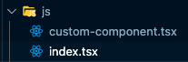

import Tabs from "@theme/Tabs";
import TabItem from "@theme/TabItem";

The framework allows for easy ways to customize your app whether that be through python functions or CSS dictionaries. If you want to take it a step further and are familiar with JavaScript, you are welcome to make custom JavaScript components.

## Local components

### Setting up the project

Dara CLI provides a command to setup necessary scaffolding to include your custom local JS in the application.

Run the following to setup custom JS:

<Tabs
    defaultValue="poetry"
    groupId="packageManager"
    values={[{label: 'Pip', value: 'pip'}, {label: 'Poetry', value: 'poetry'}]}
>
<TabItem value="poetry">

```sh
poetry run dara setup-custom-js
```

</TabItem>
<TabItem value="pip">

```sh
dara setup-custom-js
```

</TabItem>
</Tabs>

The command does the following:

- includes a `dara.config.json` file in the root of your project

```json title=dara.config.json
{
  "local_entry": "./js",
  "extra_dependencies": {},
  "package_manager": "npm"
}
```

- includes a `js` folder in your application with an example custom JS component

The JSON configuration is required for custom JS to work.
When running the application in production mode, custom JS will then be included if the JSON file is present.

The configuration file provides sensible defaults, however these can be tuned to your project's needs.

The `local_entry` component defines the path to the folder containing your custom JS. That folder should include an `index.tsx` file which
collects everything you want to export there. Continuing the previous example:

```tsx title=js/index.tsx
// Notice `LocalJsComponent` corresponds to the name of registered component in the Python code
export { default as LocalJsComponent } from "./local-js-component";
```

`extra_dependencies` allows you to specify any extra npm dependencies your local module requires. These will be merged into the generated `package.json` file.

`package_manager` allows you to specify which package manager to use when installing or building dependencies. Currently, only `npm`, `pnpm` and `yarn` are supported.

### Writing and Registering Custom Components

The custom JS scaffolding includes an example component. However, this documentation walks you through creating your own in a step by step fashion.

The custom components you write can be any kind of React component. The system will understand how to render this once
you have registered the component with the application. You'll use the following component as an example and slowly build
it up to something useful.

```tsx title=js/custom-component.tsx
import * as React from "react";

interface CustomComponentProps {
  title: string;
  content: number;
}

export default function CustomComponent(props: CustomComponentProps) {
  return (
    <div>
      <h1>{props.title}</h1>
      {props.content}
    </div>
  );
}
```

:::tip
Note that you need to import `react` in every component for the JSX transform to work properly
:::

The following would then need to be added into the local module's main export file:

```tsx title=js/index.tsx
export { default as CustomComponent } from "./custom-component";
```

:::caution
The name of the component exported here _must_ match the name of the component definition class on the python side (detailed
below). It can be otherwise customised by setting `js_component` property on your `ComponentInstance` subclass.
:::

The directory structure should now look like the following if you have followed the steps so far:



However, this doesn't yet allow us to easily construct the component on the python side. For that you need to create a props mapping object using
our `ComponentInstance` base class:

```python
from dara.core.definitions import ComponentInstance

class CustomComponent(ComponentInstance):
    title: str
    content: int
```

The final step to register this component on the python side is to add the following line to the configuration of the
application so that our application knows where to find it.

```python
config.add_js_component(CustomComponent, local=True)
```

With this, you can now use this component as you would any other exposed by the various extensions in the framework and it
will encode the title and content parameters as the props for the component.

### Running Your Application

Now that you have setup your application then you will want to start it. When working with this mode then you will need
to get two different terminal processes running.

The first will be the startup of the main application. Here the `--enable-hmr` flag tells it to triggers the install of the required JS packages, picking up your custom JS based on `dara.config.json`,
and to serve the UI from a development server so you can benefit from Hot Module Reloading.

<Tabs
    defaultValue="poetry"
    groupId="packageManager"
    values={[{label: 'Pip', value: 'pip'}, {label: 'Poetry', value: 'poetry'}]}
>
<TabItem value="poetry">

```sh
poetry run dara --enable-hmr
```

</TabItem>
<TabItem value="pip">

```sh
dara --enable-hmr
```

</TabItem>
</Tabs>

The second will be the Vite development server, which when run in dev mode will serve the JS part of your application. The Vite
bundler supports Hot Module replacement, which means you don't need to refresh the page when developing and components
will be replaced in place. For convenience, Dara CLI provides a command for that:

<Tabs
    defaultValue="poetry"
    groupId="packageManager"
    values={[{label: 'Pip', value: 'pip'}, {label: 'Poetry', value: 'poetry'}]}
>
<TabItem value="poetry">

```sh
poetry run dara dev
```

</TabItem>
<TabItem value="pip">

```sh
dara dev
```

</TabItem>
</Tabs>

This should start up quickly and be ready to serve your modules and you should be able to see the application in the browser.

:::tip
If you are not going to edit the JS and don't want the HMR functionality then you can simply run `dara start --production` rather than
the `--enable-hmr` flag. This will build an optimized JS bundle and serve it from the main application server.
:::

### Handling Variables and Actions

In the example above we are just passing simple properties that require no special handling. However, the framework
supports a couple of special parameters such as Variables and Actions that require some special handling on the JS side.
The following section shows how you can work with these on the JS side:

#### Variables

To easily support `Variable` type arguments (including `DerivedVariable`) there is a helper hook called
`useVariable` that accepts the serialized variable as its single input and returns an array of useful parameters that
work in a similar fashion to a normal `useState` hook.

```tsx title=js/custom-component.tsx
import { useVariable, Variable } from "@darajs/core";

interface CustomComponentProps {
  title: string;
  content: Variable<number>;
}

export default function CustomComponent(props: CustomComponentProps) {
  const [content, setContent] = useVariable(props.content);

  function onChange(e: InputEvent) {
    setContent(e.target.value);
  }

  return (
    <div>
      <h1>{props.title}</h1>
      {content}
      <input onChange={onChange} />
    </div>
  );
}
```

In this example, the content can be passed as a Variable or not and the hook will process what it receives to ensure
that the `content` variable is set correctly. Further to this, the second element of the returned array is a setter
function that allows for the variable to be updated, in the example we added an input that can be used to control the
content. This setter will propagate any changes to all other uses of `useVariable` that are subscribed to the same
`Variable` element on the python side.

#### Actions

Actions are configured on the python side and their main use is as event listeners that trigger some action in the
framework when a particular event happens on the JS side. Let's add a button and onclick action to our component.

```tsx title=js/custom-component.tsx
import * as React from "react";
import { Action, useAction, useVariable, Variable } from "@darajs/core";

interface CustomComponentProps {
  title: string;
  content: Variable<number>;
  onclick: Action;
}

export default function CustomComponent(props: CustomComponentProps) {
  const [content, setContent] = useVariable(props.content);
  const [onClick] = useAction(props.onclick);

  function onChange(e: InputEvent) {
    setContent(e.target.value);
  }

  return (
    <div>
      <h1>{props.title}</h1>
      {content}
      <input onChange={onChange} />
      <button onClick={onClick}>Click Me</button>
    </div>
  );
}
```

In this example you'll use the `useAction` hook to ingest the onclick handler passed. It will simply return undefined if no
action was passed so the underlying JS component doesn't register a listener. The hook itself will deal with how to
process the action, so each component doesn't have to worry about handling generic actions.

Note that the `useAction` hook returns an array with the first element being the handler, and the second being a boolean
indicating whether the action is currently in progress. This is useful for long-running actions involving `DerivedVariable`s
which are run as a background task.

### Writing and Registering Custom Actions

For some advanced use cases, you might want to create custom action. The process is very similar to creating a custom component.

The custom action you create needs to be have a specific signature compatible with the action system. For ease of use,
a TypeScript `ActionHandler` helper type is provided:

```tsx title=dara-core/js/types/core.tsx
import { CallbackInterface } from "recoil";

/**
 * Object injected into actions
 */
export interface ActionContext extends CallbackInterface {
  /**
   * Current auth session token
   */
  sessionToken: string;
  /**
   * Websocket Client instance
   */
  wsClient: WebSocketClientInterface;
  /**
   * Navigate function
   */
  navigate: NavigateFunction;
  /**
   * Location object
   */
  location: Location;
  /**
   * Input value passed from the invoking component
   */
  input: any;
  /**
   * Task context
   */
  taskCtx: GlobalTaskContext;
  /**
   * Notification context
   */
  notificationCtx: ReturnType<typeof useNotifications>;
  /**
   * Callback invoked for any unhandled action
   */
  onUnhandledAction?: ActionHandler;
}

/**
 * Signature of an ActionHandler
 */
export interface ActionHandler<ActionImplType extends ActionImpl = ActionImpl> {
  (actionContext: ActionContext, action: ActionImplType): void | Promise<void>;
}
```

As you can see, the action function takes an `ActionInstance` and an `ActionContext` object, providing the action with useful
constructs and functions. The action function should be a pure function, since it might get internally cached for performance
reasons, on a per action name basis.

```tsx = title=js/custom-action.tsx
import * as React from "react";
import { ActionHandler, ActionImpl } from "@darajs/core";

interface CustomActionInstance extends ActionInstance {
  country: string;
}

const CustomAction: ActionHandler<CustomActionInstance> = async (
  ctx,
  actionImpl
): Promise<void> => {
  // Navigate to a new page
  ctx.navigate(`/country/${actionImpl.country}`);
};

export default CustomAction;
```

In this example, you define an action handler for an instance that can be configured with a `country` prop. This handler will be invoked when
your `CustomActionInstance` is received from the backend. The above could have been achieved using the built-in `Navigate` instead, but it serves
as a simple example of how to write a custom action handler.

Just like for the component, the following would then need to be added into the local module's main export file.

```tsx title=js/index.tsx
export { default as CustomAction } from "./custom-action";
```

To register the action on the backend side you need to write a subclass of `ActionImpl` and create it with your application config.

```python
from dara.core.base_definitions import action, ActionImpl

class CustomAction(ActionImpl):
    country: str

    async def execute(self, ctx: action.Ctx):
        """Invoked when passed into `ctx.execute_action`"""
        # Any custom logic
        print(f'Executing custom action with country {self.country}')
        # Optionally invoke the default implementation, which sends the serialized instance to the frontend
        return await super().execute(ctx)


config.add_action(CustomAction, local=True)
```

:::tip

Overriding the `execute` method is optional. If you don't need to perform any custom logic, you can omit it and the default implementation will be used
to send the serialized instance to the frontend. Alternatively, you can choose to not call the default implementation and only perform a server-side
action, e.g. to update the database, without sending anything to the frontend. Then there is no need to register the action in `config.add_action`.

:::

The action can then be used like any other built-in action.

```python
Button('Test button', onclick=CustomAction(country='United Kingdom'))
```

If you would rather handle your `ActionImpl` objects in a more customized way on a component-by-component basis, you can provide a callback to the `useAction` hook.

```tsx title=js/custom-component.tsx
import * as React from "react";
import { Action, useAction, useVariable, Variable } from "@darajs/core";

interface CustomComponentProps {
  title: string;
  content: Variable<number>;
  onclick: Action;
}

export default function CustomComponent(props: CustomComponentProps) {
  const [content, setContent] = useVariable(props.content);
  const [onClick] = useAction(props.onclick, {
    onUnhandledAction: (ctx, action) => {
      // Handle the action here
    },
  });

  function onChange(e: InputEvent) {
    setContent(e.target.value);
  }

  return (
    <div>
      <h1>{props.title}</h1>
      {content}
      <input onChange={onChange} />
      <button onClick={onClick}>Click Me</button>
    </div>
  );
}
```

In the example above we are passing a callback to the `useAction` hook that will be invoked whenever an `ActionImpl` is encountered that does not have
a corresponding action handler registered on the frontend.

:::note

`onUnhandledAction` will not be invoked if you previously registered your `ActionImpl` class with `config.add_action`

:::

### WebSocket communication

In addition to using actions or raw HTTP requests to communicate with the Dara server, custom components can utilise the WebSocket connection if real-time communication is required.
Dara internally supports a `custom` WS message type which the application can choose to handle in any way it wants; each custom message has a `kind` field which can be used to
distinguish between different message types.

On the Python side, a custom handler can be registered by calling `config.add_ws_handler`:

```python title=main.py
from dara.core import ConfigurationBuilder

config = ConfigurationBuilder()

def handle_custom_message(channel: str, message: dict):
    """
    channel: The channel the message was received on; unique to each client connection
    message: The content of the message received
    """
    print(f'Received custom message: {message} from channel {str}')
    # response is sent back to the client, must be JSON-serializable
    return {'response': 'Hello from Python!'}

config.add_ws_handler(kind='my_custom_kind', handler=handle_custom_message)
```

The registered handler will be called whenever a message with the specified `kind` is received from the client, receiving a channel ID unique to a specific user connection as well as the message payload.
The handler can then send a response back to the client if needed.

On the JS side, the `WebSocketContext` provides a client with a `sendCustomMessage` method which can be used to send a custom message to the server,
as well as a `customMessages$()` observable which emits messages received from the server.

```tsx title=js/custom-component.tsx
import { WebsocketCtx } from "@darajs/core";

function MyCustomComponent(props: any) {
  const { client } = useContext(WebsocketCtx);

  useEffect(() => {
    const sub = client.customMessages$().subscribe((message) => {
      // Handle custom messages from the server
      console.log("received message", message);
    });

    return () => {
      sub.unsubscribe();
    };
  }, [client]);

  const handleClick = () => {
    // Send a message to the server
    client.sendCustomMessage("my_custom_type", { some: "content" });
  };

  return <button onClick={handleClick}>Send custom message</button>;
}
```

#### Identifying websocket connections

In some cases, it might be useful to identify websocket connections, i.e. to know which user is connected to which channel. For this purpose, Dara maintains registries
of websocket connections and their associated user and session identifiers.

```python title=main.py
from dara.core import ConfigurationBuilder
from dara.core.internal.registries import sessions_registry, websocket_registry

config = ConfigurationBuilder()

def handle_custom_message(channel: str, message: dict):
    """
    channel: The channel the message was received on; unique to each client connection
    message: The content of the message received
    """
    session = None
    user = None

    # websocket registry maps session_id -> channel_id
    for session_id, channel_id in websocket_registry.get_all().items():
        if channel_id == channel:
            session = session_id
            break

    # sessions registry maps user_id -> session_id
    for user_id, session_id in sessions_registry.get_all().items():
        if session_id == session:
            user = user_id
            break

    print(f'Received custom message: {message} from channel {str} for user {user} and session {session}')
```

The same registries can be used to send WS messages to a specific user or session:

```python
from dara.core.internal.registries import utils_registry, sessions_registry, websocket_registry

# Some stored user ID
user_id = 'some_user_id'

# Get the channel associated with the user; this lookup will only succeed if the user is currently connected
session_id = sessions_registry.get(user_id)
channel_id = websocket_registry.get(session_id)

# Send a message to the channel
ws_manager = utils_registry.get('WebsocketManager')
ws_manager.send_message(channel_id, {'kind': 'my_kind', 'data': 'some_payload'}, custom=True)
```

## Distributing custom components and actions

After you have built components and actions you might want to distribute them as a separate package. Users will then be able to use your components and actions without explicitly registering them. The steps to do that are as follows:

1. Distribute the JavaScript implementation as an `npm` package

In order for other applications to automatically pull the JavaScript, you need to publish your JavaScript module to `npm`. You will need to create your own `package.json`, defining the dependencies required.

2. Add `js_module` entry to component and action classes

Modify your component and action classes to point to your `npm` module

```python

class CustomAction(ActionImpl):
    country: str

    js_module = 'my_npm_module'

class CustomComponent(ComponentInstance):
    title: str
    content: int

    js_module = 'my_npm_module'
```

This makes it so that your `npm` module will be installed in the user's app whenever the component or action is used.

3. Distribute your Python package via `PyPi`

4. Include a `umd` bundle to make the package work in non-production mode

In order for your package to work when running the Dara CLI with a simple `dara start` (non-production mode), your package needs to distribute a pre-built UMD JavaScript bundle which can be pulled without running an `npm install`.
If the file is not present, your custom components and actions will only work in production mode, e.g. with `dara start --production`.

The requirements for the UMD bundle are:

- define an entry-point for `dara_assets` in your `pyproject.toml` file:

For example, `dara-core` defines the following entry-point:

```toml
[tool.poetry.plugins."dara_assets"]
dara-core = "dara.core._assets:asset_manifest"
```

This must point to a variable of type `dara.core.base_definitions.AssetManifest` which defines which assets need to be included. The manifest can also be useful to include external bundles which are relied on by your custom components.
Note that ALL of the assets depended on should be included in the wheel and the manifest - Dara in principle does not rely on external CDNs for its dependencies, in order to e.g. work in air-gapped environments without internet access.
You can see examples of this in action by looking at `dara.core` and `dara.components` asset manifests.

- your UMD module needs to expose a global variable with its name matching the Python's module name
- make sure not to include `react`, `react-dom`, `styled-components` or `@darajs/core` with your bundle as those will already be included in the core bundle

Here's an example [`Vite`](https://vitejs.dev/) configuration to achieve those, but you are welcome to use a bundler of your choice.

```typescript title=vite.config.ts
import react from "@vitejs/plugin-react";
import { defineConfig } from "vite";
import path from "path";

export default defineConfig({
  plugins: [
    react({
      jsxRuntime: "classic",
    }),
  ],
  define: {
    "process.env.NODE_ENV": '"production"',
  },
  build: {
    minify: false,
    rollupOptions: {
      external: ["react", "react-dom", "styled-components", "@darajs/core"],
      output: {
        exports: "named",
        globals: {
          react: "React",
          "react-dom": "ReactDOM",
          "styled-components": "styled",
          "@darajs/core": "dara.core",
        },
      },
    },
    lib: {
      entry: path.resolve(__dirname, "js/index.tsx"),
      name: "your_python_package_name",
      formats: ["umd"],
    },
    outDir: "your_python_package_name/_assets/auto_js",
  },
});
```

Make sure to include the files inside your wheel, by specifying an `include` key in the `pyproject.toml` file:

```toml
[tool.poetry.plugins."dara_assets"]
my-package = "my_package._assets:asset_manifest"

[tool.poetry.build]
include = ["my-package/_assets/*"]
```
