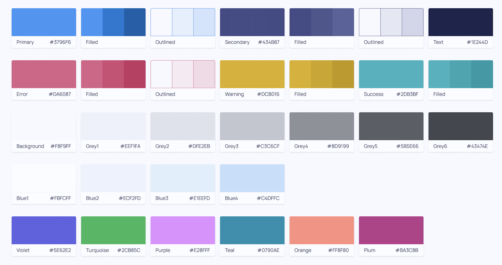
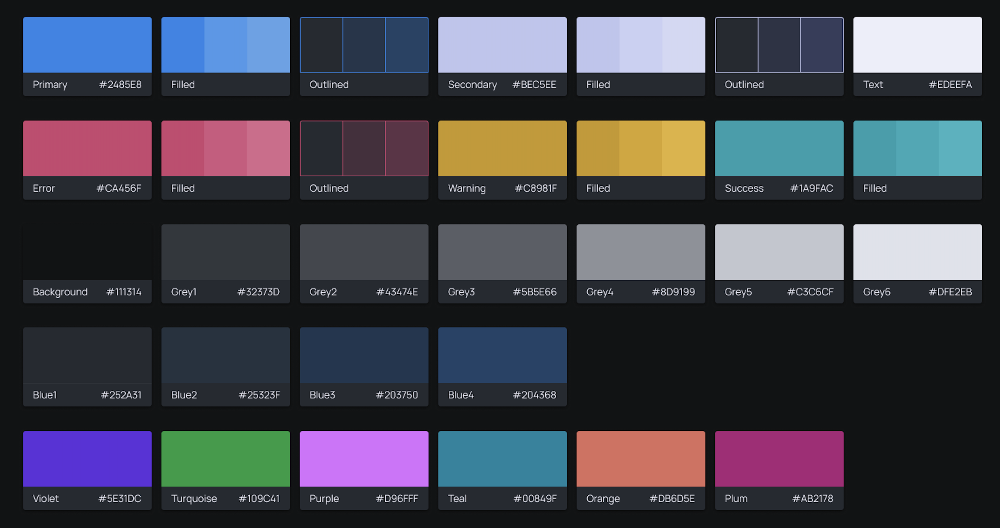

You may want to give your app a certain color scheme. Instead of specifying `color` in all your components with a hardcoded string, you should use a theme. This will ensure that you do not forget to add the color anywhere you may want it, and takes away the extra work in doing so. 

### App Themes

Dara provides two pre-built themes: one for light mode and one for dark mode. These themes include a set of default colors that can be applied across your app. Below are the default colors for each theme:




To apply a color from one of these themes to a component, you can use the following approach:

```python
from dara.components import Text
from dara.core.visual.themes.light import Light

Text('Hello World', color=Light.colors.teal)
```

This example applies the `teal` color from the `Light` theme to a `Text` component.

If you prefer to create a theme tailored to your brand, you can learn how to define your own theme [here](../advanced/custom-themes).

### Plotting Themes

Plotting components such as `Plotly` and `Bokeh` are unique in that they also can take default themes, this can be done with the following:

```python
from dara.components.plotting import set_default_bokeh_theme, set_default_plotly_theme

# provide theme object as expected by bokeh Document, see docs https://docs.bokeh.org/en/2.4.1/docs/reference/document.html#bokeh.document.Document.theme
set_default_bokeh_theme({ ... })

set_default_plotly_theme({ ... })
```

The `set_default_bokeh_theme` and `set_default_plotly_theme` takes a dictionary representation of the theme that each plotting library takes.

For example, you can use the following default Dara dark theme for Plotly:

```python
import plotly.express as px
from dara.components import Plotly, set_default_plotly_theme
from dara.components.plotting.plotly import dark_theme


df = px.data.iris()  # Using built-in Iris dataset
fig = px.scatter(df, x='sepal_width', y='sepal_length', color='species', title='Iris Dataset Scatter Plot')


set_default_plotly_theme(theme=dark_theme)
Plotly(figure=fig, min_height=500)
```

You can also modify the default themes for each plotting library by modifying the theme dictionary.
You can find the documentation for themes in the links below:
- For [Bokeh](https://docs.bokeh.org/en/latest/docs/reference/themes.html#theme)
- For [Plotly](https://plotly.com/javascript/reference/#layout)

### CSS & Reusable Components

If you only want to change the color of say, one type of component, you can use the principle of [reusable components](./reusing-components).

```python
from dara.components import Button

def GreenButton(content: str, **kwargs) -> Button:
    """
    Displays button in green
    """
    kwargs['raw_css'] = {'background-color': '#00FF00'}
    return Button(content, **kwargs)

```
