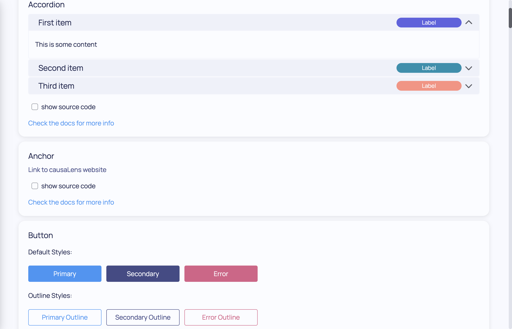
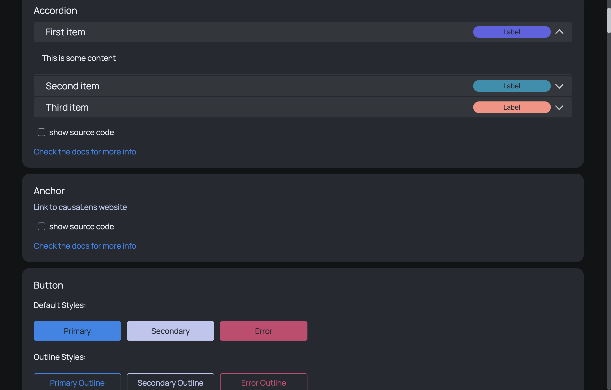

This section will run you through the fundamental parts of a Dara app.

### Configuration

Your `main.py` file is where you want to set up your configuration with Dara's `dara.core.configuration.ConfigurationBuilder`.

With the `ConfigurationBuilder` you can do the following:

1. Configure your app's look and feel customizing themes, and the template.
2. Setup authentication
3. Add your pages via the router.

Pages hold the contents of your app while extensions and plugins allow you to include the exact types of content that you want in your pages whether that be basic UI components, Bokeh plots, graph editors, file browsers and more.

```python title=main.py
from dara.core import ConfigurationBuilder
from dara.core.auth import BasicAuthConfig
from dara.components import Heading

# Create a configuration builder
config = ConfigurationBuilder()

# Add authentication
config.add_auth(BasicAuthConfig(username='test', password='test'))

# Register page
config.router.add_page(path='hello-world', content=Heading('Hello World!'))
```

With the code above, navigating to any URL in the app will redirect to the `/hello-world` page and display the `Heading` component with the text `Hello World!`.

### Extensions

The core of Dara framework comes with many functionalities such as interactivity and the base rendering engine. By design, the framework is also easily extendable with extra components and other features via outside packages and plugins.

Extensions are packages distributing related functionality - for most of them it is UI components and/or interactivity actions to be used within your applications. In addition extensions can also choose to distribute:

- REST endpoints, either to be consumed by the components or for programmatic access
- Startup functions
- Scheduled jobs
- Any other utilities

#### Usage

The simplest extension that comes with the Dara framework is the `dara-components`. This extension adds a range of common UI components to quickly extend upon the basic functionality of the page system.

This is the extension used in the above `Hello World` app example. Using the dashboarding extension is as simple as importing the UI component, `dara.components.common.heading.Heading`, and using it as your page's content.

:::info

Dara needs to know about your components ahead of time, in part because it needs to be able to install their JavaScript implementation packages. While one can register the components explicitly, this is not necessary thanks to the [import discovery process](../advanced/import-discovery).

:::


### Plugins

Larger reusable pieces of code can be distributed as Dara plugins. They are simply functions that run on the `ConfigurationBuilder` instance. They can then choose to call any of the configuration APIs to enhance your application.

```python
# in a custom package
from dara.core import ConfigurationBuilder

def my_custom_plugin(config: ConfigurationBuilder):
    """A custom plugin which enhances the configuration"""
    config.add_endpoint(my_custom_endpoint)
    config.add_configuration(CustomEndpointConfig(...))
    config.on_startup(my_custom_startup_hook)

# In your app
from dara.core import ConfigurationBuilder
from my_custom_package import my_custom_plugin

config = ConfigurationBuilder()
my_custom_plugin(config)
```

### Pages

Pages hold the contents of your app. They are added with methods available on the `Router` instance - a default router is created for you in the `router` property of the `ConfigurationBuilder` instance.

```python title=main.py
from dara.core import ConfigurationBuilder
from dara.components import Heading, Text

# Create a configuration builder
config = ConfigurationBuilder()

# Register pages
config.router.add_page(path='hello-world', content=Heading('Hello World!'))
config.router.add_page(path='my-second-page', content=Text('Hello World, again.'))
```

You can add your second page by calling `router.add_page` a second time. With the code above, there will be two pages in the app:
- navigating to `/hello-world` will display the `Heading` component with the text `Hello World!`
- navigating to `/my-second-page` will display the `Text` component with the text `Hello World, again.`
- navigating to any other path will redirect back to the first available page, in this case `/hello-world`

For now, you will have to manually navigate to the URLs to see the pages in the app.
We will cover creating menus and other routing features in detail in the [Routing](./routing.mdx) section.

### Themes

To set a theme, use the `set_theme` method on the `ConfigurationBuilder`. The default theme is `Light`.



In addition to the default there is the option of `Dark`.

```python
from dara.core import ConfigurationBuilder

config = ConfigurationBuilder()

config.set_theme('dark')
```



:::tip

Check out the [Custom Themes](../advanced/custom-themes.md) section to learn more about how you can customize the theme in your applications.

:::

### Next Steps

The foundation of pages are components whether that be basic components from extensions like `dara-components`, specialized components from other extensions, or self-made components. In the next section you will learn more about them so you can start building your own pages with ease.
