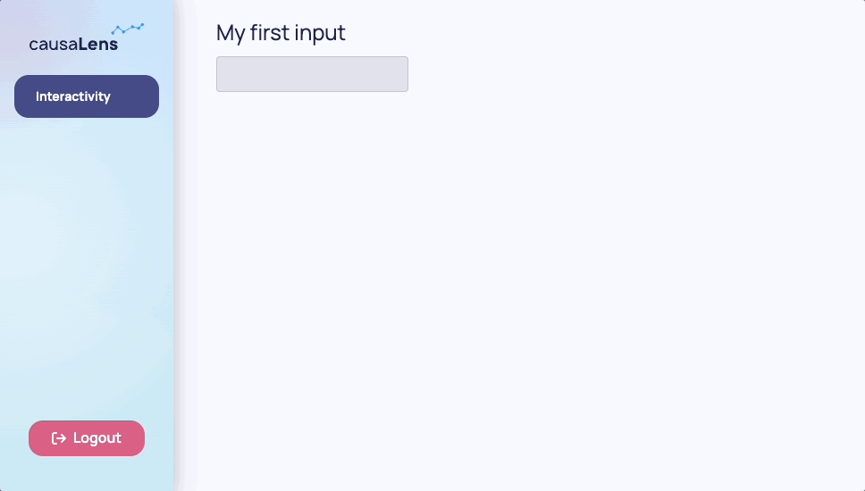
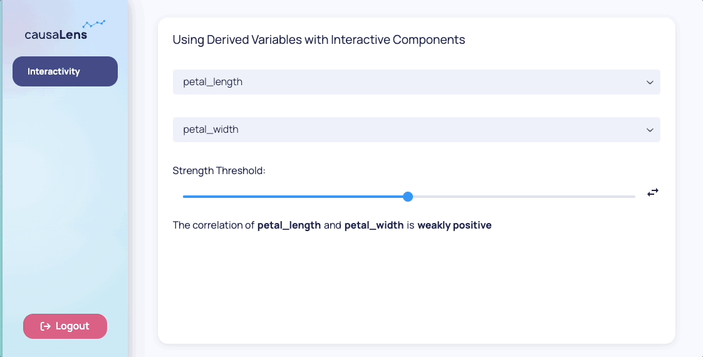

This page will introduce you to the reactivity system used in the Dara framework. The reactivity system allows you to connect parts of your app together and enable user interaction on the UI.

As underlined by the [Guiding Principles](./whats-dara#guiding-principles), to achieve as close to native web performance as possible, the framework only makes calls to the backend when absolutely necessary. The interactivity tools introduced in this page allow this type of performance.

The first tool is the `dara.core.interactivity.plain_variable.Variable`, which allow the end-user to see and interact with values in the frontend.

The second tool is the `dara.core.visual.dynamic_component.py_component` which allow you to use the current value of a single, or set of, Variable(s) to determine the components and layout present on a page.

## Variables

In this section you will walk through some different Variable types. Variables contain values that live entirely in the frontend.

### `Variable`

`dara.core.interactivity.plain_variable.Variable` is the core of Dara framework's reactivity system. It represents a dynamic value that can be read and written to by components. The state is managed entirely in the user's browser which means there is no need to call back to the Python server on each update.

```python
from dara.core import Variable

my_first_variable = Variable()
```

You can give your variable an initial `default` value of any type:

```python
my_variable_with_default = Variable(default='initial value')
```

<details>
<summary>What can you store in a <code>Variable</code>?</summary>

Values stored by a `Variable` do not have to be primitive types. They can also store JSON serializable types such as lists and dictionaries. As an example, you could store a dictionary representing application state in a single Variable:

```python
state = Variable({
    'input_value': 'Text',
    'settings': {
        'language': 'English'
    }
})
```

You could then use the .get(key) method available on `Variable` instances to specify a piece of a more complex state to pass into components. The framework will make sure to only retrieve or update the specified part of the variable.

```python
state = Variable({
    'input_value': 'Text',
    'settings': {
        'language': 'English'
    }
})

page_content = Stack(
    # Only `input_value` will be displayed
    Text(text=state.get('input_value')),
    # Only the specified property will be updated
    Input(value=state.get('input_value')),
    # You can chain the `get` calls to specify a sub-property to use
    Input(value=state.get('settings').get('language'))
)
```

</details>

:::tip
A `Variable`'s source of truth can be customized by providing a `store` parameter. This enables features like URL persistence, browser storage, and collaboration across users. For more information about available store options, [check out the persistence guide](../advanced/persistence-and-collaboration.mdx).
:::

:::caution
You cannot extract values from or do operations on a `Variable` through traditional Python code.

For example, this calculation:

```
Variable(15) + Variable(5)
```

will not equal 20 and will not compile in the first place.

In the later sections of this page you will learn how to update a `Variable` and extract values from the `Variable` to perform calculations and update the frontend.

:::


### `SwitchVariable`

`dara.core.interactivity.switch_variable.SwitchVariable` provides a powerful way to create conditional logic in your application by switching between different values based on conditions or value mappings. This is particularly useful for implementing if/else logic, status mappings, and dynamic content selection without requiring backend calls.

A `SwitchVariable` evaluates reactively - whenever its input variables change, it automatically recalculates and updates dependent components. This makes it perfect for creating responsive UIs that adapt to user input or application state.

There are two main patterns for creating `SwitchVariable`s:

#### Boolean Conditions with `SwitchVariable.when()`

The `when()` method is ideal for simple if/else logic where you want to switch between two values based on a true/false condition:

```python
from dara.core import ConfigurationBuilder, Variable, SwitchVariable
from dara.components import Stack, Text, Button, Card

config = ConfigurationBuilder()

# User authentication state
is_logged_in = Variable(default=False)

# Switch between different UI messages based on login status
welcome_message = SwitchVariable.when(
    condition=is_logged_in,
    true_value='Welcome back! You are logged in.',
    false_value='Please log in to continue.'
)

# Switch between different button text
button_text = SwitchVariable.when(
    condition=is_logged_in,
    true_value='Logout',
    false_value='Login'
)

# Complete authentication component
page_content = Card(
    Stack(
        Text(text=welcome_message),
        Button(text=button_text, onclick=is_logged_in.toggle())
    ),
    title='Authentication Demo'
)

config.router.add_page(path='authenticated', content=page_content)
```

You can also use complex conditions with other variables:

```python
from dara.core import Variable, SwitchVariable, ConfigurationBuilder
from dara.components import Stack, Text, Input, Card

config = ConfigurationBuilder()

# Temperature-based clothing advice
temperature = Variable(default=20)
advice = SwitchVariable.when(
    condition=temperature > 25,
    true_value='Wear light clothes - it\'s warm!',
    false_value='Wear warm clothes - it\'s cool!'
)

# Complete weather advice component
weather_component = Card(
    Stack(
        Text('Enter temperature (°C):'),
        Input(value=temperature, type='number'),
        Text('Advice:'),
        Text(text=advice)
    ),
    title='Weather Advice'
)

config.router.add_page(path='weather', content=page_content)
```

The base variable type overrides the `__eq__` and other comparison operator methods to return a `Condition` object. In the above example we compare the `temperature` variable to the number 25, which returns a `Condition` object that the `SwitchVariable` understands how to evaluate whenever your `Variable` changes.

#### Value Mapping with `SwitchVariable.match()`

The `match()` method is perfect for mapping specific values to corresponding outputs, similar to a switch statement:

```python
from dara.core import ConfigurationBuilder, Variable, SwitchVariable
from dara.components import Stack, Text, Select, Item, Card

config = ConfigurationBuilder()

# User role selection
user_role = Variable(default='guest')

# Map roles to permission descriptions
permission_text = SwitchVariable.match(
    value=user_role,
    mapping={
        'admin': 'Full access to all features',
        'editor': 'Can create and edit content',
        'viewer': 'Read-only access',
        'guest': 'Limited access to public content'
    },
    default='Unknown role - contact administrator'
)

# Map roles to UI themes
theme_class = SwitchVariable.match(
    value=user_role,
    mapping={
        'admin': 'admin-theme',
        'editor': 'editor-theme',
        'viewer': 'viewer-theme'
    },
    default='default-theme'
)

# Complete role management component
page_content = Card(
    Stack(
        Text('Select your role:'),
        Select(
            value=user_role,
            items=[
                Item(label='Administrator', value='admin'),
                Item(label='Editor', value='editor'),
                Item(label='Viewer', value='viewer'),
                Item(label='Guest', value='guest')
            ]
        ),
        Text('Permissions:'),
        Text(text=permission_text),
        Text('Theme:'),
        Text(text=theme_class)
    ),
    title='Role Management'
)

config.router.add_page(path='role', content=page_content)
```

#### Advanced Usage

`SwitchVariable` can work with other variables as mapping sources:

```python
from dara.core import Variable, SwitchVariable
from dara.components import Stack, Text, Select, Item, Card

# Dynamic mapping based on another variable
status_messages = Variable({
    'loading': 'Please wait...',
    'success': 'Operation completed successfully!',
    'error': 'Something went wrong. Please try again.',
    'idle': 'Ready to start'
})

current_status = Variable('idle')

# Use a variable as the mapping source
status_display = SwitchVariable.match(
    value=current_status,
    mapping=status_messages,
    default='Unknown status'
)

# Complete status display component
status_component = Card(
    Stack(
        Text('Current Status:'),
        Select(
            value=current_status,
            items=[
                Item(label='Idle', value='idle'),
                Item(label='Loading', value='loading'),
                Item(label='Success', value='success'),
                Item(label='Error', value='error')
            ]
        ),
        Text('Status Message:'),
        Text(text=status_display)
    ),
    title='Dynamic Status Display'
)
```

:::tip
**Key Serialization**: When using mappings with `SwitchVariable`, remember that JSON object keys are always strings. The system automatically converts lookup keys to strings, so `{True: 'admin', False: 'user'}` becomes `{"true": "admin", "false": "user"}` in the frontend. Dara handles the e.g. boolean and number cases for you on a best-effort basis but it's a good thing to keep in mind in case you run into unexpected behaviour.
:::

:::note
`SwitchVariable` is read-only like `DerivedVariable`. Its value can only change when the underlying condition or input variables change. You cannot directly update a `SwitchVariable` using actions or component interactions.
It should be preferred over a `DerivedVariable` as much as possible as it is more performant, avoiding a backend roundtrip.
:::

### Interaction Through Components

As mentioned earlier, a `Variable` cannot be written to with traditional Python code. However, `Variable`s can be written to by components that enable interactivity. You were briefly introduced to these in the last section and now you will see how to use them throughout this section.

The example below shows how to use the `dara.components.common.input.Input` component to enable input from the user. The component accepts a `value`, which should be a `Variable` instance, and will allow the user to enter free text into the field. The `Input` will update the value with whatever is typed into the field.

```python
from dara.core import ConfigurationBuilder, Variable
from dara.components import Input, Heading, Stack, Text

config = ConfigurationBuilder()

my_first_variable = Variable()

page_content = Stack(
        Heading('My first input', level=2),
        Input(value=my_first_variable),
        Text(text=my_first_variable)
    )

config.router.add_page(path='input', content=page_content)
```



In the above example, whenever the `Input` field changes, it updates the value of `my_first_variable` and its value is displayed in the `Text` component. The whole process is synchronized as the value is stored entirely in the frontend so there are no calls to the Python server.

### Interaction Through Actions

The components mentioned above offer a way to directly update Variables. Another way to update Variables is through actions. Actions can be found in the core framework along with `Variable` and they work
by being passed to a component's callback parameter. A callback is simply a function that is passed as an argument to another function.

The primary way to create actions in Dara is the `@action` decorator. This decorator takes a function and returns an action that can be passed to a component's callback.
It injects an `ActionCtx` object as the first argument of the function, which contains the input sent from the component and exposes action methods to update the state of the application.

:::note

The action methods on `ActionCtx` are `async` and must be `await`-ed, so your decorated function should be `async` as well.
To learn more about `async` and `await` in Python, check out [this blogpost](https://realpython.com/async-io-python/).

:::

```python
from dara.core import action, Variable
from dara.components import Select, Item

some_variable = Variable(1)
other_variable = Variable(2)

@action
async def my_action(ctx: action.Ctx, arg_1: int, arg_2: int):
    # Value coming from the component, in this case the selected item
    value = ctx.input
    # Your action logic...

    # Update `some_variable` to `value` multiplied by 2 by arg_1 and arg_2
    await ctx.update(variable=some_variable, value=value * arg_1 * arg_2)


Select(
    items=[Item(label='item1', value=1), Item(label='item2', value=2)],
    onchange=my_action(2, other_variable)
)
```

The example above shows how to use the `@action` decorator to create an action that updates a `Variable` with the value of the selected item in a `Select` component multiplied by the static `2` argument and current value of `other_variable`.
The `@action`-decorated function can take a mixture of regular Python variables and Dara `Variable`-based arguments in any combination. The `@action` decorator will automatically resolve the `Variable`-based arguments so your function will receive the current value of the `Variable` instead of the `Variable` instance.

The `dara.components.common.button.Select` component has an `onchange` parameter which accepts an action. A valid argument to an action parameter is one of the following three options:

- An instance of an `@action`-decorated function (as in the example above).
- An instance of an individual static action object.
- A list of a combination of the above two options.

:::warning

Passing a list of `@action`-decorated functions to an action prop is deprecated and will not be supported in future versions of Dara. This is because it requires
the app to make a request to the backend server for each action in the list, which is not performant. Instead, you should use the `@action` decorator to create a single action
and compose them. Learn more about composing actions [here](./actions.md#composing-actions).

:::

One example of a static action object is the result of calling `sync` on a `Variable` instance. This creates an action object which, when passed to an action prop,
will update the variable with the value of the input sent from the component.

```python
from dara.core import action, Variable
from dara.components import Select, Item

some_variable = Variable()

Select(
    items=[Item(label='item1', value=1), Item(label='item2', value=2)],
    onchange=some_variable.sync()
)
```

The example above shows how to use the `sync` method to create an action that updates a `Variable` with the value of the selected item in a `Select` component.
Other interactive components like `Button`s have corresponding callback parameters, e.g. `onclick`, `onchange` or similar.

In summary, to trigger an update based on user interaction simply pass an action to your component's callback. The `@action` decorator allows you to create
a complex action flow with multiple steps, control flow and error handling. For simpler use cases, you can use shortcuts like `sync` to create one-off actions for
common operations like updating a variable with the value of the input sent from a component.
To see more actions checkout the [Actions](./actions.md).

### `DerivedVariable`

As mentioned earlier, values cannot be extracted from `Variable`s with traditional Python code. However, the values of a `Variable` can be extracted and used for calculations in a `dara.core.interactivity.derived_variable.DerivedVariable`.

The primary purpose of a `DerivedVariable` is to transform a set of raw state variables from the frontend browser into a single new derived state from a calculation on the backend server. This state can then be shared into components in the same way as other `Variable`s. This is particularly useful for running expensive or long running tasks such as machine learning or data processing steps.

When defining a `DerivedVariable`, you have to specify a function and a list of `Variable`s or other `DerivedVariable`s to that function. Every time one of the specified variables changes, the function is re-run with the current values of the variables.

```python
from dara.core import Variable, DerivedVariable

x = Variable(10)
y = Variable(15)
result = DerivedVariable(lambda a, b: a + b, variables=[x, y])
```

:::info
What is going on under the hood?

1. The browser collects the state of the browser-side `Variable`s listed in the `DerivedVariable`s argument, `variables`. It does so recursively so that you can define `DerivedVariable`s based on other `DerivedVariable`s.
2. The browser then sends a single request comprising of all of these states to the backend server.
3. The server makes necessary calculations based on these values, again acting recursively so that if your `DerivedVariable` lists another `DerivedVariable` as an input, that value will be ready for the `DerivedVariable` in question.
4. Your resolved function is executed with the final raw values so that you can perform any custom Python logic involving these values.

:::

The example below will show you how `DerivedVariable`s can work with interactive components to render dynamic output based on the user's input. The example allows the user to select which features for which they would like to calculate the correlation coefficient. The output will tell them the strength and sign of the correlation.

The features are selected with the `Select` component, which takes a list of `items` to select from and a `value` in which to store the selection. What is strong and what is weak is determined by the threshold that can be set via the `Slider` component. This component takes a `domain` determining the range, a `step` determining the increment of the slider, and `values` in which to store the values the slider lands on. Similar to how you made the `Input` component in the example previously, these values will be `Variable`s.

```python
import pandas
import numpy

from dara.core import ConfigurationBuilder, Variable, DerivedVariable
from dara.components import Card, Text, Spacer, Paragraph, Select, Slider, Label

config = ConfigurationBuilder()

data = pandas.DataFrame(
    {
        'sepal_length': [5.1, 4.9, 4.7, 4.6, 5.0, 5.4, 4.6, 5.0, 4.4, 4.9, 5.4, 4.8, 4.8],
        'sepal_width': [3.5, 3.0, 3.2, 3.1, 3.6, 3.9, 3.4, 3.4, 2.9, 3.1, 3.7, 3.4, 3.0],
        'petal_length': [1.4, 1.4, 1.3, 1.5, 1.4, 1.7, 1.4, 1.5, 1.4, 1.5, 1.5, 1.6, 1.4],
        'petal_width': [0.2, 0.2, 0.2, 0.2, 0.2, 0.4, 0.3, 0.2, 0.2, 0.1, 0.2, 0.2, 0.1],
    }
)

def correlation(x, y, threshold):
    corr = numpy.corrcoef(data[x], data[y])[0, 1]
    if abs(corr) >= threshold:
        strength = 'strongly'
    else:
        strength = 'weakly'

    if corr > 0:
        sign = 'positive'
    else:
        sign = 'negative'
    return f'{strength} {sign}'


selected_x = Variable('petal_length')
selected_y = Variable('petal_width')
strength_threshold = Variable([0.5])

corr_xy = DerivedVariable(correlation, variables=[selected_x, selected_y, strength_threshold])

page_content = Card(
    Spacer(),
    Select(value=selected_x, items=[*data.columns]),
    Spacer(),
    Select(value=selected_y, items=[*data.columns]),
    Spacer(),
    Label(Slider(value=strength_threshold, domain=[0, 1], step=0.1), value='Strength Threshold:'),
    Paragraph(
        Text('The correlation of '),
        Text(selected_x, bold=True),
        Text(' and '),
        Text(selected_y, bold=True),
        Text(' is '),
        Text(corr_xy, bold=True),
    ),
    title='Using Derived Variables with Interactive Components',
)

# Adding page
config.router.add_page(path='interactivity', content=page_content)
```



There are several more advanced configuration options available on a `DerivedVariable`. One advanced setting is the `deps` parameter. This parameter gives you control over when the recalculation of the `DerivedVariable` happens.

The possible values are:

- `None`: (the default) the function specified in a `DerivedVariable` is rerun each time any of its dependant variables change
- A list of variables: (subset of all variables used by the function) the function specified in a `DerivedVariable` is rerun only when these specified variables change
- `[]`: the variable will only calculate its value on page load which could be useful in combination with the next advanced feature, a `trigger`

```python
x = Variable(10)
y = Variable(15)

def expensive_computation(x, y):
    value = # Some complex computation...
    return value

# Only 'x' changing will trigger a re-calculation; all updates to 'y' will be ignored
result = DerivedVariable(expensive_computation, variables=[x, y], deps=[y])
```

In this example, `result` will only be recalculated when `y` is updated.

:::caution
It is important to note that it is _not_ possible to update a `DerivedVariable` directly. Its value can only be changed if one of its dependant variables changes. This is because a `DerivedVariable` is a read-only piece of derived state.
:::

As shown earlier, interactive components often take functions or callbacks, called actions, as parameters to specify what should happen upon some user interaction. The `DerivedVariable` provides a helper method `trigger` which returns a ready-to-use action that forces the `DerivedVariable` to recalculate with the current values of its variable list.

To continue the described scenario:

```python
x = Variable(10)
y = Variable(15)

def expensive_computation(x, y):
    value = # Some complex computation...
    return value

# result will calculate on page load
result = DerivedVariable(expensive_computation, variables=[a, b], deps=[])

# result will only be recalculated when this button is clicked
layout = Stack(
    ...
    Button('Calculate', onclick=result.trigger())
)
```

This feature is useful in a scenario when the computation is very expensive and takes multiple inputs. It should not be rerun every time a user changes one of the settings as you would want to group the updates together.

<details>
<summary><h3 style={{margin: '0px 0px 0px 0px'}}> Tasks:<code>DerivedVariables</code> with Heavy CPU Calculations</h3></summary>

CPU bound calculations are calculations that require intensive processing. Typically this will include machine learning calculations or expensive data manipulations. These calls block not only the thread they are running on, but all the other threads of the webserver as well. This is due to python's GIL (Global Interpreter Lock) and if you want to avoid this then you need to offload these calculations to separate processes, or even to another machine if you have it available. You can learn more about python's Global Interpreter Lock [here](https://docs.python.org/3/c-api/init.html#thread-state-and-the-global-interpreter-lock).

Offloading computation to another process can get complicated fairly quickly, so Dara provides an easy way define certain functions as tasks that can be offloaded to another process outside the main one running your web app.

To use this feature you must put the definition of the `DerivedVariable`'s resolver into a file of your choice.

```python title=my_app/tasks.py
def task_func(var1, var2):
    """ Mock task function """
    result = # some expensive calculation
    return result

```

You should then import the resolver function where you need it. You also need to set `run_as_task` to `True` on the `DerivedVariable` you are working with. This tells the app to spin up another process to run this function. You also need to set the `task_module` property on the config which specifies the name of the module where your task resolver functions are located.

```python title=my_app/main.py
from my_app.tasks import task_func
...

my_var1 = Variable()
my_var2 = Variable()
results = DerivedVariable(
    task_func,
    variables=[my_var1, my_var2],
    run_as_task=True
)

@py_component
def display_results(results):
    # Do something with the results here and return some dashboarding components based on the results.
    return Stack(
        ...
    )

config.router.add_page(path='expensive-calculation', content=display_results(results))

config.task_module = 'my_app.tasks'
```

:::tip
If you have long-running tasks, it helps to let the end-user know the progress through a progress bar. This utilizes the `track_progress` feature of `py_component`s or is set in Dara components directly. Check out [**Advanced: Progress Tracking**](../advanced/progress-tracking) to learn more.
:::

Alternatively, you can use the `run_task` action to run a task imperatively upon a user action. Check out [run_task](./actions#run_task) to learn more.


</details>

#### `Variable.create_from_derived`

`DerivedVariable`s represent the result of a computation and are read-only. They can only be modified by changing one of their input variables. However, you may want to use the value of a `DerivedVariable`as a starting point for a mutable `Variable` that users can modify.

You can achieve this using the `dara.core.interactivity.plain_variable.create_from_derived` static method on the `Variable` class. It creates a new `Variable` instance that is initially bound to the `DerivedVariable` passed as an argument. The resulting `Variable` will be mutable, like any other `Variable`. At first, it will mirror the value of the `DerivedVariable`. Once it's explicitly modified, e.g. by a component or an action, it will stop mirroring the `DerivedVariable` value.

```python
from cai_causal_graph import CausalGraph
from dara.components import CausalGraphViewer
from dara.core import DerivedVariable, Variable

def compute_causal_graph(...) -> CausalGraph:
    return CausalGraph(...)

# read-only computed CausalGraph
computed_cg = DerivedVariable(compute_causal_graph, variables=[...])

# mutable copy
mutable_cg = Variable.create_from_derived(computed_cg)

# use the mutable copy for the viewer so the up-to-date value can be used elsewhere
CausalGraphViewer(causal_graph=mutable_cg)
```

The example above demonstrates a common use case for `Variable.create_from_derived` with editor-like components. The initial value for the user to interact with, in this case a `CausalGraph` instance, is computed using a `DerivedVariable`. To make this value editable, you create a mutable copy using `Variable.create_from_derived` and pass it to the `CausalGraphViewer`. This enables the user to update the `mutable_cg` variable, which can also be used elsewhere to represent the current editor state, while keeping `computed_cg` as the original `CausalGraph`.

To revert the `Variable` back to its initial state, use the `ResetVariables` action to re-bind it to the `DerivedVariable` it was created from.

```python
from dara.core import ResetVariables
from dara.components import Button

Button('Reset', onclick=ResetVariables(variables=[mutable_cg]))
```

After resetting the `Variable` will mirror the `DerivedVariable` it was created from until it is modified once more. This means that if the `DerivedVariable` has changed since the `Variable` was last bound to it, the `Variable` will now reflect the latest value of the `DerivedVariable` after the reset.

#### Caching

The results of a `DerivedVariable` are cached on the backend server. So, when a `DerivedVariable` is called with values of arguments it has already been called with in the past, there does not need to be a re-calculation.

There are different levels of caching that a `DerivedVariable` can offer and you can specify your choice in the `DerivedVariable`'s `cache` argument. The different levels of caching are defined in the `CacheType` enumeration.

```python
from dara.core import CacheType

results = DerivedVariable(
    task_func,
    variables=[my_var1, my_var2],
    run_as_task=True,
    cache=CacheType.GLOBAL
)
```

You have the following options for caching your `DerivedVariable`s:

- `CacheType.GLOBAL`: (default setting) calculation results are stored in a global cache across all users and are able to be reused if a calculation is invoked with the same set of arguments
- `CacheType.SESSION`: behaves similarly to `global` with the only difference being that calculation results are cached per session
- `CacheType.USER`: behaves similarly to `session` with the only difference being that calculation results are cached per user across sessions/logins
- `None`: disables caching and causes the `DerivedVariable` calculation to be reran every time.

Global caching enables the best performance. The further you go down the list, the more you will have your `DerivedVariable`s being recalculated.

:::note
The `trigger` method takes an optional `force` argument specifying whether you want the forced recalculation to also act as a _cache buster_ , replacing the values stored in the cache and essentially ignoring the caching settings specified on the variable. The default of `force` is True.
:::

In addition to the cache `type`, you can also specify the `policy` to use, which determines how items are retained or evicted from the cache.The default policy is an `LRU` (Least Recently Used)
cache with a maximum size of 10 items (globally, or per user/session depending on the `CacheType` set). For a detailed explanation of the available cache policies and how to use them,
refer to [Cache Policies Documentation](../advanced/cache-policies.mdx).

#### State Tracking

`DerivedVariable`s provide three built-in state tracking properties (that return internal `StateVariable` instances) to help you monitor the execution state of your derived calculations:

- `is_loading`: Returns `True` when the `DerivedVariable` is currently calculating, `False` otherwise
- `has_error`: Returns `True` when the `DerivedVariable` calculation resulted in an error, `False` otherwise
- `has_value`: Returns `True` when the `DerivedVariable` has a resolved value (successful calculation), `False` otherwise

These state variables are particularly useful for creating responsive UIs that show loading states, error handling, and conditional rendering based on calculation status.

```python
from dara.core import Variable, DerivedVariable
from dara.components import Stack, Text, Button, Input, If

# Variables for calculation
x = Variable(10)
y = Variable(5)

# Expensive calculation that might take time
def expensive_calculation(a, b):
    import time
    time.sleep(2)  # Simulate expensive operation
    if b == 0:
        raise ValueError("Division by zero!")
    return a / b

result = DerivedVariable(expensive_calculation, variables=[x, y])

page_content = Stack(
    Text("Enter values:"),
    Input(value=x, type='number'),
    Input(value=y, type='number'),
    Button("Recalculate", onclick=result.trigger()),

    # Conditional rendering based on calculation state
    If(
        result.is_loading,
        Text("Calculating...")
    ),
    If(
        result.has_error,
        Stack(
            Text("❌ Calculation failed!", color='red'),
            Text("Please check your inputs"),
            align='center'
        )
    ),
    If(
        result.has_value,
        Stack(
            Text("✅ Calculation complete!", color='green'),
            Text(f"Result: {result}"),
            align='center'
        )
    )
)
```

:::note
The `StateVariable` instances are read-only and automatically managed by their parent `DerivedVariable`.
They also cannot be used as inputs to other `DerivedVariable`s to prevent complex dependency cycles. They should mostly be used directly
within `If` components or via `SwitchVariable`s.
:::

## Control Flow Components

Dara provides a few components that let you declaratively define the control flow of your application.

### Conditional Rendering with `If`

The `dara.components.common.if_cmp.If` lets you conditionally render different components based on a condition.

Conditions are defined with a `dara.core.interactivity.condition.Condition` object, which can be defined manually or by using a normal comparison operator on a Variable instance, e.g. `Variable() == True` - variables override comparison operators to create the condition objects automatically.
The component then accepts one required set of children (`true_children`) and one optional set (`false_children`).
The first set (`true_children`) will be rendered if the condition is truthy and the second set (`false_children`) will be rendered if the condition is falsey.

```python
from dara.core import Variable
from dara.components.common import If, Text

var_1 = Variable(True)
var_2 = Variable(False)

# condition created by using the == operator on two variables
If(
    condition=var_1 == var_2,
    true_children=Text('Equal'),
    false_children=Text('Different')
)

# condition created by using the == operator on a variable and a constant
If(
    condition=var_1 == True,
    true_children=Text('Equal'),
    false_children=Text('Different')
)
```

The component also accepts a `DerivedVariable` as the condition for more complex conditions.

This component should be the go-to component for conditional rendering in Dara apps as it's optimized to perform client-side comparisons in most cases without extra round-trips to the server.

### List rendering with `For`

The `dara.core.visual.components.for_cmp.For` component lets you generate multiple elements from a collection of data where each element corresponds to an item in the collection.

It accepts a data source in the `items` prop which can any Dara variable that contains an iterable value (i.e. a list).

To generate the elements, the component accepts a `renderer` prop which is a component that will be rendered for each item in the data source. In order to use item-specific data, you can use the `.list_item` property on the variable holding the value which returns a `LoopVariable` instance.

For primitive values, `.list_item` is then replaced with the value of each item in the list.

```python
from dara.core import Variable
from dara.core.visual.components import For

my_list = Variable([1, 2, 3])

# Renders a list of Text component where each item is the corresponding item in the list
For(
    items=my_list,
    renderer=Text(text=my_list.list_item),
    placeholder=Text('No items') # fallback component to render if the data source is empty
)
```

To support a list of objects (dicts), `LoopVariable` behaves like a dict (i.e. supports index access with `[key]` or `.get(key)`) to retrieve a reference to a given field which will be replaced with the value of that key for each item in the list.

Note that you should specify the `key_accessor` argument to specify which field to use as the unique identifier to optimize the performance of the component. If you don't specify it, the index of the item in the list will be used instead which might cause issues when the list is updated or re-ordered.

```python
from dara.core import Variable
from dara.core.visual.components import For

my_list = Variable([{'id': 1, 'name': 'John', 'age': 30}, {'id': 2, 'name': 'Jane', 'age': 25}])

# Renders a list of Text component where each item is the corresponding `item.name` in the list
For(
    items=my_list,
    renderer=Text(text=my_list.list_item.get('name')),
    key_accessor='id'
)
```

This component should be preferred whenever you need to render a list of elements based on a collection of data. It is optimized to perform rendering client-side and doesn't require any extra round-trips to the server.

## `ServerVariable`

There are cases where your data is too large to send to the client, or is simply unserializable. In those and other cases, you can use a `ServerVariable`. It represents **synchronized server state**.

You will learn more about it in the [Handling Data section](./handling-data.mdx).

## `py_component`

The final piece of the interacitivity puzzle is the `py_component` function. It is a decorator which lets you create a dynamic layout based on the current state of an application's variables.

It is similar to a `DerivedVariable` in that it is a derived state from the backend server based on the values in the frontend. It is different though in that it returns a component to render in the frontend instead of just a value. Another difference is that the values returned from it are not cached and the logic inside it runs every time its inputs change.

For those reasons, the `py_component` function should be thought of as an **escape hatch** from the optimized declarative rendering that Dara provides.

First, let's understand how it works and how to use it.


### `py_component` Usage

The `py_component`-decorated function can take a mixture of regular python variables and Dara `Variable`-based arguments in any combination. This lets you create reusable visual components to use within your application.

Similar to `DerivedVariable`s, any `py_component`-decorated function will only be rerun when one of its input variables changes.

```python
@py_component
def FormattedNumber(number: int, symbol: str):
    # number is a regular value here
    formatted = f'{symbol}{number}.00'
    return Text(text=formatted)

number_variable = Variable(20)
symbol_variable = Variable('$')

config.router.add_page(path='first', content=FormattedNumber(number_variable, '£'))
config.router.add_page(path='second', content=FormattedNumber(150, '£'))
config.router.add_page(path='third', content=FormattedNumber(number_variable, symbol_variable))
```

<details>
<summary>What is a python decorator?</summary>

Decorators allow you to add new functionality to an existing object without modifying its structure.

If you have the following function:

```python
def calculate_ratio(numerator: int, denominator: int):
    return float(numerator) / float(denominator)
```

You can define a decorator which wraps the function passed into it and makes it a percentage by multiplying it by 100.

```python
def make_percent(function):
    def wrapper():
        result = function()
        return f'{result * 100}%'

    return wrapper
```

The decorator takes a function as an argument so you can do the following:

```python
calculate_percent = make_percent(calculate_ratio)
calculate_percent(5, 10)

>>> 50%
```

This is a valid way to decorate a function but python provides an easier way to apply decorators with the @ symbol before the function you want to decorate.

```python
@make_percent
def calculate_ratio(numerator: int, denominator: int):
    return float(numerator) / float(denominator)

calculate_ratio(5, 10)

>>> 50%
```

You can learn more about decorators in [python's docs](https://docs.python.org/3/glossary.html#term-decorator).

</details>

:::tip
What is going on under the hood? The `py_component` decorator is extracting the values out of the `Variable`s or `DerivedVariables` that were passed into it so you can work with the raw values and perform logic with them.
:::

A `py_component` decorator can also be configured to specify:

- A `fallback` component to render whilst waiting for the component to be rendered. See [**Loading States**](../advanced/loading-states) for more information.
- A `polling_interval` causing the component to poll the backend and refresh itself every `n` seconds
- A `track_progress` flag to indicate whether progress tracking is enabled or not, defaulting to `False`. This is turns the fallback component into a progress bar if the component is waiting for a long-running task to complete. See [**Progress Tracking**](../advanced/progress-tracking) for more information.

You only need a `py_component` if you need to extract the values from `Variable`s for rendering a dynamic layout based on the value in the `Variable`. You do not have to unwrap `Variable`s if you just want to pass them to a component that accepts variables directly like `Text`.

:::tip
You should abstract any heavy logic in a `py_component` logic to a `DerivedVariable` when possible for better performance and code structure. Check out [**Best Practices: Light PyComponents**](../best-practices/light-pycomponents) to learn more.
:::

### You Might Not Need `py_component`

In the majority of cases, you will not need to use `py_component`. Removing `py_component`s from your code will make it more readable, performant and provide a better UX to your users. In this section you will learn how to avoid unnecessary `py_component`s.

Let's look at a few examples of common scenarios where you might be able to avoid the use of `py_component`s.

#### Conditional Rendering

Suppose you have a part of UI where you select a country from a list and then display details about it next to it if one is selected.
Your instinct might be to use a `py_component` to render the details side:

```python
from dara.core import Variable, py_component
from dara.components import Heading, Stack, Select, Text

# Some function to retrieve the details
def get_details(country: str) -> str:
    return f'Details for {country}'

selected_country = Variable(default=None)

# AVOID: unnecessary py_component:
# - involves simple control flow that could be handled with If
# - doesn't cache the results
@py_component
def CountryDetails(country: str | None):
    if country is None:
        return Text('No country selected')

    return Text(get_details(country))

def Content():
    return Stack(
        Heading('Select a country'),
        Select(
            value=selected_country,
            items=['USA', 'Canada', 'Mexico', 'UK', 'France'],
            placeholder='Select a country'
        ),
        Heading('Details'),
        CountryDetails(country=selected_country)
    )
```

There's a few issues with this approach:
- the entire `CountryDetails` part of the page will be re-rendered every time the `selected_country` changes
- we aren't utilizing any caching or memoization - if `get_details` comes from e.g. an external API, it will be called every time the `selected_country` changes

To avoid these, we could utilize `If` for conditional rendering and extract details into a `DerivedVariable`:

```python
from dara.core import Variable, DerivedVariable, py_component
from dara.components import Heading, Stack, Select, Text

# Some function to retrieve the details
def get_details(country: str) -> str:
    return f'Details for {country}'

selected_country = Variable(default=None)

# GOOD: DerivedVariable caches results per selected_country
details = DerivedVariable(lambda country: get_details(country), variables=[selected_country])

def Content():
    return Stack(
        Heading('Select a country'),
        Select(
            value=selected_country,
            items=['USA', 'Canada', 'Mexico', 'UK', 'France'],
            placeholder='Select a country'
        ),
        Heading('Details'),
        # GOOD: If for conditional rendering
        If(selected_country, Text(details), Text('No country selected'))
    )
```

When simple control flow is involved, **prefer `If` over `py_component`**. This is because `If` is optimized to perform client-side comparisons in most cases without extra round-trips to the server.

#### Displaying multiple elements based on a collection of data

A very common scenario you will encounter is trying to display multiple elements based on a collection of data. For example, you might have a list of items computed from a database and you want to display a list of `Card`s for each one with their details.

You might think to use a `py_component` to create the list of `Card`s dynamically:

```python
from typing import TypedDict
from dara.core import Variable, py_component
from dara.components import Card, Stack, Text, Heading

class DatabaseItem(TypedDict):
    id: int
    name: str
    description: str

async def get_items(query: str) -> list[DatabaseItem]:
    # fake DB API
    return await DB.query(name=query)

query = Variable(default='')
# Good: cached results per query
items = DerivedVariable(get_items, variables=[query])

# AVOID: unnecessary py_component
@py_component
def ItemsDisplay(items: list[DatabaseItem]):
    stack = Stack()

    for item in items:
        stack.append(
            Card(
                Stack(
                    Text(item['name']),
                    Text(item['description'])
                )
            )
        )

    return stack

def Content():
    return Stack(
        Heading('Search for items'),
        Input(value=query),
        Heading('Items'),
        # AVOID: unnecessary py_component
        ItemsDisplay(items=items)
    )
```

While this approach works, it is not ideal. The entire `ItemsDisplay` component will have to re-run every time the `items` variable changes. This is not very performant, as we need to make a round-trip to the server, and doesn't provide a great UX - the user will see the fallback display while the items are re-fetched.

To avoid this, we can use the built-in `For` component:

```python
from typing import TypedDict
from dara.core import Variable, DerivedVariable, py_component
from dara.components import Card, Stack, Text, Heading, For

class DatabaseItem(TypedDict):
    id: int
    name: str
    description: str

async def get_items(query: str) -> list[DatabaseItem]:
    # fake DB API
    return await DB.query(name=query)

query = Variable(default='')
# GOOD: cached results per query
items = DerivedVariable(get_items, variables=[query])

def Content():
    return Stack(
        Heading('Search for items'),
        Input(value=query),
        Heading('Items'),
        # GOOD: For component used to render multiple elements
        For(
            items=items,
            renderer=Card(
                Stack(
                    Text(items.list_item['name']),
                    Text(items.list_item['description'])
                )
            ),
            key_accessor='id'
        )
    )
```

This makes the code more readable and performant. The `For` component will not show its fallback display after the initial load of `items`, and will update whenever `items` changes.

You might notice that we're introducing a new problem here, state tearing - the `For` component will display effectively stale content while the new items are being fetched. You can show an affordance to the user while the content is being reloaded by combining the [`is_loading` state variable](#state-tracking) on `items` with the `SwitchVariable`:

```python
# rest of the code omitted for brevity

items = DerivedVariable(get_items, variables=[query])

For(
    items=items,
    renderer=Card(
        Stack(
            Text(items.list_item['name']),
            Text(items.list_item['description'])
        )
    ),
    key_accessor='id',
    raw_css=SwitchVariable.when(
        condition=items.is_loading,
        true_value='opacity: 0.5;',
        false_value=''
    )
)
```

In the snippet above, we're using the `SwitchVariable` to conditionally apply a CSS style to the `For` component. This is a common pattern in Dara apps, where you might want to show that the data is being fetched but still display the stale data. Alternatively, you might display e.g. a spinner next to the search box which you could achieve using an `If` based on the `is_loading` state as well.

#### Initializing state of a part of the page on load

There are a few common scenarios where you might want to initialize the state of your page based on some external system. Your instinct might be to use a `py_component`:

```python
from dara.core import py_component, ConfigurationBuilder, Variable
from dara.components import Text, Stack

@py_component
async def InnerContent():
    # AVOID: doing all the work in a py_component to initialize state
    db_countries = await DB.get_countries() # fake DB API
    available_countries = Variable(default=db_countries)
    selected_country = Variable(default=db_countries[0])

    return Stack(
        Heading('Select a country'),
        Select(
            value=selected_country,
            items=available_countries,
        ),
        Heading('Details'),
        # Omitted: details component for selected country
        CountryDetails(country=selected_country)
    )

config = ConfigurationBuilder()
config.router.add_page(path='countries', content=InnerContent())
```

In the above example, we're using a `py_component` to ensure the logic inside it runs on every page load and initializes the state of the page. This is a common pattern in Dara apps, where you might want to initialize the state of a page based on some external system, e.g. a database or an API. There are however a few issues with it:
- we're not utilizing any caching at all
- we're causing a waterfall of requests to the backend server
- the UX is not great - the user will immediately see a spinner since we have to request the `InnerContent` as soon as we navigate to the page

To avoid these issues, depending on your use case you might want to consider one of the following:

1. Use `DerivedVariable` and `Variable.create_from_derived` APIs for state initialization

```python
from dara.core import py_component, ConfigurationBuilder, Variable, Cache
from dara.components import Text, Stack

async def Content():
    # GOOD: retrieve the data in a cached DerivedVariable - cache setting can be tweaked to e.g. store for 30 seconds
    available_countries = DerivedVariable(DB.get_countries, variables=[], cache=Cache.TTL(ttl=30))

    # GOOD: compute first item and use it as default value for the Variable
    first_item = DerivedVariable(lambda: available_countries[0], variables=[available_countries], cache=Cache.TTL(ttl=30))
    selected_country = Variable.create_from_derived(first_item)

    return Stack(
        Heading('Select a country'),
        Select(
            value=selected_country,
            items=available_countries,
        ),
        Heading('Details'),
        # Omitted: details component for selected country
        CountryDetails(country=selected_country)
    )

config = ConfigurationBuilder()
config.router.add_page(path='countries', content=Content)
```

In the above example, `selected_country` will default to the computed `first_item` but keep user updates. Whenever `available_countries` change, it will reset back to the `first_item`.

2. Utilize a route `on_load` action to initialize the state

```python
from dara.core import py_component, ConfigurationBuilder, Variable, Cache, action
from dara.components import Text, Stack

available_countries = Variable()
selected_country = Variable()

# GOOD: initialize state on load based on external system
@action
async def countries_loader(ctx: action.Ctx):
    db_countries = await DB.get_countries() # fake DB API
    await ctx.update(variable=available_countries, value=db_countries)
    await ctx.update(variable=selected_country, value=db_countries[0])


async def CountriesContent():
    return Stack(
        Heading('Select a country'),
        Select(
            value=selected_country,
            items=available_countries,
        ),
        Heading('Details'),
        # Omitted: details component for selected country
        CountryDetails(country=selected_country)
    )

config = ConfigurationBuilder()
config.router.add_page(path='countries', content=CountriesContent, on_load=countries_loader())
```

Dara will ensure that the `countries_loader` runs before the page is rendered so the state is initialized.

## Architecture Summary

As mentioned in the introduction, Dara enables a close-to-native web app performance by offloading as much logic as possible into the browser. This optimization results in the app not needing to call into the server every time you want to change something on the screen.

This close-to-native performance is achieved by the concepts in this page. `Variable`s are updated in the frontend browser so they do not require server involvement. `SwitchVariable` lets you swap or map values based on a value or condition using simply client-side mapping. Server-side computed logic is handled by `DerivedVariable`s, including more heavy computations, with support for caching.  `ServerVariable` lets you keep large or unserializable data on the server and fit it into your reactivity graph. Control flow components such as `If` and `For` let you conditionally display different UI or map a collection of items into elements efficiently. If all else fails, `py_component` is an escape hatch that lets you compute an arbitrary tree of Dara components on the server based on a set of variables.


:::info
As mentioned, `DerivedVariable`s and `py_components` unwrap `Variable`s to expose their values. This has some caveats due to the architecture. Check out [**Best Practices: Retaining Correct Variable Types**](../best-practices/retaining-correct-variable-types) to learn more.
:::

## Next Steps

So far you have learned how to handle your app's information and interactivity by declaratively defining your derived variables and components. You will learn about responding to user interaction.
