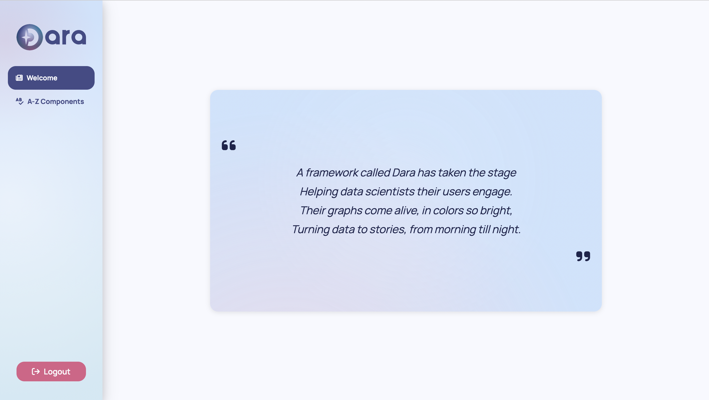
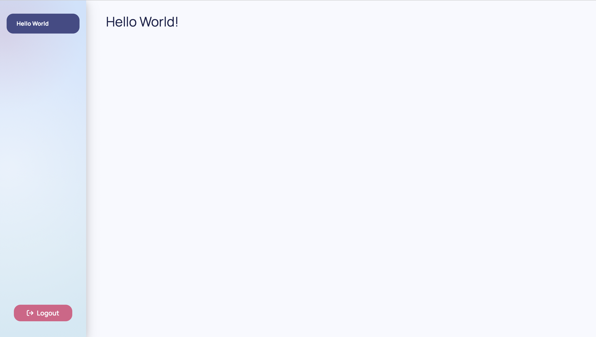

import Tabs from "@theme/Tabs";
import TabItem from "@theme/TabItem";

This page will walk you through the installation of Dara framework and the creation of a simple 'Hello World' app.

## Requirements

There are two prerequisites to being able to use the Dara framework:

- Python 3.10–3.12
- Node.js >=22.12.0 and pnpm 12 for development and builds. Generated apps include optional `mise.toml` pins; run `mise install` to use them. Deployment with `dara start` needs only Python and compiled output.

You can install both of these via the Homebrew package manager on MacOS or follow the instructions on their
websites: [Python](https://www.Python.org/about/gettingstarted/) [node](https://nodejs.org/en/).

Once you have these tools installed the best way is to create a Python virtual environment or start a new
Python project with uv so that our dependencies don't conflict with anything you have installed on your wider system.

## Installation - Starting a new project

There are two methods in which you can start a new Dara project:

- The first is through using the CLI for creating apps.
- The second is by manually starting a project with `uv` or `pip`.

<Tabs
    defaultValue="cli"
    values={[{label: 'CLI Quickstart', value: 'cli'}, {label: 'Uv Quickstart', value: 'uv'}, {label: 'Pip Quickstart', value: 'pip'}]}
>
<TabItem value="cli">

The CLI can be installed globally with

```bash
pip install create-dara-app
```

<details>
<summary>
You can also use `pipx` to install the CLI in an isolated global virtual environment
</summary>

`pipx` installation instructions [are available here](https://pypa.github.io/pipx/installation/) but the short version is:

```bash
python3 -m pip install --user pipx
python3 -m pipx ensurepath
```

You might need to **restart your terminal** after installing `pipx`. The `ensurepath` command adds necessary directories to your `PATH`, the changes might not be reflected in your terminal until you restart it.

To install the CLI globally with the `pipx` package, run the following command:

```bash
pipx install create-dara-app
```

</details>

You should see a message saying that the CLI has been installed successfully. Check that the CLI is available by running the following command:

```bash
create-dara-app --version
```

</TabItem>

<TabItem value="uv">

[uv](https://docs.astral.sh/uv/) can be installed following these [instructions](https://docs.astral.sh/uv/getting-started/installation/). You can
then create a new uv project with the following command in your project's directory:

```sh
uv init --bare --name <your-app-name>
```

The generated `pyproject.toml` should contain the following at the minimum:

```toml
[project]
name = "<your-app-name>"
version = "0.1.0"
description = ""
readme = "README.md"
requires-python = ">=3.10, <3.13"
dependencies = []

[build-system]
requires = ["hatchling"]
build-backend = "hatchling.build"

[tool.hatch.build.targets.wheel]
packages = ["<your_app_name>"]
```

:::warning
The package name cannot have hyphens, and therefore you must substitute `-` for `_`. For example, the `first-dashboard` project will have a `first_dashboard` package. Set `[tool.hatch.build.targets.wheel] packages` to the same value.
:::

As the `readme` field is set to `"README.md"`, you will want to make sure to have a `README.md` file in your directory. This file can be empty to start with and you can fill it out at a later time with important information about the app. You will now have the following file structure:

```
- <your-app-name>/
    - pyproject.toml
    - README.md
```

Then create a folder in your project with the same name as the package itself. Within the folder add two empty files, one called `__init__.py` and the other called `main.py`. You will have the following file structure:

```
- <your-app-name>/
    - <your_app_name>/
        - __init__.py
        - main.py
    - pyproject.toml
    - README.md
```

You are now ready to add the core of the Dara framework:

```sh
uv add "dara-core[all]"
```

This creates a `.venv` and a `uv.lock` file in your project directory and installs everything, including your app in editable mode.

</TabItem>
</Tabs>

## Building your app

The following will go through two examples of building a simple app - one using the `create-dara-app` command line interface and the other using uv manually.

<Tabs
    defaultValue="cli"
    values={[{label: 'CLI Quickstart', value: 'cli'}, {label: 'Manual Quickstart', value: 'manual'}]}
>
<TabItem value="cli">

If you have installed the `create-dara-app` package, you can follow these instructions.

`create-dara-app` creates an app with two pages. The first page is an introductory page with a welcome message, and the second page is a gallery of components, providing a simple example of how to use each component offered in `dara-components`.

```
- <your-app-name>/
    - <your_app_name>/
        - pages/
            - intro_page.py
            - components_page.py
        - utils/
            - components.py
            - template.py
        - main.py
    - pyproject.toml
    - README.md
```

To create this app run the following command:

```bash
create-dara-app
```

:::note
By default the CLI will attempt to install your project's dependencies with [`uv`](https://docs.astral.sh/uv/) but will fall back to `pip` if `uv` is not present.
:::

</TabItem>
<TabItem value="manual">

If you have set up your project manually with uv or pip, you will have the following file structure:

```
- <your-app-name>/
    - <your_app_name>/
        - __init__.py
        - main.py
    - pyproject.toml
    - README.md
```

Now you can start coding your app. In `main.py`, copy the following contents into it:

```python title=<your-app-name>/<your_app_name>/main.py
from dara.core import ConfigurationBuilder
from dara.components import Heading

# Here you initialize the app config, which uses a Builder pattern to
# build up the app piece by piece.
config = ConfigurationBuilder()

# Here you add ocntent as a page to the application router.
# You will learn more about the router in later sections.
config.router.add_page(
    path='hello-world', # The page will be available at /hello-world (it's the only route so navigating to any other route will redirect to this one)
    content=Heading('Hello World!'), # The content will be a heading with the text 'Hello World!'
)
```

:::note
Dara expects configuration to be available as a `config` variable in `{root_package}/main.py` by default.

As an example, in a project called `test-application`
your code should be in `(...)/test-application/test_application/main.py`. Take note of the dash being replaced by an underscore in the package name.

The default behavior can be overridden using the `--config` CLI flag which takes the format of `--config {root_package}.{module}:{variable}`.
:::

</TabItem>
</Tabs>

### Running your application

Once you've got your project setup, you will want to run the application so you can see your application in action. This can be done with a single command from the root of your project:

<Tabs
    defaultValue="uv"
    groupId="packageManager"
    values={[ {label: 'uv', value: 'uv'}, {label: 'pip', value: 'pip'}]}
>

<TabItem value="uv">

To start the app:

```sh
uv run dara dev
```

</TabItem>
<TabItem value="pip">

If you installed the dependencies with `pip` instead of `uv`, activate the virtual environment first:

```sh
source .venv/bin/activate
```

Then start the app:

```sh
dara dev
```

:::note
You need to activate the virtual environment before running the command. If you have not activated the virtual environment, you might see an error saying that the `dara` command cannot be found.

You can read more about virtual environments [on the `venv` package documentation site](https://docs.python.org/3/library/venv.html).

:::

</TabItem>
</Tabs>

:::tip
The `--reload` flag here will cause it to automatically reload the backend and UI whenever any changes are made and saved.

When authentication is enabled, `--reload` also uses file-backed auth sessions by default so code reloads do not force you to log in again during local development. See [Auth Session Storage](../advanced/authentication#auth-session-storage) for details.

By default it will infer and watch the parent directory of the module containing your `config` variable.
This can be overriden using the `--reload-dir` flag which can be used multiple times to watch multiple specified directories
instead of the default one.

```
# Example structure
- decision-app/
    - decision_app/
        - main.py
        - pages/
        - utils/
    - pyproject.toml

# Will watch for changes in these directories: ['(...)/decision-app/decision_app']
dara dev
# Will watch for changes in these directories: ['(...)/decision-app/decision_app/pages']
dara dev --reload-dir decision_app/pages
# Will watch for changes in these directories: ['(...)/decision-app/decision_app/utils', '(...)/decision-app/decision_app/pages']
dara dev --reload-dir decision_app/pages --reload-dir decision_app/utils
```

:::

This command will start a local development server and will start your application at `http://localhost:8000`.

If you have used the `create-dara-app` CLI, your app will look like the following:



If you have set up your app manually, your app will look like the following:


